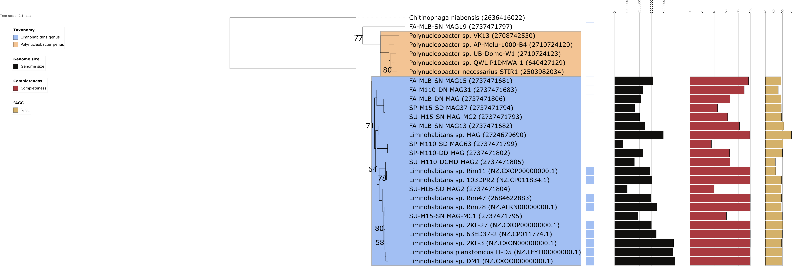

```{r setup, include = FALSE, warning = FALSE}
library("knitr")
opts_chunk$set(eval = TRUE, 
                      echo = TRUE, 
                      cache = TRUE,
                      include = TRUE,
                      collapse = FALSE,
                      dependson = NULL,
                      engine = "R", # Chunks will always have R code, unless noted
                      error = TRUE,
                      fig.path="Figures/cached/",  # Set the figure options
                      fig.align = "center",
                      fig.width = 7, 
                      fig.height = 6)
# Load libraries
library('tidyr')
library('dplyr')
library('ggplot2')
library("grid")
library("gridExtra")
library("easyGgplot2")
library("edgeR")
library("DESeq2")
source("functions.R")
```

```{r read-format data, warning = FALSE}
# Read data
mean_coverage <- read.table("./anvio_output/mean_coverage_selected_final.tsv", header = TRUE)
std_coverage <- read.table("./anvio_output/std_coverage_selected_final.tsv", header = TRUE)
bin_size <- read.table("./anvio_output/general_bins_summary_selected_final.tsv", header = TRUE)[, c(2,4)]
total_reads <- read.table("./anvio_output/sample_reads.tsv", header = TRUE)
read_length <- 150

# From wide to long format
mean_coverage_long <- gather(mean_coverage, Sample_ID, coverage, 
                             Fa13_BD_MLB_DN:Su13_BD_MM15_SN_C, factor_key=TRUE)
mean_coverage_long[,2] <- gsub(mean_coverage_long[,2], pattern = "_C", 
                               replacement = "")

std_coverage_long <- gather(std_coverage, Sample_ID, std_coverage, 
                            Fa13_BD_MLB_DN:Su13_BD_MM15_SN_C, 
                            factor_key=TRUE)
std_coverage_long[,2] <- gsub(std_coverage_long[,2], pattern = "_C", 
                            replacement = "")
 
coverage_data <- data.frame(mean_coverage_long, 
                            std_coverage = std_coverage_long[,3])

# Read and add metadata
meta <- read.csv2("metadata.csv")
meta$Sample_ID <- gsub(meta$Sample_ID, pattern = ".", replacement = "_", fixed = TRUE)
data_total <- left_join(coverage_data, total_reads, by = c("Sample_ID" = "sample"))
data_total <- left_join(data_total, bin_size, by = "bins")
data_total <- left_join(data_total, meta, by =  "Sample_ID")

# Calculate relative abundance of the bins
data_total$mean_rel_abundance <- 100*(data_total$coverage*data_total$bin_size)/(read_length*data_total$Total_reads)
data_total$upper_rel_abundance <- 100*((data_total$coverage+data_total$std_coverage)*data_total$bin_size)/(read_length*data_total$Total_reads)
data_total$lower_rel_abundance <- 100*((data_total$coverage-data_total$std_coverage)*data_total$bin_size)/(read_length*data_total$Total_reads)
```

# 1. Phylogenetic tree
  

# 2. Investigate MAG- and 16S-based abundances
Formula used to calculate relative abundances:
$$Relative\ abundance =100*(\frac{mean\ coverage * bin\ size}{read\ length*total\ sample\ reads })$$

```{r plot abundances, warning = FALSE, fig.width = 15, fig.height = 30}
# Plot abundance distributions of all bins

p_season <- ggplot(data = data_total, aes(x = bins, y = mean_rel_abundance, fill = bins))+
  geom_point(size = 4, shape = 21, alpha = 0.7)+
  geom_boxplot(alpha = 0.3)+
  scale_fill_brewer(palette = "Paired")+
  facet_grid(.~Site)+
  theme_bw()+
  geom_errorbar(aes(ymin=lower_rel_abundance, 
                    ymax=upper_rel_abundance, 
                    width=.1))+
  facet_grid(Season~.)+
  # ylim(0,1)+ 
  theme(axis.text=element_text(size=14), axis.title=element_text(size=20),
        title=element_text(size=20), legend.text=element_text(size=14),
        legend.background = element_rect(fill="transparent"),
        axis.text.x = element_text(angle = 45, hjust = 1),
        strip.text.y=element_text(size=18))+
  ylab("Mean relative abundance (%)")

p_station <- ggplot(data = data_total, aes(x = bins, y = mean_rel_abundance, fill = bins))+
  geom_point(size = 4, shape = 21, alpha = 0.7)+
  geom_boxplot(alpha = 0.3)+
  scale_fill_brewer(palette = "Paired")+
  facet_grid(.~Site)+
  theme_bw()+
  geom_errorbar(aes(ymin=lower_rel_abundance, 
                    ymax=upper_rel_abundance, 
                    width=.1))+
  facet_grid(Site~.)+
  # ylim(0,1)+ 
  theme(axis.text=element_text(size=14), axis.title=element_text(size=20),
        title=element_text(size=20), legend.text=element_text(size=14),
        legend.background = element_rect(fill="transparent"),
        axis.text.x = element_text(angle = 45, hjust = 1),
        strip.text.y=element_text(size=18))+
  ylab("Mean relative abundance (%)")

grid.arrange(p_season, p_station, nrow = 2)
```

# 3. Investigate sequence characteristics within coding DNA sequences (CDS)
```{r gc-analysis, dpi = 500, warning = FALSE, fig.width = 15, fig.height = 30}
# First we need the files that map the gene ID to the sequence ID (linux cmd: https://github.com/rprops/MetaG_lakeMI/wiki/11.-Genome-annotation)
# These are stored in the IMG_annotation data for each genome bin

# Next, extract the %GC of each gene from the gff file
Bin_2737471681 <- extract_gc_from_gff("./IMG_annotation/IMG_2737471681/IMG_Data/133052.assembled.gff", 
                                      outputFolder = "GC_analysis")
Bin_2737471682 <- extract_gc_from_gff("./IMG_annotation/IMG_2737471682/IMG_Data/133053.assembled.gff", 
                                      outputFolder = "GC_analysis")
Bin_2737471683 <- extract_gc_from_gff("./IMG_annotation/IMG_2737471683/IMG_Data/133054.assembled.gff", 
                                      outputFolder = "GC_analysis")
Bin_2737471793 <- extract_gc_from_gff("./IMG_annotation/IMG_2737471793/IMG_Data/133647.assembled.gff", 
                                      outputFolder = "GC_analysis")
Bin_2737471794 <- extract_gc_from_gff("./IMG_annotation/IMG_2737471794/IMG_Data/133648.assembled.gff", 
                                      outputFolder = "GC_analysis")
Bin_2737471795 <- extract_gc_from_gff("./IMG_annotation/IMG_2737471795/IMG_Data/133649.assembled.gff", 
                                      outputFolder = "GC_analysis")
Bin_2737471797 <- extract_gc_from_gff("./IMG_annotation/IMG_2737471797/IMG_Data/133651.assembled.gff", 
                                      outputFolder = "GC_analysis")
Bin_2737471799 <- extract_gc_from_gff("./IMG_annotation/IMG_2737471799/IMG_Data/133653.assembled.gff", 
                                      outputFolder = "GC_analysis")
Bin_2737471802 <- extract_gc_from_gff("./IMG_annotation/IMG_2737471802/IMG_Data/133656.assembled.gff", 
                                      outputFolder = "GC_analysis")
Bin_2737471804 <- extract_gc_from_gff("./IMG_annotation/IMG_2737471804/IMG_Data/133658.assembled.gff", 
                                      outputFolder = "GC_analysis")
Bin_2737471805 <- extract_gc_from_gff("./IMG_annotation/IMG_2737471805/IMG_Data/133659.assembled.gff", 
                                      outputFolder = "GC_analysis")
Bin_2737471806 <- extract_gc_from_gff("./IMG_annotation/IMG_2737471806/IMG_Data/133660.assembled.gff", 
                                      outputFolder = "GC_analysis")


# Use these files to make dataframes mapping function (COGs) and %GC
Bin_2737471681_gc_cog <- gc2function(seq_id_gc = "GC_analysis/seqid_GC_133052.assembled.gff.tsv", gene_id_seq_id ="./IMG_annotation/IMG_2737471681/IMG_Data/2737471681/2737471681.gene_oid_2_seq_id.txt", 
                             functions = "./IMG_annotation/IMG_2737471681/IMG_Data/2737471681/2737471681.cog.tab.txt", 
                             gc_thresh = 0.1, output = FALSE, label = "Bin_2737471681")

Bin_2737471682_gc_cog <- gc2function(seq_id_gc = "GC_analysis/seqid_GC_133053.assembled.gff.tsv", gene_id_seq_id ="./IMG_annotation/IMG_2737471682/IMG_Data/2737471682/2737471682.gene_oid_2_seq_id.txt", 
                             functions = "./IMG_annotation/IMG_2737471682/IMG_Data/2737471682/2737471682.cog.tab.txt", 
                             gc_thresh = 0.1, output = FALSE, label = "Bin_2737471682")

Bin_2737471683_gc_cog <- gc2function(seq_id_gc = "GC_analysis/seqid_GC_133054.assembled.gff.tsv", gene_id_seq_id ="./IMG_annotation/IMG_2737471683/IMG_Data/2737471683/2737471683.gene_oid_2_seq_id.txt", 
                             functions = "./IMG_annotation/IMG_2737471683/IMG_Data/2737471683/2737471683.cog.tab.txt", 
                             gc_thresh = 0.1, output = FALSE, label = "Bin_2737471683")

Bin_2737471793_gc_cog <- gc2function(seq_id_gc = "GC_analysis/seqid_GC_133647.assembled.gff.tsv", gene_id_seq_id ="./IMG_annotation/IMG_2737471793/IMG_Data/2737471793/2737471793.gene_oid_2_seq_id.txt", 
                             functions = "./IMG_annotation/IMG_2737471793/IMG_Data/2737471793/2737471793.cog.tab.txt", 
                             gc_thresh = 0.1, output = FALSE, label = "Bin_2737471793")

Bin_2737471794_gc_cog <- gc2function(seq_id_gc = "GC_analysis/seqid_GC_133648.assembled.gff.tsv", gene_id_seq_id ="./IMG_annotation/IMG_2737471794/IMG_Data/2737471794/2737471794.gene_oid_2_seq_id.txt", 
                             functions = "./IMG_annotation/IMG_2737471794/IMG_Data/2737471794/2737471794.cog.tab.txt", 
                             gc_thresh = 0.1, output = FALSE, label = "Bin_2737471794")

Bin_2737471795_gc_cog <- gc2function(seq_id_gc = "GC_analysis/seqid_GC_133649.assembled.gff.tsv", gene_id_seq_id ="./IMG_annotation/IMG_2737471795/IMG_Data/2737471795/2737471795.gene_oid_2_seq_id.txt", 
                             functions = "./IMG_annotation/IMG_2737471795/IMG_Data/2737471795/2737471795.cog.tab.txt", 
                             gc_thresh = 0.1, output = FALSE, label = "Bin_2737471795")

Bin_2737471797_gc_cog <- gc2function(seq_id_gc = "GC_analysis/seqid_GC_133651.assembled.gff.tsv", gene_id_seq_id ="./IMG_annotation/IMG_2737471797/IMG_Data/2737471797/2737471797.gene_oid_2_seq_id.txt", 
                             functions = "./IMG_annotation/IMG_2737471797/IMG_Data/2737471797/2737471797.cog.tab.txt", 
                             gc_thresh = 0.1, output = FALSE, label = "Bin_2737471797")

Bin_2737471799_gc_cog <- gc2function(seq_id_gc = "GC_analysis/seqid_GC_133653.assembled.gff.tsv", gene_id_seq_id ="./IMG_annotation/IMG_2737471799/IMG_Data/2737471799/2737471799.gene_oid_2_seq_id.txt", 
                             functions = "./IMG_annotation/IMG_2737471799/IMG_Data/2737471799/2737471799.cog.tab.txt", 
                             gc_thresh = 0.1, output = FALSE, label = "Bin_2737471799")

Bin_2737471802_gc_cog <- gc2function(seq_id_gc = "GC_analysis/seqid_GC_133656.assembled.gff.tsv", gene_id_seq_id ="./IMG_annotation/IMG_2737471802/IMG_Data/2737471802/2737471802.gene_oid_2_seq_id.txt", 
                             functions = "./IMG_annotation/IMG_2737471802/IMG_Data/2737471802/2737471802.cog.tab.txt", 
                             gc_thresh = 0.1, output = FALSE, label = "Bin_2737471802")

Bin_2737471804_gc_cog <- gc2function(seq_id_gc = "GC_analysis/seqid_GC_133658.assembled.gff.tsv", gene_id_seq_id ="./IMG_annotation/IMG_2737471804/IMG_Data/2737471804/2737471804.gene_oid_2_seq_id.txt", 
                             functions = "./IMG_annotation/IMG_2737471804/IMG_Data/2737471804/2737471804.cog.tab.txt", 
                             gc_thresh = 0.1, output = FALSE, label = "Bin_2737471804")

Bin_2737471805_gc_cog <- gc2function(seq_id_gc = "GC_analysis/seqid_GC_133659.assembled.gff.tsv", gene_id_seq_id ="./IMG_annotation/IMG_2737471805/IMG_Data/2737471805/2737471805.gene_oid_2_seq_id.txt", 
                             functions = "./IMG_annotation/IMG_2737471805/IMG_Data/2737471805/2737471805.cog.tab.txt", 
                             gc_thresh = 0.1, output = FALSE, label = "Bin_2737471805")

Bin_2737471806_gc_cog <- gc2function(seq_id_gc = "GC_analysis/seqid_GC_133660.assembled.gff.tsv", gene_id_seq_id ="./IMG_annotation/IMG_2737471806/IMG_Data/2737471806/2737471806.gene_oid_2_seq_id.txt", 
                             functions = "./IMG_annotation/IMG_2737471806/IMG_Data/2737471806/2737471806.cog.tab.txt", 
                             gc_thresh = 0.1, output = FALSE, label = "Bin_2737471806")

merged_gc_cog <- rbind(Bin_2737471681_gc_cog, Bin_2737471682_gc_cog, Bin_2737471683_gc_cog,
                       Bin_2737471793_gc_cog, Bin_2737471794_gc_cog, Bin_2737471795_gc_cog,
                       Bin_2737471797_gc_cog, Bin_2737471799_gc_cog, Bin_2737471802_gc_cog,
                       Bin_2737471804_gc_cog, Bin_2737471805_gc_cog, Bin_2737471806_gc_cog)
merged_gc_cog$genome_id <- as.character(merged_gc_cog$genome_id)
```

# 4. Analysis of gene length distribution
```{r gene length analysis, dpi = 300, warning = FALSE, fig.width = 5, fig.height = 20}
p_cog_length <- easyGgplot2::ggplot2.histogram(data = merged_gc_cog, xName = 'gene_length',
                  groupName = 'genome_id', alpha = 0.5,
                  legendPosition = "top", binwidth = 0.15, addMeanLine=TRUE, meanLineColor="black",
                  meanLineType="dashed")+ theme_bw()+ ylim(0,15)+
  facet_grid(genome_id~.)+
  labs(x = "Gene length (bp)", y = "Count")+ theme(legend.position="none", axis.text.x = element_text(angle = 45))+
  ggtitle("Limnohabitans MAGs")+ xlim(0,2000)

print(p_cog_length)
```

# 5. COG functional categories
Get COG ID to COG functional category mapping file here: ftp://ftp.ncbi.nih.gov/pub/wolf/COGs/COG0303/cogs.csv    

The exact statistical analysis to compare genomes based on these profiles should be performed in STAMP.

```{r COG functional categories, dpi = 300, warning = FALSE, fig.width = 7, fig.height = 23}
# Import COG mapping file
cogid_2_cogcat <- read.csv("./Mapping_files/cogid_2_cogcat.csv", sep = ",", header = FALSE, fill = TRUE,col.names = c("COG_ID", "COG_class", "function"))[, 1:2]
cogid_2_cogcat <- cogid_2_cogcat[(cogid_2_cogcat$COG_class)!="", ]
cogid_2_cogcat <- droplevels(cogid_2_cogcat)

# Read COG category file
cog_categories <- read.table("./Mapping_files/cog_categories.tsv", header = TRUE, sep = "\t")

# Merge COG metadata
cog_meta <- dplyr::left_join(cog_categories, cogid_2_cogcat, by = c("COG_class" = "COG_class"))
cog_meta <- droplevels(cog_meta)

# Merge this metadata with the genome data from before
# COGs with multiple classifications are currently still NA - work on this.
merged_gc_cog <- dplyr::left_join(merged_gc_cog, cog_meta, by = c("cog_id" = "COG_ID"))
merged_gc_cog <- merged_gc_cog[!is.na(merged_gc_cog$COG_functional_category),]

# Visualize distribution across major metabolism functional COG groups per genome.
p_cog_func_group <- ggplot(data = merged_gc_cog, aes(x=COG_functional_category, fill = COG_functional_cluster))+
  geom_bar(stat="count", width=0.7, color = "black", size = 0.75)+
  theme_bw()+
  facet_grid(genome_id~.)+
  scale_fill_brewer(palette = "Accent")+
  labs(x = "Gene length (bp)", y = "Count")+ theme(legend.position="bottom", axis.text.x = element_text(angle = 90, hjust = 1),
                                                   legend.text = element_text(size = 7))+
  ggtitle("Limnohabitans MAGs")+
  guides(fill=guide_legend(nrow=2,byrow=TRUE))

print(p_cog_func_group)

p_cog_func_clust <- ggplot(data = merged_gc_cog, aes(x=COG_functional_cluster, fill = COG_functional_cluster))+
  geom_bar(stat="count", width=0.7, color = "black", size = 0.75)+
  theme_bw()+
  facet_grid(genome_id~.)+
  scale_fill_brewer(palette = "Accent")+
  labs(x = "Gene length (bp)", y = "Count")+ theme(legend.position="bottom",axis.text.x = element_text(angle = 90, hjust = 1),
                                                   legend.text = element_text(size = 7))+
  ggtitle("Limnohabitans MAGs")+
  guides(fill=guide_legend(nrow=2,byrow=TRUE))

print(p_cog_func_clust)
```

# 6. Expression analysis  

Remember:  
  1. Get total nr. of reads through the `samtools flagstat command`.
  2. Get gene length through the DESMAN command: `python $DESMAN/scripts/Lengths.py -i CDS.fa > CDS.len`

```{r import and process data, dpi = 300, warning = FALSE, fig.width = 7, fig.height = 7}
expr_cov <- read.table("./metaT/Coverage_genes.tsv", header = TRUE)
colnames(expr_cov) <- gsub(colnames(expr_cov), pattern = "Map_genes.",
                           replacement = "")
colnames(expr_cov)[1] <- "gene_oid"
expr_cov$gene_oid <- as.character(expr_cov$gene_oid)

# Merge gene annotations from all genomes in one file
file_list <- list.dirs("./IMG_annotation", recursive = FALSE)
merged_file <- merge_annotations(file_list[1:12], genoid_seqid = TRUE)

# Annotate this expression table with Kegg Orthology and genome ids
expr_cov <- dplyr::left_join(expr_cov, merged_file[, c(1,10)], by = c("gene_oid"))

# Move to long format dataframe for visualization in ggplot2
expr_cov_long <- tidyr::gather(expr_cov, sample, coverage, Fa13.BD.MLB.DN:Su13.BD.MM15.SN, 
              factor_key = TRUE)

# Calculate average read recruitment to genes (for edgeR/DESeq) and also normalize to transcripts per million (TPM) just in case
# First read in gene lengths and total sample reads
sample_reads_metaT <- read.table("./metaT/sample_reads.tsv", header = TRUE)
gene_lengths_metaT <- read.table("./metaT/genes_concat.len", header = TRUE)
gene_lengths_metaT$gene <- as.character(gene_lengths_metaT$gene)

# Add this information to current long dataframe
expr_cov_long <- dplyr::left_join(expr_cov_long, sample_reads_metaT, by = "sample")
expr_cov_long <- dplyr::left_join(expr_cov_long, gene_lengths_metaT, by = c("gene_oid" = "gene"))

# Now calculate average read recruitment and TPM (relative to the recruitment to these
# genomes in this dataset)
# 150 = read length
expr_cov_long <- dplyr::mutate(expr_cov_long, 
                               mapped_reads = round((coverage * length)/(150),0)
                               ) # Be aware that this average is already rounded here..
expr_cov_long <- dplyr::mutate(expr_cov_long, 
                               reads_per_kb = mapped_reads/length/1000
                               )
expr_cov_long <- expr_cov_long %>% group_by(sample) %>% 
  mutate(RPK_scaling = sum(reads_per_kb)/1e6)
expr_cov_long <- expr_cov_long %>% 
  mutate(TPM = reads_per_kb/RPK_scaling)

# Now add the metadata to this long dataframe
expr_cov_long <- left_join(expr_cov_long, meta[, 1:11], by = c("sample" = "Sample"))
expr_cov_long$Genome_id <- as.factor(expr_cov_long$Genome_id)

# Remove duplicate rows
expr_cov_long <- expr_cov_long %>% distinct()
```

```{r KO annotation expression analysis, dpi = 300, warning = FALSE, fig.width = 7, fig.height = 7}
# Format data for DESeq2
## Put count matrices in list including a count matrix for each bin 
expr_cov_bins <- list()
for(i in 1:nlevels(expr_cov_long$Genome_id)){
  expr_cov_bins[[i]] <-  expr_cov_long %>% 
  filter(Genome_id == levels(expr_cov_long$Genome_id)[i]) %>% 
  select(gene_oid, sample, mapped_reads) %>% 
  spread(sample, mapped_reads)
  r.bin <- expr_cov_bins[[i]]$gene_oid
  expr_cov_bins[[i]] <- as.matrix(expr_cov_bins[[i]][, -1])
  rownames(expr_cov_bins[[i]]) <- r.bin
}

# Metadata file
meta_metaT <-  distinct(meta[, 2:nrow(meta)])
rownames(meta_metaT) <- gsub(meta_metaT$Sample_ID, pattern="_", replacement = ".")
meta_metaT <- as.matrix(meta_metaT)

# Check order of colnames in count and rownames in metadata matrix 
# and make sure these are in the same order!
meta_metaT <- meta_metaT[match(colnames(expr_cov_bins[[1]]), rownames(meta_metaT)), ]
all(rownames(meta_metaT) %in% colnames(expr_cov_bins[[1]]))

# Perform DESeq2 for differential abundance testing for each genome separately
## Season effect
General_deseq_results_season <- list()
for(i in 1:nlevels(expr_cov_long$Genome_id)){
  cat(" --- Running DESeq2 on Genome_id:",levels(expr_cov_long$Genome_id)[i],sep = " ")
  dds <- DESeqDataSetFromMatrix(countData = expr_cov_bins[[i]],
                              colData = meta_metaT,
                              design= ~ Site + Season) # Test for season but controlling for site
  dds <- DESeq(dds)
  General_deseq_results_season[[i]] <- results(dds)[order(results(dds)$padj), ] # specify contrasts here if need to
  summary(results(dds))
}

## Site effect
General_deseq_results_site <- list()
for(i in 1:nlevels(expr_cov_long$Genome_id)){
  cat(" --- Running DESeq2 on Genome_id:",levels(expr_cov_long$Genome_id)[i],sep = " ")
  dds <- DESeqDataSetFromMatrix(countData = expr_cov_bins[[i]],
                              colData = meta_metaT,
                              design= ~ Season + Site) # Test for season but controlling for site
  dds <- DESeq(dds)
  General_deseq_results_site[[i]] <- results(dds)[order(results(dds)$padj), ] # specify contrasts here if need to
  summary(results(dds))
}
##

##

sessionInfo()
```
