```r
# Read data
mean_coverage <- read.table("./anvio_output/rebin/mean_coverage_selected_final.tsv", header = TRUE)
std_coverage <- read.table("./anvio_output/rebin/std_coverage_selected_final.tsv", header = TRUE)
bin_size <- read.table("./anvio_output/rebin/general_bins_summary_selected_final.tsv", header = TRUE)[, c(2,5)]
total_reads <- read.table("./anvio_output/sample_reads.tsv", header = TRUE)
read_length <- 150

# From wide to long format
mean_coverage_long <- tidyr::gather(mean_coverage, Sample_ID, coverage, 
                             Fa13_BD_MLB_DN:Su13_BD_MM15_SN_C, factor_key=TRUE)
mean_coverage_long[,2] <- gsub(mean_coverage_long[,2], pattern = "_C", 
                               replacement = "")

std_coverage_long <- tidyr::gather(std_coverage, Sample_ID, std_coverage, 
                            Fa13_BD_MLB_DN:Su13_BD_MM15_SN_C, 
                            factor_key=TRUE)
std_coverage_long[,2] <- gsub(std_coverage_long[,2], pattern = "_C", 
                            replacement = "")
 
coverage_data <- data.frame(mean_coverage_long, 
                            std_coverage = std_coverage_long[,3])

# Read and add metadata
meta <- read.csv2("metadata.csv")
meta$Sample_ID <- gsub(meta$Sample_ID, pattern = ".", replacement = "_", fixed = TRUE)
data_total <- left_join(coverage_data, total_reads, by = c("Sample_ID" = "sample"))
data_total <- left_join(data_total, bin_size, by = "bins")
data_total <- left_join(data_total, meta, by =  "Sample_ID")

# Calculate relative abundance of the bins
data_total$mean_rel_abundance <- 100*(data_total$coverage*data_total$bin_size)/(read_length*data_total$Total_reads)
data_total$upper_rel_abundance <- 100*((data_total$coverage+data_total$std_coverage)*data_total$bin_size)/(read_length*data_total$Total_reads)
data_total$lower_rel_abundance <- 100*((data_total$coverage-data_total$std_coverage)*data_total$bin_size)/(read_length*data_total$Total_reads)
```

# 1a. Phylogeny

## Phylogenomic tree  

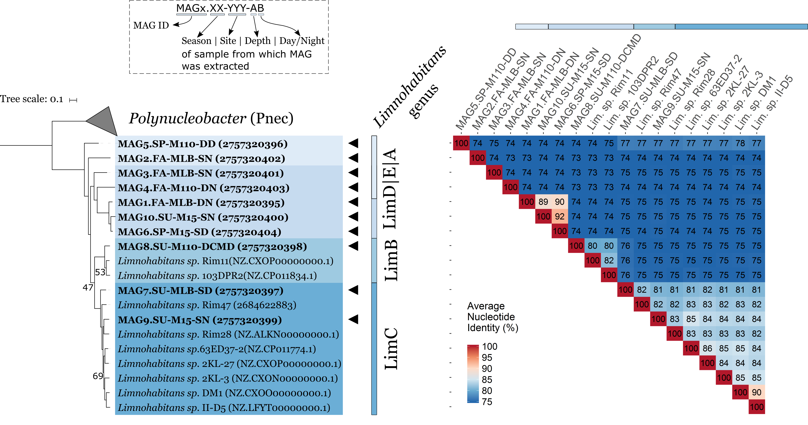

## 16S rRNA gene phylogenetic tree


### Microdiversity in MAG8  

**At each iteration, SSU sequences were merged into one sequence if the identity of non-gapped positions in a global alignment was greater than 97%. A single SSU sequence (and its prior probability) was divided into two sequences if the second most probable base in more than 4% of all positions had a probability greater than 10%. In this way, sequences that evolved over iterations to be the same were merged, and sequences with evidence from the reads for multiple OTUs were duplicated and allowed to evolve as separate OTUs in future iterations.** [Reference](https://genomebiology.biomedcentral.com/articles/10.1186/gb-2011-12-5-r44)  

The workflow for postprocessing the `EMIRGE` reconstructed 16S rRNA gene sequences:  


```r
# Import seq-table that was generated after EMIRGE post-processing
EMIRGE_OTU <- read.table("./Tree/EMIRGE/read.info.txt", 
                         stringsAsFactors = FALSE)
colnames(EMIRGE_OTU) <- c("Sample",  "Sequence", "Prior", "Length", "Prior_norm")
EMIRGE_names <- read.table("./Tree/EMIRGE/EMIRGE_Limno.names")
EMIRGE_OTU_97 <- read.table("./Tree/EMIRGE/final.otu.emirge.pick.an.0.03.rep.names",
                            stringsAsFactors = FALSE)
EMIRGE_OTU_99 <- read.table("./Tree/EMIRGE/final.otu.emirge.pick.an.0.01.rep.names",
                            stringsAsFactors = FALSE)

# Filter out putative Limnohabitans OTUs
EMIRGE_OTU <- EMIRGE_OTU[EMIRGE_OTU$Sequence %in% EMIRGE_names$V1, ]

# Formate sample names
EMIRGE_OTU$Sample <- gsub(".A","", EMIRGE_OTU$Sample, fixed = TRUE)
EMIRGE_OTU$Sample <- gsub(".C","", EMIRGE_OTU$Sample, fixed = TRUE)

# Add OTU cluster results as new columns (0.97 level and 0.99 level)
EMIRGE_OTU$OTU_97 <- EMIRGE_OTU$Sequence

for(i in 1:nrow(EMIRGE_OTU_97)){
   EMIRGE_OTU$OTU_97[EMIRGE_OTU$Sequence %in% 
                            do.call(rbind, strsplit(EMIRGE_OTU_97$V2[i], ","))] <-
     EMIRGE_OTU_97$V3[i]
}

EMIRGE_OTU$OTU_99 <- EMIRGE_OTU$Sequence

for(i in 1:nrow(EMIRGE_OTU_99)){
  EMIRGE_OTU$OTU_99[EMIRGE_OTU$Sequence %in% 
                            do.call(rbind, strsplit(EMIRGE_OTU_99$V2[i], ","))] <-
     EMIRGE_OTU_99$V3[i]
}


# Calculate new abundance for the relative abundance of each OTU (0.97 and 0.99 level)
EMIRGE_OTU <- EMIRGE_OTU %>% dplyr::group_by(OTU_97, Sample) %>% 
  dplyr::mutate(Prior_norm_OTU97 = sum(Prior_norm))

EMIRGE_OTU <- EMIRGE_OTU %>% dplyr::group_by(OTU_99, Sample) %>% 
  dplyr::mutate(Prior_norm_OTU99 = sum(Prior_norm))

# Add metadata variables as new column
meta_em <- meta[-1]; meta_em$Sample_ID <- gsub("_",".", meta_em$Sample_ID)
meta_em <- meta_em %>% dplyr::distinct()
EMIRGE_OTU <- dplyr::left_join(EMIRGE_OTU, meta_em, by = c("Sample" = "Sample_ID"))
```


```r
# Plot
p_emirge_abund_otu97 <- ggplot(EMIRGE_OTU, aes(x = Sample, y = 100*Prior_norm, fill = OTU_97))+
  theme_bw()+
  geom_bar(stat = "identity", size = 1, color = "black", alpha = 0.7)+
  scale_fill_brewer(palette = "Accent")+
  theme(axis.text=element_text(size=14), axis.title=element_text(size=20),
        axis.text.x = element_text(size = 14, angle = 45, hjust = 1),
      title=element_text(size=20), legend.text=element_text(size=12),
      legend.background = element_rect(fill="transparent"),
      strip.text=element_text(size=14), legend.position = "right",
      strip.background = element_rect(fill = adjustcolor("gray", 0.15)))+
  guides(fill=guide_legend(nrow = 3))+
  facet_grid(.~Site, scales = "free_x")+
  ylab("Length-normalized prior (%)")+
  xlab("")+
  ggtitle("97% clustered OTUs")
  # coord_trans(x = "atanh", y = "atanh")

# Plot
p_emirge_abund_otu99 <- ggplot(EMIRGE_OTU, aes(x = Sample, y = 100*Prior_norm, fill = OTU_99))+
  theme_bw()+
  geom_bar(stat = "identity", size = 1, color = "black", alpha = 0.7)+
  # geom_point(size = 4, shape = 21, color = "black", alpha = 0.7)+
  scale_fill_brewer(palette = "Accent")+
  theme(axis.text=element_text(size=14), axis.title=element_text(size=20),
        axis.text.x = element_text(size = 14, angle = 45, hjust = 1),
      title=element_text(size=20), legend.text=element_text(size=12),
      legend.background = element_rect(fill="transparent"),
      strip.text=element_text(size=14), legend.position = "right",
      strip.background = element_rect(fill = adjustcolor("gray", 0.15)))+
  guides(fill=guide_legend(nrow = 3))+
  facet_grid(.~Site, scales = "free_x")+
  ylab("Length-normalized prior (%)")+
  xlab("")+
  ggtitle("99% clustered OTUs")
  # coord_trans(x = "atanh", y = "atanh")

# Plot
p_emirge_abund_seq <- ggplot(EMIRGE_OTU, aes(x = Sample, y = 100*Prior_norm, fill = OTU_97))+
  theme_bw()+
  # geom_point(size = 4, shape = 21, color = "black", alpha = 0.7)+
  geom_bar(stat = "identity", size = 1, color = "black", alpha = 0.7)+
  scale_fill_brewer(palette = "Accent")+
  theme(axis.text=element_text(size=14), axis.title=element_text(size=20),
        axis.text.x = element_text(size = 14, angle = 45, hjust = 1),
      title=element_text(size=20), legend.text=element_text(size=12),
      legend.background = element_rect(fill="transparent"),
      strip.text=element_text(size=14), legend.position = "right",
      strip.background = element_rect(fill = adjustcolor("gray", 0.15)))+
  guides(fill=guide_legend(nrow = 3))+
  facet_grid(.~Site, scales = "free_x")+
  ylab("Length-normalized prior (%)")+
  xlab("")+
  ggtitle("Unique sequences")
  # coord_trans(x = "atanh", y = "atanh")

grid.arrange(p_emirge_abund_otu97, p_emirge_abund_otu99, p_emirge_abund_seq ,nrow = 3)
```

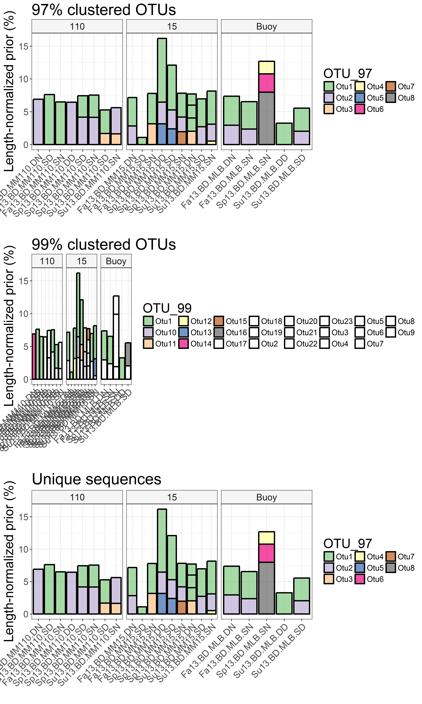


```r
# read file
data.ANI <- read.table("./ANI/ANIb_percentage_identity.tab")

# Replace genome names by better annotated names
map_ani <- read.delim("./ANI/pyani_ref_names.tsv", stringsAsFactors = FALSE)
for(i in 1:nrow(map_ani)){
 colnames(data.ANI)[colnames(data.ANI) %in% map_ani$ani_file[i]] <- map_ani$ref_name[i]
 rownames(data.ANI)[rownames(data.ANI) %in% map_ani$ani_file[i]] <- map_ani$ref_name[i]
}

# Remove pnec and root genomes from dataframe
data.ANI <- data.ANI[grep("MAG|Lim", rownames(data.ANI)), grep("MAG|Lim", rownames(data.ANI))]

# Order y-axis according to phylogenetic tree order
ord_list_bin <- c(
  "MAG5.SP-M110-DD", "MAG2.FA-MLB-SN",
  "MAG3.FA-MLB-SN", "MAG4.FA-M110-DN",
  "MAG1.FA-MLB-DN", "MAG10.SU-M15-SN",
  "MAG6.SP-M15-SD","MAG8.SU-M110-DCMD",
  "Lim. sp. Rim11", "Lim. sp. 103DPR2",
  "MAG7.SU-MLB-SD", "Lim. sp. Rim47",
  "MAG9.SU-M15-SN", "Lim. sp. Rim28",
  "Lim. sp. 63ED37-2","Lim. sp. 2KL-27",
  "Lim. sp. 2KL-3", "Lim. sp. DM1",
  "Lim. sp. II-D5"
  )

# order rows and columns
data.ANI <- data.ANI[, order(match(colnames(data.ANI), ord_list_bin))]
data.ANI <- data.ANI[order(match(rownames(data.ANI), ord_list_bin)), ]

data.ANI <- get_upper_tri(data.ANI)

# melt to dataframe
df_pyani <- melt(as.matrix(data.ANI), na.rm = TRUE) # reshape into dataframe
names(df_pyani)[c(1:3)] <- c("bin1", "bin2", "ANI")
df_pyani[, 1] <- as.character(df_pyani[, 1]); df_pyani[, 2] <- as.character(df_pyani[, 2])
df_pyani$bin2 <- factor(df_pyani$bin2, levels = ord_list_bin)
df_pyani$bin1 <- factor(df_pyani$bin1, levels = rev(ord_list_bin))

# make plot
p_ani <- ggplot(data = df_pyani,
       aes(x = bin2, y = bin1, fill = 100*ANI))+ 
  geom_raster()+
  scale_fill_distiller(palette = "RdBu", name = "Average\nNucleotide\nIdentity (%)\n",
                       limits = 100*c(0.75,1.0), oob=squish) +
  geom_text(aes(label = round(100*ANI, 0)), size = 4.5)+
  xlab("")+
  ylab("")+
  scale_x_discrete(position = "top") +
  theme(axis.title=element_text(size=14), strip.text.x=element_text(size=14),
        legend.title=element_text(size=14), legend.text=element_text(size=14),
        axis.text.y = element_blank(),
        axis.text.x = element_text(size=14, angle = 55, hjust = 0),
        title=element_text(size=20),
        plot.margin = unit(c(1.1,1.1,1.1,1.1), "cm"),
        panel.grid.major = element_blank(), 
        panel.grid.minor = element_blank(),
        panel.background = element_rect(fill = "transparent",colour = NA),
        plot.background = element_rect(fill = "transparent",colour = NA)
  )

# png("ANI_heatmap.png", height= 9, width = 9, res = 500, units = "in", bg = "transparent")
print(p_ani)
```

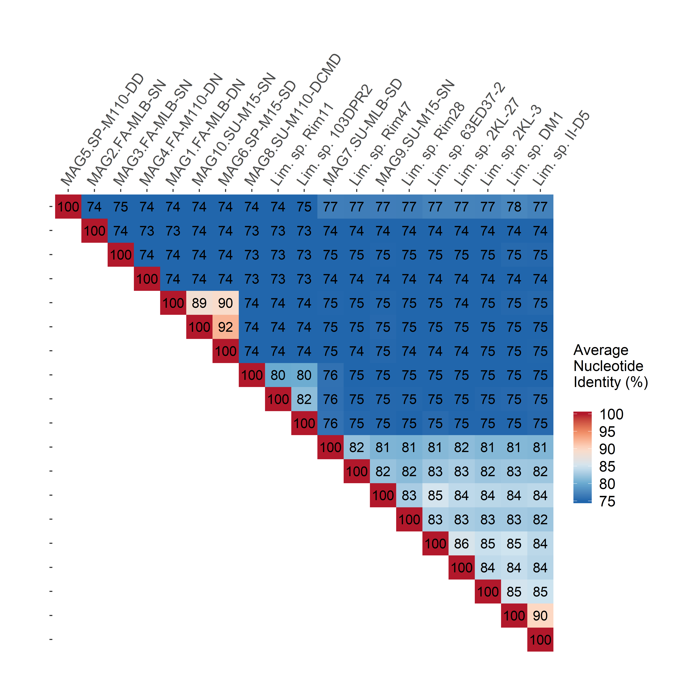

```r
# dev.off()
```

# 1b. Investigate predicted generation time (MGT)

```r
MGT_df <- read.table("./Growthpred/GP_results.tsv", header = TRUE,
                     stringsAsFactors = FALSE, sep = "\t")

# Order genome_ids according to the phylogenetic clustering
MGT_df$Genome_ID <- factor(MGT_df$Genome_ID, levels = ord_list_bin)
MGT_df$Lineage <- factor(MGT_df$Lineage, levels = c("LimDEA_1", "LimDEA_2",
                                                    "LimB", "LimC"))

# Make barplot with st.dev to visualize MGT and optimal temperature
selected_points <- data.frame(Genome_ID = MGT_df$Genome_ID, 
                              ypos = c(rep(18, 10), rep(NA,9)))
p_MGT <- ggplot(MGT_df, aes(x = Genome_ID, y = MGT, fill = Lineage, group = Genome_ID))+
  theme_bw()+
  geom_bar(alpha = 0.4, stat = "identity", color = "black",
           position = position_dodge(width = 1), width = 0.7)+
  scale_fill_manual("Minimal generation time (h)",
                    values = c(rgb(red=t(col2rgb("#deebf7ff")), maxColorValue  = 255), 
                               rgb(red=t(col2rgb("#c6dbefff")), maxColorValue  = 255),
                               rgb(red=t(col2rgb("#9ecae1ff")), maxColorValue  = 255),
                               rgb(red=t(col2rgb("#6baed6ff")), maxColorValue  = 255)
                              ))+
  theme(axis.text=element_text(size=15, face = "bold"), axis.title=element_text(size=20),
        title=element_text(size=20), legend.text=element_text(size=14),
        legend.background = element_rect(fill="transparent"),
        # axis.text.x = element_text(angle = 65, hjust = 1),
        strip.text.x=element_text(size = 18),
        legend.position="bottom",
        axis.text.x=element_text(size = 13, angle =45, hjust= 1),
        axis.title.x=element_blank(),
        plot.title = element_text(hjust = 0, size=18))+
  guides(fill=FALSE)+
  geom_errorbar(aes(ymin = MGT - sd.MGT, ymax = MGT + sd.MGT), width = 0.15,
                position = position_dodge(width = 1))+
  ylab("")+
  xlab("")+
  ggtitle("Minimal Generation Time (h)")+
  geom_point(data = selected_points, aes(x = Genome_ID, y = ypos),
             shape = 25, fill = "black", col = "black", size = 3)

# svg(filename = "MGT_figure.svg", width = 9.5, height = 4)
print(p_MGT)
```

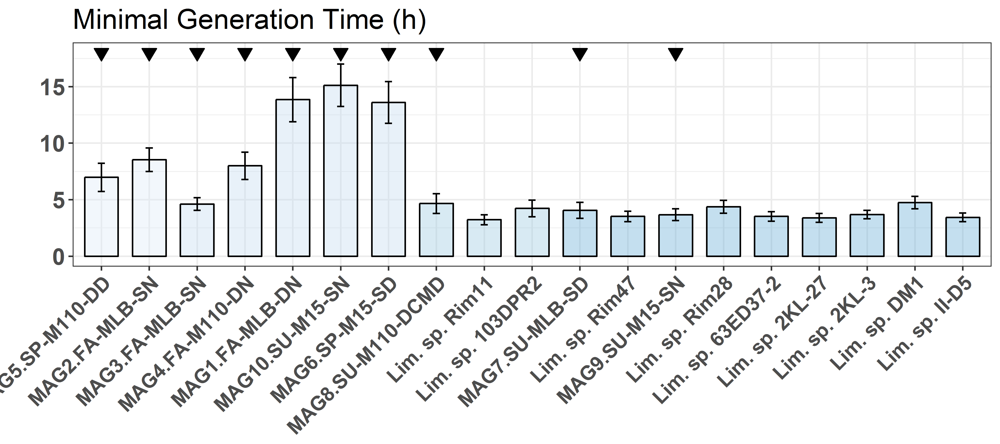

```r
# dev.off()

# Make the same plot for optimal growth temperature
selected_points <- data.frame(Genome_ID = MGT_df$Genome_ID, 
                              ypos = c(rep(30, 10), rep(NA,9)))

p_Topt <- ggplot(MGT_df, aes(x = Genome_ID, y = Topt, fill = Lineage, group = Genome_ID))+
  theme_bw()+
  geom_bar(alpha = 0.4, stat = "identity", color = "black",
           position = position_dodge(width = 1), width = 0.7)+
  scale_fill_manual("Optimal growth temperature (°C)",
                    values = c("#deebf7ff", "#c6dbefff","#9ecae1ff",
                               "#6baed6ff"))+
  theme(axis.text=element_text(size=15, face = "bold"), axis.title=element_text(size=20),
        title=element_text(size=20), legend.text=element_text(size=14),
        legend.background = element_rect(fill="transparent"),
        # axis.text.x = element_text(angle = 65, hjust = 1),
        strip.text.x=element_text(size = 18),
        legend.position="bottom",
        axis.text.x=element_text(size = 13, angle =45, hjust= 1),
        axis.title.x=element_blank(),
        plot.title = element_text(hjust = 0, size=18))+
  guides(fill=FALSE)+
  ylab("")+
  xlab("")+
  ggtitle("Optimal growth temperature (°C)")+
  geom_point(data = selected_points, aes(x = Genome_ID, y = ypos),
             shape = 25, fill = "black", col = "black", size = 3)

print(p_Topt)
```

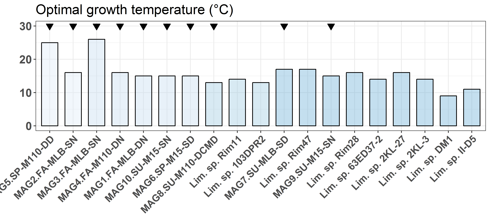


# 1c. Network analysis based on 16S data


```r
# import data
df_phy <- import_mothur(mothur_shared_file = "./16S/stability.trim.contigs.good.unique.good.filter.unique.precluster.pick.pick.an.unique_list.shared",
                        mothur_constaxonomy_file = "./16S/stability.trim.contigs.good.unique.good.filter.unique.precluster.pick.pick.an.unique_list.0.03.cons.taxonomy")

# Filter out 2013 samples
df_phy <- prune_samples(grep(pattern = ".", sample_names(df_phy), fixed = TRUE,
     value = TRUE), df_phy)
df_phy <- prune_samples(grep(pattern = "cD", sample_names(df_phy), fixed = TRUE,
     value = TRUE, invert = TRUE), df_phy)
df_phy <- prune_samples(grep(pattern = "ED", sample_names(df_phy), fixed = TRUE,
     value = TRUE, invert = TRUE), df_phy)

# Calculate diversity
diversity_df_phy <- Diversity_16S(df_phy, brea = FALSE, R = 100)
```

```
## 	**WARNING** this functions assumes that rows are samples and columns
##       	are taxa in your phyloseq object, please verify.
## Sat Mar 03 16:11:48 2018	Calculating diversity for sample 1/41 --- Fa13.BD.MLB.DN.1.renamed
## Sat Mar 03 16:12:18 2018	Calculating diversity for sample 2/41 --- Fa13.BD.MLB.SN.1.renamed
## Sat Mar 03 16:12:49 2018	Calculating diversity for sample 3/41 --- Fa13.BD.MM110.DN.1.renamed
## Sat Mar 03 16:13:18 2018	Calculating diversity for sample 4/41 --- Fa13.BD.MM110.DN.2.renamed
## Sat Mar 03 16:13:49 2018	Calculating diversity for sample 5/41 --- Fa13.BD.MM110.SD.1.renamed
## Sat Mar 03 16:14:24 2018	Calculating diversity for sample 6/41 --- Fa13.BD.MM110.SD.2.renamed
## Sat Mar 03 16:15:02 2018	Calculating diversity for sample 7/41 --- Fa13.BD.MM110.SN.1.renamed
## Sat Mar 03 16:15:36 2018	Calculating diversity for sample 8/41 --- Fa13.BD.MM110.SN.2.renamed
## Sat Mar 03 16:16:07 2018	Calculating diversity for sample 9/41 --- Fa13.BD.MM15.DN.1.renamed
## Sat Mar 03 16:16:36 2018	Calculating diversity for sample 10/41 --- Fa13.BD.MM15.DN.2.renamed
## Sat Mar 03 16:17:07 2018	Calculating diversity for sample 11/41 --- Fa13.BD.MM15.SD.1.renamed
## Sat Mar 03 16:17:45 2018	Calculating diversity for sample 12/41 --- Fa13.BD.MM15.SD.2.renamed
## Sat Mar 03 16:18:13 2018	Calculating diversity for sample 13/41 --- Fa13.BD.MM15.SN.1.renamed
## Sat Mar 03 16:18:45 2018	Calculating diversity for sample 14/41 --- Fa13.BD.MM15.SN.2.renamed
## Sat Mar 03 16:19:12 2018	Calculating diversity for sample 15/41 --- Sp13.BD.MLB.SN.1.renamed
## Sat Mar 03 16:19:47 2018	Calculating diversity for sample 16/41 --- Sp13.BD.MLB.SN.2.renamed
## Sat Mar 03 16:20:18 2018	Calculating diversity for sample 17/41 --- Sp13.BD.MM110.DD.1.renamed
## Sat Mar 03 16:20:45 2018	Calculating diversity for sample 18/41 --- Sp13.BD.MM110.SD.1.renamed
## Sat Mar 03 16:21:16 2018	Calculating diversity for sample 19/41 --- Sp13.BD.MM110.SD.2.renamed
## Sat Mar 03 16:21:47 2018	Calculating diversity for sample 20/41 --- Sp13.BD.MM110.SN.1.renamed
## Sat Mar 03 16:22:22 2018	Calculating diversity for sample 21/41 --- Sp13.BD.MM110.SN.2.renamed
## Sat Mar 03 16:22:56 2018	Calculating diversity for sample 22/41 --- Sp13.BD.MM15.DD.1.renamed
## Sat Mar 03 16:23:32 2018	Calculating diversity for sample 23/41 --- Sp13.BD.MM15.SD.1.renamed
## Sat Mar 03 16:24:08 2018	Calculating diversity for sample 24/41 --- Sp13.BD.MM15.SN.1.renamed
## Sat Mar 03 16:24:43 2018	Calculating diversity for sample 25/41 --- Sp13.BD.MM15.SN.2.renamed
## Sat Mar 03 16:25:18 2018	Calculating diversity for sample 26/41 --- Su13.BD.MLB.DD.1.renamed
## Sat Mar 03 16:25:51 2018	Calculating diversity for sample 27/41 --- Su13.BD.MLB.SD.1.renamed
## Sat Mar 03 16:26:25 2018	Calculating diversity for sample 28/41 --- Su13.BD.MM110.DCMD.1.renamed
## Sat Mar 03 16:26:59 2018	Calculating diversity for sample 29/41 --- Su13.BD.MM110.DCMD.2.renamed
## Sat Mar 03 16:27:33 2018	Calculating diversity for sample 30/41 --- Su13.BD.MM110.DN.1.renamed
## Sat Mar 03 16:28:09 2018	Calculating diversity for sample 31/41 --- Su13.BD.MM110.DN.2.renamed
## Sat Mar 03 16:28:44 2018	Calculating diversity for sample 32/41 --- Su13.BD.MM110.SD.1.renamed
## Sat Mar 03 16:29:18 2018	Calculating diversity for sample 33/41 --- Su13.BD.MM110.SD.2.renamed
## Sat Mar 03 16:29:54 2018	Calculating diversity for sample 34/41 --- Su13.BD.MM110.SN.1.renamed
## Sat Mar 03 16:30:28 2018	Calculating diversity for sample 35/41 --- Su13.BD.MM110.SN.2.renamed
## Sat Mar 03 16:31:02 2018	Calculating diversity for sample 36/41 --- Su13.BD.MM15.DN.1.renamed
## Sat Mar 03 16:31:36 2018	Calculating diversity for sample 37/41 --- Su13.BD.MM15.DN.2.renamed
## Sat Mar 03 16:32:11 2018	Calculating diversity for sample 38/41 --- Su13.BD.MM15.SD.1.renamed
## Sat Mar 03 16:32:45 2018	Calculating diversity for sample 39/41 --- Su13.BD.MM15.SD.2.renamed
## Sat Mar 03 16:33:20 2018	Calculating diversity for sample 40/41 --- Su13.BD.MM15.SN.1.renamed
## Sat Mar 03 16:34:07 2018	Calculating diversity for sample 41/41 --- Su13.BD.MM15.SN.2.renamed
## Sat Mar 03 16:34:45 2018 	Done with all 41 samples
```

```r
# Perform prevalence filtering
df_phy <- filter_taxa(df_phy, function(x) sum(x > 30) > (0.25*length(x)), TRUE)

# Run spiec-easi
sp_easi <- spiec.easi(df_phy, method='mb', lambda.min.ratio=1e-2,
                           nlambda=20, icov.select.params=list(rep.num=50))
```

```
## Normalizing/clr transformation of data with pseudocount ...
```

```
## Inverse Covariance Estimation with mb ...
```

```
## Model selection with stars ...
```

```
## Done!
```

```r
ig.mb <- adj2igraph(sp_easi$refit,  vertex.attr = list(name=taxa_names(df_phy)))
vsize <- Biobase::rowMax(clr(t(otu_table(df_phy)), 1))+10
Lineage_rel <- tax_table(df_phy)[,"Rank2"]
Lineage_rel <- factor(Lineage_rel, levels = unique(Lineage_rel))

# OTUs that are Limnohabitans
limno_otus <- taxa_names(df_phy)[tax_table(df_phy)[,"Rank6"] == "betI_A"]
limno_otus <- limno_otus[!is.na(limno_otus)]

# Make Limno label
limno_labs <- c()
limno_labs[vertex.attributes(ig.mb)$name %in% limno_otus] <- "Limnohabitans sp."
limno_labs[is.na(limno_labs)] <- ""

# Plot network
p_16S_network <- plot_network_custom(ig.mb, df_phy, type='taxa',
             line_weight = 2, hjust = 0.5,
             point_size = 0.1, alpha = 0.01, label=NULL, label_size = 3.95)+
  scale_fill_brewer(palette = "Paired")+
  scale_color_brewer(palette = "Paired")+
  geom_point(aes(size = vsize, fill = Lineage_rel), alpha = 0.5,
             colour="black", shape=21)+
  guides(size = FALSE,
    fill  = guide_legend(title = "Phylum", override.aes = list(size = 5),
                         nrow = 4),
    color = FALSE)+
  theme(legend.position="bottom", legend.text=element_text(size=12),
        text = element_text(size = 12),
        plot.margin = unit(c(1,1,1,1), "cm"))+
  scale_size(range = c(5, 15))+
  geom_label_repel(aes(label = limno_labs), fontface = 'bold', color = 'black',
                   box.padding = 0.35, point.padding = 0.5,
                   segment.color = 'black',
                   size = 4,
                       # Width of the line segments.
                   segment.size = 1.5,
                   # Draw an arrow from the label to the data point.
                   arrow = arrow(length = unit(0.015, 'npc')),
                   nudge_x = -0.1,
                   nudge_y = 0.6
  )

print(p_16S_network)
```

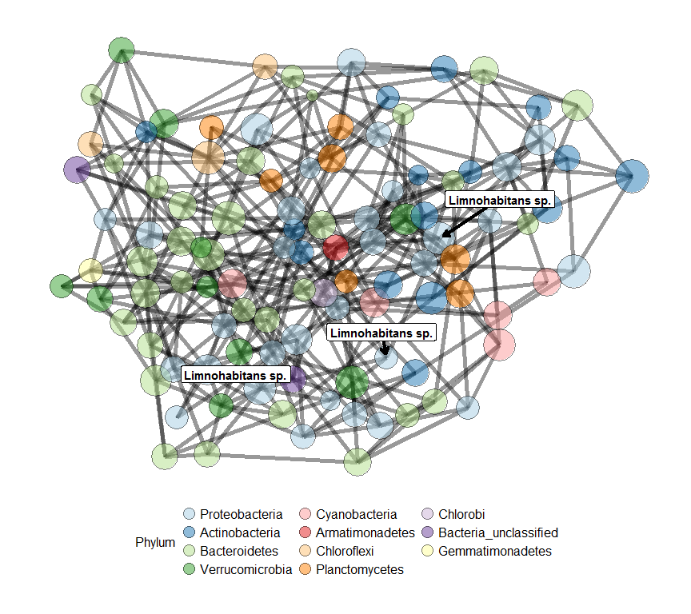

# 2. Investigate MAG- and 16S-based abundances  

## 2.1. From coverage info (anvi'o)  

Formula used to calculate relative abundances:
$$Relative\ abundance =100*(\frac{mean\ coverage * bin\ size}{read\ length*total\ sample\ reads })$$


```r
# Normalize for bin sizes
data_total <- data_total %>% group_by(bins) %>% 
  mutate(norm_mean_rel_abundance = mean_rel_abundance/(bin_size/1e6),
         norm_upper_rel_abundance = upper_rel_abundance/(bin_size/1e6),
         norm_lower_rel_abundance = lower_rel_abundance/(bin_size/1e6)
         )

# Plot abundance distributions of all bins
p_season1 <- ggplot(data = data_total, aes(x = bins, y = norm_mean_rel_abundance, fill = bins))+
  geom_point(size = 4, shape = 21, alpha = 0.7)+
  geom_boxplot(alpha = 0.3)+
  scale_fill_brewer(palette = "Paired")+
  theme_bw()+
  geom_errorbar(aes(ymin=norm_lower_rel_abundance, 
                    ymax=norm_upper_rel_abundance, 
                    width=.1))+
  facet_grid(Season~Site)+
  # ylim(0,1)+ 
  theme(axis.text=element_text(size=14), axis.title=element_text(size=20),
        title=element_text(size=20), legend.text=element_text(size=14),
        legend.background = element_rect(fill="transparent"),
        axis.text.x = element_text(angle = 90, hjust = 1),
        strip.text=element_text(size=18))+
  ylab("Normalized relative abundance (%)")

p_season1
```

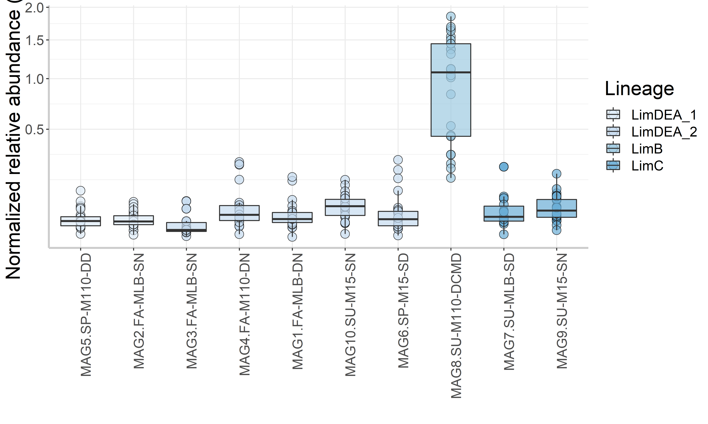

## 2.1. From mapped reads info (BBmap - `pileup.sh`)  

From: https://doi.org/10.1186/s13059-015-0834-7  

*"The relative abundance of each MAG was estimated using the fraction of reads in each sample mapping to the respective MAG. Normalized on the size of that bin, this yielded the measure fraction of reads per nucleotide in bin. This measure was chosen since it is comparable across samples with varying sequencing output and different bin sizes. Using the CONCOCT input table, multiplying the average coverage per nucleotide with the length of the contig in question and summing over all contigs within a bin and within a sample gave the number of reads per bin within a sample. The fraction of reads in each sample mapping to each bin was then calculated by dividing this value with the total number of reads from each sample, after having removed duplicated reads."*


```r
# Generated from SAM file with pileup.sh from BBmap toolset
df_map_reads <- read.delim("./anvio_output/collection_vizbin_pileup_cov.tsv",
                           stringsAsFactors = FALSE)
df_map_reads$Sample <- gsub(df_map_reads$Sample, pattern = "_cov.tsv",
                            replacement = "")

# This file was generated in anvio with anvi-export-collections
lab_map_reads <- read.delim("./anvio_output/collection_vizbin.tsv",
                            header = FALSE)
colnames(lab_map_reads) <- c("contig_split", "Bin")

# Select Limnohabitans bins
lab_map_reads <- lab_map_reads[lab_map_reads$Bin %in% data_total$bins, ]
lab_map_reads$contig <- paste(
  do.call(rbind, strsplit(as.character(lab_map_reads$contig_split), "_"))[, 1],
  do.call(rbind, strsplit(as.character(lab_map_reads$contig_split), "_"))[, 2],
  sep = "_"
  )

lab_map_reads <- lab_map_reads[ ,2:3] %>% distinct()

# Merge dataframes
df_map_merged <- left_join(lab_map_reads, df_map_reads, by = c("contig" = "X.ID")
)
df_map_merged[, 4:13] <- apply(df_map_merged[, 4:13], 2, FUN = function(x) as.numeric(x))

df_map_merged <- df_map_merged %>% group_by(Bin, Sample) %>% summarise(sum_map_read = sum(Plus_reads))

# Merge with metadata/bin sizes
meta$Sample <- gsub(".C", "", meta$Sample, fixed = TRUE)
meta$Sample <- gsub(".A", "", meta$Sample, fixed = TRUE)
df_map_merged$Sample <- gsub(".C", "", df_map_merged$Sample, fixed = TRUE)
df_map_merged <- left_join(df_map_merged, bin_size, by = c("Bin" = "bins"))
df_map_merged <- left_join(df_map_merged, meta, "Sample")
total_reads$sample <- gsub("_", ".", fixed = TRUE,total_reads$sample)
df_map_merged <- left_join(df_map_merged, total_reads, c("Sample" = "sample"))

df_map_merged <- df_map_merged %>% group_by(Bin, Sample) %>%
  mutate(rel_abundance = 100*sum_map_read/Total_reads)

df_map_merged <- df_map_merged %>% group_by(Bin, Sample) %>%
  mutate(rel_norm_abundance = 100*sum_map_read/Total_reads/(bin_size/1e6))

# Rename bin names to more sensible names
# Add extra column with new bin names
new_bin_names <- read.table("./anvio_output/rebin/general_bins_summary_selected_final.tsv", header = TRUE)[, c(2,3)]
df_map_merged <- left_join(df_map_merged, new_bin_names, by = c("Bin" = "bins"))
df_map_merged$new_bin_name <- as.character(df_map_merged$new_bin_name)
df_map_merged$new_bin_name <- factor(df_map_merged$new_bin_name, levels =
                                      c("MAG1.FA-MLB-DN","MAG2.FA-MLB-SN",
                                        "MAG3.FA-MLB-SN", "MAG4.FA-M110-DN",
                                        "MAG5.SP-M110-DD","MAG6.SP-M15-SD",
                                        "MAG7.SU-MLB-SD","MAG8.SU-M110-DCMD",
                                        "MAG9.SU-M15-SN","MAG10.SU-M15-SN"))
df_map_merged$Site <- as.character(df_map_merged$Site)
df_map_merged$Site <- gsub("110", "Lake Michigan\nsite M110", df_map_merged$Site)
df_map_merged$Site <- gsub("15", "Lake Michigan\nsite M15", df_map_merged$Site)
df_map_merged$Site <- gsub("Buoy", "Muskegon Lake", df_map_merged$Site)
df_map_merged$Site <- factor(df_map_merged$Site, levels = c("Muskegon Lake",
                                                            "Lake Michigan\nsite M15",
                                                            "Lake Michigan\nsite M110"))
df_map_merged$Season <- as.character(df_map_merged$Season)
df_map_merged$Season <- factor(df_map_merged$Season, levels = c("Spring", "Summer","Fall"))

# Remove non-limno bin
df_map_merged <- df_map_merged %>% dplyr::filter(new_bin_name != "MAG.noLIM")

# Make plots
p_abs2 <- ggplot(data = df_map_merged, aes(x = new_bin_name, y = rel_norm_abundance, fill = new_bin_name))+
  theme_bw()+
  scale_fill_manual("", values = fill_palette)+
  geom_jitter(size = 4, shape = 21, color = "black", alpha = 0.7, width = 0.15)+
  theme(axis.text=element_text(size=14), axis.title=element_text(size=20),
      title=element_text(size=20), legend.text=element_text(size=12),
      legend.background = element_rect(fill="transparent"),
      axis.text.x = element_blank(),
      strip.text=element_text(size=14), legend.position = "bottom",
      strip.background = element_rect(fill = adjustcolor("gray", 0.15)))+
  ylab(paste0("Norm. relative abundance (%)"))+
  xlab("")+
  guides(fill=guide_legend(nrow = 3))+
  facet_grid(Season~Site, scales ="free")+
  scale_y_continuous(labels=scaleFUN, limits = c(0,1.25))+
  coord_trans(y = "sqrt")

p_abs2
```


# 3. Investigate sequence characteristics within coding DNA sequences (CDS)

```r
# First we need the files that map the gene ID to the sequence ID (linux cmd: https://github.com/rprops/MetaG_lakeMI/wiki/11.-Genome-annotation)
# These are stored in the IMG_annotation data for each genome bin

# Next, extract the %GC of each gene from the gff file
Bin_2737471681 <- extract_gc_from_gff("./IMG_annotation/IMG_2737471681/IMG_Data/133052.assembled.gff", 
                                      outputFolder = "GC_analysis")
```

```
## Error in file(file, "rt"): cannot open the connection
```

```r
Bin_2737471682 <- extract_gc_from_gff("./IMG_annotation/IMG_2737471682/IMG_Data/133053.assembled.gff", 
                                      outputFolder = "GC_analysis")
```

```
## Error in file(file, "rt"): cannot open the connection
```

```r
Bin_2737471683 <- extract_gc_from_gff("./IMG_annotation/IMG_2737471683/IMG_Data/133054.assembled.gff", 
                                      outputFolder = "GC_analysis")
```

```
## Error in file(file, "rt"): cannot open the connection
```

```r
Bin_2737471793 <- extract_gc_from_gff("./IMG_annotation/IMG_2737471793/IMG_Data/133647.assembled.gff", 
                                      outputFolder = "GC_analysis")
```

```
## Error in file(file, "rt"): cannot open the connection
```

```r
Bin_2737471794 <- extract_gc_from_gff("./IMG_annotation/IMG_2737471794/IMG_Data/133648.assembled.gff", 
                                      outputFolder = "GC_analysis")
```

```
## Error in file(file, "rt"): cannot open the connection
```

```r
Bin_2737471795 <- extract_gc_from_gff("./IMG_annotation/IMG_2737471795/IMG_Data/133649.assembled.gff", 
                                      outputFolder = "GC_analysis")
```

```
## Error in file(file, "rt"): cannot open the connection
```

```r
Bin_2737471797 <- extract_gc_from_gff("./IMG_annotation/IMG_2737471797/IMG_Data/133651.assembled.gff", 
                                      outputFolder = "GC_analysis")
```

```
## Error in file(file, "rt"): cannot open the connection
```

```r
Bin_2737471799 <- extract_gc_from_gff("./IMG_annotation/IMG_2737471799/IMG_Data/133653.assembled.gff", 
                                      outputFolder = "GC_analysis")
```

```
## Error in file(file, "rt"): cannot open the connection
```

```r
Bin_2737471802 <- extract_gc_from_gff("./IMG_annotation/IMG_2737471802/IMG_Data/133656.assembled.gff", 
                                      outputFolder = "GC_analysis")
```

```
## Error in file(file, "rt"): cannot open the connection
```

```r
Bin_2737471804 <- extract_gc_from_gff("./IMG_annotation/IMG_2737471804/IMG_Data/133658.assembled.gff", 
                                      outputFolder = "GC_analysis")
```

```
## Error in file(file, "rt"): cannot open the connection
```

```r
Bin_2737471805 <- extract_gc_from_gff("./IMG_annotation/IMG_2737471805/IMG_Data/133659.assembled.gff", 
                                      outputFolder = "GC_analysis")
```

```
## Error in file(file, "rt"): cannot open the connection
```

```r
Bin_2737471806 <- extract_gc_from_gff("./IMG_annotation/IMG_2737471806/IMG_Data/133660.assembled.gff", 
                                      outputFolder = "GC_analysis")
```

```
## Error in file(file, "rt"): cannot open the connection
```

```r
# Use these files to make dataframes mapping function (COGs) and %GC
Bin_2737471681_gc_cog <- gc2function(seq_id_gc = "GC_analysis/seqid_GC_133052.assembled.gff.tsv", gene_id_seq_id ="./IMG_annotation/IMG_2737471681/IMG_Data/2737471681/2737471681.gene_oid_2_seq_id.txt", 
                             functions = "./IMG_annotation/IMG_2737471681/IMG_Data/2737471681/2737471681.cog.tab.txt", 
                             gc_thresh = 0.1, output = FALSE, label = "Bin_2737471681")
```

```
## Error in file(file, "rt"): cannot open the connection
```

```r
Bin_2737471682_gc_cog <- gc2function(seq_id_gc = "GC_analysis/seqid_GC_133053.assembled.gff.tsv", gene_id_seq_id ="./IMG_annotation/IMG_2737471682/IMG_Data/2737471682/2737471682.gene_oid_2_seq_id.txt", 
                             functions = "./IMG_annotation/IMG_2737471682/IMG_Data/2737471682/2737471682.cog.tab.txt", 
                             gc_thresh = 0.1, output = FALSE, label = "Bin_2737471682")
```

```
## Error in file(file, "rt"): cannot open the connection
```

```r
Bin_2737471683_gc_cog <- gc2function(seq_id_gc = "GC_analysis/seqid_GC_133054.assembled.gff.tsv", gene_id_seq_id ="./IMG_annotation/IMG_2737471683/IMG_Data/2737471683/2737471683.gene_oid_2_seq_id.txt", 
                             functions = "./IMG_annotation/IMG_2737471683/IMG_Data/2737471683/2737471683.cog.tab.txt", 
                             gc_thresh = 0.1, output = FALSE, label = "Bin_2737471683")
```

```
## Error in file(file, "rt"): cannot open the connection
```

```r
Bin_2737471793_gc_cog <- gc2function(seq_id_gc = "GC_analysis/seqid_GC_133647.assembled.gff.tsv", gene_id_seq_id ="./IMG_annotation/IMG_2737471793/IMG_Data/2737471793/2737471793.gene_oid_2_seq_id.txt", 
                             functions = "./IMG_annotation/IMG_2737471793/IMG_Data/2737471793/2737471793.cog.tab.txt", 
                             gc_thresh = 0.1, output = FALSE, label = "Bin_2737471793")
```

```
## Error in file(file, "rt"): cannot open the connection
```

```r
Bin_2737471794_gc_cog <- gc2function(seq_id_gc = "GC_analysis/seqid_GC_133648.assembled.gff.tsv", gene_id_seq_id ="./IMG_annotation/IMG_2737471794/IMG_Data/2737471794/2737471794.gene_oid_2_seq_id.txt", 
                             functions = "./IMG_annotation/IMG_2737471794/IMG_Data/2737471794/2737471794.cog.tab.txt", 
                             gc_thresh = 0.1, output = FALSE, label = "Bin_2737471794")
```

```
## Error in file(file, "rt"): cannot open the connection
```

```r
Bin_2737471795_gc_cog <- gc2function(seq_id_gc = "GC_analysis/seqid_GC_133649.assembled.gff.tsv", gene_id_seq_id ="./IMG_annotation/IMG_2737471795/IMG_Data/2737471795/2737471795.gene_oid_2_seq_id.txt", 
                             functions = "./IMG_annotation/IMG_2737471795/IMG_Data/2737471795/2737471795.cog.tab.txt", 
                             gc_thresh = 0.1, output = FALSE, label = "Bin_2737471795")
```

```
## Error in file(file, "rt"): cannot open the connection
```

```r
Bin_2737471797_gc_cog <- gc2function(seq_id_gc = "GC_analysis/seqid_GC_133651.assembled.gff.tsv", gene_id_seq_id ="./IMG_annotation/IMG_2737471797/IMG_Data/2737471797/2737471797.gene_oid_2_seq_id.txt", 
                             functions = "./IMG_annotation/IMG_2737471797/IMG_Data/2737471797/2737471797.cog.tab.txt", 
                             gc_thresh = 0.1, output = FALSE, label = "Bin_2737471797")
```

```
## Error in file(file, "rt"): cannot open the connection
```

```r
Bin_2737471799_gc_cog <- gc2function(seq_id_gc = "GC_analysis/seqid_GC_133653.assembled.gff.tsv", gene_id_seq_id ="./IMG_annotation/IMG_2737471799/IMG_Data/2737471799/2737471799.gene_oid_2_seq_id.txt", 
                             functions = "./IMG_annotation/IMG_2737471799/IMG_Data/2737471799/2737471799.cog.tab.txt", 
                             gc_thresh = 0.1, output = FALSE, label = "Bin_2737471799")
```

```
## Error in file(file, "rt"): cannot open the connection
```

```r
Bin_2737471802_gc_cog <- gc2function(seq_id_gc = "GC_analysis/seqid_GC_133656.assembled.gff.tsv", gene_id_seq_id ="./IMG_annotation/IMG_2737471802/IMG_Data/2737471802/2737471802.gene_oid_2_seq_id.txt", 
                             functions = "./IMG_annotation/IMG_2737471802/IMG_Data/2737471802/2737471802.cog.tab.txt", 
                             gc_thresh = 0.1, output = FALSE, label = "Bin_2737471802")
```

```
## Error in file(file, "rt"): cannot open the connection
```

```r
Bin_2737471804_gc_cog <- gc2function(seq_id_gc = "GC_analysis/seqid_GC_133658.assembled.gff.tsv", gene_id_seq_id ="./IMG_annotation/IMG_2737471804/IMG_Data/2737471804/2737471804.gene_oid_2_seq_id.txt", 
                             functions = "./IMG_annotation/IMG_2737471804/IMG_Data/2737471804/2737471804.cog.tab.txt", 
                             gc_thresh = 0.1, output = FALSE, label = "Bin_2737471804")
```

```
## Error in file(file, "rt"): cannot open the connection
```

```r
Bin_2737471805_gc_cog <- gc2function(seq_id_gc = "GC_analysis/seqid_GC_133659.assembled.gff.tsv", gene_id_seq_id ="./IMG_annotation/IMG_2737471805/IMG_Data/2737471805/2737471805.gene_oid_2_seq_id.txt", 
                             functions = "./IMG_annotation/IMG_2737471805/IMG_Data/2737471805/2737471805.cog.tab.txt", 
                             gc_thresh = 0.1, output = FALSE, label = "Bin_2737471805")
```

```
## Error in file(file, "rt"): cannot open the connection
```

```r
Bin_2737471806_gc_cog <- gc2function(seq_id_gc = "GC_analysis/seqid_GC_133660.assembled.gff.tsv", gene_id_seq_id ="./IMG_annotation/IMG_2737471806/IMG_Data/2737471806/2737471806.gene_oid_2_seq_id.txt", 
                             functions = "./IMG_annotation/IMG_2737471806/IMG_Data/2737471806/2737471806.cog.tab.txt", 
                             gc_thresh = 0.1, output = FALSE, label = "Bin_2737471806")
```

```
## Error in file(file, "rt"): cannot open the connection
```

```r
merged_gc_cog <- rbind(Bin_2737471681_gc_cog, Bin_2737471682_gc_cog, Bin_2737471683_gc_cog,
                       Bin_2737471793_gc_cog, Bin_2737471794_gc_cog, Bin_2737471795_gc_cog,
                       Bin_2737471797_gc_cog, Bin_2737471799_gc_cog, Bin_2737471802_gc_cog,
                       Bin_2737471804_gc_cog, Bin_2737471805_gc_cog, Bin_2737471806_gc_cog)
```

```
## Error in eval(quote(list(...)), env): object 'Bin_2737471681_gc_cog' not found
```

```r
merged_gc_cog$genome_id <- as.character(merged_gc_cog$genome_id)
```

```
## Error in eval(expr, envir, enclos): object 'merged_gc_cog' not found
```

<!-- # 4. Analysis of gene length distribution -->
<!-- ```{r gene length analysis, dpi = 300, warning = FALSE, fig.width = 5, fig.height = 20} -->
<!-- p_cog_length <- easyGgplot2::ggplot2.histogram(data = merged_gc_cog, xName = 'gene_length', -->
<!--                   groupName = 'genome_id', alpha = 0.5, -->
<!--                   legendPosition = "top", binwidth = 0.15, addMeanLine=TRUE, meanLineColor="black", -->
<!--                   meanLineType="dashed")+ theme_bw()+ ylim(0,15)+ -->
<!--   facet_grid(genome_id~.)+ -->
<!--   labs(x = "Gene length (bp)", y = "Count")+ theme(legend.position="none", axis.text.x = element_text(angle = 45))+ -->
<!--   ggtitle("Limnohabitans MAGs")+ xlim(0,2000) -->

<!-- print(p_cog_length) -->
<!-- ``` -->

# 5. COG functional categories
Get COG ID to COG functional category mapping file here: ftp://ftp.ncbi.nih.gov/pub/wolf/COGs/COG0303/cogs.csv    

The exact statistical analysis to compare genomes based on these profiles should be performed in STAMP.


```r
# Import COG mapping file
cogid_2_cogcat <- read.csv("./Mapping_files/cogid_2_cogcat.csv", sep = ",", header = FALSE, fill = TRUE,col.names = c("COG_ID", "COG_class", "function"))[, 1:2]
cogid_2_cogcat <- cogid_2_cogcat[(cogid_2_cogcat$COG_class)!="", ]
cogid_2_cogcat <- droplevels(cogid_2_cogcat)

# Read COG category file
cog_categories <- read.table("./Mapping_files/cog_categories.tsv", header = TRUE, sep = "\t")

# Merge COG metadata
cog_meta <- dplyr::left_join(cog_categories, cogid_2_cogcat, by = c("COG_class" = "COG_class"))
cog_meta <- droplevels(cog_meta)

# Merge this metadata with the genome data from before
# COGs with multiple classifications are currently still NA - work on this.
merged_gc_cog <- dplyr::left_join(merged_gc_cog, cog_meta, by = c("cog_id" = "COG_ID"))
```

```
## Error in dplyr::left_join(merged_gc_cog, cog_meta, by = c(cog_id = "COG_ID")): object 'merged_gc_cog' not found
```

```r
merged_gc_cog <- merged_gc_cog[!is.na(merged_gc_cog$COG_functional_category),]
```

```
## Error in eval(expr, envir, enclos): object 'merged_gc_cog' not found
```

```r
# Visualize distribution across major metabolism functional COG groups per genome.
p_cog_func_group <- ggplot(data = merged_gc_cog, aes(x=COG_functional_category, fill = COG_functional_cluster))+
  geom_bar(stat="count", width=0.7, color = "black", size = 0.75)+
  theme_bw()+
  facet_grid(genome_id~.)+
  scale_fill_brewer(palette = "Accent")+
  labs(x = "Gene length (bp)", y = "Count")+ theme(legend.position="bottom", axis.text.x = element_text(angle = 90, hjust = 1),
                                                   legend.text = element_text(size = 7))+
  ggtitle("Limnohabitans MAGs")+
  guides(fill=guide_legend(nrow=2,byrow=TRUE))
```

```
## Error in ggplot(data = merged_gc_cog, aes(x = COG_functional_category, : object 'merged_gc_cog' not found
```

```r
print(p_cog_func_group)
```

```
## Error in print(p_cog_func_group): object 'p_cog_func_group' not found
```

```r
p_cog_func_clust <- ggplot(data = merged_gc_cog, aes(x=COG_functional_cluster, fill = COG_functional_cluster))+
  geom_bar(stat="count", width=0.7, color = "black", size = 0.75)+
  theme_bw()+
  facet_grid(genome_id~.)+
  scale_fill_brewer(palette = "Accent")+
  labs(x = "Gene length (bp)", y = "Count")+ theme(legend.position="bottom",axis.text.x = element_text(angle = 90, hjust = 1),
                                                   legend.text = element_text(size = 7))+
  ggtitle("Limnohabitans MAGs")+
  guides(fill=guide_legend(nrow=2,byrow=TRUE))
```

```
## Error in ggplot(data = merged_gc_cog, aes(x = COG_functional_cluster, : object 'merged_gc_cog' not found
```

```r
print(p_cog_func_clust)
```

```
## Error in print(p_cog_func_clust): object 'p_cog_func_clust' not found
```

# 6. Expression analysis  

One way: 
  1. Get total nr. of reads through the `samtools flagstat command`.
  2. Get gene length through the DESMAN command: `python $DESMAN/scripts/Lengths.py -i CDS.fa > CDS.len`

Chosen way:
  1. Map reads with `bwa`
  2. Extract mapping statistics with `pileup.sh` from `BBtools`  

## Import and process data  

The file needed to map `genome_ids` to `gene_ids` was generated with this code individually for each IMG `genes.fna` file and the concatenated with `cat`:  
```
grep ">" 2757320404.genes.fna | sed "s/>//g" | awk '{ print $1, $2 }' > 2757320404.genes.ids
awk -F ' ' -v samname="2757320404" '{$(1)=samname FS $1;}1' OFS=" " 2757320404.genes.ids > 2757320404.genes.names
```


```r
expr_cov <- read.delim("./metaT/metaT_pileup.tsv", header = TRUE,
                       stringsAsFactors = FALSE)

# Merge gene annotations from all genomes in one file
file_list <- list.files(path = "./IMG_annotation", recursive = FALSE, 
                        pattern = "IMG", full.names = TRUE)

# Import annotations of all MAG genes
merged_file <- merge_annotations(file_list[1:10], genoid_seqid = FALSE)
```

```
##  --- I will merge the annotation files from the following genomes:
##                            Genomes
## 1  ./IMG_annotation/IMG_2757320395
## 2  ./IMG_annotation/IMG_2757320396
## 3  ./IMG_annotation/IMG_2757320397
## 4  ./IMG_annotation/IMG_2757320398
## 5  ./IMG_annotation/IMG_2757320399
## 6  ./IMG_annotation/IMG_2757320400
## 7  ./IMG_annotation/IMG_2757320401
## 8  ./IMG_annotation/IMG_2757320402
## 9  ./IMG_annotation/IMG_2757320403
## 10 ./IMG_annotation/IMG_2757320404
## [1] 2322
## [1] 3720
## [1] 5259
## [1] 7208
## [1] 9745
## [1] 12405
## [1] 14858
## [1] 17644
## [1] 19813
## [1] 21848
## Sat Mar 03 16:36:41 2018  --- Sucessfully merged files
```

```r
merged_file$ko_id <- gsub(merged_file$ko_id, pattern = "KO:", replacement = "")

# import KO annotation hierarchy 
ko_df <- format_ko(path = "./Mapping_files/ko00000.keg")

# Annotated merged_file
merged_file_annot <- dplyr::left_join(merged_file, ko_df, by = "ko_id")

# Genes that were not annotated can be assigned a genome ID using another file
# made from the genes.fna IMG generated files
genome_gene_map <- read.table("IMG_annotation/genome_geneids.txt",
                              header = FALSE)[, 1:2]
colnames(genome_gene_map) <- c("Genome_ID", "gene_oid")
genome_gene_map <- data.frame(apply(genome_gene_map, 2, as.character))

# Add genome_ID to all genes
expr_cov <- dplyr::left_join(expr_cov, genome_gene_map, by = "gene_oid")

# Annotate this expression table with Kegg Orthology
# expr_cov <- dplyr::left_join(expr_cov, merged_file[, c(1,9)], by = c("gene_oid"))
expr_cov$Plus_reads <- as.integer(expr_cov$Plus_reads)
expr_cov$Length <- as.integer(expr_cov$Length)
expr_cov <- expr_cov[!is.na(expr_cov$Plus_reads),]

expr_cov_long <- dplyr::mutate(expr_cov, 
                               reads_per_kb = Plus_reads/Length/1000
                               )
expr_cov_long <- expr_cov_long %>% group_by(Sample) %>% 
  mutate(RPK_scaling = sum(reads_per_kb)/1e6
         )
expr_cov_long <- expr_cov_long %>% 
  mutate(TPM = reads_per_kb/RPK_scaling
         )

# Now add the metadata to this long dataframe
# Metadata file
meta_metaT <- distinct(meta[, 2:nrow(meta)])
rownames(meta_metaT) <- gsub(meta_metaT$Sample_ID, pattern="_", replacement = ".")

expr_cov_long <- left_join(expr_cov_long, meta_metaT[, 1:11], by = c("Sample" = "Sample_ID"))
expr_cov_long$Genome_ID <- as.factor(expr_cov_long$Genome_ID)

# Remove duplicate rows
expr_cov_long <- expr_cov_long %>% distinct()
```

## Run DESeq  

__Don't forget:__   
__In order to benefit from the default settings of the package, you should put__ 
__the variable of interest at the end of the formula and make sure the control__ 
__level is the first level.__ 

Manual can be found [here](file:///C:/Users/rprops/Desktop/metaG_lakeMI/Limno_lakeMI/Analysis.html#run_deseq)  


```r
# Format data for DESeq2
## Put count matrices in list including a count matrix for each bin 

colnames(expr_cov_long)[colnames(expr_cov_long) == "Plus_reads"] <- "mapped_reads"
expr_cov_bins <- list()
for(i in 1:nlevels(expr_cov_long$Genome_ID)){
  expr_cov_bins[[i]] <-  expr_cov_long %>% 
  dplyr::filter(Genome_ID == levels(expr_cov_long$Genome_ID)[i]) %>% 
  dplyr::select(gene_oid, Sample, mapped_reads) %>% 
  tidyr::spread(Sample, mapped_reads)
  r.bin <- expr_cov_bins[[i]]$gene_oid
  expr_cov_bins[[i]] <- as.matrix(expr_cov_bins[[i]][, -1])
  rownames(expr_cov_bins[[i]]) <- r.bin
}

# Check order of colnames in count and rownames in metadata matrix 
# and make sure these are in the same order!
meta_metaT <- as.matrix(meta_metaT)
meta_metaT <- meta_metaT[match(colnames(expr_cov_bins[[1]]), rownames(meta_metaT)), ]
all(rownames(meta_metaT) %in% colnames(expr_cov_bins[[1]]))
```

```
## [1] TRUE
```

```r
# Perform DESeq2 for differential abundance testing for each genome separately
## Season effect
General_deseq_results_season <- list()
deseq_comparisons_season <- list()
for(i in 1:nlevels(expr_cov_long$Genome_ID)){
  cat(" --- Running DESeq2 on Genome_ID:",levels(expr_cov_long$Genome_ID)[i], "\n",sep = " ")

  # Test for season but controlling for site
  dds <- DESeq2::DESeqDataSetFromMatrix(countData = expr_cov_bins[[i]],
                              colData = meta_metaT,
                              design= ~ Site + Season) 
  # Run DESeq
  dds <- DESeq2::DESeq(dds, quiet = TRUE)
  
  # Calculate contrasts for all comparisons
  comp1 <- DESeq2::results(dds, contrast=c("Season","Fall","Summer"))[order(results(dds)$padj), ]
  comp2 <- DESeq2::results(dds, contrast=c("Season","Fall","Spring"))[order(results(dds)$padj), ]
  comp3 <- DESeq2::results(dds, contrast=c("Season","Spring","Summer"))[order(results(dds)$padj), ]
  
  # Store data in single list with dataframes
  General_deseq_results_season[[i]] <- rbind(comp1, comp2, comp3)
  deseq_comparisons_season[[i]] <- data.frame(comparison = 
                                           c(rep("Fall-Summer", nrow(comp1)),
                                           rep("Fall-Spring", nrow(comp2)),
                                           rep("Spring-Summer", nrow(comp3))),
                                         design = "~ Site + Season"
                                         )
}
```

```
##  --- Running DESeq2 on Genome_ID: 2757320395 
##  --- Running DESeq2 on Genome_ID: 2757320396 
##  --- Running DESeq2 on Genome_ID: 2757320397 
##  --- Running DESeq2 on Genome_ID: 2757320398 
##  --- Running DESeq2 on Genome_ID: 2757320399 
##  --- Running DESeq2 on Genome_ID: 2757320400 
##  --- Running DESeq2 on Genome_ID: 2757320401 
##  --- Running DESeq2 on Genome_ID: 2757320402 
##  --- Running DESeq2 on Genome_ID: 2757320403 
##  --- Running DESeq2 on Genome_ID: 2757320404
```

```r
## Site effect
General_deseq_results_site <- list()
deseq_comparisons_site <- list()
for(i in 1:nlevels(expr_cov_long$Genome_ID)){
  cat(" --- Running DESeq2 on Genome_ID:",levels(expr_cov_long$Genome_ID)[i], "\n",sep = " ")
  dds <- DESeq2::DESeqDataSetFromMatrix(countData = expr_cov_bins[[i]],
                              colData = meta_metaT,
                              design= ~ Season + Site) # Test for site but controlling for season
  dds <- DESeq2::DESeq(dds, quiet = TRUE)
  
    # Calculate contrasts for all comparisons
  comp1 <- DESeq2::results(dds, 
                   contrast=c("Site","Buoy","110"))[order(results(dds)$padj), ]
  comp2 <- DESeq2::results(dds, 
                   contrast=c("Site","Buoy","15"))[order(results(dds)$padj), ]
  comp3 <- DESeq2::results(dds, 
                   contrast=c("Site","15","110"))[order(results(dds)$padj), ]
  
  # Store data in single list with dataframes
  General_deseq_results_site[[i]] <- rbind(comp1, comp2, comp3)
  deseq_comparisons_site[[i]] <- data.frame(comparison = 
                                           c(rep("Muskegon Lake\nVs\nM110",
                                                 nrow(comp1)),
                                           rep("Muskegon Lake\nVs\nM15", 
                                               nrow(comp2)),
                                           rep("M15\nVs\nM110", 
                                               nrow(comp3))),
                                         design = "~ Season + Site"
  )
}
```

```
##  --- Running DESeq2 on Genome_ID: 2757320395 
##  --- Running DESeq2 on Genome_ID: 2757320396 
##  --- Running DESeq2 on Genome_ID: 2757320397 
##  --- Running DESeq2 on Genome_ID: 2757320398 
##  --- Running DESeq2 on Genome_ID: 2757320399 
##  --- Running DESeq2 on Genome_ID: 2757320400 
##  --- Running DESeq2 on Genome_ID: 2757320401 
##  --- Running DESeq2 on Genome_ID: 2757320402 
##  --- Running DESeq2 on Genome_ID: 2757320403 
##  --- Running DESeq2 on Genome_ID: 2757320404
```

```r
# Pool results for each genome into a single result dataframe
res_deseq <- data.frame()

for(i in 1:length(General_deseq_results_season)){
  tmp <- data.frame(gene_oid = General_deseq_results_season[[i]]@rownames,
                    baseMean = General_deseq_results_season[[i]]@listData$baseMean,
                    log2FoldChange = General_deseq_results_season[[i]]@listData$log2FoldChange,
                    pvalue = General_deseq_results_season[[i]]@listData$pvalue,
                    padj = General_deseq_results_season[[i]]@listData$padj,
                    Genome_ID = levels(expr_cov_long$Genome_ID)[i],
                    Comparison = deseq_comparisons_season[[i]]$comparison,
                    Design = deseq_comparisons_season[[i]]$design)
  if(i == 1) res_deseq <- tmp else{
    res_deseq <- rbind(res_deseq, tmp)
  }
}
for(i in 1:length(General_deseq_results_site)){
  tmp <- data.frame(gene_oid = General_deseq_results_site[[i]]@rownames,
                    baseMean = General_deseq_results_site[[i]]@listData$baseMean,
                    log2FoldChange = General_deseq_results_site[[i]]@listData$log2FoldChange,
                    pvalue = General_deseq_results_site[[i]]@listData$pvalue,
                    padj = General_deseq_results_site[[i]]@listData$padj,
                    Genome_ID = levels(expr_cov_long$Genome_ID)[i],
                    Comparison = deseq_comparisons_site[[i]]$comparison,
                    Design = deseq_comparisons_site[[i]]$design)
  res_deseq <- rbind(res_deseq, tmp)
}

# Only retain significantly differentially expressed genes
res_deseq <- res_deseq %>% dplyr::filter(padj < 0.01)

new_bin_names2 <- read.table("./anvio_output/rebin/general_bins_summary_selected_final.tsv", header = TRUE)[, c(3,8:10)]; new_bin_names2$IMG_taxID <- as.character(new_bin_names2$IMG_taxID)
res_deseq <- left_join(res_deseq, new_bin_names2, by = c("Genome_ID" = "IMG_taxID"))
res_deseq$new_bin_name <- as.character(res_deseq$new_bin_name)
res_deseq$new_bin_name <- factor(res_deseq$new_bin_name, levels =
                                      c("MAG1.FA-MLB-DN","MAG2.FA-MLB-SN",
                                        "MAG3.FA-MLB-SN", "MAG4.FA-M110-DN",
                                        "MAG5.SP-M110-DD", "MAG6.SP-M15-SD",
                                        "MAG7.SU-MLB-SD", "MAG8.SU-M110-DCMD",
                                        "MAG9.SU-M15-SN", "MAG10.SU-M15-SN"))
res_deseq$regulation <- res_deseq$log2FoldChange > 0
res_deseq$regulation[res_deseq$regulation == "TRUE"] <- "upregulation"
res_deseq$regulation[res_deseq$regulation == "FALSE"] <- "downregulation"

# Add KO/COG/pfam/tigrfam gene annotations to DeSEQ2 results
res_deseq_anott <- dplyr::left_join(res_deseq, merged_file_annot, by = c("gene_oid"))

metaT_reads_mapped <- expr_cov_long %>% 
  group_by(Sample, Genome_ID) %>% 
  dplyr::summarise(sum_mapped_reads = sum(mapped_reads))

metaT_reads_mapped <- left_join(metaT_reads_mapped, new_bin_names2, by = c("Genome_ID" = "IMG_taxID"))
metaT_reads_mapped$new_bin_name <- as.character(metaT_reads_mapped$new_bin_name)
metaT_reads_mapped$new_bin_name <- factor(metaT_reads_mapped$new_bin_name, 
                                          levels =
                                      c("MAG1.FA-MLB-DN","MAG2.FA-MLB-SN",
                                        "MAG3.FA-MLB-SN", "MAG4.FA-M110-DN",
                                        "MAG5.SP-M110-DD", "MAG6.SP-M15-SD",
                                        "MAG7.SU-MLB-SD", "MAG8.SU-M110-DCMD",
                                        "MAG9.SU-M15-SN", "MAG10.SU-M15-SN"))

p_deseq_reads <- ggplot2::ggplot(metaT_reads_mapped, aes(x = new_bin_name, y = sum_mapped_reads, fill = new_bin_name))+
  geom_bar(color = "black", stat = "identity")+
  theme_bw()+
  scale_fill_brewer(palette = "Paired")+
  theme(axis.text.x = element_blank(),
        axis.text.y = element_text(size = 14),
        legend.title = element_blank(),
        axis.title = element_text(size = 14),
        strip.text = element_text(size = 12),
        axis.title.x = element_blank())+
  ylab("Number of mapped reads")+
  xlab("")+
  facet_wrap(~Sample, nrow = 4)

print(p_deseq_reads)
```


```r
selected_ko <- c("Carbohydrate metabolism", "Energy metabolism",
                 "Amino acid metabolism", "Membrane transport",
                 "Replication and repair", "Translation",
                 "Energy metabolism")
# for(genome in levels(unique(res_deseq_anott$new_bin_name))){
p_deseq_1 <- res_deseq_anott %>% dplyr::filter(!is.na(ko_id) & ko_level_B %in% selected_ko & Design == "~ Season + Site") %>% 
  ggplot2::ggplot(aes(x = ko_level_C, fill = ko_level_B))+
  geom_bar(color = "black")+
  theme_bw()+
  scale_fill_brewer("", palette = "Paired")+
  theme(axis.text.x =  element_text(size = 10.5, angle = 45, hjust =1),
        axis.text.y = element_text(size = 14),
        legend.title = element_blank(),
        axis.title = element_text(size = 14),
        strip.text = element_text(size = 14)) +
  ylab("Number of genes")+
  xlab("")+
  facet_wrap(~new_bin_name, ncol = 2)+
  guides(fill = FALSE)+
  ggtitle("Muskegon lake vs. M110")

print(p_deseq_1)
```

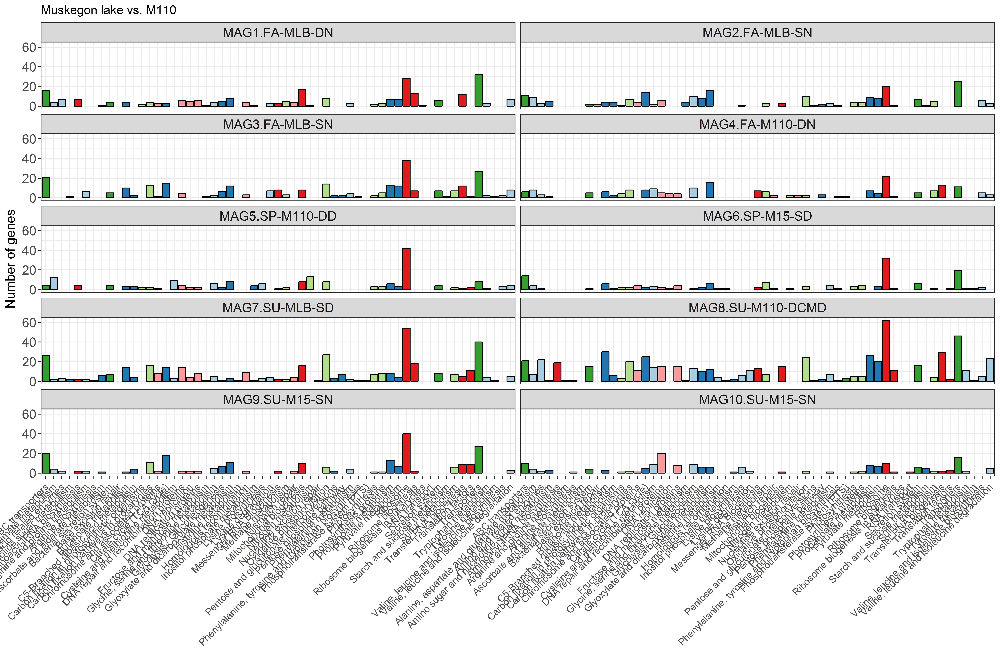

```r
# }

# Plot for each genome the number of differentially expressed genes according to:
# season and site
# p_deseq_1 <- ggplot2::ggplot(res_deseq, aes(x = new_bin_name, fill = new_bin_name))+
#   geom_bar(color = "black")+
#   theme_bw()+
#   scale_fill_brewer(palette = "Paired")+
#   theme(axis.text.x = element_blank(),
#         axis.text.y = element_text(size = 14),
#         legend.title = element_blank(),
#         axis.title = element_text(size = 14),
#         strip.text = element_text(size = 14)) +
#   ylab("Number of mapped reads")+
#   xlab("")+
#   facet_grid(Design~Comparison)
# 
# print(p_deseq_1)

# p_deseq_2 <- ggplot2::ggplot(res_deseq, aes(x = new_bin_name, shape = regulation,
#                                             y = log2FoldChange))+
#   # geom_jitter(size = 3, width = 0.25, shape = 21)+
#   geom_boxplot(alpha= 1, aes(fill = new_bin_name))+
#   theme_bw()+
#   scale_fill_brewer(palette = "Paired")+
#   theme(axis.text.x = element_blank(),
#         axis.text.y = element_text(size = 14),
#         legend.title = element_blank(),
#         axis.title = element_text(size = 14),
#         strip.text = element_text(size = 14))+
#   ylab("log2FoldChange")+
#   xlab("")+
#   facet_grid(Design~Comparison)+
#   guides(shape = FALSE)
# 
# print(p_deseq_2)
```


# 7. Sequence discrete populations

**In order to check unspecific mapping sample reads were mapped consecutively to
every bin using `BBmap.sh`.** This approach allows us to check the mapping specificity by evaluating the distribution of read identity to the putative genome bin.  

Competitive mapping was performed through `blastn` searches against a 1M and 10M read subsample from the interleaved fasta generated after QC (`seqtk`). Shell script used to achieve this:
```
#!/bin/bash
set -e

for file in `cat map.list`
        do
        echo $file
		db=/scratch/vdenef_fluxm/rprops/DESMAN/metaG/vizbin_rebin_anvio_v230/SEQ_discrete/contigs/merged_bins-fixed.db
		seqtk sample -s 777 /scratch/vdenef_fluxm/rprops/DESMAN/metaG/data/${file}/dt_int.fasta 1000000 > /scratch/vdenef_fluxm/rprops/DESMAN/metaG/data/${file}/dt_int_subs_1000000.fasta
        qseqs=/scratch/vdenef_fluxm/rprops/DESMAN/metaG/data/${file}/dt_int_subs_1000000.fasta
		blastn -query ${qseqs} -task megablast -db ${db} -out ./blast_output/${file}_blast.tsv -outfmt 6 -max_target_seqs 1 -num_threads 40 -perc_identity 60
		rm ${qseqs}
done
```

<!-- # ```{r sequence discrete populations, dpi = 500, warning = FALSE, fig.width = 10, fig.height = 7} -->
<!-- # map_disc <- read.table("./SEQs_discrete/final.idhist", header = FALSE, -->
<!-- #                        row.names = NULL) -->
<!-- # colnames(map_disc) <- c("bin","sample", "identity", "reads_mapped", "bases_mapped") -->
<!-- #  -->
<!-- # # Add season metadata -->
<!-- # map_disc$season <- "Summer" -->
<!-- # map_disc$season[grep("Fa", map_disc$sample)] <- "Fall" -->
<!-- # map_disc$season[grep("Su", map_disc$sample)] <- "Summer" -->
<!-- # map_disc$season[grep("Sp", map_disc$sample)] <- "Spring" -->
<!-- # map_disc$sample <- gsub(".C","", map_disc$sample, fixed = TRUE) -->
<!-- # total_reads2 <- total_reads -->
<!-- # total_reads2$sample <- gsub("_", ".", fixed = TRUE,total_reads$sample) -->
<!-- # map_disc <- dplyr::left_join(map_disc, total_reads2, by = "sample") -->
<!-- #  -->
<!-- # # Throw away all %identity below 60% -->
<!-- # # map_disc <- map_disc %>% filter(identity > 60) -->
<!-- #  -->
<!-- # # Normalize reads_mapped to library sizes -->
<!-- # map_disc <- map_disc %>% group_by(sample) %>%  -->
<!-- #   mutate(rel_reads_mapped = 100*reads_mapped/Total_reads) -->
<!-- #  -->
<!-- # # Add observed genome size -->
<!-- # map_disc$bin <- gsub(".fa","",map_disc$bin) -->
<!-- # map_disc <- left_join(map_disc, bin_size, by = c("bin" = "bins")) -->
<!-- #  -->
<!-- # # Plot distributions -->
<!-- # for(bin2plot in unique(map_disc$bin)){ -->
<!-- #     p_sdisc <- map_disc %>% filter(bin == bin2plot) %>%  -->
<!-- #       ggplot(aes(x = identity, y = rel_reads_mapped, color = season))+ -->
<!-- #       theme_bw()+ -->
<!-- #       scale_color_brewer(palette = "Accent")+ -->
<!-- #       facet_wrap(~sample, nrow = 4)+ -->
<!-- #       geom_line(size = 1.5)+ -->
<!-- #       guides(color = FALSE)+ -->
<!-- #       ggtitle(bin2plot)+ -->
<!-- #       theme(axis.text=element_text(size=14), axis.title=element_text(size=20), -->
<!-- #         title=element_text(size=20), legend.text=element_text(size=14), -->
<!-- #         legend.background = element_rect(fill="transparent"), -->
<!-- #         axis.text.x = element_text(angle = 45, hjust = 1), -->
<!-- #         strip.text.y=element_text(size=14))+ -->
<!-- #       ylab("Proportion of reads mapped (%)")+ -->
<!-- #       xlab("Nucleotide identity (%)") -->
<!-- #       # ylim(0,.5) -->
<!-- #    -->
<!-- #   print(p_sdisc) -->
<!-- # } -->
<!-- # ``` -->
<!-- #  -->
<!-- # ```{r plot-cum-discrete, dpi = 500, warning = FALSE, fig.width = 7, fig.height = 10} -->
<!-- # # Plot % reads corrected for genome size over threshold of 0.95 -->
<!-- # id_thresh <- 95 -->
<!-- # map_disc_cum <- map_disc  %>% filter(identity > id_thresh) %>% group_by(sample) %>%  -->
<!-- #   mutate(cum_rel_reads_mapped = cumsum(rel_reads_mapped))%>%  -->
<!-- #   filter(identity == 100) -->
<!-- # sum_cum <- map_disc_cum %>% group_by(sample, bin) %>% mutate(cum_bins_rel_reads_mapped = sum(cum_rel_reads_mapped)) -->
<!-- # colnames(sum_cum)[c(2)] <- "Sample2" -->
<!-- #  -->
<!-- # p_sdisc_cum1 <- ggplot(map_disc_cum, aes(x = sample, y = 1e6*cum_rel_reads_mapped/bin_size,  -->
<!-- #                                         fill = bin))+ -->
<!-- #   theme_bw()+ -->
<!-- #   scale_fill_brewer(palette = "Paired")+ -->
<!-- #   geom_point(size = 4, shape = 21, color = "black")+ -->
<!-- #   theme(axis.text=element_text(size=14), axis.title=element_text(size=20), -->
<!-- #       title=element_text(size=20), legend.text=element_text(size=14), -->
<!-- #       legend.background = element_rect(fill="transparent"), -->
<!-- #       axis.text.x = element_text(angle = 45, hjust = 1), -->
<!-- #       strip.text.y=element_text(size=14), legend.position = "bottom")+ -->
<!-- #   ylab(paste0("Proportion of reads mapped > ", id_thresh, "% NI"))+ -->
<!-- #   xlab("Sample")+ -->
<!-- #   guides(fill=guide_legend(nrow = 11))+ -->
<!-- #   # geom_point(data = sum_cum, aes(x = Sample2, y = cum_bins_rel_reads_mapped), -->
<!-- #              # shape = 22, fill = "black", size = 4)+ -->
<!-- #   ylim(0,2.5) -->
<!-- #  -->
<!-- # print(p_sdisc_cum1) -->
<!-- #  -->
<!-- # # Plot % reads over threshold of 0.99 -->
<!-- # id_thresh <- 99 -->
<!-- # map_disc_cum2 <- map_disc  %>% filter(identity > id_thresh) %>% group_by(sample) %>%  -->
<!-- #   mutate(cum_rel_reads_mapped = cumsum(rel_reads_mapped))%>%  -->
<!-- #   filter(identity == 100) -->
<!-- # sum_cum <- map_disc_cum2 %>% group_by(sample, bin) %>% mutate(cum_bins_rel_reads_mapped = sum(cum_rel_reads_mapped)) -->
<!-- # colnames(sum_cum)[c(2)] <- "Sample2" -->
<!-- #  -->
<!-- # p_sdisc_cum2 <- ggplot(map_disc_cum2, aes(x = sample, y = 1e6*cum_rel_reads_mapped/bin_size,  -->
<!-- #                                         fill = bin))+ -->
<!-- #   theme_bw()+ -->
<!-- #   scale_fill_brewer(palette = "Paired")+ -->
<!-- #   geom_point(size = 4, shape = 21, color = "black")+ -->
<!-- #   theme(axis.text=element_text(size=14), axis.title=element_text(size=20), -->
<!-- #       title=element_text(size=20), legend.text=element_text(size=14), -->
<!-- #       legend.background = element_rect(fill="transparent"), -->
<!-- #       axis.text.x = element_text(angle = 45, hjust = 1), -->
<!-- #       strip.text.y=element_text(size=14), legend.position = "bottom")+ -->
<!-- #   ylab(paste0("Proportion of reads mapped > ", id_thresh, "% NI"))+ -->
<!-- #   xlab("Sample")+ -->
<!-- #   guides(fill=guide_legend(nrow = 11))+ -->
<!-- #   # geom_point(data = sum_cum, aes(x = Sample2, y = cum_bins_rel_reads_mapped), -->
<!-- #              # shape = 22, fill = "black", size = 4)+ -->
<!-- #   ylim(0,1.0) -->
<!-- #  -->
<!-- # print(p_sdisc_cum2) -->
<!-- # ``` -->

### Competitive mapping using `blast` with 1M reads of interleaved fasta.  


```r
blast_df <- read.table("./SEQs_discrete/merged_blast_1M.tsv", header = FALSE)
colnames(blast_df) <- c("Sample", "Contig", "Identity")
blast_df_map <- read.table("./SEQs_discrete/merged_contig_list.tsv", header = FALSE)
colnames(blast_df_map) <- c("m_contig", "o_contig", "bin")

# Round identity to integer
# blast_df$Identity <- round(blast_df$Identity, 1)
# blast_df$Identity <- factor(blast_df$Identity)
blast_df <- left_join(blast_df, blast_df_map, by = c("Contig" = "m_contig"))

# Bin the %Identity in intervals of 0.5%
blast_df_sum <- transform(blast_df, bin_group=cut(Identity,  breaks=seq(0, 100, 0.5)))

# Format sample names and convert to data.frame
blast_df_sum$Sample <- gsub("_blast.tsv", "", blast_df_sum$Sample)
blast_df_sum <- data.frame(blast_df_sum)
# blast_df_sum$Identity <- as.numeric(as.character(blast_df_sum$Identity))
blast_df_sum$bin <- gsub(".fa","",blast_df_sum$bin)
blast_df_sum <- dplyr::left_join(blast_df_sum, bin_size, by = c("bin" = "bins"))

# Add extra column that converts the binning range to a numeric x-coordinate that
# is positioned in the middle of the binning interval
blast_df_sum$bin_group <- gsub("\\(|]", "", 
                               as.character(blast_df_sum$bin_group))
blast_df_sum$bin_xcoord <- as.numeric(do.call(rbind,
                                              strsplit(blast_df_sum$bin_group,
                                                       ","))[,1])+0.25

# Normalize mapped reads per sample based on sample reads
# blast_subs <- 1e6
# blast_df_sum <- blast_df_sum %>% ungroup %>% group_by(Sample) %>% 
#   mutate(n_prop = 100*n/blast_subs)

# Add season variable
blast_df_sum$season <- "Summer"
blast_df_sum$season[grep("Fa", blast_df_sum$Sample)] <- "Fall"
blast_df_sum$season[grep("Su", blast_df_sum$Sample)] <- "Summer"
blast_df_sum$season[grep("Sp", blast_df_sum$Sample)] <- "Spring"

# Reformat sample names
blast_df_sum$Sample <- gsub(".C", "", blast_df_sum$Sample, fixed = TRUE)
blast_df_sum$Sample <- gsub(".A", "", blast_df_sum$Sample, fixed = TRUE)
blast_df_sum$Sample <- gsub(".", "_", blast_df_sum$Sample, fixed = TRUE)

# Add metadata to dataframe
meta_blast <- meta[, -1] %>% distinct()
blast_df_sum <- dplyr::left_join(blast_df_sum, meta_blast, by = c("Sample" = "Sample_ID"))

# Reorder site factor
blast_df_sum$Site <- as.character(blast_df_sum$Site)
blast_df_sum$Site <- gsub("Buoy","Muskegon Lake", blast_df_sum$Site)
blast_df_sum$Site <- gsub("110","Lake Michigan\nsite M110", blast_df_sum$Site)
blast_df_sum$Site <- gsub("15","Lake Michigan\nsite M15", blast_df_sum$Site)
blast_df_sum$Site <- factor(blast_df_sum$Site, levels = c("Muskegon Lake",
                                                          "Lake Michigan\nsite M15",
                                                          "Lake Michigan\nsite M110"))
blast_df_sum$Depth <- as.character(blast_df_sum$Depth)
blast_df_sum$Depth <- factor(blast_df_sum$Depth, levels = c("Surface", "Mid", "Deep"))
blast_df_sum$season <- as.character(blast_df_sum$season)
blast_df_sum$season <- factor(blast_df_sum$season, levels = c("Spring", "Summer", "Fall"))

# remove non-Limnohabbitans bin
blast_df_sum <- blast_df_sum %>% dplyr::filter(bin != "B2_Fa13.BD.MLB.DN_rebin10")

# Add extra column with new bin names
new_bin_names <- read.table("./anvio_output/rebin/general_bins_summary_selected_final.tsv", header = TRUE)[, c(2,3)]
blast_df_sum <- left_join(blast_df_sum, new_bin_names, by = c("bin" = "bins"))
blast_df_sum$new_bin_name <- as.character(blast_df_sum$new_bin_name)
blast_df_sum$new_bin_name <- factor(blast_df_sum$new_bin_name, levels =
                                      c("MAG1.FA-MLB-DN","MAG2.FA-MLB-SN",
                                        "MAG3.FA-MLB-SN", "MAG4.FA-M110-DN",
                                        "MAG5.SP-M110-DD","MAG6.SP-M15-SD",
                                        "MAG7.SU-MLB-SD","MAG8.SU-M110-DCMD",
                                        "MAG9.SU-M15-SN","MAG10.SU-M15-SN"))
# plot for individual bins
for(bin2plot in unique(blast_df_sum$new_bin_name)){
  p_blast_sdisc <- blast_df_sum %>% dplyr::filter(new_bin_name == bin2plot) %>% 
     ggplot(aes(x = bin_xcoord, ..scaled.., fill = season))+
      theme_bw()+
      scale_fill_brewer(palette = "Accent")+
      facet_wrap(~Sample, nrow = 4)+
      geom_density(color = "black")+
      guides(color = FALSE)+
      ggtitle(bin2plot)+
      theme(axis.text=element_text(size=14), axis.title=element_text(size=20),
        title=element_text(size=20), legend.text=element_text(size=14),
        legend.background = element_rect(fill="transparent"),
        axis.text.x = element_text(angle = 45, hjust = 1),
        strip.text.y=element_text(size=14))+
      ylab("Density")+
      xlab("Nucleotide identity (%)")+
    xlim(75,100)
     
print(p_blast_sdisc)
}
```

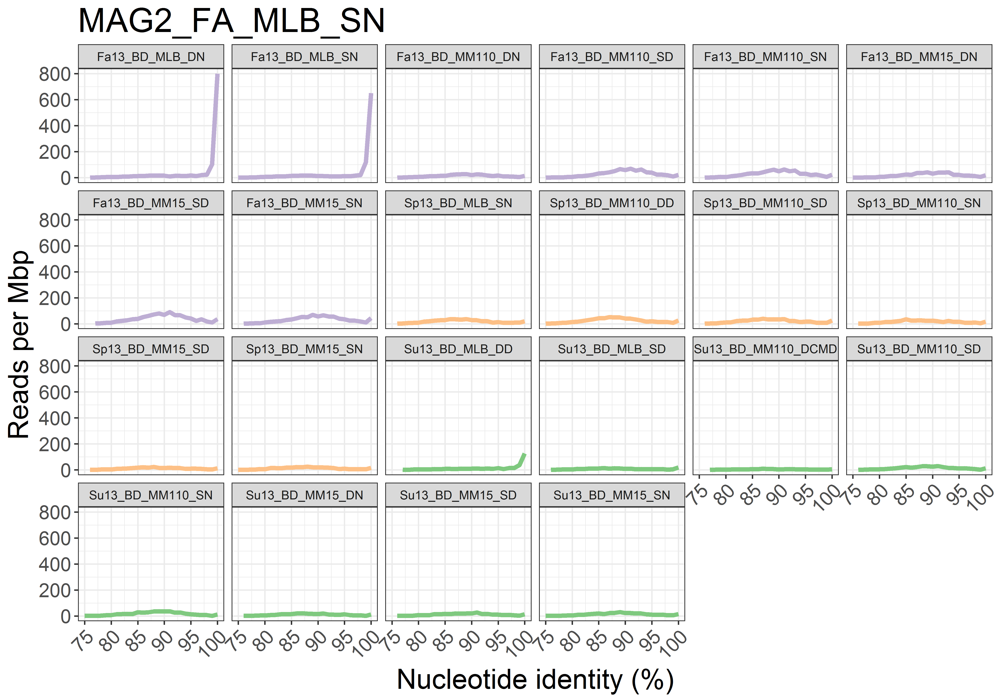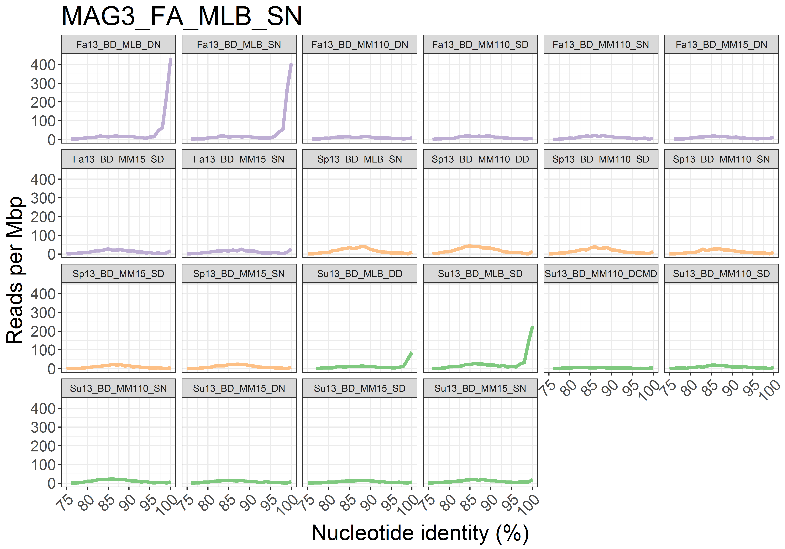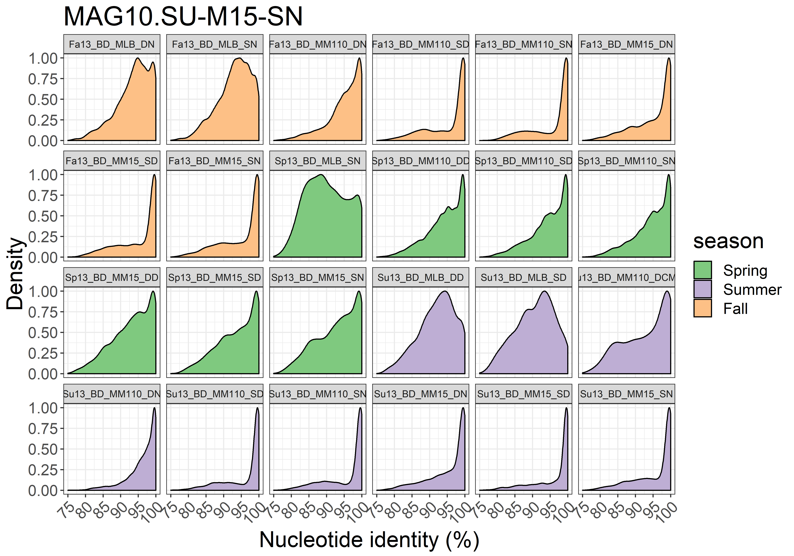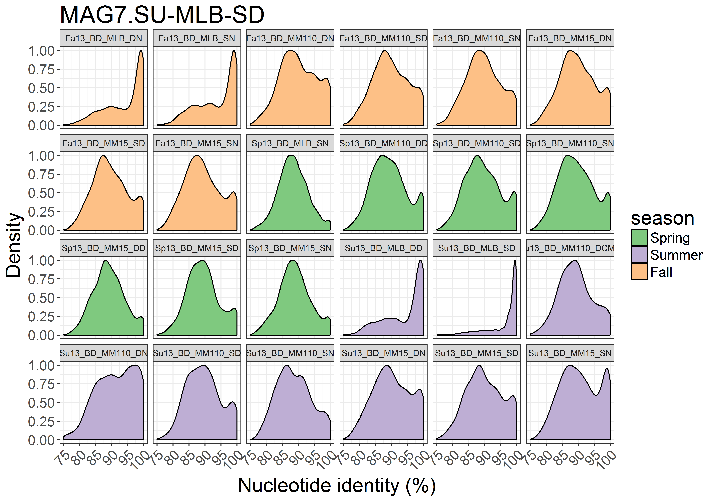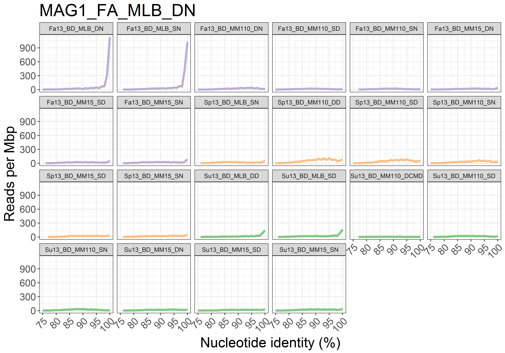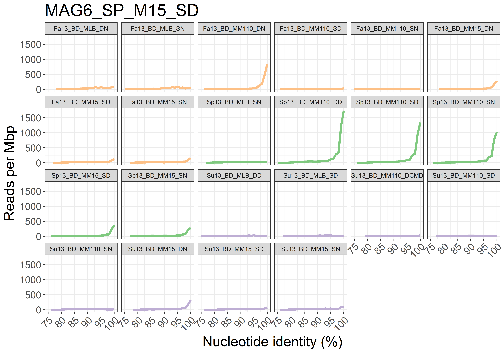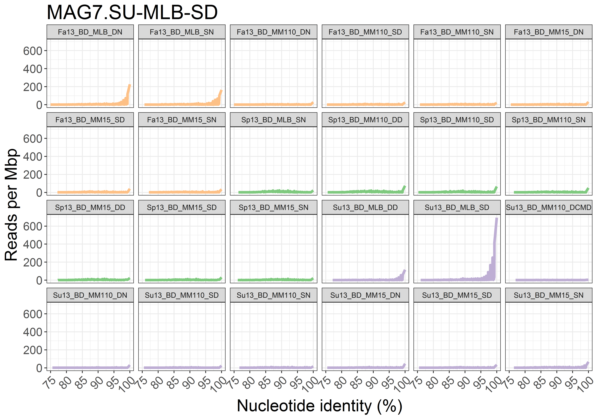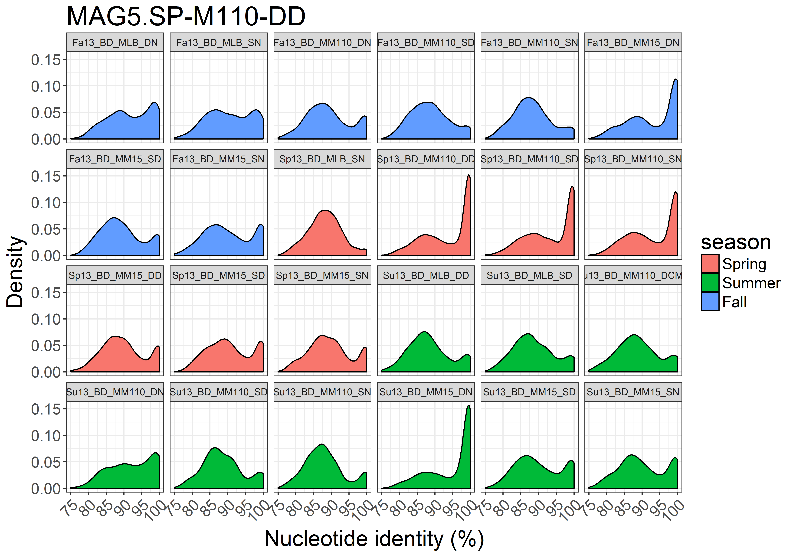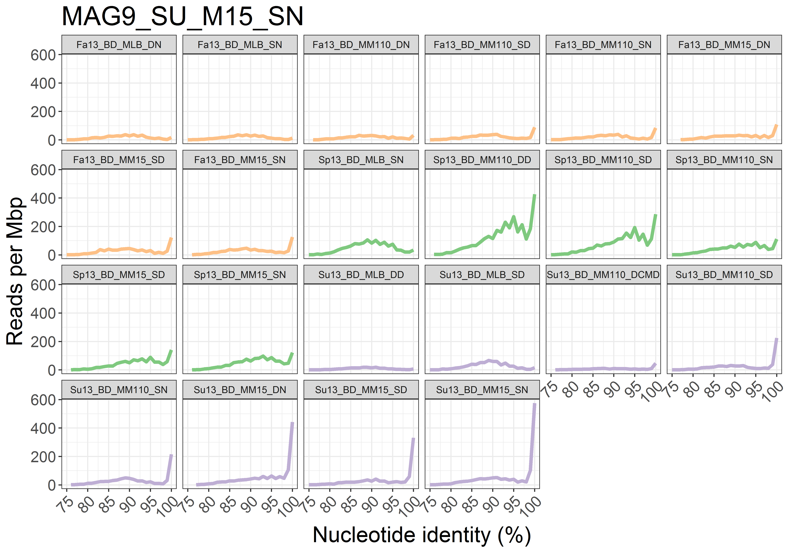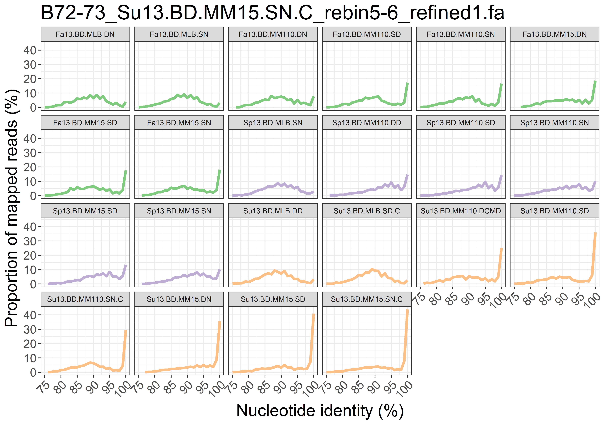


```r
# Plot one combined figure with proportions normalized for genome size
p_blast_sdisc_merged <- blast_df_sum %>% 
     ggplot(aes(x = bin_xcoord, ..density.., color = bin))+
      theme_gray()+
      scale_color_brewer("", palette = "Paired")+
      facet_wrap(~Sample, nrow = 4)+
      geom_density()+
      ggtitle("Merged bins per sample")+
      theme(axis.text=element_text(size=14), axis.title=element_text(size=20),
        title=element_text(size=20), legend.text=element_text(size=14),
        legend.background = element_rect(fill="transparent"),
        axis.text.x = element_text(angle = 45, hjust = 1),
        strip.text.y=element_text(size=14),
        legend.position = "bottom")+
      ylab("Reads per Mbp")+
      xlab("Nucleotide identity (%)")+
    xlim(75,100)+
  guides(color=guide_legend(ncol=3))
     
print(p_blast_sdisc_merged)
```

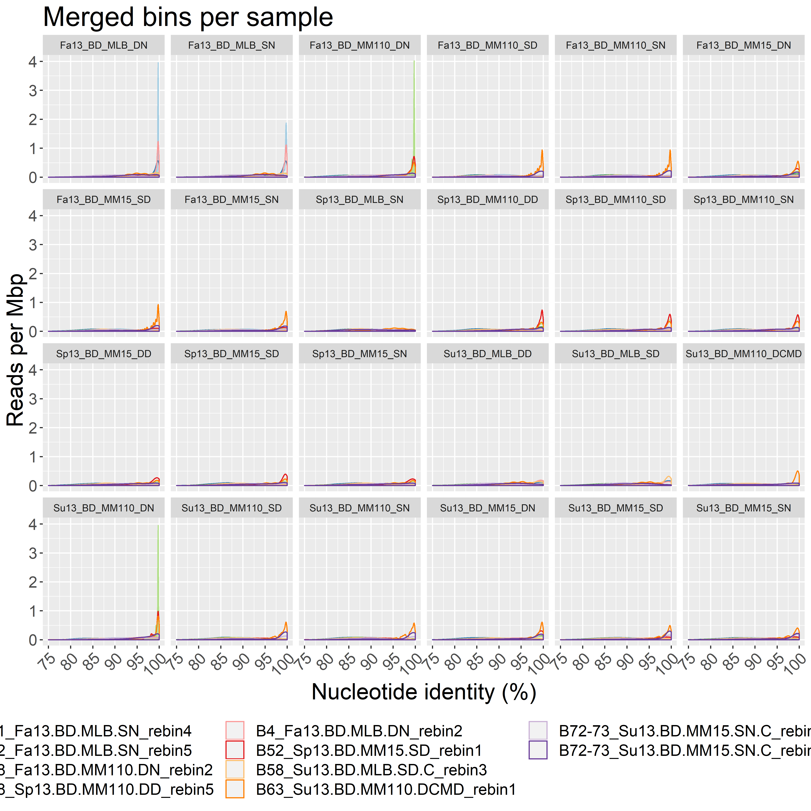

```r
# Plot for most abundant bin (B63)
p_blast_sdisc_B63 <- blast_df_sum %>% dplyr::filter(bin == "B63_Su13.BD.MM110.DCMD_rebin1") %>% 
  ggplot(aes(x = bin_xcoord, ..density.., fill = season, group = Sample,
             shape = Depth))+
  theme_bw()+
  facet_grid(season~Site)+
  geom_density(alpha = 0.4, color = "black", size = 1)+
  scale_shape_manual("", values = c(21,22,24))+
  scale_fill_brewer(palette = "Accent")+
  guides(color = FALSE, fill = FALSE)+
  theme(axis.text=element_text(size=14), axis.title=element_text(size=20),
        title=element_text(size=20), legend.text=element_text(size=14),
        legend.background = element_rect(fill="transparent"),
        axis.text.x = element_text(angle = 45, hjust = 1),
        strip.text=element_text(size=16),
        panel.grid.minor = element_blank(),
        legend.position = "bottom")+
  ylab("Density")+
  xlab("Nucleotide identity (%)")+
  xlim(75,100)

p_blast_sdisc_B63
```

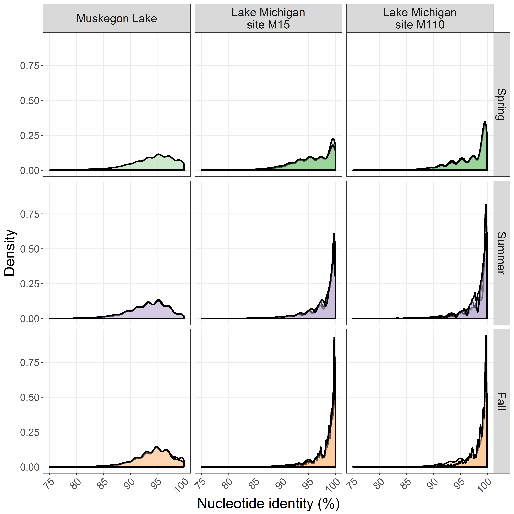


```r
# Plot for most Muskegon Lake for all bins
p_blast_sdisc_ML <- blast_df_sum %>% dplyr::filter(Site == "Muskegon Lake") %>% 
  ggplot(aes(x = bin_xcoord, ..scaled.., fill = new_bin_name, group = Sample,
             shape = Depth))+
  theme_bw()+
  facet_grid(new_bin_name~season, scales = "free_y")+
  geom_density(alpha = 0.3, color = "black", size = 1)+
  # geom_point(size = 3, alpha = 0.6)+
  scale_shape_manual("", values = c(21,22,24))+
  scale_fill_manual(values = fill_palette)+
  guides(color = FALSE, fill = FALSE)+
  # ggtitle(bin2plot)+
  theme(axis.text=element_text(size=14), axis.title=element_text(size=20),
        title=element_text(size=20), legend.text=element_text(size=14),
        legend.background = element_rect(fill="transparent"),
        axis.text.x = element_text(angle = 45, hjust = 1),
        strip.text=element_text(size=14),
        panel.grid.minor = element_blank(),
        legend.position = "bottom")+
  ylab("Scaled density")+
  xlab("Nucleotide identity (%)")+
  xlim(75,100)

p_blast_sdisc_ML
```

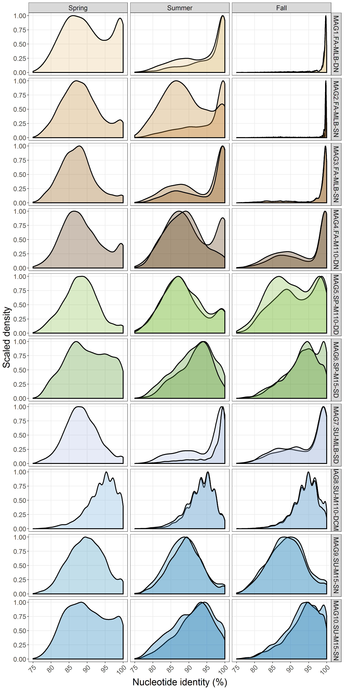


```r
blast_df_sum_comp <- blast_df_sum %>% group_by(Sample, bin) %>% dplyr::count(bin_xcoord)
blast_df_sum_comp <-  dplyr::left_join(blast_df_sum_comp, bin_size, by = c("bin" = "bins"))
blast_df_sum_comp <- left_join(blast_df_sum_comp, new_bin_names, by = c("bin" = "bins"))
blast_df_sum_comp$new_bin_name <- as.character(blast_df_sum_comp$new_bin_name)
blast_df_sum_comp$new_bin_name <- factor(blast_df_sum_comp$new_bin_name, levels =
                                      c("MAG1.FA-MLB-DN","MAG2.FA-MLB-SN",
                                        "MAG3.FA-MLB-SN", "MAG4.FA-M110-DN",
                                        "MAG5.SP-M110-DD","MAG6.SP-M15-SD",
                                        "MAG7.SU-MLB-SD","MAG8.SU-M110-DCMD",
                                        "MAG9.SU-M15-SN","MAG10.SU-M15-SN"))
blast_df_sum_comp <- dplyr::left_join(blast_df_sum_comp, meta_blast, by = c("Sample" = "Sample_ID"))

# Reorder site factor
blast_df_sum_comp$Site <- as.character(blast_df_sum_comp$Site)
blast_df_sum_comp$Site <- gsub("Buoy","Muskegon Lake", blast_df_sum_comp$Site)
blast_df_sum_comp$Site <- gsub("110","Lake Michigan\nsite M110", blast_df_sum_comp$Site)
blast_df_sum_comp$Site <- gsub("15","Lake Michigan\nsite M15", blast_df_sum_comp$Site)
blast_df_sum_comp$Site <- factor(blast_df_sum_comp$Site, 
                                 levels = c("Muskegon Lake",
                                            "Lake Michigan\nsite M15",
                                            "Lake Michigan\nsite M110"))
blast_df_sum_comp$Depth <- as.character(blast_df_sum_comp$Depth)
blast_df_sum_comp$Depth <- factor(blast_df_sum_comp$Depth, 
                                  levels = c("Surface", "Mid", "Deep"))
blast_df_sum_comp$Season <- as.character(blast_df_sum_comp$Season)
blast_df_sum_comp$Season <- factor(blast_df_sum_comp$Season, levels = c("Spring", "Summer", "Fall"))

# Normalize mapped reads per sample based on genome size
blast_df_sum_comp <- blast_df_sum_comp %>% group_by(bin) %>%
mutate(n_norm = 1e6*n/bin_size)

blast_df_sum_comp <- left_join(blast_df_sum_comp, total_reads, by = c("Sample" = "sample"))

# Divide normalized reads by 1M (fixed blast census)
blast_df_sum_comp <- blast_df_sum_comp %>% mutate(n_norm_perc = 100*n_norm/1e6)
```


```r
# Plot % reads corrected for genome size over threshold of 0.95
id_thresh <- 95-0.25
map_disc_cum <- blast_df_sum_comp  %>% dplyr::filter(bin_xcoord > id_thresh) %>% group_by(Sample, bin) %>% 
  mutate(cum_rel_reads_mapped = cumsum(n_norm_perc))%>% 
  dplyr::filter(bin_xcoord == 100-0.25)
sum_cum <- map_disc_cum %>% group_by(Sample, bin) %>% mutate(cum_bins_rel_reads_mapped = sum(cum_rel_reads_mapped))

p_sdisc_cum3 <- ggplot(map_disc_cum, aes(x = new_bin_name, 
                                         y = cum_rel_reads_mapped, 
                                        fill = new_bin_name))+
  theme_bw()+
  scale_fill_manual("", values = fill_palette)+
  geom_jitter(size = 4, shape = 21, color = "black", alpha = 0.7, width = 0.15)+
  theme(axis.text=element_text(size=14), axis.title=element_text(size=20),
      title=element_text(size=20), legend.text=element_text(size=12),
      legend.background = element_rect(fill="transparent"),
      axis.text.x = element_blank(),
      strip.text=element_text(size=14), legend.position = "bottom",
      strip.background = element_rect(fill = adjustcolor("gray", 0.15)))+
  ylab(paste0("Norm. relative abundance ( > ", id_thresh, "% NI)"))+
  xlab("")+
  guides(fill=guide_legend(nrow = 3))+
  facet_grid(Season~Site, scales ="free")+
  scale_y_continuous(labels=scaleFUN, limits = c(0,3))+
  coord_trans(y = "sqrt")

print(p_sdisc_cum3)
```

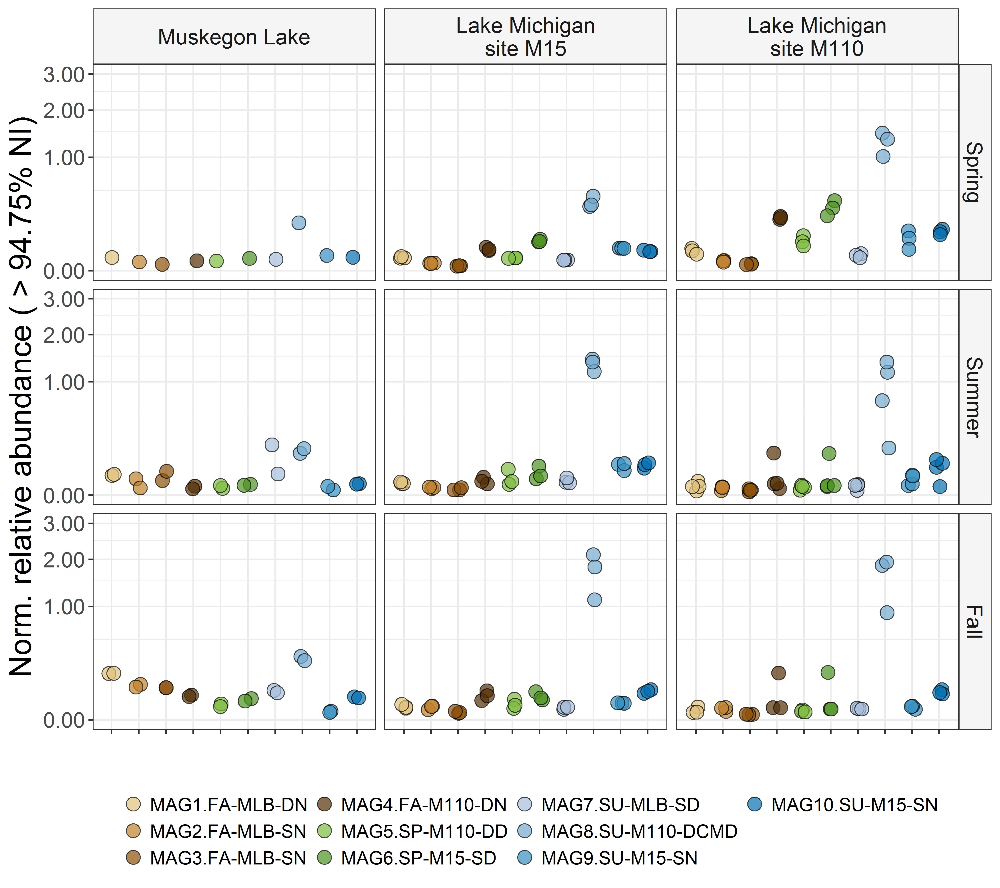

```r
# Plot % reads over threshold of 0.99
id_thresh <- 99-0.25
map_disc_cum <- blast_df_sum_comp  %>% dplyr::filter(bin_xcoord > id_thresh) %>% group_by(Sample, bin) %>% 
  mutate(cum_rel_reads_mapped = cumsum(n_norm_perc))%>% 
  dplyr::filter(bin_xcoord == 100-0.25)
sum_cum <- map_disc_cum %>% group_by(Sample, bin) %>% mutate(cum_bins_rel_reads_mapped = sum(cum_rel_reads_mapped))

p_sdisc_cum4 <- ggplot(map_disc_cum, aes(x = new_bin_name, 
                                         y = cum_rel_reads_mapped, 
                                        fill = new_bin_name))+
  theme_bw()+
  scale_fill_manual("", values = fill_palette)+
  geom_jitter(size = 4, shape = 21, color = "black", alpha = 0.7, width = 0.15)+
  theme(axis.text=element_text(size=14), axis.title=element_text(size=20),
      title=element_text(size=20), legend.text=element_text(size=12),
      legend.background = element_rect(fill="transparent"),
      axis.text.x = element_blank(),
      strip.text=element_text(size=14), legend.position = "bottom",
      strip.background = element_rect(fill = adjustcolor("gray", 0.15)))+
  ylab(paste0("Norm. relative abundance ( > ", id_thresh, "% NI)"))+
  xlab("")+
  guides(fill=guide_legend(nrow = 3))+
  facet_grid(Season~Site, scales ="free")+
  scale_y_continuous(labels=scaleFUN, limits = c(0,1.25))+
  coord_trans(y = "sqrt")

print(p_sdisc_cum4)
```

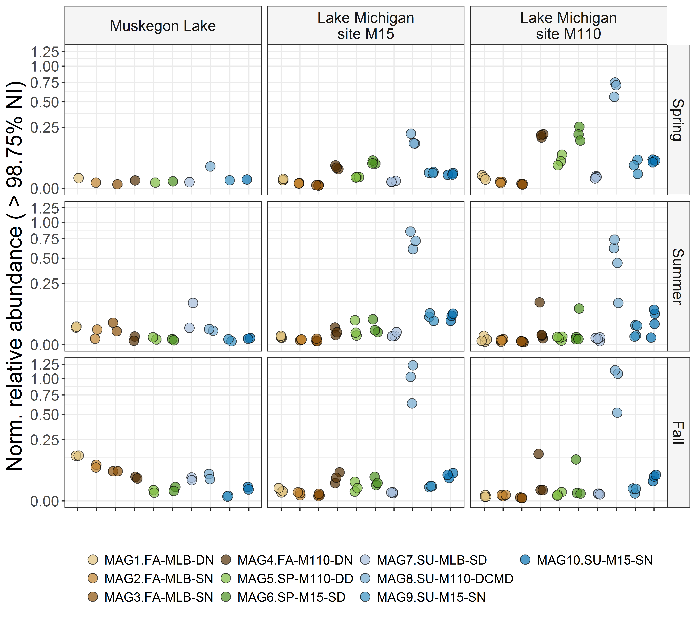

### Filter out bins using MClust  

** Here we will use model-based clustering to determine whether there is a MAG present or not in a certain sample. ** 


```r
# Perform gaussian mixture clustering on whole dataset.
mod1 <- densityMclust(blast_df_sum$bin_xcoord)
summary(mod1)
```

```
## -------------------------------------------------------
## Density estimation via Gaussian finite mixture modeling 
## -------------------------------------------------------
## 
## Mclust V (univariate, unequal variance) model with 3 components:
## 
##  log.likelihood      n df      BIC      ICL
##        -2219404 946589  8 -4438919 -4672195
## 
## Clustering table:
##      1      2      3 
## 329524 251916 365149
```

```r
par(mfrow=c(2,2))
plot(mod1, what = "density", data = blast_df_sum$bin_xcoord, breaks = 15)
plot(mod1, what = "BIC")
plot(mod1, what = "diagnostic", type = "cdf")
plot(mod1, what = "diagnostic", type = "qq")
```

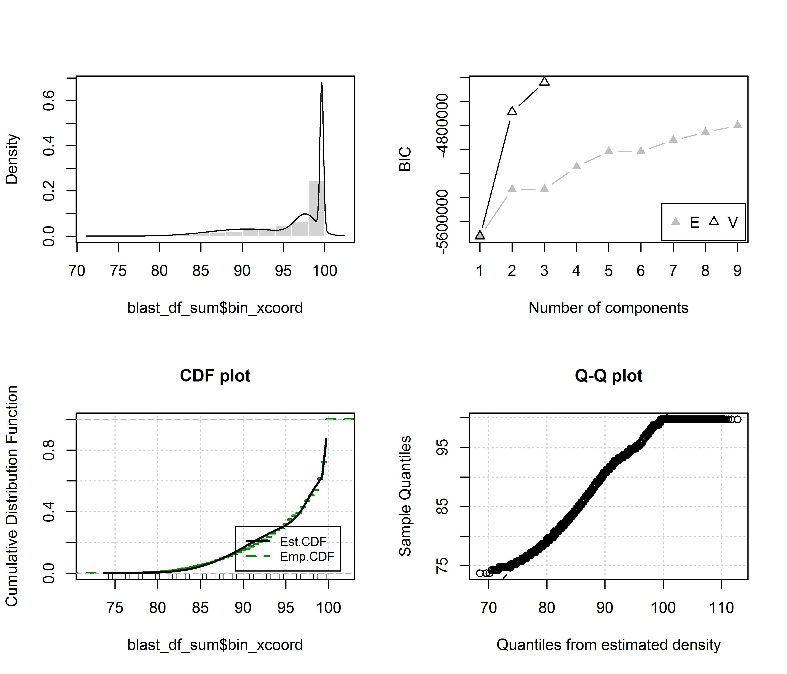

```r
par(mfrow=c(1,1))

# Return cluster labels and plot the Sequence discrete populations again.
blast_df_sum$cluster_label <- mod1$classification
blast_df_sum$model_density <- mod1$density

# Add cluster labels to blast_df_sum_comp
tmp <- blast_df_sum[, c("bin_xcoord", "cluster_label", "model_density")] %>% distinct()
tmp$bin_xcoord <- as.factor(tmp$bin_xcoord)
blast_df_sum_comp$bin_xcoord <- as.factor(blast_df_sum_comp$bin_xcoord)
blast_df_sum_comp <- left_join(blast_df_sum_comp, tmp, by = "bin_xcoord")
blast_df_sum_comp$bin_xcoord <- 
  as.numeric(as.character(blast_df_sum_comp$bin_xcoord))
blast_df_sum_comp$cluster_label <- as.factor(blast_df_sum_comp$cluster_label)

# Plot for global analysis
p_blast_sdisc_glob_clust <- blast_df_sum_comp %>% 
  ggplot(aes(x = bin_xcoord, y = model_density, 
             color = cluster_label, group = Sample))+
  theme_bw()+
  geom_line(alpha = 1, size = 1)+
  scale_color_brewer(palette = "Dark2")+
  guides(color = FALSE, fill = FALSE)+
  theme(axis.text=element_text(size=14), axis.title=element_text(size=20),
        title=element_text(size=20), legend.text=element_text(size=14),
        legend.background = element_rect(fill="transparent"),
        axis.text.x = element_text(angle = 45, hjust = 1),
        strip.text=element_text(size=16),
        panel.grid.minor = element_blank(),
        legend.position = "bottom")+
  ylab("Density")+
  xlab("Nucleotide identity (%)")+
  xlim(75,100)

print(p_blast_sdisc_glob_clust)
```

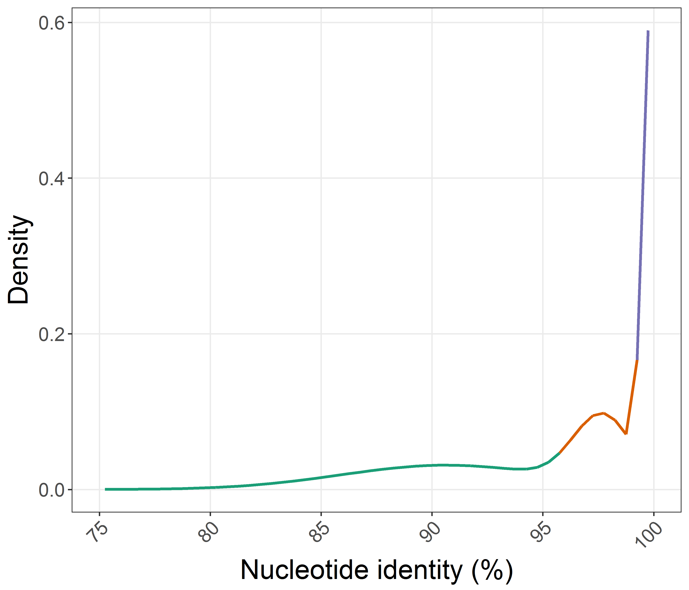


```r
# Plot for most abundant bin (B63)
p_blast_sdisc_B63_clust <- blast_df_sum_comp %>% dplyr::filter(bin == "B63_Su13.BD.MM110.DCMD_rebin1") %>% 
  ggplot(aes(x = bin_xcoord, y = n, color = cluster_label, group = Sample))+
  theme_bw()+
  facet_grid(Season~Site)+
  geom_line(alpha = 1, size = 1)+
  scale_color_brewer(palette = "Dark2")+
  guides(color = FALSE, fill = FALSE)+
  theme(axis.text=element_text(size=14), axis.title=element_text(size=20),
        title=element_text(size=20), legend.text=element_text(size=14),
        legend.background = element_rect(fill="transparent"),
        axis.text.x = element_text(angle = 45, hjust = 1),
        strip.text=element_text(size=16),
        panel.grid.minor = element_blank(),
        legend.position = "bottom")+
  ylab("Density")+
  xlab("Nucleotide identity (%)")+
  xlim(75,100)

print(p_blast_sdisc_B63_clust)
```

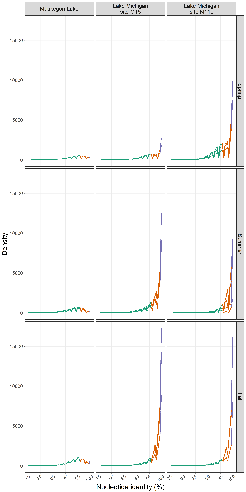

### Compare blast to bwa results  


```r
# Compare blast inferred abundances with bwa inferred abundances
grid_arrange_shared_legend(p_abs2, p_sdisc_cum4, ncol = 2)
```

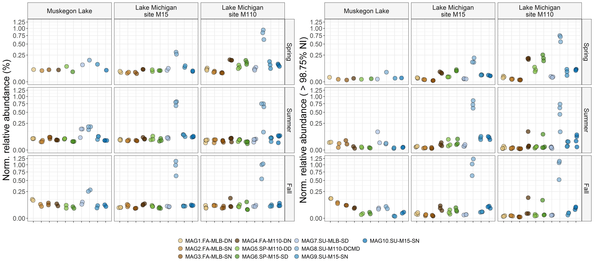


```r
# Merge those two dataframes and make scatter plot highlighting the differences 
df_map_merged_sm <- df_map_merged[, c("Bin","Sample","rel_norm_abundance", "Season", "Site")]
df_map_merged_sm$Sample <- gsub(".", "_", df_map_merged_sm$Sample, fixed = TRUE)
df_map_merged_sm <- data.frame(df_map_merged_sm, 
                               interaction = interaction(df_map_merged_sm$Bin,
                                                                         df_map_merged_sm$Sample),
                              method = "bwa")

map_disc_cum_sm <- map_disc_cum[, c("bin","Sample","cum_rel_reads_mapped")] 
map_disc_cum_sm <- data.frame(map_disc_cum_sm, 
                              interaction = interaction(map_disc_cum_sm$bin,
                                                                         map_disc_cum_sm$Sample),
                              method = "blastn")

abs_merged <- left_join(df_map_merged_sm, map_disc_cum_sm, by = "interaction")
abs_merged <- abs_merged[,c("Bin","Sample.x","rel_norm_abundance","cum_rel_reads_mapped",
                            "Season", "Site")]
colnames(abs_merged) <- c("Bin","Sample",
                          "bwa_norm_abundance","blastn_norm_abundance",
                          "Season", "Site")


# Plot
p_scat_abund <- ggplot(abs_merged, aes(x = bwa_norm_abundance, y = blastn_norm_abundance))+
  theme_bw()+
  geom_point(size = 4, shape = 21, color = "black", alpha = 0.7,
             aes(fill = Bin))+
  scale_fill_manual("", values = fill_palette)+
  theme(axis.text=element_text(size=14), axis.title=element_text(size=20),
      title=element_text(size=20), legend.text=element_text(size=12),
      legend.background = element_rect(fill="transparent"),
      strip.text=element_text(size=14), legend.position = "bottom",
      strip.background = element_rect(fill = adjustcolor("gray", 0.15)))+
  ylab(paste0("Norm. relative abundance (blastn, > ", id_thresh, "% NI)"))+
  xlab("Norm. relative abundance (BWA)")+
  guides(fill=guide_legend(nrow = 3))+
  facet_grid(Season~Site, scales ="free")+
  scale_y_continuous(labels=scaleFUN)+
  scale_x_continuous(labels=scaleFUN)+
  geom_smooth(method = "lm", color = "black")
  # coord_trans(x = "atanh", y = "atanh")

print(p_scat_abund)
```

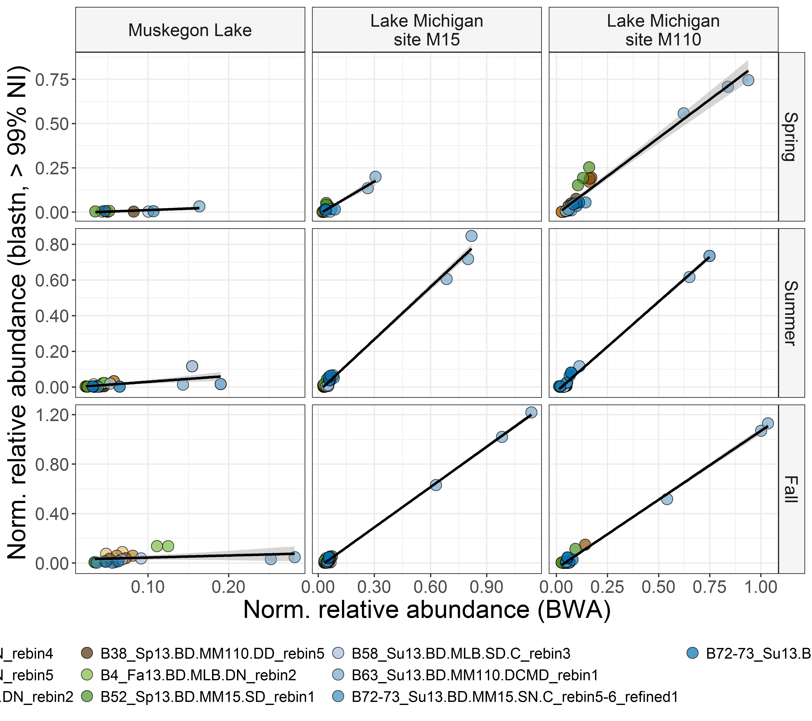

### Calculate temporospatial diversity in Lhab


```r
abs_merged_div <- map_disc_cum[, c("Sample", "new_bin_name", "n_norm")]
abs_merged_div$n_norm <- as.integer(abs_merged_div$n_norm )

# Format long to wide format
abs_table <- spread(abs_merged_div, Sample, n_norm)
abs_table <- data.frame(abs_table)
rownames(abs_table) <- abs_table[, 1]; abs_table <- abs_table[, -1]
tax.table <- data.frame(MAGs = rownames(abs_table))
rownames(tax.table) <- tax.table$MAGs

# Make phyloseq object
MAG_phy <- phyloseq(otu_table(abs_table, taxa_are_rows = TRUE), 
         tax_table(as.matrix(tax.table)))

# Run Diversity_16S()
MAG_div <- Diversity_16S(MAG_phy, ncore = 3, parallel = TRUE,
                         R = 100, brea = FALSE)
```

```
## 	**WARNING** this functions assumes that rows are samples and columns
##       	are taxa in your phyloseq object, please verify.
## Sat Mar 03 16:50:18 2018 	Using 3 cores for calculations
## Sat Mar 03 16:50:18 2018	Calculating diversity for sample 1/24 --- Fa13_BD_MLB_DN
## Sat Mar 03 16:50:33 2018	Done with sample Fa13_BD_MLB_DN
## Sat Mar 03 16:50:33 2018	Calculating diversity for sample 2/24 --- Fa13_BD_MLB_SN
## Sat Mar 03 16:50:36 2018	Done with sample Fa13_BD_MLB_SN
## Sat Mar 03 16:50:36 2018	Calculating diversity for sample 3/24 --- Fa13_BD_MM110_DN
## Sat Mar 03 16:50:39 2018	Done with sample Fa13_BD_MM110_DN
## Sat Mar 03 16:50:39 2018	Calculating diversity for sample 4/24 --- Fa13_BD_MM110_SD
## Sat Mar 03 16:50:42 2018	Done with sample Fa13_BD_MM110_SD
## Sat Mar 03 16:50:42 2018	Calculating diversity for sample 5/24 --- Fa13_BD_MM110_SN
## Sat Mar 03 16:50:45 2018	Done with sample Fa13_BD_MM110_SN
## Sat Mar 03 16:50:45 2018	Calculating diversity for sample 6/24 --- Fa13_BD_MM15_DN
## Sat Mar 03 16:50:47 2018	Done with sample Fa13_BD_MM15_DN
## Sat Mar 03 16:50:47 2018	Calculating diversity for sample 7/24 --- Fa13_BD_MM15_SD
## Sat Mar 03 16:50:50 2018	Done with sample Fa13_BD_MM15_SD
## Sat Mar 03 16:50:50 2018	Calculating diversity for sample 8/24 --- Fa13_BD_MM15_SN
## Sat Mar 03 16:50:53 2018	Done with sample Fa13_BD_MM15_SN
## Sat Mar 03 16:50:53 2018	Calculating diversity for sample 9/24 --- Sp13_BD_MLB_SN
## Sat Mar 03 16:50:56 2018	Done with sample Sp13_BD_MLB_SN
## Sat Mar 03 16:50:56 2018	Calculating diversity for sample 10/24 --- Sp13_BD_MM110_DD
## Sat Mar 03 16:50:58 2018	Done with sample Sp13_BD_MM110_DD
## Sat Mar 03 16:50:58 2018	Calculating diversity for sample 11/24 --- Sp13_BD_MM110_SD
## Sat Mar 03 16:51:01 2018	Done with sample Sp13_BD_MM110_SD
## Sat Mar 03 16:51:01 2018	Calculating diversity for sample 12/24 --- Sp13_BD_MM110_SN
## Sat Mar 03 16:51:04 2018	Done with sample Sp13_BD_MM110_SN
## Sat Mar 03 16:51:04 2018	Calculating diversity for sample 13/24 --- Sp13_BD_MM15_DD
## Sat Mar 03 16:51:08 2018	Done with sample Sp13_BD_MM15_DD
## Sat Mar 03 16:51:08 2018	Calculating diversity for sample 14/24 --- Sp13_BD_MM15_SD
## Sat Mar 03 16:51:10 2018	Done with sample Sp13_BD_MM15_SD
## Sat Mar 03 16:51:10 2018	Calculating diversity for sample 15/24 --- Sp13_BD_MM15_SN
## Sat Mar 03 16:51:14 2018	Done with sample Sp13_BD_MM15_SN
## Sat Mar 03 16:51:14 2018	Calculating diversity for sample 16/24 --- Su13_BD_MLB_DD
## Sat Mar 03 16:51:17 2018	Done with sample Su13_BD_MLB_DD
## Sat Mar 03 16:51:17 2018	Calculating diversity for sample 17/24 --- Su13_BD_MLB_SD
## Sat Mar 03 16:51:19 2018	Done with sample Su13_BD_MLB_SD
## Sat Mar 03 16:51:19 2018	Calculating diversity for sample 18/24 --- Su13_BD_MM110_DCMD
## Sat Mar 03 16:51:22 2018	Done with sample Su13_BD_MM110_DCMD
## Sat Mar 03 16:51:22 2018	Calculating diversity for sample 19/24 --- Su13_BD_MM110_DN
## Sat Mar 03 16:51:25 2018	Done with sample Su13_BD_MM110_DN
## Sat Mar 03 16:51:25 2018	Calculating diversity for sample 20/24 --- Su13_BD_MM110_SD
## Sat Mar 03 16:51:28 2018	Done with sample Su13_BD_MM110_SD
## Sat Mar 03 16:51:28 2018	Calculating diversity for sample 21/24 --- Su13_BD_MM110_SN
## Sat Mar 03 16:51:31 2018	Done with sample Su13_BD_MM110_SN
## Sat Mar 03 16:51:31 2018	Calculating diversity for sample 22/24 --- Su13_BD_MM15_DN
## Sat Mar 03 16:51:34 2018	Done with sample Su13_BD_MM15_DN
## Sat Mar 03 16:51:34 2018	Calculating diversity for sample 23/24 --- Su13_BD_MM15_SD
## Sat Mar 03 16:51:37 2018	Done with sample Su13_BD_MM15_SD
## Sat Mar 03 16:51:37 2018	Calculating diversity for sample 24/24 --- Su13_BD_MM15_SN
## Sat Mar 03 16:51:40 2018	Done with sample Su13_BD_MM15_SN
## Sat Mar 03 16:51:40 2018 	Closing workers
## Sat Mar 03 16:51:40 2018 	Done with all 24 samples
```

```r
MAG_div <- data.frame(Sample = rownames(MAG_div), MAG_div[,-c(3:6)])

# Merge with metadata
MAG_div <- left_join(MAG_div, meta_blast, by = c("Sample" = "Sample_ID"))

# Annotate and order metavariables
MAG_div$Site <- as.character(MAG_div$Site)
MAG_div$Site <- gsub("Buoy","Muskegon Lake", MAG_div$Site)
MAG_div$Site <- gsub("110","Lake Michigan\nsite M110", MAG_div$Site)
MAG_div$Site <- gsub("15","Lake Michigan\nsite M15", MAG_div$Site)
MAG_div$Site <- factor(MAG_div$Site, levels = c("Muskegon Lake",
                                                          "Lake Michigan\nsite M15",
                                                          "Lake Michigan\nsite M110"))
MAG_div$Depth <- as.character(MAG_div$Depth)
MAG_div$Depth <- factor(MAG_div$Depth, levels = c("Surface", "Mid", "Deep"))
MAG_div$Season <- as.character(MAG_div$Season)
MAG_div$Season <- factor(MAG_div$Season, levels = c("Spring", "Summer", "Fall"))

# Plot results
p_MAG_div <- ggplot(MAG_div, aes(x = Season, y = D2, 
                                        fill = Season, shape = Depth))+
  theme_bw()+
  scale_fill_brewer(palette = "Accent")+
  geom_point(size = 4, color = "black", alpha = 0.7)+
  scale_shape_manual(values = c(21,24,23))+
  # geom_boxplot(alpha = 0.4)+
  theme(axis.text=element_text(size=14), axis.title=element_text(size=20),
      title=element_text(size=20), legend.text=element_text(size=12),
      legend.background = element_rect(fill="transparent"),
      axis.text.x = element_text(size = 14, angle = 45, hjust = 1),
      strip.text=element_text(size=14), legend.position = "bottom",
      strip.background = element_rect(fill = adjustcolor("gray", 0.15)))+
  ylab(paste0("Limnohabitans population\n diversity (D2)"))+
  guides(fill=FALSE)+
  facet_grid(~Site, scales ="free")+
  xlab("")+
  geom_errorbar(aes(ymin = D2 - sd.D2, ymax = D2 + sd.D2), width = 0.05)+
  scale_y_continuous(labels=scaleFUN, limits = c(0,6.5))
  # coord_trans(y = "sqrt")

print(p_MAG_div)
```

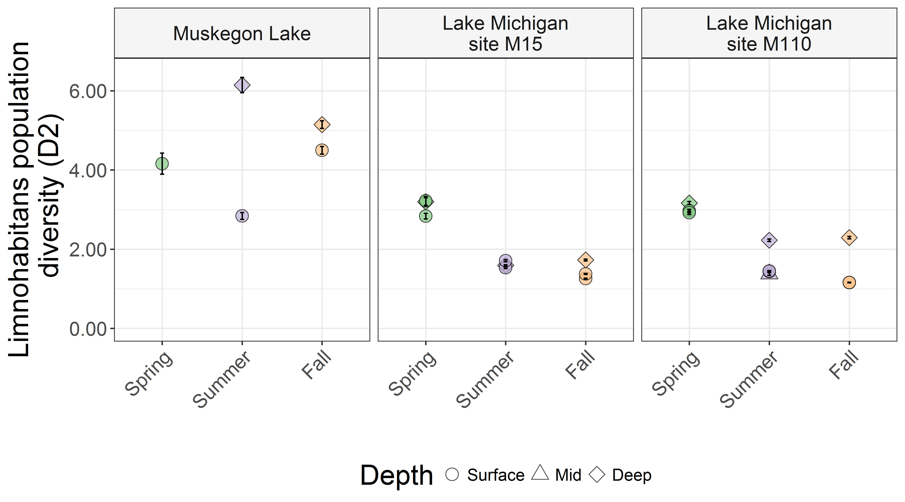

# 8. DESMAN


```r
# Import data
results_desm <- read.csv("./DESMAN/MAG8_scg_10_9/Gamma_meanR.csv", header = TRUE)
colnames(results_desm)[1] <- "Samples"
colnames(results_desm) <- gsub("X", "Variant", colnames(results_desm))
results_desm$Samples <- gsub(".sorted.MAG8","",results_desm$Samples, fixed = TRUE)
# Import library prep data
library_prep <- read.table("./mapping_files/Libraries.tsv",header = TRUE)

# Wide to long format
results_desm_long <- tidyr::gather(results_desm, Variant, Freq, 
                             2:(ncol(results_desm)), factor_key=TRUE)
# Merge with metadata
results_desm_long <- dplyr::left_join(results_desm_long, library_prep, by = "Samples")
results_desm_long$Samples <- gsub(".A", "", results_desm_long$Samples, fixed = TRUE)
results_desm_long$Samples <- gsub(".C", "", results_desm_long$Samples, fixed = TRUE)
results_desm_long <- dplyr::left_join(results_desm_long, meta_em, by = c("Samples" = "Sample_ID"))

results_desm_long$Site <- as.character(results_desm_long$Site)
results_desm_long$Site <- gsub("110", "Lake Michigan\nsite M110", results_desm_long$Site)
results_desm_long$Site <- gsub("15", "Lake Michigan\nsite M15", results_desm_long$Site)
results_desm_long$Site <- gsub("Buoy", "Muskegon Lake", results_desm_long$Site)
results_desm_long$Site <- factor(results_desm_long$Site, levels = c("Muskegon Lake",
                                                            "Lake Michigan\nsite M15",
                                                            "Lake Michigan\nsite M110"))
results_desm_long$Season <- as.character(results_desm_long$Season)
results_desm_long$Season <- factor(results_desm_long$Season, levels = c("Spring", "Summer","Fall"))

# Factor to numeric
results_desm_long$Temperature..C. <- as.numeric(as.character(results_desm_long$Temperature..C.))
results_desm_long$PAR <- as.numeric(as.character(results_desm_long$PAR))
results_desm_long$Chl.Lab..ug.L. <- as.numeric(as.character(results_desm_long$Chl.Lab..ug.L.))
results_desm_long$DO.Probe..mg.L. <- as.numeric(as.character(results_desm_long$DO.Probe..mg.L.))
results_desm_long$TP.ug.L <- as.numeric(as.character(results_desm_long$TP.ug.L))
results_desm_long$DOC.mg.L <- as.numeric(as.character(results_desm_long$DOC.mg.L))
```

## Check correlation with environmental variables 


```r
# # Make plots
# desm_p1 <- ggplot(results_desm_long, aes(x = Samples, y = Freq, fill = Variant))+
#   geom_bar(stat = "identity", color = "black", alpha = 0.7)+
#   scale_fill_brewer(palette = "Accent")+
#   theme_bw()+
#   # geom_point(size = 4, color = "black", alpha = 0.7)+
#   # scale_shape_manual(values = c(21,24,23))+
#   # geom_boxplot(alpha = 0.4)+
#   theme(axis.text=element_text(size=12), axis.title=element_text(size=16),
#       title=element_text(size=16), legend.text=element_text(size=10),
#       legend.background = element_rect(fill="transparent"),
#       axis.text.x = element_text(size = 12, angle = 45, hjust = 1),
#       strip.text=element_text(size=14), legend.position = "bottom",
#       strip.background = element_rect(fill = adjustcolor("gray", 0.15)))+
#   ylab(paste0("Variant frequency MAG8"))+
#   guides(fill=FALSE)+
#   facet_grid(Season~Site, scales ="free")+
#   xlab("")+
#   scale_y_continuous(labels=scaleFUN, limits = c(0,1))
#   # coord_trans(y = "sqrt")
# 
# print(desm_p1)

desm_p1b <- ggplot(results_desm_long, aes(x = Season, y = Freq, 
                                         fill = Variant, 
                                         col = Variant,
                                         shape = Depth))+
  geom_point(color = "black", alpha = 0.7, size = 3, col = "black")+
  scale_shape_manual(values = c(21,22,23))+
  geom_boxplot(alpha = 0.3, col = "black", outlier.shape = NA, size = 0.3)+
  scale_fill_brewer("", palette = "Accent")+
  scale_color_brewer("",palette = "Accent")+
  theme_bw()+
  # geom_point(size = 4, color = "black", alpha = 0.7)+
  # scale_shape_manual(values = c(21,24,23))+
  # geom_boxplot(alpha = 0.4)+
  theme(axis.text=element_text(size=12), axis.title=element_text(size=16),
      title=element_text(size=16), legend.text=element_text(size=10),
      legend.background = element_rect(fill="transparent"),
      axis.text.x = element_text(size = 12, angle = 45, hjust = 1),
      strip.text=element_text(size=12), legend.position = "bottom",
      strip.background = element_rect(fill = adjustcolor("gray", 0.15)))+
  ylab(paste0("Variant frequency"))+
  guides(fill=FALSE)+
  facet_grid(Site~Variant, scales ="free")+
  xlab("")+
  scale_y_continuous(labels=scaleFUN, limits = c(0,1))+
  # geom_smooth(se = FALSE)+
  guides(fill=FALSE)
  # coord_trans(y = "sqrt")

print(desm_p1b)
```

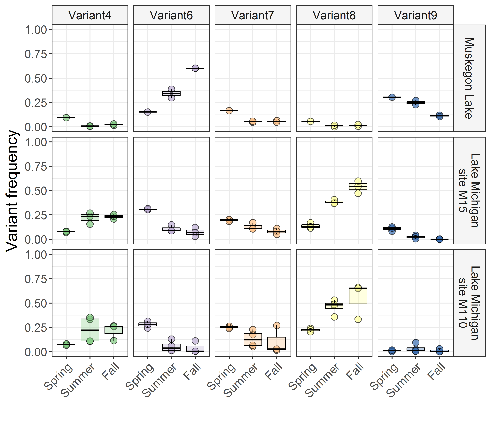


```r
desm_p2 <- ggplot(results_desm_long, aes(x = Temperature..C., y = Freq, 
                                         fill = Variant, 
                                         col = Variant))+
  geom_point(color = "black", alpha = 0.7, shape = 21, size = 4, col = "black")+
  scale_fill_brewer("", palette = "Accent")+
  scale_color_brewer("", palette = "Accent")+
  theme_bw()+
  # geom_point(size = 4, color = "black", alpha = 0.7)+
  # scale_shape_manual(values = c(21,24,23))+
  # geom_boxplot(alpha = 0.4)+
  theme(axis.text=element_text(size=12), axis.title=element_text(size=16),
      title=element_text(size=16), legend.text=element_text(size=10),
      legend.background = element_rect(fill="transparent"),
      axis.text.x = element_text(size = 12, angle = 45, hjust = 1),
      strip.text=element_text(size=12), legend.position = "bottom",
      strip.background = element_rect(fill = adjustcolor("gray", 0.15)))+
  ylab(paste0("Variant frequency"))+
  guides(fill=FALSE)+
  # facet_grid(Season~Site, scales ="free")+
  xlab("Temperature (°C)")+
  scale_y_continuous(labels=scaleFUN, limits = c(0,1))+
  geom_smooth(se = FALSE)+
  guides(fill=guide_legend(nrow=2))
  # coord_trans(y = "sqrt")

desm_p3 <- ggplot(results_desm_long, aes(x = PAR , y = Freq, 
                                         fill = Variant, 
                                         col = Variant))+
  geom_point(color = "black", alpha = 0.7, shape = 21, size = 4, col = "black")+
  scale_fill_brewer("", palette = "Accent")+
  scale_color_brewer("", palette = "Accent")+
  theme_bw()+
  # geom_point(size = 4, color = "black", alpha = 0.7)+
  # scale_shape_manual(values = c(21,24,23))+
  # geom_boxplot(alpha = 0.4)+
  theme(axis.text=element_text(size=12), axis.title=element_text(size=16),
      title=element_text(size=16), legend.text=element_text(size=10),
      legend.background = element_rect(fill="transparent"),
      axis.text.x = element_text(size = 12, angle = 45, hjust = 1),
      strip.text=element_text(size=12), legend.position = "bottom",
      strip.background = element_rect(fill = adjustcolor("gray", 0.15)))+
  ylab(paste0("Variant frequency"))+
  guides(fill=FALSE)+
  # facet_grid(Season~Site, scales ="free")+
  xlab("PAR")+
  scale_y_continuous(labels=scaleFUN, limits = c(0,1))+
  geom_smooth(se = FALSE)+
  guides(fill=guide_legend(nrow=2))
  # coord_trans(y = "sqrt")

desm_p4 <- ggplot(results_desm_long, aes(x = DO.Probe..mg.L. , y = Freq, 
                                         fill = Variant, 
                                         col = Variant))+
  geom_point(color = "black", alpha = 0.7, shape = 21, size = 4, col = "black")+
  scale_fill_brewer("", palette = "Accent")+
  scale_color_brewer("",palette = "Accent")+
  theme_bw()+
  # geom_point(size = 4, color = "black", alpha = 0.7)+
  # scale_shape_manual(values = c(21,24,23))+
  # geom_boxplot(alpha = 0.4)+
  theme(axis.text=element_text(size=12), axis.title=element_text(size=16),
      title=element_text(size=16), legend.text=element_text(size=10),
      legend.background = element_rect(fill="transparent"),
      axis.text.x = element_text(size = 12, angle = 45, hjust = 1),
      strip.text=element_text(size=12), legend.position = "bottom",
      strip.background = element_rect(fill = adjustcolor("gray", 0.15)))+
  ylab(paste0("Variant frequency"))+
  guides(fill=FALSE)+
  # facet_grid(Season~Site, scales ="free")+
  xlab("DO concentration (mg/L)")+
  scale_y_continuous(labels=scaleFUN, limits = c(0,1))+
  geom_smooth(se = FALSE)+
  guides(fill=guide_legend(nrow=2))
  # coord_trans(y = "sqrt")

desm_p5 <- ggplot(results_desm_long, aes(x =TP.ug.L, y = Freq, 
                                         fill = Variant, 
                                         col = Variant))+
  geom_point(color = "black", alpha = 0.7, shape = 21, size = 4, col = "black")+
  scale_fill_brewer("", palette = "Accent")+
  scale_color_brewer("",palette = "Accent")+
  theme_bw()+
  # geom_point(size = 4, color = "black", alpha = 0.7)+
  # scale_shape_manual(values = c(21,24,23))+
  # geom_boxplot(alpha = 0.4)+
  theme(axis.text=element_text(size=12), axis.title=element_text(size=16),
      title=element_text(size=16), legend.text=element_text(size=10),
      legend.background = element_rect(fill="transparent"),
      axis.text.x = element_text(size = 12, angle = 45, hjust = 1),
      strip.text=element_text(size=12), legend.position = "bottom",
      strip.background = element_rect(fill = adjustcolor("gray", 0.15)))+
  ylab(paste0("Variant frequency"))+
  guides(fill=FALSE)+
  # facet_grid(Season~Site, scales ="free")+
  xlab("Total Phosphorous (µg/L)")+
  scale_y_continuous(labels=scaleFUN, limits = c(0,1))+
  geom_smooth(se = FALSE)+
  guides(fill=guide_legend(nrow=2))
  # coord_trans(y = "sqrt")

desm_p6 <- ggplot(results_desm_long, aes(x =DOC.mg.L, y = Freq, 
                                         fill = Variant, 
                                         col = Variant))+
  geom_point(color = "black", alpha = 0.7, shape = 21, size = 4, col = "black")+
  scale_fill_brewer("", palette = "Accent")+
  scale_color_brewer("",palette = "Accent")+
  theme_bw()+
  # geom_point(size = 4, color = "black", alpha = 0.7)+
  # scale_shape_manual(values = c(21,24,23))+
  # geom_boxplot(alpha = 0.4)+
  theme(axis.text=element_text(size=12), axis.title=element_text(size=16),
      title=element_text(size=16), legend.text=element_text(size=10),
      legend.background = element_rect(fill="transparent"),
      axis.text.x = element_text(size = 12, angle = 45, hjust = 1),
      strip.text=element_text(size=12), legend.position = "bottom",
      strip.background = element_rect(fill = adjustcolor("gray", 0.15)))+
  ylab(paste0("Variant frequency"))+
  guides(fill=FALSE)+
  # facet_grid(Season~Site, scales ="free")+
  xlab("DOC (mg/L)")+
  scale_y_continuous(labels=scaleFUN, limits = c(0,1))+
  geom_smooth(se = FALSE)+
  guides(fill=guide_legend(nrow=2))
  # coord_trans(y = "sqrt")

# Combine all exploratory plots
cowplot::plot_grid(desm_p2, desm_p3, desm_p4, desm_p5, ncol = 2, align = 'hv')
```

```
## `geom_smooth()` using method = 'loess'
## `geom_smooth()` using method = 'loess'
## `geom_smooth()` using method = 'loess'
## `geom_smooth()` using method = 'loess'
```

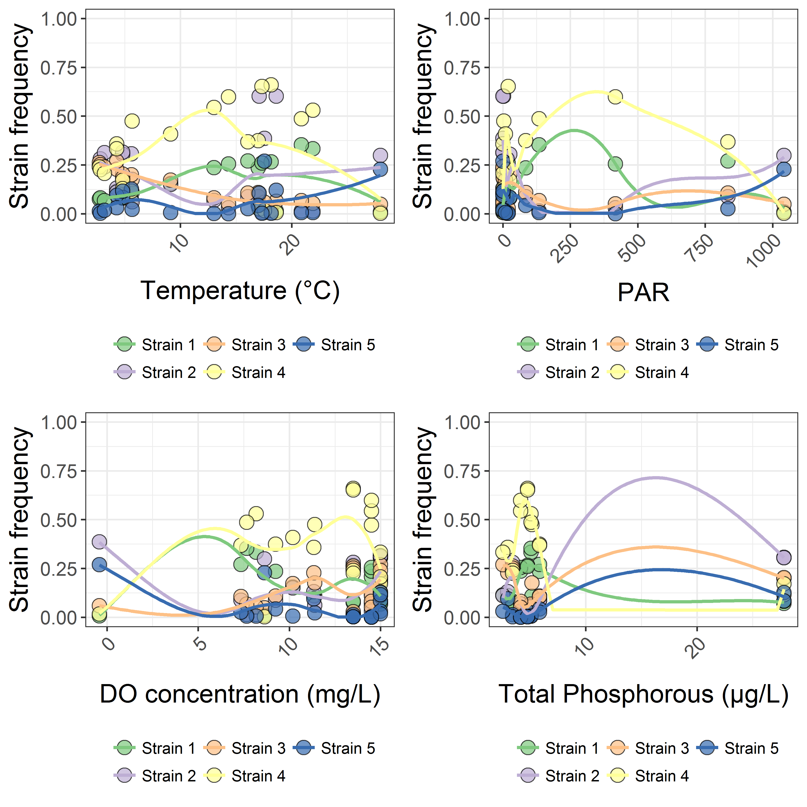


## Ordination plots 


```r
# Make PCoA
variants <- results_desm[,2:ncol(results_desm)]
rownames(variants) <- results_desm[, 1]
taxa <- as.matrix(data.frame(variant_name = colnames(results_desm)[2:ncol(results_desm)]))
rownames(taxa) <- colnames(results_desm)[2:ncol(results_desm)]

# Store as phyloseq object
physeq_desm <- phyloseq(otu_table(variants, taxa_are_rows = FALSE),
         tax_table(taxa)
)

# Run beta diversity analysis on 16s data
pcoa <- ordinate(
  physeq = physeq_desm, 
  method = "PCoA", 
  distance = "bray",
  correction = "lingoes",
  k=2
)
pcoa.df <- data.frame(Samples = sample_names(physeq_desm), pcoa$vectors)
var <- round(pcoa$values$Eigenvalues/sum(pcoa$values$Eigenvalues)*100,1)

# Add metadata
pcoa.df$Samples <- gsub(".A", "", pcoa.df$Samples, fixed = TRUE)
pcoa.df$Samples <- gsub(".C", "", pcoa.df$Samples, fixed = TRUE)
pcoa.df <- dplyr::left_join(pcoa.df, meta_em, by = c("Samples" = "Sample_ID"))

# Run permanova
x <- results_desm[,2:ncol(results_desm)]
rownames(x) <- results_desm[, 1]
dist_desm <- vegan::vegdist(x)
perm <- permute::how(nperm = 999)
permanova_desm <- vegan::adonis(dist_desm ~ Season * Site, 
                        data = meta_em, 
                        permutations = perm)

# Plot PCoA
my_grob = grobTree(textGrob(bquote(paste(r[Season]^2 == 
    .(round(100 * permanova_desm$aov.tab[1, 5], 1)), 
    "%")), x = 0.7, y = 0.95, hjust = 0, gp = gpar(col = "black", 
    fontsize = 14, fontface = "italic")))
my_grob2 = grobTree(textGrob(bquote(paste(r[Site]^2 == 
    .(format(round(100 * permanova_desm$aov.tab[2, 5], 
        1), nsmall = 1)), "%")), x = 0.7, y = 0.87, 
    hjust = 0, gp = gpar(col = "black", fontsize = 14, 
        fontface = "italic")))
my_grob3 = grobTree(textGrob(bquote(paste(r[Season:Site]^2 == 
    .(round(100 * permanova_desm$aov.tab[3, 5], 1)), 
    "%")), x = 0.7, y = 0.79, hjust = 0, gp = gpar(col = "black", 
    fontsize = 14, fontface = "italic")))

pcoa.ord <- ggplot(data=pcoa.df, aes(x=Axis.1, y=Axis.2, shape = Site))+
  scale_shape_manual(values=c(21,23, 24))+
  geom_point(size=7, alpha=0.7, aes(fill = Season))+
  theme_bw()+
  scale_fill_brewer(palette = "Accent")+
  labs(x = paste0("PCoA axis 1 (",var[1], "%)"),
       y = paste0("PCoA axis 2 (",var[2], "%)"), fill="", shape = "", colour="")+
  theme(axis.text=element_text(size=14), axis.title=element_text(size=16),
        title=element_text(size=16), legend.text=element_text(size=16))+ 
  guides(fill = guide_legend(override.aes = list(shape = 22)))+
  annotation_custom(my_grob)+
  annotation_custom(my_grob2)+
  annotation_custom(my_grob3)+
  ggtitle("PCoA of resolved MAG8 variant composition")

print(pcoa.ord)
```

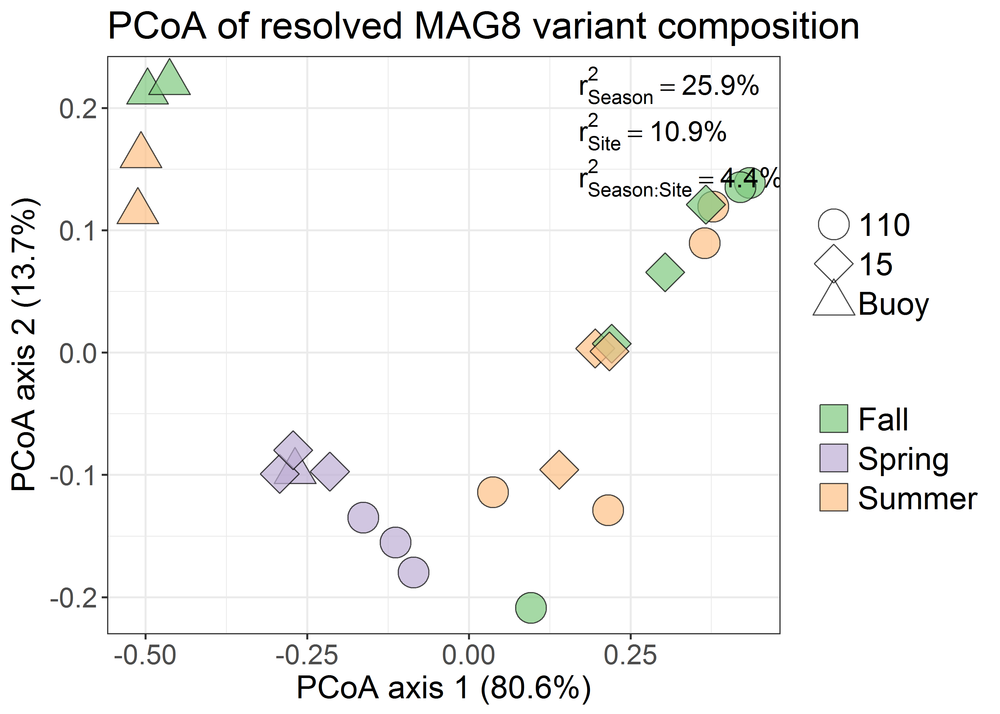

## MVabund

Whip out multivariate abundance testing for hypopthesis test on environmental variables?


# 9. iRep analysis

```r
# Import data
irep_files <- list.files("./iRep/results", pattern = "irep_")
irep_sample_order <- read.table("./iRep/results/sample_order.tsv")
for(file in irep_files){
  # print(file)
  file_tmp <- read.table(paste("./iRep/results/", file, sep = ""),
                         stringsAsFactors = FALSE)
  bin_name <- gsub("irep_results_|.tsv", "", file)
  # print(bin_name)
  file_tmp <- data.frame(Genome_bin = bin_name, iRep_value = file_tmp[,2],
                         iRep_type = rep(c("iRep_filtered","iRep_unfiltered"), 24),
                         Sample = rep(irep_sample_order$V1, each = 2))
  if(file == irep_files[1]) results_irep <- file_tmp else{
    results_irep <- rbind(results_irep, file_tmp)
  }
}

# Rename sample names
results_irep$Sample <- gsub(".A", "", results_irep$Sample, fixed = TRUE)
results_irep$Sample <- gsub(".C", "", results_irep$Sample, fixed = TRUE)

# Rename genome bins
results_irep <- dplyr::left_join(results_irep, new_bin_names, by = c("Genome_bin" = "bins"))
results_irep$new_bin_name <- as.character(results_irep$new_bin_name)
results_irep$new_bin_name <- factor(results_irep$new_bin_name, levels =
                                      c("MAG1.FA-MLB-DN","MAG2.FA-MLB-SN",
                                        "MAG3.FA-MLB-SN", "MAG4.FA-M110-DN",
                                        "MAG5.SP-M110-DD","MAG6.SP-M15-SD",
                                        "MAG7.SU-MLB-SD","MAG8.SU-M110-DCMD",
                                        "MAG9.SU-M15-SN","MAG10.SU-M15-SN"))

# Merge with metadata
results_irep <- dplyr::left_join(results_irep, meta, by = "Sample")
results_irep$iRep_value <- as.numeric(as.character(results_irep$iRep_value))

# Format metadata
results_irep$Site <- as.character(results_irep$Site)
results_irep$Site <- gsub("110", "Lake Michigan\nsite M110", results_irep$Site)
results_irep$Site <- gsub("15", "Lake Michigan\nsite M15", results_irep$Site)
results_irep$Site <- gsub("Buoy", "Muskegon Lake", results_irep$Site)
results_irep$Site <- factor(results_irep$Site, levels = c("Muskegon Lake",
                                                            "Lake Michigan\nsite M15",
                                                            "Lake Michigan\nsite M110"))
results_irep$Season <- as.character(results_irep$Season)
results_irep$Season <- factor(results_irep$Season, levels = c("Spring", "Summer","Fall"))
```

## Plot results  


```r
# Plot unfiltered iRep
irep_p1 <- results_irep %>% 
  dplyr::filter(iRep_type == "iRep_unfiltered") %>% 
  ggplot(aes(x = new_bin_name, y = iRep_value, fill = new_bin_name, col = new_bin_name))+
  geom_point(color = "black", alpha = 0.7, size = 4, shape = 21)+
  # scale_shape_manual(values = c(21,22,23))+
  geom_boxplot(alpha = 0.3, col = "black", outlier.shape = NA, size = 0.3)+
  scale_fill_manual("", values = fill_palette)+
  scale_color_brewer("",palette = "Accent")+
  theme_bw()+
  # geom_point(size = 4, color = "black", alpha = 0.7)+
  # scale_shape_manual(values = c(21,24,23))+
  # geom_boxplot(alpha = 0.4)+
  theme(axis.text=element_text(size=12), axis.title=element_text(size=16),
      title=element_text(size=16), legend.text=element_text(size=10),
      legend.background = element_rect(fill="transparent"),
      axis.text.x = element_text(size = 12, angle = 45, hjust = 1),
      strip.text=element_text(size=12), legend.position = "bottom",
      strip.background = element_rect(fill = adjustcolor("gray", 0.15)))+
  ylab(paste0("iRep"))+
  guides(fill=FALSE)+
  facet_grid(Season~Site, scales ="free")+
  xlab("")+
  scale_y_continuous(labels=scaleFUN, limits = c(1,4.5))+
  # geom_smooth(se = FALSE)+
  guides(fill=FALSE)
  # coord_trans(y = "sqrt")

print(irep_p1)
```


```r
# Plot filtered irep
irep_p2 <- results_irep %>% 
  dplyr::filter(iRep_type == "iRep_filtered") %>% 
  ggplot(aes(x = new_bin_name, y = iRep_value, fill = new_bin_name, col = new_bin_name))+
  geom_point(color = "black", alpha = 0.7, size = 4, shape = 21)+
  # scale_shape_manual(values = c(21,22,23))+
  geom_boxplot(alpha = 0.3, col = "black", outlier.shape = NA, size = 0.3)+
  scale_fill_manual("", values = fill_palette)+
  scale_color_brewer("",palette = "Accent")+
  theme_bw()+
  # geom_point(size = 4, color = "black", alpha = 0.7)+
  # scale_shape_manual(values = c(21,24,23))+
  # geom_boxplot(alpha = 0.4)+
  theme(axis.text=element_text(size=12), axis.title=element_text(size=16),
      title=element_text(size=16), legend.text=element_text(size=10),
      legend.background = element_rect(fill="transparent"),
      axis.text.x = element_text(size = 12, angle = 45, hjust = 1),
      strip.text=element_text(size=12), legend.position = "bottom",
      strip.background = element_rect(fill = adjustcolor("gray", 0.15)))+
  ylab(paste0("iRep"))+
  guides(fill=FALSE)+
  facet_grid(Season~Site, scales ="free")+
  xlab("")+
  scale_y_continuous(labels=scaleFUN, limits = c(1,4.5))+
  # geom_smooth(se = FALSE)+
  guides(fill=FALSE)
  # coord_trans(y = "sqrt")

print(irep_p2)
```

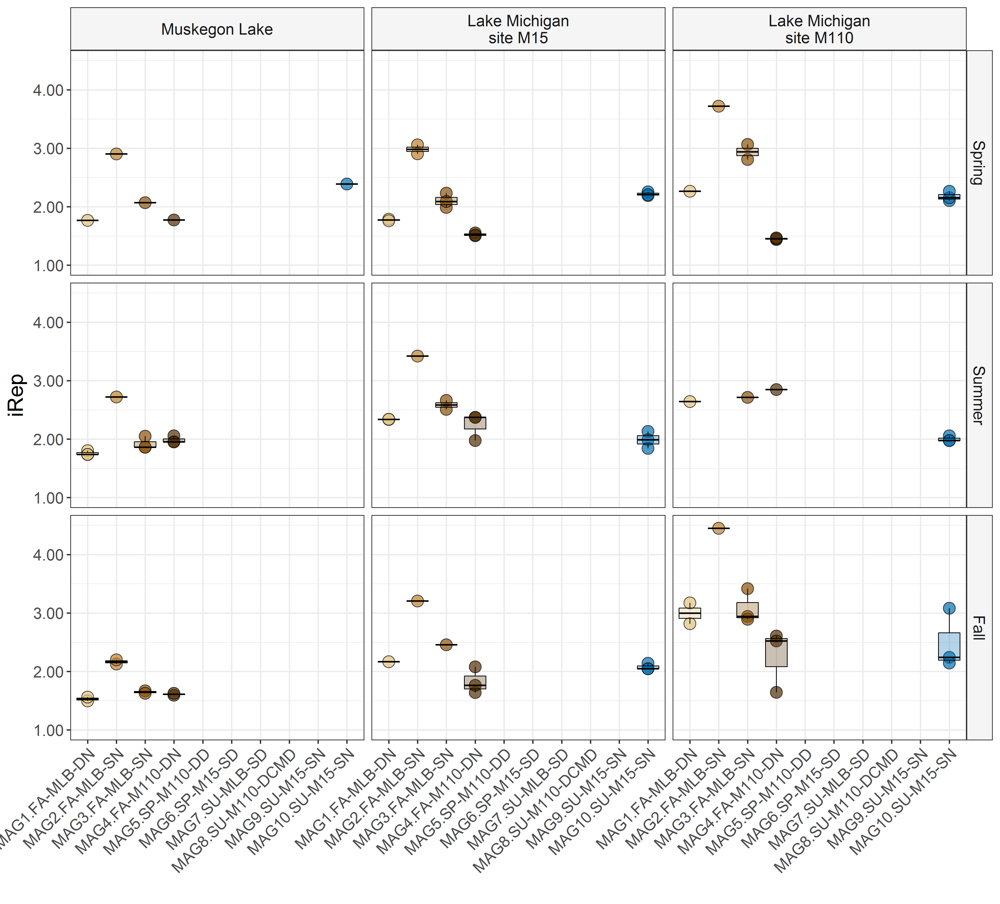


```r
# Only focus on MAGs for which we can determine accurate iRep values 
irep_p3 <- results_irep %>% 
  dplyr::filter(iRep_type == "iRep_filtered") %>% 
  dplyr::filter(!is.na(iRep_value)) %>% 
  ggplot(aes(x = Season, y = iRep_value, fill = new_bin_name, col = new_bin_name))+
  geom_point(color = "black", alpha = 0.7, size = 4, shape = 21)+
  # scale_shape_manual(values = c(21,22,23))+
  geom_boxplot(alpha = 0.3, col = "black", outlier.shape = NA, size = 0.3)+
  scale_fill_manual("", values = fill_palette)+
  scale_color_brewer("",palette = "Accent")+
  theme_bw()+
  # geom_point(size = 4, color = "black", alpha = 0.7)+
  # scale_shape_manual(values = c(21,24,23))+
  # geom_boxplot(alpha = 0.4)+
  theme(axis.text=element_text(size=12), axis.title=element_text(size=16),
      title=element_text(size=16), legend.text=element_text(size=10),
      legend.background = element_rect(fill="transparent"),
      axis.text.x = element_text(size = 12, angle = 45, hjust = 1),
      strip.text=element_text(size=12), legend.position = "bottom",
      strip.background = element_rect(fill = adjustcolor("gray", 0.15)))+
  ylab(paste0("iRep"))+
  guides(fill=FALSE)+
  facet_grid(new_bin_name~Site, scales ="free")+
  xlab("")+
  scale_y_continuous(labels=scaleFUN, limits = c(1,4.5))+
  # geom_smooth(se = FALSE)+
  guides(fill=FALSE)
  # coord_trans(y = "sqrt")

print(irep_p3)
```

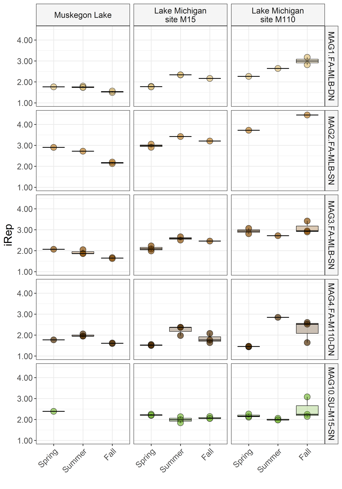


```r
# Only focus on MAGs for which we can determine accurate iRep values 
irep_p4 <- results_irep %>% 
  dplyr::filter(iRep_type == "iRep_filtered") %>% 
  dplyr::filter(!is.na(iRep_value)) %>% 
  ggplot(aes(x = new_bin_name, y = iRep_value, fill = Site, col = Site))+
  # geom_point(color = "black", alpha = 0.7, size = 4, shape = 21)+
  # scale_shape_manual(values = c(21,22,23))+
  geom_boxplot(alpha = 0.3, col = "black", outlier.shape = NA, size = 0.3)+
  scale_fill_brewer("", palette = "Accent")+
  scale_color_brewer("",palette = "Accent")+
  theme_bw()+
  # geom_point(size = 4, color = "black", alpha = 0.7)+
  # scale_shape_manual(values = c(21,24,23))+
  # geom_boxplot(alpha = 0.4)+
  theme(axis.text=element_text(size=12), axis.title=element_text(size=16),
      title=element_text(size=16), legend.text=element_text(size=10),
      legend.background = element_rect(fill="transparent"),
      axis.text.x = element_text(size = 12, angle = 45, hjust = 1),
      strip.text=element_text(size=12), legend.position = "bottom",
      strip.background = element_rect(fill = adjustcolor("gray", 0.15)))+
  ylab(paste0("iRep"))+
  # facet_grid(new_bin_name~Site, scales ="free")+
  xlab("")+
  scale_y_continuous(labels=scaleFUN, limits = c(1,4.5))
  # geom_smooth(se = FALSE)+
  # guides(fill=FALSE)
  # coord_trans(y = "sqrt")

print(irep_p4)
```

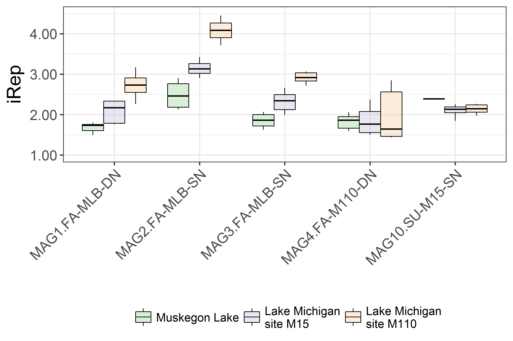
# Pangenome analysis  


<!-- # Phenotypic diversity -->

<!-- ```{r PhenoD-1, dpi = 500, warning = FALSE, fig.width = 10, fig.height = 10, include = FALSE} -->
<!-- expr_cov_pd <- expr_cov_long %>% dplyr::select(c("gene_oid", "Sample", -->
<!--                                                  "mapped_reads", "Genome_ID")) -->
<!-- expr_cov_pd <- tidyr::spread(expr_cov_pd, Genome_ID, mapped_reads) -->

<!-- # Loop through all samples and calculate diversity for each sample -->
<!-- for(i in 1:length(unique(expr_cov_pd$Sample))){ -->
<!--   phy_tmp <- expr_cov_pd %>% dplyr::filter(Sample == unique(expr_cov_pd$Sample)[i]) -->
<!--   phy_tmp[is.na(phy_tmp)] <- 0   -->
<!--   phylo_expr_cov_pd <- phyloseq::phyloseq(phyloseq::otu_table(phy_tmp[ ,-c(1,2)], taxa_are_rows = TRUE),  -->
<!--                                          as.matrix(phyloseq::tax_table(phy_tmp[,1]))) -->
<!--   pd_tmp <- Phenoflow::Diversity_16S(phylo_expr_cov_pd, R = 10, brea = FALSE) -->
<!--   pd_tmp <- data.frame(Sample = unique(expr_cov_pd$Sample)[i], Genome_ID = sample_names(phylo_expr_cov_pd), -->
<!--                        pd_tmp) -->
<!--   if(i == 1) results_pd <- pd_tmp else results_pd <- rbind(results_pd, pd_tmp) -->
<!-- } -->

<!-- # Merge with metadata -->
<!-- meta_metaT2 <- distinct(meta[, 2:nrow(meta)]) -->
<!-- meta_metaT2$Sample_ID <- gsub("_",".", meta_metaT2$Sample_ID) -->
<!-- results_pd <- left_join(results_pd, meta_metaT2, by = c("Sample" = "Sample_ID")) -->

<!-- new_bin_names2 <- read.table("./anvio_output/rebin/general_bins_summary_selected_final.tsv", header = TRUE)[, c(3,8:10)]; new_bin_names2$IMG_taxID <- as.character(new_bin_names2$IMG_taxID) -->
<!-- results_pd <- left_join(results_pd, new_bin_names2, by = c("Genome_ID" = "IMG_taxID")) -->
<!-- results_pd$new_bin_name <- as.character(results_pd$new_bin_name) -->
<!-- results_pd$new_bin_name <- factor(results_pd$new_bin_name, levels = -->
<!--                                       c("MAG1.FA-MLB-DN","MAG2.FA-MLB-SN", -->
<!--                                         "MAG3.FA-MLB-SN", "MAG4.FA-M110-DN", -->
<!--                                         "MAG5.SP-M110-DD", "MAG6.SP-M15-SD", -->
<!--                                         "MAG7.SU-MLB-SD", "MAG8.SU-M110-DCMD", -->
<!--                                         "MAG9.SU-M15-SN", "MAG10.SU-M15-SN")) -->
<!-- ``` -->

<!-- ### Plot phenoD -->

<!-- ```{r PhenoD-2, dpi = 500, warning = FALSE, fig.width = 10, fig.height = 10} -->
<!-- # Plot results -->
<!-- p_MAG_Pdiv <- ggplot(results_pd, aes(x = new_bin_name, y = D2))+ -->
<!--   theme_bw()+ -->
<!--   scale_fill_brewer(palette = "Accent")+ -->
<!--   geom_point(size = 4, color = "black", alpha = 0.7, aes(fill = Season,  -->
<!--                                                          shape = Depth))+ -->
<!--   scale_shape_manual(values = c(21,24,23))+ -->
<!--   geom_boxplot(alpha = 0.4, width = 0.2, fill = "lightgray")+ -->
<!--   theme(axis.text=element_text(size=14), axis.title=element_text(size=20), -->
<!--       title=element_text(size=20), legend.text=element_text(size=12), -->
<!--       legend.background = element_rect(fill="transparent"), -->
<!--       axis.text.x = element_text(size = 14, angle = 45, hjust = 1), -->
<!--       strip.text=element_text(size=14), legend.position = "bottom", -->
<!--       strip.background = element_rect(fill = adjustcolor("gray", 0.15)))+ -->
<!--   ylab(paste0("Limnohabitans population\n phenotypic diversity (D2)"))+ -->
<!--   guides(shape=FALSE,  -->
<!--          fill = guide_legend(override.aes=list(colour=brewer.pal(3,"Accent"))))+ -->
<!--   facet_grid(Site~., scales ="free")+ -->
<!--   xlab("")+ -->
<!--   geom_errorbar(aes(ymin = D2 - sd.D2, ymax = D2 + sd.D2), width = 0.05)+ -->
<!--   scale_y_continuous(labels=scaleFUN) -->
<!--   # coord_trans(y = "sqrt") -->

<!-- print(p_MAG_Pdiv) -->


<!-- # Plot results -->
<!-- p_MAG_Pdiv2 <- ggplot(results_pd, aes(x = new_bin_name, y = D2))+ -->
<!--   theme_bw()+ -->
<!--   scale_fill_brewer(palette = "Accent")+ -->
<!--   geom_point(size = 4, color = "black", alpha = 0.7, aes(fill = Season,  -->
<!--                                                          shape = Depth))+ -->
<!--   scale_shape_manual(values = c(21,24,23))+ -->
<!--   geom_boxplot(alpha = 0.4, width = 0.2, fill = "lightgray")+ -->
<!--   theme(axis.text=element_text(size=14), axis.title=element_text(size=20), -->
<!--       title=element_text(size=20), legend.text=element_text(size=12), -->
<!--       legend.background = element_rect(fill="transparent"), -->
<!--       axis.text.x = element_text(size = 14, angle = 45, hjust = 1), -->
<!--       strip.text=element_text(size=14), legend.position = "bottom", -->
<!--       strip.background = element_rect(fill = adjustcolor("gray", 0.15)))+ -->
<!--   ylab(paste0("Limnohabitans population\n phenotypic diversity (D2)"))+ -->
<!--   guides(shape=FALSE,  -->
<!--          fill = guide_legend(override.aes=list(colour=brewer.pal(3,"Accent"))))+ -->
<!--   facet_grid(Site~Time, scales ="free")+ -->
<!--   xlab("")+ -->
<!--   geom_errorbar(aes(ymin = D2 - sd.D2, ymax = D2 + sd.D2), width = 0.05)+ -->
<!--   scale_y_continuous(labels=scaleFUN) -->
<!--   # coord_trans(y = "sqrt") -->

<!-- print(p_MAG_Pdiv2) -->
<!-- ``` -->

<!-- ### Example expression profiles -->
<!-- ```{r PhenoD-3, dpi = 500, warning = FALSE, fig.width = 12, fig.height = 12} -->
<!-- new_bin_names2 <- read.table("./anvio_output/rebin/general_bins_summary_selected_final.tsv", header = TRUE)[, c(3,8:10)]; new_bin_names2$IMG_taxID <- as.character(new_bin_names2$IMG_taxID) -->
<!-- expr_cov_long_sb <- left_join(expr_cov_long, new_bin_names2, by = c("Genome_ID" = "IMG_taxID")) -->

<!-- p_Pdist <- expr_cov_long_sb %>% dplyr::filter(new_bin_name %in% c("MAG6.SP-M15-SD", "MAG8.SU-M110-DCMD", -->
<!--                                                        "MAG4.FA-M110-DN") &  -->
<!--                                    Sample == "Fa13.BD.MM15.SD") %>%  -->
<!--   group_by(new_bin_name) %>% dplyr::mutate(rank = rank(-mapped_reads/sum(mapped_reads))) %>%  -->
<!--   dplyr::mutate(mapped_reads_norm = mapped_reads/sum(mapped_reads)) %>%  -->
<!--   ggplot(aes(x = rank, y = mapped_reads_norm, color = new_bin_name))+ -->
<!--   geom_line(size = 2, linetype = 2)+ -->
<!--   theme_bw()+ -->
<!--   scale_color_brewer("", palette = "Accent")+ -->
<!--   theme(axis.text=element_text(size=12), axis.title=element_text(size=12), -->
<!--       title=element_text(size=12), legend.text=element_text(size=12), -->
<!--       legend.background = element_rect(fill="transparent"), -->
<!--       axis.text.x = element_text(size = 12, angle = 45, hjust = 1), -->
<!--       strip.text=element_text(size=12), legend.position = "bottom", -->
<!--       strip.background = element_rect(fill = adjustcolor("gray", 0.15)))+ -->
<!--   ylab("Relative number of mapped reads")+ -->
<!--   xlab("Genes ranked by mapped reads")+ -->
<!--   scale_y_continuous(labels=scaleFUN)+ -->
<!--   xlim(0,300) -->
<!--   # coord_trans(y = "sqrt") -->

<!-- print(p_Pdist) -->

<!-- # Add 16S-estimated taxonomic diversity -->
<!-- diversity_df_phy <- data.frame(Sample = rownames(diversity_df_phy), diversity_df_phy) -->
<!-- diversity16S_df_phy <- diversity_df_phy[grep(".1", diversity_df_phy$Sample,  -->
<!--                                              fixed = TRUE), ] -->
<!-- diversity16S_df_phy$Sample <- gsub(".1.renamed", "", diversity16S_df_phy$Sample) -->
<!-- colnames(diversity16S_df_phy)[2:ncol(diversity16S_df_phy)] <- paste("16S", colnames(diversity16S_df_phy)[2:ncol(diversity16S_df_phy)], sep = "_") -->
<!-- results_pd_16S <- left_join(results_pd, diversity16S_df_phy, by = "Sample") -->

<!-- # Plot taxonomic vs. phenotypic diversity -->
<!-- p_MAG_Pdiv3 <- ggplot(results_pd_16S, aes(x = `16S_D2`, y = D2, fill = new_bin_name.x))+ -->
<!--   theme_bw()+ -->
<!--   scale_fill_brewer(palette = "Paired")+ -->
<!--   scale_color_brewer(palette = "Paired")+ -->
<!--   geom_point(size = 4, color = "black", alpha = 0.7, shape = 21)+ -->
<!--   scale_shape_manual(values = c(21,24,23))+ -->
<!--   theme(axis.text=element_text(size=14), axis.title=element_text(size=20), -->
<!--       title=element_text(size=20), legend.text=element_text(size=12), -->
<!--       legend.background = element_rect(fill="transparent"), -->
<!--       axis.text.x = element_text(size = 14, angle = 45, hjust = 1), -->
<!--       strip.text=element_text(size=14), legend.position = "bottom", -->
<!--       strip.background = element_rect(fill = adjustcolor("gray", 0.15)))+ -->
<!--   ylab(paste0("Limnohabitans population\n phenotypic diversity (D2)"))+ -->
<!--   guides(shape=FALSE)+ -->
<!--   xlab("")+ -->
<!--   facet_grid(Site~new_bin_name.x)+ -->
<!--   geom_errorbar(aes(ymin = D2 - sd.D2, ymax = D2 + sd.D2), width = 0.05)+ -->
<!--   scale_y_continuous(labels=scaleFUN)+ -->
<!--   geom_smooth(method = "loess", aes(color = new_bin_name.x)) -->
<!--   # coord_trans(y = "sqrt") -->

<!-- print(p_MAG_Pdiv3) -->
<!-- ``` -->
