```r
# Read data
mean_coverage <- read.table("./anvio_output/rebin/mean_coverage_selected_final.tsv", header = TRUE)
std_coverage <- read.table("./anvio_output/rebin/std_coverage_selected_final.tsv", header = TRUE)
bin_size <- read.table("./anvio_output/rebin/general_bins_summary_selected_final.tsv", header = TRUE)[, c(2,5)]
total_reads <- read.table("./anvio_output/sample_reads.tsv", header = TRUE)
read_length <- 150

# From wide to long format
mean_coverage_long <- tidyr::gather(mean_coverage, Sample_ID, coverage, 
                             Fa13_BD_MLB_DN:Su13_BD_MM15_SN_C, factor_key=TRUE)
mean_coverage_long[,2] <- gsub(mean_coverage_long[,2], pattern = "_C", 
                               replacement = "")

std_coverage_long <- tidyr::gather(std_coverage, Sample_ID, std_coverage, 
                            Fa13_BD_MLB_DN:Su13_BD_MM15_SN_C, 
                            factor_key=TRUE)
std_coverage_long[,2] <- gsub(std_coverage_long[,2], pattern = "_C", 
                            replacement = "")
 
coverage_data <- data.frame(mean_coverage_long, 
                            std_coverage = std_coverage_long[,3])

# Read and add metadata
meta <- read.csv2("metadata.csv")
meta$Sample_ID <- gsub(meta$Sample_ID, pattern = ".", replacement = "_", fixed = TRUE)
data_total <- left_join(coverage_data, total_reads, by = c("Sample_ID" = "sample"))
data_total <- left_join(data_total, bin_size, by = "bins")
data_total <- left_join(data_total, meta, by =  "Sample_ID")

# Calculate relative abundance of the bins
data_total$mean_rel_abundance <- 100*(data_total$coverage*data_total$bin_size)/(read_length*data_total$Total_reads)
data_total$upper_rel_abundance <- 100*((data_total$coverage+data_total$std_coverage)*data_total$bin_size)/(read_length*data_total$Total_reads)
data_total$lower_rel_abundance <- 100*((data_total$coverage-data_total$std_coverage)*data_total$bin_size)/(read_length*data_total$Total_reads)
```

# 1a. Phylogeny

## Phylogenomic tree  


## 16S rRNA gene phylogenetic tree


### Microdiversity in MAG8  

**At each iteration, SSU sequences were merged into one sequence if the identity of non-gapped positions in a global alignment was greater than 97%. A single SSU sequence (and its prior probability) was divided into two sequences if the second most probable base in more than 4% of all positions had a probability greater than 10%. In this way, sequences that evolved over iterations to be the same were merged, and sequences with evidence from the reads for multiple OTUs were duplicated and allowed to evolve as separate OTUs in future iterations.** [Reference](https://genomebiology.biomedcentral.com/articles/10.1186/gb-2011-12-5-r44)  

The workflow for postprocessing the `EMIRGE` reconstructed 16S rRNA gene sequences:  


```r
# Import seq-table that was generated after EMIRGE post-processing
EMIRGE_OTU <- read.table("./Tree/EMIRGE/read.info.txt", 
                         stringsAsFactors = FALSE)
colnames(EMIRGE_OTU) <- c("Sample",  "Sequence", "Prior", "Length", "Prior_norm")
EMIRGE_names <- read.table("./Tree/EMIRGE/EMIRGE_Limno.names")

EMIRGE_OTU_97 <- read.table("./Tree/EMIRGE/final.otu.emirge.pick.an.0.03.rep.names",
                            stringsAsFactors = FALSE)
EMIRGE_OTU_99 <- read.table("./Tree/EMIRGE/final.otu.emirge.pick.an.0.01.rep.names",
                            stringsAsFactors = FALSE)

# Filter out putative Limnohabitans OTUs
EMIRGE_OTU <- EMIRGE_OTU[EMIRGE_OTU$Sequence %in% EMIRGE_names$V1, ]

# Formate sample names
EMIRGE_OTU$Sample <- gsub(".A","", EMIRGE_OTU$Sample, fixed = TRUE)
EMIRGE_OTU$Sample <- gsub(".C","", EMIRGE_OTU$Sample, fixed = TRUE)

# Add OTU cluster results as new columns (0.97 level and 0.99 level)
EMIRGE_OTU$OTU_97 <- EMIRGE_OTU$Sequence

for(i in 1:nrow(EMIRGE_OTU_97)){
   EMIRGE_OTU$OTU_97[EMIRGE_OTU$Sequence %in% 
                            do.call(rbind, strsplit(EMIRGE_OTU_97$V2[i], ","))] <-
     EMIRGE_OTU_97$V3[i]
}

EMIRGE_OTU$OTU_99 <- EMIRGE_OTU$Sequence

for(i in 1:nrow(EMIRGE_OTU_99)){
  EMIRGE_OTU$OTU_99[EMIRGE_OTU$Sequence %in% 
                            do.call(rbind, strsplit(EMIRGE_OTU_99$V2[i], ","))] <-
     EMIRGE_OTU_99$V3[i]
}


# Calculate new abundance for the relative abundance of each OTU (0.97 and 0.99 level)
EMIRGE_OTU <- EMIRGE_OTU %>% dplyr::group_by(OTU_97, Sample) %>% 
  dplyr::mutate(Prior_norm_OTU97 = sum(Prior_norm))

EMIRGE_OTU <- EMIRGE_OTU %>% dplyr::group_by(OTU_99, Sample) %>% 
  dplyr::mutate(Prior_norm_OTU99 = sum(Prior_norm))

# Add metadata variables as new column
meta_em <- meta[-1]; meta_em$Sample_ID <- gsub("_",".", meta_em$Sample_ID)
meta_em <- meta_em %>% dplyr::distinct()
EMIRGE_OTU <- dplyr::left_join(EMIRGE_OTU, meta_em, by = c("Sample" = "Sample_ID"))

# to change
```


```r
# Plot
p_emirge_abund_otu97 <- ggplot(EMIRGE_OTU, aes(x = Sample, y = 100*Prior_norm, fill = OTU_97))+
  theme_bw()+
  geom_bar(stat = "identity", size = 1, color = "black", alpha = 0.7)+
  scale_fill_brewer(palette = "Accent")+
  theme(axis.text=element_text(size=14), axis.title=element_text(size=20),
        axis.text.x = element_text(size = 14, angle = 45, hjust = 1),
      title=element_text(size=20), legend.text=element_text(size=12),
      legend.background = element_rect(fill="transparent"),
      strip.text=element_text(size=14), legend.position = "right",
      strip.background = element_rect(fill = adjustcolor("gray", 0.15)))+
  guides(fill=guide_legend(nrow = 3))+
  facet_grid(.~Site, scales = "free_x")+
  ylab("Length-normalized prior (%)")+
  xlab("")+
  ggtitle("97% clustered OTUs")
  # coord_trans(x = "atanh", y = "atanh")

# Plot
p_emirge_abund_otu99 <- ggplot(EMIRGE_OTU, aes(x = Sample, y = 100*Prior_norm, fill = OTU_99))+
  theme_bw()+
  geom_bar(stat = "identity", size = 1, color = "black", alpha = 0.7)+
  # geom_point(size = 4, shape = 21, color = "black", alpha = 0.7)+
  scale_fill_brewer(palette = "Accent")+
  theme(axis.text=element_text(size=14), axis.title=element_text(size=20),
        axis.text.x = element_text(size = 14, angle = 45, hjust = 1),
      title=element_text(size=20), legend.text=element_text(size=12),
      legend.background = element_rect(fill="transparent"),
      strip.text=element_text(size=14), legend.position = "right",
      strip.background = element_rect(fill = adjustcolor("gray", 0.15)))+
  guides(fill=guide_legend(nrow = 3))+
  facet_grid(.~Site, scales = "free_x")+
  ylab("Length-normalized prior (%)")+
  xlab("")+
  ggtitle("99% clustered OTUs")
  # coord_trans(x = "atanh", y = "atanh")

# Plot
p_emirge_abund_seq <- ggplot(EMIRGE_OTU, aes(x = Sample, y = 100*Prior_norm, fill = OTU_97))+
  theme_bw()+
  # geom_point(size = 4, shape = 21, color = "black", alpha = 0.7)+
  geom_bar(stat = "identity", size = 1, color = "black", alpha = 0.7)+
  scale_fill_brewer(palette = "Accent")+
  theme(axis.text=element_text(size=14), axis.title=element_text(size=20),
        axis.text.x = element_text(size = 14, angle = 45, hjust = 1),
      title=element_text(size=20), legend.text=element_text(size=12),
      legend.background = element_rect(fill="transparent"),
      strip.text=element_text(size=14), legend.position = "right",
      strip.background = element_rect(fill = adjustcolor("gray", 0.15)))+
  guides(fill=guide_legend(nrow = 3))+
  facet_grid(.~Site, scales = "free_x")+
  ylab("Length-normalized prior (%)")+
  xlab("")+
  ggtitle("Unique sequences")
  # coord_trans(x = "atanh", y = "atanh")

grid.arrange(p_emirge_abund_otu97, p_emirge_abund_otu99, p_emirge_abund_seq ,nrow = 3)
```

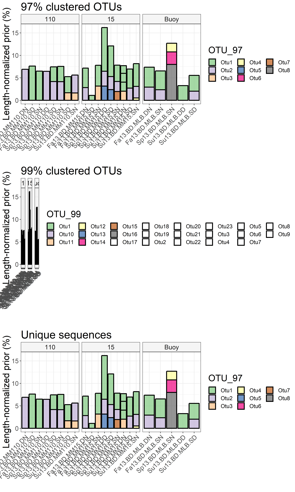


```r
# Import blast results
blast_emirge <- read.csv("./Tree/EMIRGE/blast_table.csv", header = FALSE)[, 1:3]
colnames(blast_emirge) <- c("seq1", "seq2", "pid")
# Annotate based on 97% clusters
EMIRGE_OTU_annot <- EMIRGE_OTU %>% dplyr::select(Sequence, OTU_97) %>%
  distinct() %>% 
  left_join(., EMIRGE_OTU_97[, c("V3", "V4")], by = c("OTU_97" = "V3"))
```

```
## Adding missing grouping variables: `OTU_99`, `Sample`
```

```r
# label sequence 1
blast_emirge_annot <- left_join(blast_emirge, EMIRGE_OTU_annot,
                              by = c("seq1" = "Sequence")) %>% 
  dplyr::filter(V4 != "not_limno")
colnames(blast_emirge_annot)[7] <- "seq1_label"
# label sequence 2
blast_emirge_annot <- left_join(blast_emirge_annot, EMIRGE_OTU_annot[, c(3,5)],
                              by = c("seq2" = "Sequence")) %>% 
  dplyr::filter(V4 != "not_limno")
colnames(blast_emirge_annot)[8] <- "seq2_label"

# Create interaction effect
blast_emirge_annot$label_interaction <- interaction(blast_emirge_annot$seq1_label,
                                                    blast_emirge_annot$seq2_label,
                                                    sep= "-")
# Only visualize within-group blast identities
subset_seq_labels <- c("LimB-LimB", "Lhab-A4-Lhab-A4")
blast_emirge_annot %>% 
  dplyr::filter(label_interaction %in% subset_seq_labels &
                                       seq1 != seq2) %>% 
ggplot(aes(x = label_interaction, y = pid, fill = label_interaction))+
  geom_jitter(size = 2.5,
             color = "black", shape = 21, width = 0.1, alpha = 0.5)+
  geom_violin(alpha = 0.4, adjust = 1, draw_quantiles = TRUE, width = 0.3)+
  stat_summary(fun.data=mean_sdl, fun.args = list(mult = 1), 
                 geom="pointrange", color="black")+
  ylim(95,100)+
  scale_fill_manual("", values = rev(c("#e31a1c","#fdbf6f")))+
  theme_bw()+
  theme(axis.text=element_text(size=14), axis.title=element_text(size=20),
        axis.text.x=element_text(size=14),
        title=element_text(size=16), legend.text=element_text(size=14),
        legend.background = element_rect(fill="transparent"),
        strip.text.x=element_text(size=18))+
  guides(fill = FALSE)+
  labs(x="")
```


```r
blast_emirge_annot %>% dplyr::filter(label_interaction %in% subset_seq_labels &
                                       seq1 != seq2) %>% 
  group_by(label_interaction) %>% 
  summarize(mean(pid), sd(pid))
```

```
## # A tibble: 2 x 3
##   label_interaction `mean(pid)` `sd(pid)`
##   <fct>                   <dbl>     <dbl>
## 1 Lhab-A4-Lhab-A4          98.8     0.826
## 2 LimB-LimB                98.8     0.850
```

```r
# Only look at the outlying sequence of LimB
# 10|JN626652.1.1352
blast_emirge_annot$label_interaction <- interaction(blast_emirge_annot$seq1_label,
                                                    blast_emirge_annot$seq2_label,
                                                    sep= "-")
# Only visualize within-group blast identities
subset_seq_labels <- c("LimB-LimB", "Lhab-A4-Lhab-A4")
blast_emirge_annot %>% dplyr::filter(label_interaction %in% subset_seq_labels &
                                      seq1 == "10|JN626652.1.1352") %>% 
  summarize(mean(pid), sd(pid))
```

```
##   mean(pid)   sd(pid)
## 1  97.96535 0.6247723
```

# ANI analysis


```r
# read file
data.ANI <- read.table("./ANI/ANIb_percentage_identity.tab")

# Replace genome names by better annotated names
map_ani <- read.delim("./ANI/pyani_ref_names.tsv", stringsAsFactors = FALSE)
for(i in 1:nrow(map_ani)){
 colnames(data.ANI)[colnames(data.ANI) %in% map_ani$ani_file[i]] <- map_ani$ref_name[i]
 rownames(data.ANI)[rownames(data.ANI) %in% map_ani$ani_file[i]] <- map_ani$ref_name[i]
}

# Remove pnec and root genomes from dataframe
data.ANI <- data.ANI[grep("MAG|Lim", rownames(data.ANI)), grep("MAG|Lim", rownames(data.ANI))]

# Order y-axis according to phylogenetic tree order
ord_list_bin <- c(
  "MAG5.SP-M110-DD", "MAG2.FA-MLB-SN",
  "MAG3.FA-MLB-SN", "MAG4.FA-M110-DN",
  "MAG1.FA-MLB-DN", "MAG10.SU-M15-SN",
  "MAG6.SP-M15-SD","MAG8.SU-M110-DCMD",
  "Lim. sp. Rim11", "Lim. sp. 103DPR2",
  "MAG7.SU-MLB-SD", "Lim. sp. Rim47",
  "MAG9.SU-M15-SN", "Lim. sp. Rim28",
  "Lim. sp. 63ED37-2","Lim. sp. 2KL-27",
  "Lim. sp. 2KL-3", "Lim. sp. DM1",
  "Lim. sp. II-D5"
  )

# order rows and columns
data.ANI <- data.ANI[, order(match(colnames(data.ANI), ord_list_bin))]
data.ANI <- data.ANI[order(match(rownames(data.ANI), ord_list_bin)), ]

data.ANI <- get_upper_tri(data.ANI)

# melt to dataframe
df_pyani <- melt(as.matrix(data.ANI), na.rm = TRUE) # reshape into dataframe
names(df_pyani)[c(1:3)] <- c("bin1", "bin2", "ANI")
df_pyani[, 1] <- as.character(df_pyani[, 1]); df_pyani[, 2] <- as.character(df_pyani[, 2])
df_pyani$bin2 <- factor(df_pyani$bin2, levels = ord_list_bin)
df_pyani$bin1 <- factor(df_pyani$bin1, levels = rev(ord_list_bin))

# make plot
p_ani <- ggplot(data = df_pyani,
       aes(x = bin2, y = bin1, fill = 100*ANI))+ 
  geom_raster()+
  scale_fill_distiller(palette = "RdBu", name = "Average\nNucleotide\nIdentity (%)\n",
                       limits = 100*c(0.75,1.0), oob=squish) +
  geom_text(aes(label = round(100*ANI, 0)), size = 4.5)+
  xlab("")+
  ylab("")+
  scale_x_discrete(position = "top") +
  theme(axis.title=element_text(size=14), strip.text.x=element_text(size=14),
        legend.title=element_text(size=14), legend.text=element_text(size=14),
        axis.text.y = element_blank(),
        axis.text.x = element_text(size=14, angle = 55, hjust = 0),
        title=element_text(size=20),
        plot.margin = unit(c(1.1,1.1,1.1,1.1), "cm"),
        panel.grid.major = element_blank(), 
        panel.grid.minor = element_blank(),
        panel.background = element_rect(fill = "transparent",colour = NA),
        plot.background = element_rect(fill = "transparent",colour = NA)
  )

# png("ANI_heatmap.png", height= 9, width = 9, res = 500, units = "in", bg = "transparent")
print(p_ani)
```


```r
# dev.off()
```

# 1b. Investigate predicted generation time (MGT)

```r
MGT_df <- read.table("./Growthpred/GP_results.tsv", header = TRUE,
                     stringsAsFactors = FALSE, sep = "\t")

# Order genome_ids according to the phylogenetic clustering
MGT_df$Genome_ID <- factor(MGT_df$Genome_ID, levels = ord_list_bin)
MGT_df$Lineage <- factor(MGT_df$Lineage, levels = c("LimDEA_1", "LimDEA_2",
                                                    "LimB", "LimC"))

# Make barplot with st.dev to visualize MGT and optimal temperature
selected_points <- data.frame(Genome_ID = MGT_df$Genome_ID, 
                              ypos = c(rep(0.25, 10), rep(NA,9)))

p_MGT <- ggplot(MGT_df, aes(x = Genome_ID, y = log(2)/MGT, fill = Lineage, group = Genome_ID))+
  theme_bw()+
  geom_bar(alpha = 1, stat = "identity", color = "black",
           position = position_dodge(width = 1), width = 0.7)+
  scale_fill_manual(expression("Growth rate - "~"h"^-1),
                    values = c(rgb(red=t(col2rgb("#deebf7ff")), maxColorValue  = 255), 
                               rgb(red=t(col2rgb("#c6dbefff")), maxColorValue  = 255),
                               rgb(red=t(col2rgb("#9ecae1ff")), maxColorValue  = 255),
                               rgb(red=t(col2rgb("#6baed6ff")), maxColorValue  = 255)
                              ))+
  theme(axis.text=element_text(size=15, face = "bold"), axis.title=element_text(size=20),
        title=element_text(size=20), legend.text=element_text(size=14),
        legend.background = element_rect(fill="transparent"),
        # axis.text.x = element_text(angle = 65, hjust = 1),
        strip.text.x=element_text(size = 18),
        legend.position="bottom",
        axis.text.x=element_text(size = 13, angle =45, hjust= 1),
        axis.title.x=element_blank(),
        plot.title = element_text(hjust = 0, size=18))+
  guides(fill=FALSE)+
  geom_errorbar(aes(ymin = log(2)/(MGT - sd.MGT), ymax = log(2)/(MGT + sd.MGT)), width = 0.15,
                position = position_dodge(width = 1))+
  ylab("")+
  xlab("")+
  ggtitle(expression("Growth rate - h"^-1))+
  geom_point(data = selected_points, aes(x = Genome_ID, y = ypos),
             shape = 25, fill = "black", col = "black", size = 3)

# svg(filename = "MGT_figure.svg", width = 9.5, height = 4)
print(p_MGT)
```


```r
# dev.off()

# Make the same plot for optimal growth temperature
selected_points <- data.frame(Genome_ID = MGT_df$Genome_ID, 
                              ypos = c(rep(30, 10), rep(NA,9)))

p_Topt <- ggplot(MGT_df, aes(x = Genome_ID, y = Topt, fill = Lineage, group = Genome_ID))+
  theme_bw()+
  geom_bar(alpha = 0.4, stat = "identity", color = "black",
           position = position_dodge(width = 1), width = 0.7)+
  scale_fill_manual("Optimal growth temperature (°C)",
                    values = c("#deebf7ff", "#c6dbefff","#9ecae1ff",
                               "#6baed6ff"))+
  theme(axis.text=element_text(size=15, face = "bold"), axis.title=element_text(size=20),
        title=element_text(size=20), legend.text=element_text(size=14),
        legend.background = element_rect(fill="transparent"),
        # axis.text.x = element_text(angle = 65, hjust = 1),
        strip.text.x=element_text(size = 18),
        legend.position="bottom",
        axis.text.x=element_text(size = 13, angle =45, hjust= 1),
        axis.title.x=element_blank(),
        plot.title = element_text(hjust = 0, size=18))+
  guides(fill=FALSE)+
  ylab("")+
  xlab("")+
  ggtitle("Optimal growth temperature (°C)")+
  geom_point(data = selected_points, aes(x = Genome_ID, y = ypos),
             shape = 25, fill = "black", col = "black", size = 3)

print(p_Topt)
```

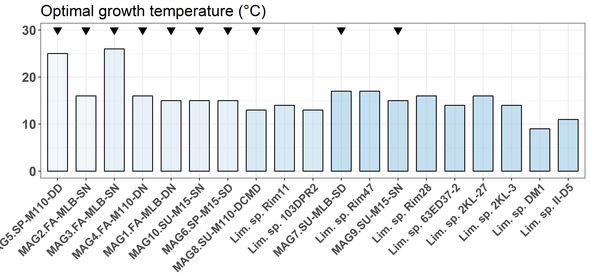


# 1c. Network analysis based on 16S data


```r
# import data
df_phy <- import_mothur(mothur_shared_file = "./16S/stability.trim.contigs.good.unique.good.filter.unique.precluster.pick.pick.an.unique_list.shared",
                        mothur_constaxonomy_file = "./16S/stability.trim.contigs.good.unique.good.filter.unique.precluster.pick.pick.an.unique_list.0.03.cons.taxonomy")

# Filter out 2013 samples
df_phy <- prune_samples(grep(pattern = ".", sample_names(df_phy), fixed = TRUE,
     value = TRUE), df_phy)
df_phy <- prune_samples(grep(pattern = "cD", sample_names(df_phy), fixed = TRUE,
     value = TRUE, invert = TRUE), df_phy)
df_phy <- prune_samples(grep(pattern = "ED", sample_names(df_phy), fixed = TRUE,
     value = TRUE, invert = TRUE), df_phy)

# Calculate diversity
diversity_df_phy <- Diversity_16S(df_phy, brea = FALSE, R = 100)
```

```
## 	**WARNING** this functions assumes that rows are samples and columns
##       	are taxa in your phyloseq object, please verify.
## Fri May 25 17:37:00 2018	Calculating diversity for sample 1/41 --- Fa13.BD.MLB.DN.1.renamed
## Fri May 25 17:37:35 2018	Calculating diversity for sample 2/41 --- Fa13.BD.MLB.SN.1.renamed
## Fri May 25 17:38:11 2018	Calculating diversity for sample 3/41 --- Fa13.BD.MM110.DN.1.renamed
## Fri May 25 17:38:44 2018	Calculating diversity for sample 4/41 --- Fa13.BD.MM110.DN.2.renamed
## Fri May 25 17:39:18 2018	Calculating diversity for sample 5/41 --- Fa13.BD.MM110.SD.1.renamed
## Fri May 25 17:39:51 2018	Calculating diversity for sample 6/41 --- Fa13.BD.MM110.SD.2.renamed
## Fri May 25 17:40:27 2018	Calculating diversity for sample 7/41 --- Fa13.BD.MM110.SN.1.renamed
## Fri May 25 17:41:00 2018	Calculating diversity for sample 8/41 --- Fa13.BD.MM110.SN.2.renamed
## Fri May 25 17:41:34 2018	Calculating diversity for sample 9/41 --- Fa13.BD.MM15.DN.1.renamed
## Fri May 25 17:42:06 2018	Calculating diversity for sample 10/41 --- Fa13.BD.MM15.DN.2.renamed
## Fri May 25 17:42:40 2018	Calculating diversity for sample 11/41 --- Fa13.BD.MM15.SD.1.renamed
## Fri May 25 17:43:18 2018	Calculating diversity for sample 12/41 --- Fa13.BD.MM15.SD.2.renamed
## Fri May 25 17:43:51 2018	Calculating diversity for sample 13/41 --- Fa13.BD.MM15.SN.1.renamed
## Fri May 25 17:44:21 2018	Calculating diversity for sample 14/41 --- Fa13.BD.MM15.SN.2.renamed
## Fri May 25 17:44:53 2018	Calculating diversity for sample 15/41 --- Sp13.BD.MLB.SN.1.renamed
## Fri May 25 17:45:29 2018	Calculating diversity for sample 16/41 --- Sp13.BD.MLB.SN.2.renamed
## Fri May 25 17:46:06 2018	Calculating diversity for sample 17/41 --- Sp13.BD.MM110.DD.1.renamed
## Fri May 25 17:46:46 2018	Calculating diversity for sample 18/41 --- Sp13.BD.MM110.SD.1.renamed
## Fri May 25 17:47:25 2018	Calculating diversity for sample 19/41 --- Sp13.BD.MM110.SD.2.renamed
## Fri May 25 17:48:04 2018	Calculating diversity for sample 20/41 --- Sp13.BD.MM110.SN.1.renamed
## Fri May 25 17:48:43 2018	Calculating diversity for sample 21/41 --- Sp13.BD.MM110.SN.2.renamed
## Fri May 25 17:49:27 2018	Calculating diversity for sample 22/41 --- Sp13.BD.MM15.DD.1.renamed
## Fri May 25 17:50:09 2018	Calculating diversity for sample 23/41 --- Sp13.BD.MM15.SD.1.renamed
## Fri May 25 17:50:46 2018	Calculating diversity for sample 24/41 --- Sp13.BD.MM15.SN.1.renamed
## Fri May 25 17:51:24 2018	Calculating diversity for sample 25/41 --- Sp13.BD.MM15.SN.2.renamed
## Fri May 25 17:52:03 2018	Calculating diversity for sample 26/41 --- Su13.BD.MLB.DD.1.renamed
## Fri May 25 17:52:37 2018	Calculating diversity for sample 27/41 --- Su13.BD.MLB.SD.1.renamed
## Fri May 25 17:53:13 2018	Calculating diversity for sample 28/41 --- Su13.BD.MM110.DCMD.1.renamed
## Fri May 25 17:53:53 2018	Calculating diversity for sample 29/41 --- Su13.BD.MM110.DCMD.2.renamed
## Fri May 25 17:54:37 2018	Calculating diversity for sample 30/41 --- Su13.BD.MM110.DN.1.renamed
## Fri May 25 17:55:13 2018	Calculating diversity for sample 31/41 --- Su13.BD.MM110.DN.2.renamed
## Fri May 25 17:55:46 2018	Calculating diversity for sample 32/41 --- Su13.BD.MM110.SD.1.renamed
## Fri May 25 17:56:20 2018	Calculating diversity for sample 33/41 --- Su13.BD.MM110.SD.2.renamed
## Fri May 25 17:56:54 2018	Calculating diversity for sample 34/41 --- Su13.BD.MM110.SN.1.renamed
## Fri May 25 17:57:28 2018	Calculating diversity for sample 35/41 --- Su13.BD.MM110.SN.2.renamed
## Fri May 25 17:58:01 2018	Calculating diversity for sample 36/41 --- Su13.BD.MM15.DN.1.renamed
## Fri May 25 17:58:34 2018	Calculating diversity for sample 37/41 --- Su13.BD.MM15.DN.2.renamed
## Fri May 25 17:59:08 2018	Calculating diversity for sample 38/41 --- Su13.BD.MM15.SD.1.renamed
## Fri May 25 17:59:41 2018	Calculating diversity for sample 39/41 --- Su13.BD.MM15.SD.2.renamed
## Fri May 25 18:00:15 2018	Calculating diversity for sample 40/41 --- Su13.BD.MM15.SN.1.renamed
## Fri May 25 18:00:50 2018	Calculating diversity for sample 41/41 --- Su13.BD.MM15.SN.2.renamed
## Fri May 25 18:01:24 2018 	Done with all 41 samples
```

```r
# Perform prevalence filtering
df_phy <- filter_taxa(df_phy, function(x) sum(x > 30) > (0.25*length(x)), TRUE)

# Run spiec-easi
sp_easi <- spiec.easi(df_phy, method='mb', lambda.min.ratio=1e-2,
                           nlambda=20, icov.select.params=list(rep.num=50))
```

```
## Normalizing/clr transformation of data with pseudocount ...
```

```
## Inverse Covariance Estimation with mb ...
```

```
## Model selection with stars ...
```

```
## Done!
```

```r
ig.mb <- adj2igraph(sp_easi$refit,  vertex.attr = list(name=taxa_names(df_phy)))
vsize <- Biobase::rowMax(clr(t(otu_table(df_phy)), 1))+10
Lineage_rel <- tax_table(df_phy)[,"Rank2"]
Lineage_rel <- factor(Lineage_rel, levels = unique(Lineage_rel))

# OTUs that are Limnohabitans
limno_otus <- taxa_names(df_phy)[tax_table(df_phy)[,"Rank6"] == "betI_A"]
limno_otus <- limno_otus[!is.na(limno_otus)]

# Make Limno label
limno_labs <- c()
limno_labs[vertex.attributes(ig.mb)$name %in% limno_otus] <- "Limnohabitans sp."
limno_labs[is.na(limno_labs)] <- ""

# Plot network
p_16S_network <- plot_network_custom(ig.mb, df_phy, type='taxa',
             line_weight = 2, hjust = 0.5,
             point_size = 0.1, alpha = 0.01, label=NULL, label_size = 3.95)+
  scale_fill_brewer(palette = "Paired")+
  scale_color_brewer(palette = "Paired")+
  geom_point(aes(size = vsize, fill = Lineage_rel), alpha = 0.5,
             colour="black", shape=21)+
  guides(size = FALSE,
    fill  = guide_legend(title = "Phylum", override.aes = list(size = 5),
                         nrow = 4),
    color = FALSE)+
  theme(legend.position="bottom", legend.text=element_text(size=12),
        text = element_text(size = 12),
        plot.margin = unit(c(1,1,1,1), "cm"))+
  scale_size(range = c(5, 15))+
  geom_label_repel(aes(label = limno_labs), 
                   fontface = 'bold', color = 'black',
                   box.padding = 0.35, point.padding = 0.5,
                   segment.color = 'black',
                   size = 4,
                       # Width of the line segments.
                   segment.size = 1.5,
                   # Draw an arrow from the label to the data point.
                   arrow = arrow(length = unit(0.015, 'npc')),
                   nudge_x = -0.1,
                   nudge_y = 0.6
  )

print(p_16S_network)
```


# 2. Investigate MAG- and 16S-based abundances  

## 2.1. From coverage info (anvi'o)  

Formula used to calculate relative abundances:
$$Relative\ abundance =100*(\frac{mean\ coverage * bin\ size}{read\ length*total\ sample\ reads })$$


```r
# Normalize for bin sizes
data_total_abund <- data_total %>% group_by(bins) %>% 
  mutate(norm_mean_rel_abundance = mean_rel_abundance/(bin_size/1e6),
         norm_upper_rel_abundance = upper_rel_abundance/(bin_size/1e6),
         norm_lower_rel_abundance = lower_rel_abundance/(bin_size/1e6)
         )

# Import bin name file used in manuscript
new_bin_names <- read.table("./anvio_output/rebin/general_bins_summary_selected_final.tsv", header = TRUE)[, c(2,3)]
data_total_abund <- left_join(data_total_abund,
                              new_bin_names, by = c("bins" = "bins"))

# Remove non-Limno bin
data_total_abund <- data_total_abund %>% 
  dplyr::filter(new_bin_name != "MAG.noLIM")

# Add putative limnohabitans lineage ID
data_total_abund <- dplyr::left_join(data_total_abund, MGT_df,
                                     by = c("new_bin_name" = "Genome_ID"))

# Order names for phylogenomic tree
data_total_abund$new_bin_name <- as.character(data_total_abund$new_bin_name)
data_total_abund$new_bin_name <- factor(data_total_abund$new_bin_name,
                                        levels = c(
                                          "MAG5.SP-M110-DD",
                                          "MAG2.FA-MLB-SN",
                                          "MAG3.FA-MLB-SN",
                                          "MAG4.FA-M110-DN",
                                          "MAG1.FA-MLB-DN",
                                          "MAG10.SU-M15-SN",
                                          "MAG6.SP-M15-SD",
                                          "MAG8.SU-M110-DCMD",
                                          "MAG7.SU-MLB-SD", 
                                          "MAG9.SU-M15-SN"
                                          )
)

# Plot abundance distributions of all bins
p_season1 <- ggplot(data = data_total_abund, 
                    aes(x = new_bin_name, y = norm_mean_rel_abundance,
                        fill = Lineage))+
  geom_point(size = 4, shape = 21, alpha = 0.7)+
  geom_boxplot(alpha = 0.7, outlier.shape = NA)+
  theme_bw()+
    scale_fill_manual(values = c(rgb(red=t(col2rgb("#deebf7ff")),
                                   maxColorValue  = 255), 
                               rgb(red=t(col2rgb("#c6dbefff")), 
                                   maxColorValue  = 255),
                               rgb(red=t(col2rgb("#9ecae1ff")), 
                                   maxColorValue  = 255),
                               rgb(red=t(col2rgb("#6baed6ff")), 
                                   maxColorValue  = 255)
                              ))+
  # ylim(0,1)+ 
  theme(axis.text=element_text(size=14), axis.title=element_text(size=20),
        title=element_text(size=20), legend.text=element_text(size=14),
        legend.background = element_rect(fill="transparent"),
        axis.text.x = element_text(angle = 90, hjust = 1),
        strip.text=element_text(size=18),
        axis.line = element_line(size = 1, colour = "grey80"),
        panel.border = element_blank())+
  ylab("Normalized relative abundance (%)")+
  scale_y_sqrt()+
  xlab("")

p_season1
```


## 2.1. From mapped reads info (BBmap - `pileup.sh`)  

From: https://doi.org/10.1186/s13059-015-0834-7  

*"The relative abundance of each MAG was estimated using the fraction of reads in each sample mapping to the respective MAG. Normalized on the size of that bin, this yielded the measure fraction of reads per nucleotide in bin. This measure was chosen since it is comparable across samples with varying sequencing output and different bin sizes. Using the CONCOCT input table, multiplying the average coverage per nucleotide with the length of the contig in question and summing over all contigs within a bin and within a sample gave the number of reads per bin within a sample. The fraction of reads in each sample mapping to each bin was then calculated by dividing this value with the total number of reads from each sample, after having removed duplicated reads."*


```r
# Generated from SAM file with pileup.sh from BBmap toolset
df_map_reads <- read.delim("./anvio_output/collection_vizbin_pileup_cov.tsv",
                           stringsAsFactors = FALSE)
df_map_reads$Sample <- gsub(df_map_reads$Sample, pattern = "_cov.tsv",
                            replacement = "")

# This file was generated in anvio with anvi-export-collections
lab_map_reads <- read.delim("./anvio_output/collection_vizbin.tsv",
                            header = FALSE)
colnames(lab_map_reads) <- c("contig_split", "Bin")

# Select Limnohabitans bins
lab_map_reads <- lab_map_reads[lab_map_reads$Bin %in% data_total$bins, ]
lab_map_reads$contig <- paste(
  do.call(rbind, strsplit(as.character(lab_map_reads$contig_split), "_"))[, 1],
  do.call(rbind, strsplit(as.character(lab_map_reads$contig_split), "_"))[, 2],
  sep = "_"
  )

lab_map_reads <- lab_map_reads[ ,2:3] %>% distinct()

# Merge dataframes
df_map_merged <- left_join(lab_map_reads, df_map_reads, by = c("contig" = "X.ID")
)
df_map_merged[, 4:13] <- apply(df_map_merged[, 4:13], 2, FUN = function(x) as.numeric(x))

df_map_merged <- df_map_merged %>% group_by(Bin, Sample) %>% summarise(sum_map_read = sum(Plus_reads))

# Merge with metadata/bin sizes
meta$Sample <- gsub(".C", "", meta$Sample, fixed = TRUE)
meta$Sample <- gsub(".A", "", meta$Sample, fixed = TRUE)
df_map_merged$Sample <- gsub(".C", "", df_map_merged$Sample, fixed = TRUE)
df_map_merged <- left_join(df_map_merged, bin_size, by = c("Bin" = "bins"))
df_map_merged <- left_join(df_map_merged, meta, "Sample")
total_reads$sample <- gsub("_", ".", fixed = TRUE,total_reads$sample)
df_map_merged <- left_join(df_map_merged, total_reads, c("Sample" = "sample"))

df_map_merged <- df_map_merged %>% group_by(Bin, Sample) %>%
  mutate(rel_abundance = 100*sum_map_read/Total_reads)

df_map_merged <- df_map_merged %>% group_by(Bin, Sample) %>%
  mutate(rel_norm_abundance = 100*sum_map_read/Total_reads/(bin_size/1e6))

# Rename bin names to more sensible names
# Add extra column with new bin names
new_bin_names <- read.table("./anvio_output/rebin/general_bins_summary_selected_final.tsv", header = TRUE)[, c(2,3)]
df_map_merged <- left_join(df_map_merged, new_bin_names, by = c("Bin" = "bins"))
df_map_merged$new_bin_name <- as.character(df_map_merged$new_bin_name)
df_map_merged$new_bin_name <- factor(df_map_merged$new_bin_name, levels =
                                      c("MAG1.FA-MLB-DN","MAG2.FA-MLB-SN",
                                        "MAG3.FA-MLB-SN", "MAG4.FA-M110-DN",
                                        "MAG5.SP-M110-DD","MAG6.SP-M15-SD",
                                        "MAG7.SU-MLB-SD","MAG8.SU-M110-DCMD",
                                        "MAG9.SU-M15-SN","MAG10.SU-M15-SN"))
df_map_merged$Site <- as.character(df_map_merged$Site)
df_map_merged$Site <- gsub("110", "Lake Michigan\nsite M110", df_map_merged$Site)
df_map_merged$Site <- gsub("15", "Lake Michigan\nsite M15", df_map_merged$Site)
df_map_merged$Site <- gsub("Buoy", "Muskegon Lake", df_map_merged$Site)
df_map_merged$Site <- factor(df_map_merged$Site, levels = c("Muskegon Lake",
                                                            "Lake Michigan\nsite M15",
                                                            "Lake Michigan\nsite M110"))
df_map_merged$Season <- as.character(df_map_merged$Season)
df_map_merged$Season <- factor(df_map_merged$Season, levels = c("Spring", "Summer","Fall"))

# Remove non-limno bin
df_map_merged <- df_map_merged %>% dplyr::filter(new_bin_name != "MAG.noLIM")

# Make plots
p_abs2 <- ggplot(data = df_map_merged, aes(x = new_bin_name, y = rel_norm_abundance, fill = new_bin_name))+
  theme_bw()+
  scale_fill_manual("", values = fill_palette)+
  geom_jitter(size = 4, shape = 21, color = "black", alpha = 0.7, width = 0.15)+
  theme(axis.text=element_text(size=14), axis.title=element_text(size=20),
      title=element_text(size=20), legend.text=element_text(size=12),
      legend.background = element_rect(fill="transparent"),
      axis.text.x = element_blank(),
      strip.text=element_text(size=14), legend.position = "bottom",
      strip.background = element_rect(fill = adjustcolor("gray", 0.15)))+
  ylab(paste0("Norm. relative abundance (%)"))+
  xlab("")+
  guides(fill=guide_legend(nrow = 3))+
  facet_grid(Season~Site, scales ="free")+
  scale_y_continuous(labels=scaleFUN, limits = c(0,1.25))+
  coord_trans(y = "sqrt")

p_abs2
```


# 3. Expression analysis  

One way: 
  1. Get total nr. of reads through the `samtools flagstat command`.
  2. Get gene length through the DESMAN command: `python $DESMAN/scripts/Lengths.py -i CDS.fa > CDS.len`

Chosen way:
  1. Map reads with `bwa`
  2. Extract mapping statistics with `pileup.sh` from `BBtools`  

## Import and process data  

The file needed to map `genome_ids` to `gene_ids` was generated with this code individually for each IMG `genes.fna` file and the concatenated with `cat`:  
```
grep ">" 2757320404.genes.fna | sed "s/>//g" | awk '{ print $1, $2 }' > 2757320404.genes.ids
awk -F ' ' -v samname="2757320404" '{$(1)=samname FS $1;}1' OFS=" " 2757320404.genes.ids > 2757320404.genes.names
```


```r
expr_cov <- read.delim("./metaT/metaT_pileup.tsv", header = TRUE,
                       stringsAsFactors = FALSE)

# Merge gene annotations from all genomes in one file
file_list <- list.files(path = "./IMG_annotation", recursive = FALSE, 
                        pattern = "IMG", full.names = TRUE)

# Import annotations of all MAG genes
merged_file <- merge_annotations(file_list[1:10], genoid_seqid = FALSE)
```

```
##  --- I will merge the annotation files from the following genomes:
##                            Genomes
## 1  ./IMG_annotation/IMG_2757320395
## 2  ./IMG_annotation/IMG_2757320396
## 3  ./IMG_annotation/IMG_2757320397
## 4  ./IMG_annotation/IMG_2757320398
## 5  ./IMG_annotation/IMG_2757320399
## 6  ./IMG_annotation/IMG_2757320400
## 7  ./IMG_annotation/IMG_2757320401
## 8  ./IMG_annotation/IMG_2757320402
## 9  ./IMG_annotation/IMG_2757320403
## 10 ./IMG_annotation/IMG_2757320404
## [1] 2322
## [1] 3720
## [1] 5259
## [1] 7208
## [1] 9745
## [1] 12405
## [1] 14858
## [1] 17644
## [1] 19813
## [1] 21848
## Fri May 25 18:03:00 2018  --- Sucessfully merged files
```

```r
merged_file$ko_id <- gsub(merged_file$ko_id, pattern = "KO:", 
                          replacement = "")

# import KO annotation hierarchy 
ko_df <- format_ko(path = "./Mapping_files/ko00000.keg")

# Annotated merged_file
merged_file_annot <- dplyr::left_join(merged_file, ko_df, by = "ko_id")

# Genes that were not annotated can be assigned a genome ID using another file
# made from the genes.fna IMG generated files
genome_gene_map <- read.table("IMG_annotation/genome_geneids.txt",
                              header = FALSE)[, 1:2]
colnames(genome_gene_map) <- c("Genome_ID", "gene_oid")
genome_gene_map <- data.frame(apply(genome_gene_map, 2, as.character))

# Add genome_ID to all genes
expr_cov <- dplyr::left_join(expr_cov, genome_gene_map, by = "gene_oid")

# Annotate this expression table with Kegg Orthology
# expr_cov <- dplyr::left_join(expr_cov, merged_file[, c(1,9)], by = c("gene_oid"))
expr_cov$Plus_reads <- as.integer(expr_cov$Plus_reads)
expr_cov$Length <- as.integer(expr_cov$Length)
expr_cov <- expr_cov[!is.na(expr_cov$Plus_reads),]

expr_cov_long <- dplyr::mutate(expr_cov, 
                               reads_per_kb = Plus_reads/Length/1000
                               )
expr_cov_long <- expr_cov_long %>% group_by(Sample) %>% 
  mutate(RPK_scaling = sum(reads_per_kb)/1e6
         )
expr_cov_long <- expr_cov_long %>% 
  mutate(TPM = reads_per_kb/RPK_scaling
         )

# Now add the metadata to this long dataframe
# Metadata file
meta_metaT <- distinct(meta[, 2:nrow(meta)])
rownames(meta_metaT) <- gsub(meta_metaT$Sample_ID, pattern="_", replacement = ".")

expr_cov_long <- left_join(expr_cov_long, meta_metaT[, 1:11], by = c("Sample" = "Sample_ID"))
expr_cov_long$Genome_ID <- as.factor(expr_cov_long$Genome_ID)

# Remove duplicate rows
expr_cov_long <- expr_cov_long %>% distinct()
```

## Run DESeq  

__Don't forget:__   
__In order to benefit from the default settings of the package, you should put__ 
__the variable of interest at the end of the formula and make sure the control__ 
__level is the first level.__ 

Manual can be found [here](file:///C:/Users/rprops/Desktop/metaG_lakeMI/Limno_lakeMI/Analysis.html#run_deseq)  


```r
# Format data for DESeq2
## Put count matrices in list including a count matrix for each bin 

colnames(expr_cov_long)[colnames(expr_cov_long) == "Plus_reads"] <- "mapped_reads"
expr_cov_bins <- list()
for(i in 1:nlevels(expr_cov_long$Genome_ID)){
  expr_cov_bins[[i]] <-  expr_cov_long %>% 
  dplyr::filter(Genome_ID == levels(expr_cov_long$Genome_ID)[i]) %>% 
  dplyr::select(gene_oid, Sample, mapped_reads) %>% 
  tidyr::spread(Sample, mapped_reads)
  r.bin <- expr_cov_bins[[i]]$gene_oid
  expr_cov_bins[[i]] <- as.matrix(expr_cov_bins[[i]][, -1])
  rownames(expr_cov_bins[[i]]) <- r.bin
}

# Check order of colnames in count and rownames in metadata matrix 
# and make sure these are in the same order!
meta_metaT <- as.matrix(meta_metaT)
meta_metaT <- meta_metaT[match(colnames(expr_cov_bins[[1]]), rownames(meta_metaT)), ]
all(rownames(meta_metaT) %in% colnames(expr_cov_bins[[1]]))
```

```
## [1] TRUE
```

```r
# Perform DESeq2 for differential abundance testing for each genome separately

## Season effect
General_deseq_results_season <- list()
deseq_comparisons_season <- list()
for(i in 1:nlevels(expr_cov_long$Genome_ID)){
  cat(" --- Running DESeq2 on Genome_ID:",levels(expr_cov_long$Genome_ID)[i], "\n",sep = " ")

  # Test for season but controlling for site
  dds <- DESeq2::DESeqDataSetFromMatrix(countData = expr_cov_bins[[i]],
                              colData = meta_metaT,
                              design= ~ Site + Season) 
  # Run DESeq
  dds <- DESeq2::DESeq(dds, quiet = TRUE)
  
  # Calculate contrasts for all comparisons
  comp1 <- DESeq2::results(dds, contrast=c("Season","Fall","Summer"))[order(results(dds)$padj), ]
  comp2 <- DESeq2::results(dds, contrast=c("Season","Fall","Spring"))[order(results(dds)$padj), ]
  comp3 <- DESeq2::results(dds, contrast=c("Season","Spring","Summer"))[order(results(dds)$padj), ]
  
  # Store data in single list with dataframes
  General_deseq_results_season[[i]] <- rbind(comp1, comp2, comp3)
  deseq_comparisons_season[[i]] <- data.frame(comparison = 
                                           c(rep("Fall-Summer", nrow(comp1)),
                                           rep("Fall-Spring", nrow(comp2)),
                                           rep("Spring-Summer", nrow(comp3))),
                                         design = "~ Site + Season"
                                         )
}
```

```
##  --- Running DESeq2 on Genome_ID: 2757320395 
##  --- Running DESeq2 on Genome_ID: 2757320396 
##  --- Running DESeq2 on Genome_ID: 2757320397 
##  --- Running DESeq2 on Genome_ID: 2757320398 
##  --- Running DESeq2 on Genome_ID: 2757320399 
##  --- Running DESeq2 on Genome_ID: 2757320400 
##  --- Running DESeq2 on Genome_ID: 2757320401 
##  --- Running DESeq2 on Genome_ID: 2757320402 
##  --- Running DESeq2 on Genome_ID: 2757320403 
##  --- Running DESeq2 on Genome_ID: 2757320404
```

```r
## Site effect
General_deseq_results_site <- list()
deseq_comparisons_site <- list()
for(i in 1:nlevels(expr_cov_long$Genome_ID)){
  cat(" --- Running DESeq2 on Genome_ID:",levels(expr_cov_long$Genome_ID)[i], "\n",sep = " ")
  dds <- DESeq2::DESeqDataSetFromMatrix(countData = expr_cov_bins[[i]],
                              colData = meta_metaT,
                              design= ~ Season + Site) # Test for site but controlling for season
  dds <- DESeq2::DESeq(dds, quiet = TRUE)
  
    # Calculate contrasts for all comparisons
  comp1 <- DESeq2::results(dds, 
                   contrast=c("Site","Buoy","110"))[order(results(dds)$padj), ]
  comp2 <- DESeq2::results(dds, 
                   contrast=c("Site","Buoy","15"))[order(results(dds)$padj), ]
  comp3 <- DESeq2::results(dds, 
                   contrast=c("Site","15","110"))[order(results(dds)$padj), ]
  
  # Store data in single list with dataframes
  General_deseq_results_site[[i]] <- rbind(comp1, comp2, comp3)
  deseq_comparisons_site[[i]] <- data.frame(comparison = 
                                           c(rep("Muskegon Lake\nVs\nM110",
                                                 nrow(comp1)),
                                           rep("Muskegon Lake\nVs\nM15", 
                                               nrow(comp2)),
                                           rep("M15\nVs\nM110", 
                                               nrow(comp3))),
                                         design = "~ Season + Site"
  )
}
```

```
##  --- Running DESeq2 on Genome_ID: 2757320395 
##  --- Running DESeq2 on Genome_ID: 2757320396 
##  --- Running DESeq2 on Genome_ID: 2757320397 
##  --- Running DESeq2 on Genome_ID: 2757320398 
##  --- Running DESeq2 on Genome_ID: 2757320399 
##  --- Running DESeq2 on Genome_ID: 2757320400 
##  --- Running DESeq2 on Genome_ID: 2757320401 
##  --- Running DESeq2 on Genome_ID: 2757320402 
##  --- Running DESeq2 on Genome_ID: 2757320403 
##  --- Running DESeq2 on Genome_ID: 2757320404
```

```r
## Depth effect
General_deseq_results_depth <- list()
deseq_comparisons_depth <- list()
for(i in 1:nlevels(expr_cov_long$Genome_ID)){
  cat(" --- Running DESeq2 on Genome_ID:",levels(expr_cov_long$Genome_ID)[i], "\n",sep = " ")

  # Test for Depth but controlling for site
  dds <- DESeq2::DESeqDataSetFromMatrix(countData = expr_cov_bins[[i]],
                              colData = meta_metaT,
                              design= ~ Site + Depth) 
  # Run DESeq
  dds <- DESeq2::DESeq(dds, quiet = TRUE)
  
  # Calculate contrasts for all comparisons
  comp1 <- DESeq2::results(dds, contrast=c("Depth","Surface","Deep"))[order(results(dds)$padj), ]
  comp2 <- DESeq2::results(dds, contrast=c("Depth","Mid","Deep"))[order(results(dds)$padj), ]
  comp3 <- DESeq2::results(dds, contrast=c("Depth","Surface","Mid"))[order(results(dds)$padj), ]
  
  # Store data in single list with dataframes
  General_deseq_results_depth[[i]] <- rbind(comp1, comp2, comp3)
  deseq_comparisons_depth[[i]] <- data.frame(comparison = 
                                           c(rep("Surface-Deep", nrow(comp1)),
                                           rep("Mid-Deep", nrow(comp2)),
                                           rep("Surface-Mid", nrow(comp3))),
                                         design = "~ Site + Depth"
                                         )
}
```

```
##  --- Running DESeq2 on Genome_ID: 2757320395 
##  --- Running DESeq2 on Genome_ID: 2757320396 
##  --- Running DESeq2 on Genome_ID: 2757320397 
##  --- Running DESeq2 on Genome_ID: 2757320398 
##  --- Running DESeq2 on Genome_ID: 2757320399 
##  --- Running DESeq2 on Genome_ID: 2757320400 
##  --- Running DESeq2 on Genome_ID: 2757320401 
##  --- Running DESeq2 on Genome_ID: 2757320402 
##  --- Running DESeq2 on Genome_ID: 2757320403 
##  --- Running DESeq2 on Genome_ID: 2757320404
```

```r
# Pool results for each genome into a single result dataframe
res_deseq <- data.frame()

for(i in 1:length(General_deseq_results_season)){
  tmp <- data.frame(gene_oid = General_deseq_results_season[[i]]@rownames,
                    baseMean = General_deseq_results_season[[i]]@listData$baseMean,
                    log2FoldChange = General_deseq_results_season[[i]]@listData$log2FoldChange,
                    pvalue = General_deseq_results_season[[i]]@listData$pvalue,
                    padj = General_deseq_results_season[[i]]@listData$padj,
                    Genome_ID = levels(expr_cov_long$Genome_ID)[i],
                    Comparison = deseq_comparisons_season[[i]]$comparison,
                    Design = deseq_comparisons_season[[i]]$design)
  if(i == 1) res_deseq <- tmp else{
    res_deseq <- rbind(res_deseq, tmp)
  }
}
for(i in 1:length(General_deseq_results_site)){
  tmp <- data.frame(gene_oid = General_deseq_results_site[[i]]@rownames,
                    baseMean = General_deseq_results_site[[i]]@listData$baseMean,
                    log2FoldChange = General_deseq_results_site[[i]]@listData$log2FoldChange,
                    pvalue = General_deseq_results_site[[i]]@listData$pvalue,
                    padj = General_deseq_results_site[[i]]@listData$padj,
                    Genome_ID = levels(expr_cov_long$Genome_ID)[i],
                    Comparison = deseq_comparisons_site[[i]]$comparison,
                    Design = deseq_comparisons_site[[i]]$design)
  res_deseq <- rbind(res_deseq, tmp)
}

for(i in 1:length(General_deseq_results_depth)){
  tmp <- data.frame(gene_oid = General_deseq_results_depth[[i]]@rownames,
                    baseMean = General_deseq_results_depth[[i]]@listData$baseMean,
                    log2FoldChange = General_deseq_results_depth[[i]]@listData$log2FoldChange,
                    pvalue = General_deseq_results_depth[[i]]@listData$pvalue,
                    padj = General_deseq_results_depth[[i]]@listData$padj,
                    Genome_ID = levels(expr_cov_long$Genome_ID)[i],
                    Comparison = deseq_comparisons_depth[[i]]$comparison,
                    Design = deseq_comparisons_depth[[i]]$design)
  res_deseq <- rbind(res_deseq, tmp)
}

# Only retain significantly differentially expressed genes
res_deseq <- res_deseq %>% dplyr::filter(padj < 0.01)

new_bin_names2 <- read.table("./anvio_output/rebin/general_bins_summary_selected_final.tsv", header = TRUE)[, c(3,8:10)]; new_bin_names2$IMG_taxID <- as.character(new_bin_names2$IMG_taxID)
res_deseq <- left_join(res_deseq, new_bin_names2, by = c("Genome_ID" = "IMG_taxID"))
res_deseq$new_bin_name <- as.character(res_deseq$new_bin_name)
res_deseq$new_bin_name <- factor(res_deseq$new_bin_name, levels =
                                      c("MAG1.FA-MLB-DN","MAG2.FA-MLB-SN",
                                        "MAG3.FA-MLB-SN", "MAG4.FA-M110-DN",
                                        "MAG5.SP-M110-DD", "MAG6.SP-M15-SD",
                                        "MAG7.SU-MLB-SD", "MAG8.SU-M110-DCMD",
                                        "MAG9.SU-M15-SN", "MAG10.SU-M15-SN"))
res_deseq$regulation <- res_deseq$log2FoldChange > 0
res_deseq$regulation[res_deseq$regulation == "TRUE"] <- "upregulation"
res_deseq$regulation[res_deseq$regulation == "FALSE"] <- "downregulation"

# Add KO/COG/pfam/tigrfam gene annotations to DeSEQ2 results
res_deseq_anott <- dplyr::left_join(res_deseq, merged_file_annot, by = c("gene_oid"))

metaT_reads_mapped <- expr_cov_long %>% 
  group_by(Sample, Genome_ID) %>% 
  dplyr::summarise(sum_mapped_reads = sum(mapped_reads))

metaT_reads_mapped <- left_join(metaT_reads_mapped, new_bin_names2, by = c("Genome_ID" = "IMG_taxID"))
metaT_reads_mapped$new_bin_name <- as.character(metaT_reads_mapped$new_bin_name)
metaT_reads_mapped$new_bin_name <- factor(metaT_reads_mapped$new_bin_name, 
                                          levels =
                                      c("MAG1.FA-MLB-DN","MAG2.FA-MLB-SN",
                                        "MAG3.FA-MLB-SN", "MAG4.FA-M110-DN",
                                        "MAG5.SP-M110-DD", "MAG6.SP-M15-SD",
                                        "MAG7.SU-MLB-SD", "MAG8.SU-M110-DCMD",
                                        "MAG9.SU-M15-SN", "MAG10.SU-M15-SN"))

p_deseq_reads <- ggplot2::ggplot(metaT_reads_mapped, aes(x = new_bin_name, y = sum_mapped_reads, fill = new_bin_name))+
  geom_bar(color = "black", stat = "identity")+
  theme_bw()+
  scale_fill_brewer(palette = "Paired")+
  theme(axis.text.x = element_blank(),
        axis.text.y = element_text(size = 14),
        legend.title = element_blank(),
        axis.title = element_text(size = 14),
        strip.text = element_text(size = 12),
        axis.title.x = element_blank())+
  ylab("Number of mapped reads")+
  xlab("")+
  facet_wrap(~Sample, nrow = 4)

print(p_deseq_reads)
```


```r
selected_ko <- c("Carbohydrate metabolism", "Energy metabolism",
                 "Amino acid metabolism", "Membrane transport",
                 "Replication and repair", "Translation",
                 "Energy metabolism")
# for(genome in levels(unique(res_deseq_anott$new_bin_name))){
p_deseq_1 <- res_deseq_anott %>% dplyr::filter(!is.na(ko_id) & ko_level_B %in% selected_ko & Design == "~ Season + Site") %>% 
  ggplot2::ggplot(aes(x = ko_level_C, fill = ko_level_B))+
  geom_bar(color = "black")+
  theme_bw()+
  scale_fill_brewer("", palette = "Paired")+
  theme(axis.text.x =  element_text(size = 10.5, angle = 45, hjust =1),
        axis.text.y = element_text(size = 14),
        legend.title = element_blank(),
        axis.title = element_text(size = 14),
        strip.text = element_text(size = 14)) +
  ylab("Number of genes")+
  xlab("")+
  facet_wrap(~new_bin_name, ncol = 2)+
  guides(fill = FALSE)+
  ggtitle("Muskegon lake vs. M110")

print(p_deseq_1)
```


```r
# }

# Plot for each genome the number of differentially expressed genes according to:
# season and site
# p_deseq_1 <- ggplot2::ggplot(res_deseq, aes(x = new_bin_name, fill = new_bin_name))+
#   geom_bar(color = "black")+
#   theme_bw()+
#   scale_fill_brewer(palette = "Paired")+
#   theme(axis.text.x = element_blank(),
#         axis.text.y = element_text(size = 14),
#         legend.title = element_blank(),
#         axis.title = element_text(size = 14),
#         strip.text = element_text(size = 14)) +
#   ylab("Number of mapped reads")+
#   xlab("")+
#   facet_grid(Design~Comparison)
# 
# print(p_deseq_1)

# p_deseq_2 <- ggplot2::ggplot(res_deseq, aes(x = new_bin_name, shape = regulation,
#                                             y = log2FoldChange))+
#   # geom_jitter(size = 3, width = 0.25, shape = 21)+
#   geom_boxplot(alpha= 1, aes(fill = new_bin_name))+
#   theme_bw()+
#   scale_fill_brewer(palette = "Paired")+
#   theme(axis.text.x = element_blank(),
#         axis.text.y = element_text(size = 14),
#         legend.title = element_blank(),
#         axis.title = element_text(size = 14),
#         strip.text = element_text(size = 14))+
#   ylab("log2FoldChange")+
#   xlab("")+
#   facet_grid(Design~Comparison)+
#   guides(shape = FALSE)
# 
# print(p_deseq_2)
```

## Run MAG8-DESeq


```r
# Select MAG8 genome and temperature gradient
expr_cov_MAG8 <- expr_cov_bins[levels(expr_cov_long$Genome_ID) == "2757320398"]
sel_MAG8 <- meta_metaT[, "Site"] == "110" & meta_metaT[, "Depth"] != "Mid" & meta_metaT[, "Season"] != "Spring" & meta_metaT[, "Time"] == "Night"
expr_cov_MAG8[[1]] <- expr_cov_MAG8[[1]][, sel_MAG8]
meta_metaT_MAG8 <- meta_metaT[sel_MAG8, ]


## Depth (temperature effect) effect and control for Seasonal variation
dds <- DESeq2::DESeqDataSetFromMatrix(countData = expr_cov_MAG8[[1]],
                              colData = meta_metaT_MAG8,
                              design= ~ Season + Depth)
# Run DESeq
dds <- DESeq2::DESeq(dds, quiet = TRUE)
  
# Calculate contrasts for all comparisons (deep vs surface logFC)
comp1 <- DESeq2::results(dds, contrast=c("Depth", "Deep", "Surface"))[order(results(dds)$padj), ]
# comp2 <- DESeq2::results(dds, contrast=c("Time.Depth", "Night.Deep", "Night.Surface"))[order(results(dds)$padj), ]

# Store data in single dataframes
MAG8_deseq_results_depth_comp1 <- data.frame(gene_oid = comp1@rownames,
                    baseMean = comp1@listData$baseMean,
                    log2FoldChange = comp1@listData$log2FoldChange,
                    pvalue = comp1@listData$pvalue,
                    padj = comp1@listData$padj,
                    Genome_ID = "2757320398",
                    Comparison = "Day.Deep - Day.Surface",
                    Time_of_day = "Day"
)

# MAG8_deseq_results_depth_comp2 <- data.frame(gene_oid = comp2@rownames,
#                     baseMean = comp2@listData$baseMean,
#                     log2FoldChange = comp2@listData$log2FoldChange,
#                     pvalue = comp2@listData$pvalue,
#                     padj = comp2@listData$padj,
#                     Genome_ID = "2757320398",
#                     Comparison = "Night.Deep - Night.Surface",
#                     Time_of_day = "Night"
# )
# MAG8_deseq_results_depth <- rbind(MAG8_deseq_results_depth_comp1,
                                  # MAG8_deseq_results_depth_comp2)

MAG8_deseq_results_depth <- MAG8_deseq_results_depth_comp1

# Filter at p < 0.01
MAG8_deseq_results_depth <- MAG8_deseq_results_depth %>% dplyr::filter(padj < 0.01)
```


```r
# Select MAG8 genome and temperature gradient in spring M110
expr_cov_MAG8 <- expr_cov_bins[levels(expr_cov_long$Genome_ID) == "2757320398"]
sel_MAG8 <- meta_metaT[, "Site"] == "110" & meta_metaT[, "Depth"] == "Surface" & meta_metaT[, "Season"] %in% c("Spring", "Summer")
expr_cov_MAG8[[1]] <- expr_cov_MAG8[[1]][, sel_MAG8]
meta_metaT_MAG8 <- meta_metaT[sel_MAG8, ]


## Depth (temperature effect) effect and control for Seasonal variation
dds <- DESeq2::DESeqDataSetFromMatrix(countData = expr_cov_MAG8[[1]],
                              colData = meta_metaT_MAG8,
                              design= ~ Time + Season)
# Run DESeq
dds <- DESeq2::DESeq(dds, quiet = TRUE)
  
# Calculate contrasts for all comparisons (deep vs surface logFC)
comp1 <- DESeq2::results(dds, contrast=c("Season", "Spring", "Summer"))[order(results(dds)$padj), ]
# comp2 <- DESeq2::results(dds, contrast=c("Time.Depth", "Night.Deep", "Night.Surface"))[order(results(dds)$padj), ]

# Store data in single dataframes
MAG8_deseq_results_temp_comp1 <- data.frame(gene_oid = comp1@rownames,
                    baseMean = comp1@listData$baseMean,
                    log2FoldChange = comp1@listData$log2FoldChange,
                    pvalue = comp1@listData$pvalue,
                    padj = comp1@listData$padj,
                    Genome_ID = "2757320398",
                    Comparison = "Cold(Spring) - Warm(Summer)"
)

# MAG8_deseq_results_depth_comp2 <- data.frame(gene_oid = comp2@rownames,
#                     baseMean = comp2@listData$baseMean,
#                     log2FoldChange = comp2@listData$log2FoldChange,
#                     pvalue = comp2@listData$pvalue,
#                     padj = comp2@listData$padj,
#                     Genome_ID = "2757320398",
#                     Comparison = "Night.Deep - Night.Surface",
#                     Time_of_day = "Night"
# )
# MAG8_deseq_results_depth <- rbind(MAG8_deseq_results_depth_comp1,
                                  # MAG8_deseq_results_depth_comp2)

MAG8_deseq_results_temp <- MAG8_deseq_results_temp_comp1

# Filter at p < 0.01
MAG8_deseq_results_temp <- MAG8_deseq_results_temp %>% dplyr::filter(padj < 0.01)
```


```r
# Merge with Kegg and COG annotations
# Import COG mapping file
cogid_2_cogcat <- read.csv("./Mapping_files/cogid_2_cogcat.csv", sep = ",", header = FALSE, fill = TRUE,col.names = c("COG_ID", "COG_class", "function"))[, 1:2]
cogid_2_cogcat <- cogid_2_cogcat[(cogid_2_cogcat$COG_class)!="", ]
cogid_2_cogcat <- droplevels(cogid_2_cogcat)

# Read COG category file
cog_categories <- read.table("./Mapping_files/cog_categories.tsv", header = TRUE, sep = "\t")

# Merge COG metadata
cog_meta <- dplyr::left_join(cog_categories, cogid_2_cogcat, by = c("COG_class" = "COG_class"))
cog_meta <- droplevels(cog_meta)

# Import KO hierarchical data
ko_path_df <- format_ko(path = "./Mapping_files/ko00000.keg")

# Import COG and KEGG annotation data of MAG8
MAG8_KO <- read.table("./IMG_annotation/IMG_2757320398/IMG Data/2757320398/2757320398.ko.tab.txt",
                              header = TRUE, fill = TRUE, sep = "\t" )
MAG8_KO$ko_id <- gsub("KO:", "", MAG8_KO$ko_id)

MAG8_COG <- read.table("./IMG_annotation/IMG_2757320398/IMG Data/2757320398/2757320398.cog.tab.txt",
                              stringsAsFactors = FALSE,  
                       sep = "\t", header = TRUE,
                       quote=NULL, comment='')

# add hierarchy to cog and KO annotations
MAG8_KO <- left_join(MAG8_KO, ko_path_df, by = "ko_id")
MAG8_COG <- left_join(MAG8_COG, cog_meta, by = c("cog_id" = "COG_ID"))

# Merge annotations and remove duplicate columns
MAG8_annot <- full_join(MAG8_KO[, c(1,10:11, 14:18)], 
                        MAG8_COG[, c(1,10:11, 13:15)], by = "gene_oid")
MAG8_annot$gene_oid <- as.character(MAG8_annot$gene_oid)

# Annotate differentially expressed genes
MAG8_deseq_results_depth_fin <- left_join(MAG8_deseq_results_depth, MAG8_annot,
                                      by = c("gene_oid") ) %>% distinct()
MAG8_deseq_results_temp_fin <- left_join(MAG8_deseq_results_temp, MAG8_annot,
                                      by = c("gene_oid") ) %>% distinct()
# Change NA to unknown
MAG8_deseq_results_depth_fin[,9:20] <- apply(MAG8_deseq_results_depth_fin[,9:20], 
                                             2, function(x) as.character(x))
MAG8_deseq_results_temp_fin[,8:19] <- apply(MAG8_deseq_results_temp_fin[,8:19], 
                                             2, function(x) as.character(x))
MAG8_deseq_results_depth_fin[is.na(MAG8_deseq_results_depth_fin)] <- "Unknown"
MAG8_deseq_results_temp_fin[is.na(MAG8_deseq_results_temp_fin)] <- "Unknown"

# Add label for up or downregulation
MAG8_deseq_results_depth_fin$regulation <- MAG8_deseq_results_depth_fin$log2FoldChange > 0
MAG8_deseq_results_depth_fin$regulation[MAG8_deseq_results_depth_fin$regulation == TRUE] <- "Upregulated"
MAG8_deseq_results_depth_fin$regulation[MAG8_deseq_results_depth_fin$regulation == FALSE] <- "Downregulated"
MAG8_deseq_results_depth_fin$regulation <- factor(MAG8_deseq_results_depth_fin$regulation,
                                                  levels =
                                         c("Upregulated", "Downregulated"))

MAG8_deseq_results_temp_fin$regulation <- MAG8_deseq_results_temp_fin$log2FoldChange > 0
MAG8_deseq_results_temp_fin$regulation[MAG8_deseq_results_temp_fin$regulation == TRUE] <- "Upregulated"
MAG8_deseq_results_temp_fin$regulation[MAG8_deseq_results_temp_fin$regulation == FALSE] <- "Downregulated"
MAG8_deseq_results_temp_fin$regulation <- factor(MAG8_deseq_results_temp_fin$regulation,
                                                  levels =
                                         c("Upregulated", "Downregulated"))
```


```r
# Overview
## Log fold changes deep vs surface
p_mag8_deseq_ov <- MAG8_deseq_results_depth_fin %>% 
  dplyr::select(gene_oid:Time_of_day) %>% 
  distinct() %>% 
  ggplot(aes(x = gene_oid, y = log2FoldChange, fill = log2FoldChange))+
  geom_bar(size = 0.1, stat = "identity", color = "black")+
  # geom_boxplot(alpha = 0.5)+
 scale_fill_distiller(palette = "RdBu", name = "Fold Change",
                       limits = c(-15,15), oob=squish,
                      direction = -1) +
  theme_bw()+
  facet_grid(Time_of_day~.)+
  theme(axis.text.x = element_blank())+
  labs(x = "", y = "Fold Change (log2)")

print(p_mag8_deseq_ov)
```

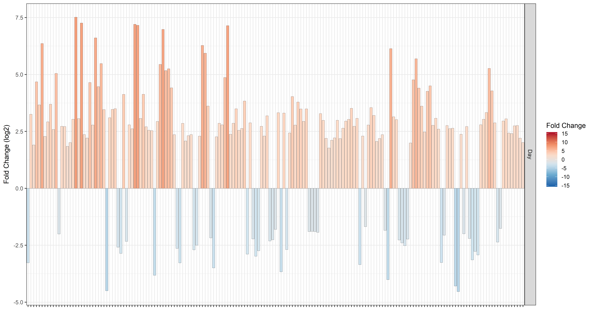

```r
# Focus on COG annotation and pool per level
p_mag8_deseq_cog <- MAG8_deseq_results_depth_fin %>% dplyr::select(gene_oid:Time_of_day, contains("cog")) %>% 
  distinct() %>% 
  ggplot(aes(x = COG_functional_category, y = log2FoldChange, fill = log2FoldChange))+
  geom_point(size = 3, color = "black", shape = 21)+
  # geom_boxplot(alpha = 0.5)+
 scale_fill_distiller(palette = "RdBu", name = "Fold Change",
                       limits = c(-15,15), oob=squish,
                      direction = -1) +
  theme_bw()+
  facet_grid(Time_of_day~.)+
  theme(axis.text.x = element_text(size = 12, angle = 90, hjust = 1))+
  labs(x = "", y = "Fold Change (log2)")

print(p_mag8_deseq_cog)
```


```r
p_mag8_deseq_temp_cog <- MAG8_deseq_results_temp_fin %>% dplyr::select(gene_oid:Comparison, contains("cog")) %>% 
  distinct() %>% 
  ggplot(aes(x = COG_functional_category, y = log2FoldChange, fill = log2FoldChange))+
  geom_point(size = 3, color = "black", shape = 21)+
  # geom_boxplot(alpha = 0.5)+
 scale_fill_distiller(palette = "RdBu", name = "Fold Change",
                       limits = c(-15,15), oob=squish,
                      direction = -1) +
  theme_bw()+
  theme(axis.text.x = element_text(size = 12, angle = 90, hjust = 1))+
  labs(x = "", y = "Fold Change (log2)")

print(p_mag8_deseq_temp_cog)
```


```r
# Focus on KO annotation and pool per level
p_mag8_deseq_KO <- MAG8_deseq_results_depth_fin %>% 
  dplyr::select(gene_oid:Time_of_day, contains("ko")) %>% 
  distinct() %>% 
  ggplot(aes(x = ko_level_B, y = log2FoldChange, fill = log2FoldChange))+
  geom_point(size = 3, color = "black", shape = 21)+
  # geom_boxplot(alpha = 0.5)+
 scale_fill_distiller(palette = "RdBu", name = "Fold Change",
                       limits = c(-15,15), oob=squish,
                      direction = -1) +
  theme_bw()+
  facet_grid(Time_of_day~.)+
  theme(axis.text.x = element_text(size = 12, angle = 90, hjust = 1))+
  labs(x = "", y = "Fold Change (log2)")

print(p_mag8_deseq_KO)
```


### Plot


```r
# Test for enrichment of functional categories in differentially expressed gene pool
## Test for enrichment of KO level C terms in transcriptome
bg_gsea <- MAG8_annot %>% 
  dplyr::select(ko_level_C, gene_oid) %>% 
  distinct()
bg_gsea[is.na(bg_gsea)] <- "Unknown"

metaT_gsea <- enricher(gene = unique(MAG8_deseq_results_depth_fin$gene_oid),
         universe = bg_gsea$gene_oid, 
         TERM2GENE = bg_gsea,
         pvalueCutoff = 0.05,
         qvalueCutoff = 0.2)
metaT_gsea_KO <- data.frame(metaT_gsea@result)
metaT_gsea_KO %>% 
  dplyr::select(Description, GeneRatio, BgRatio, p.adjust, qvalue, Count)%>%
  print()
```

```
##                                                                 Description
## Quorum sensing                                              Quorum sensing 
## Transporters                                                  Transporters 
## ABC transporters                                          ABC transporters 
## Two-component system                                  Two-component system 
## Porphyrin and chlorophyll metabolism  Porphyrin and chlorophyll metabolism 
##                                       GeneRatio BgRatio     p.adjust
## Quorum sensing                           14/108 36/1467 1.036930e-06
## Transporters                             23/108 96/1467 1.036930e-06
## ABC transporters                         16/108 50/1467 1.103524e-06
## Two-component system                      6/108 20/1467 1.260791e-02
## Porphyrin and chlorophyll metabolism      4/108 10/1467 1.816558e-02
##                                             qvalue Count
## Quorum sensing                        8.434356e-07    14
## Transporters                          8.434356e-07    23
## ABC transporters                      8.976037e-07    16
## Two-component system                  1.025524e-02     6
## Porphyrin and chlorophyll metabolism  1.477583e-02     4
```

```r
## Test for enrichment of COG functional categories
bg_gsea <- MAG8_annot %>% 
  dplyr::select(COG_functional_category, gene_oid) %>% 
  distinct()
bg_gsea <- apply(bg_gsea, 2, function(x) as.character(x))
bg_gsea[is.na(bg_gsea)] <- "Unknown"
bg_gsea <- data.frame(bg_gsea)

metaT_gsea <- enricher(gene = unique(MAG8_deseq_results_depth_fin$gene_oid),
         universe = bg_gsea$gene_oid, 
         TERM2GENE = bg_gsea,
         pvalueCutoff = 0.05,
         qvalueCutoff = 0.2)

metaT_gsea_COG <- data.frame(metaT_gsea@result)
metaT_gsea_COG %>% 
  dplyr::select(Description, GeneRatio, BgRatio, p.adjust, qvalue, Count)%>%
  print()
```

```
## [1] Description GeneRatio   BgRatio     p.adjust    qvalue      Count      
## <0 rows> (or 0-length row.names)
```

```r
# Focus on enriched KO level
p_mag8_deseq_depth_KO_gsea <- MAG8_deseq_results_depth_fin %>% 
  dplyr::select(regulation, gene_oid:Time_of_day, contains("ko")) %>% 
  distinct() %>% 
  dplyr::filter(ko_level_C %in% metaT_gsea_KO$Description) %>% 
  ggplot(aes(x = ko_level_C, y = log2FoldChange, fill = regulation))+
  geom_point(shape = 21, size = 3, position=position_jitterdodge(dodge.width=0.9,
                                                                 jitter.width=0.25)) +
  geom_boxplot(outlier.colour = NA, width = 0.5,
                        position = position_dodge(width=0.9), alpha = 0.3)+
  # geom_boxplot(alpha = 0.5)+
  scale_fill_manual(values = brewer.pal(11, "RdBu")[c(2,10)], name = "Fold Change\n") +
  theme_bw()+
  theme(axis.text.x = element_text(size = 12, angle = 45, hjust = 1),
        axis.text.y = element_text(size = 12),
        strip.text = element_text(size = 14),
        legend.text = element_text(size = 12),
        legend.title = element_blank(),
        legend.position = "top")+
  labs(x = "", y = "Fold Change (log2)")+
  ylim(-7, 7)

print(p_mag8_deseq_depth_KO_gsea)
```


```r
# Focus on enriched KO level in sprin-summer samples too
p_mag8_deseq_temp_KO_gsea <- MAG8_deseq_results_temp_fin %>% 
  dplyr::select(regulation, gene_oid:Comparison, contains("ko")) %>% 
  distinct() %>% 
  dplyr::filter(ko_level_C %in% metaT_gsea_KO$Description) %>% 
  ggplot(aes(x = ko_level_C, y = log2FoldChange, fill = regulation))+
  geom_point(shape = 21, size = 3, position=position_jitterdodge(dodge.width=0.9,
                                                                 jitter.width=0.25)) +
  geom_boxplot(outlier.colour = NA, width = 0.5,
                        position = position_dodge(width=0.9), alpha = 0.3)+
  # geom_boxplot(alpha = 0.5)+
  scale_fill_manual(values = brewer.pal(11, "RdBu")[c(2,10)], name = "Fold Change\n") +
  theme_bw()+
  theme(axis.text.x = element_text(size = 12, angle = 45, hjust = 1),
        axis.text.y = element_text(size = 12),
        strip.text = element_text(size = 14),
        legend.text = element_text(size = 12),
        legend.title = element_blank(),
        legend.position = "top")+
  labs(x = "", y = "Fold Change (log2)")+
  ylim(-7, 7)

print(p_mag8_deseq_temp_KO_gsea)
```

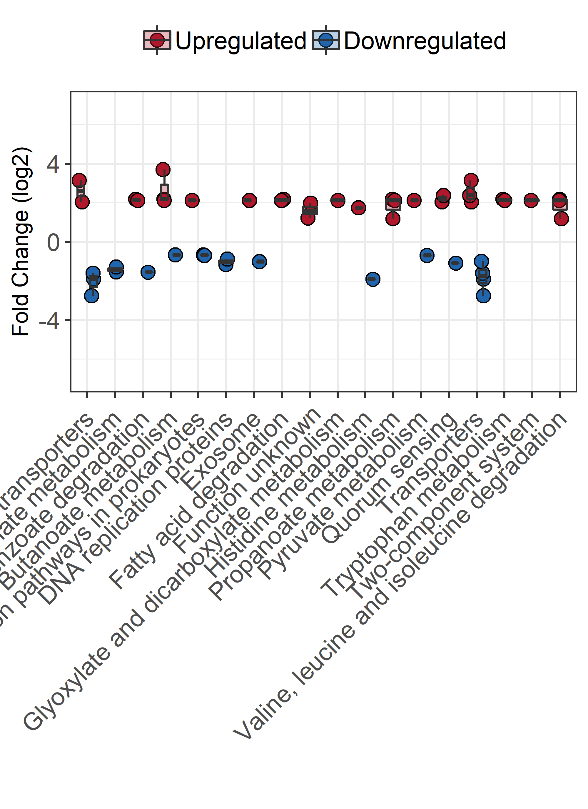


```r
# Spring - Summer samples at M110 - different temperatures but same depth

# Test for enrichment of functional categories in differentially expressed gene pool
## Test for enrichment of KO level C terms in transcriptome
bg_gsea <- MAG8_annot %>% 
  dplyr::select(ko_level_C, gene_oid) %>% 
  distinct()
bg_gsea[is.na(bg_gsea)] <- "Unknown"

metaT_gsea <- enricher(gene = unique(MAG8_deseq_results_temp_fin$gene_oid),
         universe = bg_gsea$gene_oid, 
         TERM2GENE = bg_gsea,
         pvalueCutoff = 0.05,
         qvalueCutoff = 0.2)
metaT_gsea_KO <- data.frame(metaT_gsea@result)
metaT_gsea_KO %>% 
  dplyr::select(Description, GeneRatio, BgRatio, p.adjust, qvalue, Count)%>%
  print()
```

```
## [1] Description GeneRatio   BgRatio     p.adjust    qvalue      Count      
## <0 rows> (or 0-length row.names)
```

```r
## Test for enrichment of COG functional categories
bg_gsea <- MAG8_annot %>% 
  dplyr::select(COG_functional_category, gene_oid) %>% 
  distinct()
bg_gsea <- apply(bg_gsea, 2, function(x) as.character(x))
bg_gsea[is.na(bg_gsea)] <- "Unknown"
bg_gsea <- data.frame(bg_gsea)

metaT_gsea <- enricher(gene = unique(MAG8_deseq_results_temp_fin$gene_oid),
         universe = bg_gsea$gene_oid, 
         TERM2GENE = bg_gsea,
         pvalueCutoff = 0.05,
         qvalueCutoff = 0.2)

metaT_gsea_COG <- data.frame(metaT_gsea@result)
metaT_gsea_COG %>% 
  dplyr::select(Description, GeneRatio, BgRatio, p.adjust, qvalue, Count)%>%
  print()
```

```
## [1] Description GeneRatio   BgRatio     p.adjust    qvalue      Count      
## <0 rows> (or 0-length row.names)
```

```r
# # Focus on enriched KO level
# p_mag8_deseq_KO_gsea <- MAG8_deseq_results_temp_fin %>% 
#   dplyr::select(regulation, gene_oid:Comparison, contains("ko")) %>% 
#   distinct() %>% 
#   dplyr::filter(ko_level_C %in% metaT_gsea_KO$Description) %>% 
#   ggplot(aes(x = ko_level_C, y = log2FoldChange, fill = regulation))+
#   geom_point(shape = 21, size = 3, position=position_jitterdodge(dodge.width=0.9,
#                                                                  jitter.width=0.25)) +
#   geom_boxplot(outlier.colour = NA, width = 0.5,
#                         position = position_dodge(width=0.9), alpha = 0.3)+
#   # geom_boxplot(alpha = 0.5)+
#   scale_fill_manual(values = brewer.pal(11, "RdBu")[c(2,10)], name = "Fold Change\n") +
#   theme_bw()+
#   theme(axis.text.x = element_text(size = 12, angle = 45, hjust = 1),
#         axis.text.y = element_text(size = 12),
#         strip.text = element_text(size = 14),
#         legend.text = element_text(size = 12),
#         legend.title = element_blank(),
#         legend.position = "top")+
#   labs(x = "", y = "Fold Change (log2)")+
#   ylim(-7, 7)
# 
# print(p_mag8_deseq_KO_gsea)
```

# 7. Sequence discrete populations

**In order to check unspecific mapping sample reads were mapped consecutively to
every bin using `BBmap.sh`.** This approach allows us to check the mapping specificity by evaluating the distribution of read identity to the putative genome bin.  

Competitive mapping was performed through `blastn` searches against a 1M and 10M read subsample from the interleaved fasta generated after QC (`seqtk`). Shell script used to achieve this:
```
#!/bin/bash
set -e

for file in `cat map.list`
        do
        echo $file
		db=/scratch/vdenef_fluxm/rprops/DESMAN/metaG/vizbin_rebin_anvio_v230/SEQ_discrete/contigs/merged_bins-fixed.db
		seqtk sample -s 777 /scratch/vdenef_fluxm/rprops/DESMAN/metaG/data/${file}/dt_int.fasta 1000000 > /scratch/vdenef_fluxm/rprops/DESMAN/metaG/data/${file}/dt_int_subs_1000000.fasta
        qseqs=/scratch/vdenef_fluxm/rprops/DESMAN/metaG/data/${file}/dt_int_subs_1000000.fasta
		blastn -query ${qseqs} -task megablast -db ${db} -out ./blast_output/${file}_blast.tsv -outfmt 6 -max_target_seqs 1 -num_threads 40 -perc_identity 60
		rm ${qseqs}
done
```

<!-- # ```{r sequence discrete populations, dpi = 500, warning = FALSE, fig.width = 10, fig.height = 7} -->
<!-- # map_disc <- read.table("./SEQs_discrete/final.idhist", header = FALSE, -->
<!-- #                        row.names = NULL) -->
<!-- # colnames(map_disc) <- c("bin","sample", "identity", "reads_mapped", "bases_mapped") -->
<!-- #  -->
<!-- # # Add season metadata -->
<!-- # map_disc$season <- "Summer" -->
<!-- # map_disc$season[grep("Fa", map_disc$sample)] <- "Fall" -->
<!-- # map_disc$season[grep("Su", map_disc$sample)] <- "Summer" -->
<!-- # map_disc$season[grep("Sp", map_disc$sample)] <- "Spring" -->
<!-- # map_disc$sample <- gsub(".C","", map_disc$sample, fixed = TRUE) -->
<!-- # total_reads2 <- total_reads -->
<!-- # total_reads2$sample <- gsub("_", ".", fixed = TRUE,total_reads$sample) -->
<!-- # map_disc <- dplyr::left_join(map_disc, total_reads2, by = "sample") -->
<!-- #  -->
<!-- # # Throw away all %identity below 60% -->
<!-- # # map_disc <- map_disc %>% filter(identity > 60) -->
<!-- #  -->
<!-- # # Normalize reads_mapped to library sizes -->
<!-- # map_disc <- map_disc %>% group_by(sample) %>%  -->
<!-- #   mutate(rel_reads_mapped = 100*reads_mapped/Total_reads) -->
<!-- #  -->
<!-- # # Add observed genome size -->
<!-- # map_disc$bin <- gsub(".fa","",map_disc$bin) -->
<!-- # map_disc <- left_join(map_disc, bin_size, by = c("bin" = "bins")) -->
<!-- #  -->
<!-- # # Plot distributions -->
<!-- # for(bin2plot in unique(map_disc$bin)){ -->
<!-- #     p_sdisc <- map_disc %>% filter(bin == bin2plot) %>%  -->
<!-- #       ggplot(aes(x = identity, y = rel_reads_mapped, color = season))+ -->
<!-- #       theme_bw()+ -->
<!-- #       scale_color_brewer(palette = "Accent")+ -->
<!-- #       facet_wrap(~sample, nrow = 4)+ -->
<!-- #       geom_line(size = 1.5)+ -->
<!-- #       guides(color = FALSE)+ -->
<!-- #       ggtitle(bin2plot)+ -->
<!-- #       theme(axis.text=element_text(size=14), axis.title=element_text(size=20), -->
<!-- #         title=element_text(size=20), legend.text=element_text(size=14), -->
<!-- #         legend.background = element_rect(fill="transparent"), -->
<!-- #         axis.text.x = element_text(angle = 45, hjust = 1), -->
<!-- #         strip.text.y=element_text(size=14))+ -->
<!-- #       ylab("Proportion of reads mapped (%)")+ -->
<!-- #       xlab("Nucleotide identity (%)") -->
<!-- #       # ylim(0,.5) -->
<!-- #    -->
<!-- #   print(p_sdisc) -->
<!-- # } -->
<!-- # ``` -->
<!-- #  -->
<!-- # ```{r plot-cum-discrete, dpi = 500, warning = FALSE, fig.width = 7, fig.height = 10} -->
<!-- # # Plot % reads corrected for genome size over threshold of 0.95 -->
<!-- # id_thresh <- 95 -->
<!-- # map_disc_cum <- map_disc  %>% filter(identity > id_thresh) %>% group_by(sample) %>%  -->
<!-- #   mutate(cum_rel_reads_mapped = cumsum(rel_reads_mapped))%>%  -->
<!-- #   filter(identity == 100) -->
<!-- # sum_cum <- map_disc_cum %>% group_by(sample, bin) %>% mutate(cum_bins_rel_reads_mapped = sum(cum_rel_reads_mapped)) -->
<!-- # colnames(sum_cum)[c(2)] <- "Sample2" -->
<!-- #  -->
<!-- # p_sdisc_cum1 <- ggplot(map_disc_cum, aes(x = sample, y = 1e6*cum_rel_reads_mapped/bin_size,  -->
<!-- #                                         fill = bin))+ -->
<!-- #   theme_bw()+ -->
<!-- #   scale_fill_brewer(palette = "Paired")+ -->
<!-- #   geom_point(size = 4, shape = 21, color = "black")+ -->
<!-- #   theme(axis.text=element_text(size=14), axis.title=element_text(size=20), -->
<!-- #       title=element_text(size=20), legend.text=element_text(size=14), -->
<!-- #       legend.background = element_rect(fill="transparent"), -->
<!-- #       axis.text.x = element_text(angle = 45, hjust = 1), -->
<!-- #       strip.text.y=element_text(size=14), legend.position = "bottom")+ -->
<!-- #   ylab(paste0("Proportion of reads mapped > ", id_thresh, "% NI"))+ -->
<!-- #   xlab("Sample")+ -->
<!-- #   guides(fill=guide_legend(nrow = 11))+ -->
<!-- #   # geom_point(data = sum_cum, aes(x = Sample2, y = cum_bins_rel_reads_mapped), -->
<!-- #              # shape = 22, fill = "black", size = 4)+ -->
<!-- #   ylim(0,2.5) -->
<!-- #  -->
<!-- # print(p_sdisc_cum1) -->
<!-- #  -->
<!-- # # Plot % reads over threshold of 0.99 -->
<!-- # id_thresh <- 99 -->
<!-- # map_disc_cum2 <- map_disc  %>% filter(identity > id_thresh) %>% group_by(sample) %>%  -->
<!-- #   mutate(cum_rel_reads_mapped = cumsum(rel_reads_mapped))%>%  -->
<!-- #   filter(identity == 100) -->
<!-- # sum_cum <- map_disc_cum2 %>% group_by(sample, bin) %>% mutate(cum_bins_rel_reads_mapped = sum(cum_rel_reads_mapped)) -->
<!-- # colnames(sum_cum)[c(2)] <- "Sample2" -->
<!-- #  -->
<!-- # p_sdisc_cum2 <- ggplot(map_disc_cum2, aes(x = sample, y = 1e6*cum_rel_reads_mapped/bin_size,  -->
<!-- #                                         fill = bin))+ -->
<!-- #   theme_bw()+ -->
<!-- #   scale_fill_brewer(palette = "Paired")+ -->
<!-- #   geom_point(size = 4, shape = 21, color = "black")+ -->
<!-- #   theme(axis.text=element_text(size=14), axis.title=element_text(size=20), -->
<!-- #       title=element_text(size=20), legend.text=element_text(size=14), -->
<!-- #       legend.background = element_rect(fill="transparent"), -->
<!-- #       axis.text.x = element_text(angle = 45, hjust = 1), -->
<!-- #       strip.text.y=element_text(size=14), legend.position = "bottom")+ -->
<!-- #   ylab(paste0("Proportion of reads mapped > ", id_thresh, "% NI"))+ -->
<!-- #   xlab("Sample")+ -->
<!-- #   guides(fill=guide_legend(nrow = 11))+ -->
<!-- #   # geom_point(data = sum_cum, aes(x = Sample2, y = cum_bins_rel_reads_mapped), -->
<!-- #              # shape = 22, fill = "black", size = 4)+ -->
<!-- #   ylim(0,1.0) -->
<!-- #  -->
<!-- # print(p_sdisc_cum2) -->
<!-- # ``` -->

### Competitive mapping using `blast` with 1M reads of interleaved fasta.  


```r
blast_df <- read.table("./SEQs_discrete/merged_blast_1M.tsv", header = FALSE)
colnames(blast_df) <- c("Sample", "Contig", "Identity")
blast_df_map <- read.table("./SEQs_discrete/merged_contig_list.tsv", header = FALSE)
colnames(blast_df_map) <- c("m_contig", "o_contig", "bin")

# Round identity to integer
# blast_df$Identity <- round(blast_df$Identity, 1)
# blast_df$Identity <- factor(blast_df$Identity)
blast_df <- left_join(blast_df, blast_df_map, by = c("Contig" = "m_contig"))

# Bin the %Identity in intervals of 0.5%
blast_df_sum <- transform(blast_df, bin_group=cut(Identity,  breaks=seq(0, 100, 0.5)))

# Format sample names and convert to data.frame
blast_df_sum$Sample <- gsub("_blast.tsv", "", blast_df_sum$Sample)
blast_df_sum <- data.frame(blast_df_sum)
# blast_df_sum$Identity <- as.numeric(as.character(blast_df_sum$Identity))
blast_df_sum$bin <- gsub(".fa","",blast_df_sum$bin)
blast_df_sum <- dplyr::left_join(blast_df_sum, bin_size, by = c("bin" = "bins"))

# Add extra column that converts the binning range to a numeric x-coordinate that
# is positioned in the middle of the binning interval
blast_df_sum$bin_group <- gsub("\\(|]", "", 
                               as.character(blast_df_sum$bin_group))
blast_df_sum$bin_xcoord <- as.numeric(do.call(rbind,
                                              strsplit(blast_df_sum$bin_group,
                                                       ","))[,1])+0.25

# Normalize mapped reads per sample based on sample reads
# blast_subs <- 1e6
# blast_df_sum <- blast_df_sum %>% ungroup %>% group_by(Sample) %>% 
#   mutate(n_prop = 100*n/blast_subs)

# Add season variable
blast_df_sum$season <- "Summer"
blast_df_sum$season[grep("Fa", blast_df_sum$Sample)] <- "Fall"
blast_df_sum$season[grep("Su", blast_df_sum$Sample)] <- "Summer"
blast_df_sum$season[grep("Sp", blast_df_sum$Sample)] <- "Spring"

# Reformat sample names
blast_df_sum$Sample <- gsub(".C", "", blast_df_sum$Sample, fixed = TRUE)
blast_df_sum$Sample <- gsub(".A", "", blast_df_sum$Sample, fixed = TRUE)
blast_df_sum$Sample <- gsub(".", "_", blast_df_sum$Sample, fixed = TRUE)

# Add metadata to dataframe
meta_blast <- meta[, -1] %>% distinct()
blast_df_sum <- dplyr::left_join(blast_df_sum, meta_blast, by = c("Sample" = "Sample_ID"))

# Reorder site factor
blast_df_sum$Site <- as.character(blast_df_sum$Site)
blast_df_sum$Site <- gsub("Buoy","Muskegon Lake", blast_df_sum$Site)
blast_df_sum$Site <- gsub("110","Lake Michigan\nsite M110", blast_df_sum$Site)
blast_df_sum$Site <- gsub("15","Lake Michigan\nsite M15", blast_df_sum$Site)
blast_df_sum$Site <- factor(blast_df_sum$Site, levels = c("Muskegon Lake",
                                                          "Lake Michigan\nsite M15",
                                                          "Lake Michigan\nsite M110"))
blast_df_sum$Depth <- as.character(blast_df_sum$Depth)
blast_df_sum$Depth <- factor(blast_df_sum$Depth, levels = c("Surface", "Mid", "Deep"))
blast_df_sum$season <- as.character(blast_df_sum$season)
blast_df_sum$season <- factor(blast_df_sum$season, levels = c("Spring", "Summer", "Fall"))

# remove non-Limnohabbitans bin
blast_df_sum <- blast_df_sum %>% dplyr::filter(bin != "B2_Fa13.BD.MLB.DN_rebin10")

# Add extra column with new bin names
new_bin_names <- read.table("./anvio_output/rebin/general_bins_summary_selected_final.tsv", header = TRUE)[, c(2,3)]
blast_df_sum <- left_join(blast_df_sum, new_bin_names, by = c("bin" = "bins"))
blast_df_sum$new_bin_name <- as.character(blast_df_sum$new_bin_name)
blast_df_sum$new_bin_name <- factor(blast_df_sum$new_bin_name, levels =
                                      c("MAG1.FA-MLB-DN","MAG2.FA-MLB-SN",
                                        "MAG3.FA-MLB-SN", "MAG4.FA-M110-DN",
                                        "MAG5.SP-M110-DD","MAG6.SP-M15-SD",
                                        "MAG7.SU-MLB-SD","MAG8.SU-M110-DCMD",
                                        "MAG9.SU-M15-SN","MAG10.SU-M15-SN"))
# plot for individual bins
for(bin2plot in unique(blast_df_sum$new_bin_name)){
  p_blast_sdisc <- blast_df_sum %>% dplyr::filter(new_bin_name == bin2plot) %>% 
     ggplot(aes(x = bin_xcoord, ..scaled.., fill = season))+
      theme_bw()+
      scale_fill_brewer(palette = "Accent")+
      facet_wrap(~Sample, nrow = 4)+
      geom_density(color = "black")+
      guides(color = FALSE)+
      ggtitle(bin2plot)+
      theme(axis.text=element_text(size=14), axis.title=element_text(size=20),
        title=element_text(size=20), legend.text=element_text(size=14),
        legend.background = element_rect(fill="transparent"),
        axis.text.x = element_text(angle = 45, hjust = 1),
        strip.text.y=element_text(size=14))+
      ylab("Density")+
      xlab("Nucleotide identity (%)")+
    xlim(75,100)
     
print(p_blast_sdisc)
}
```

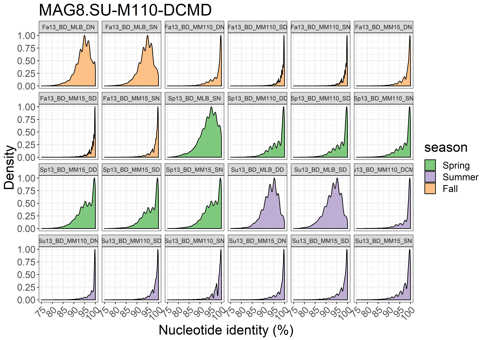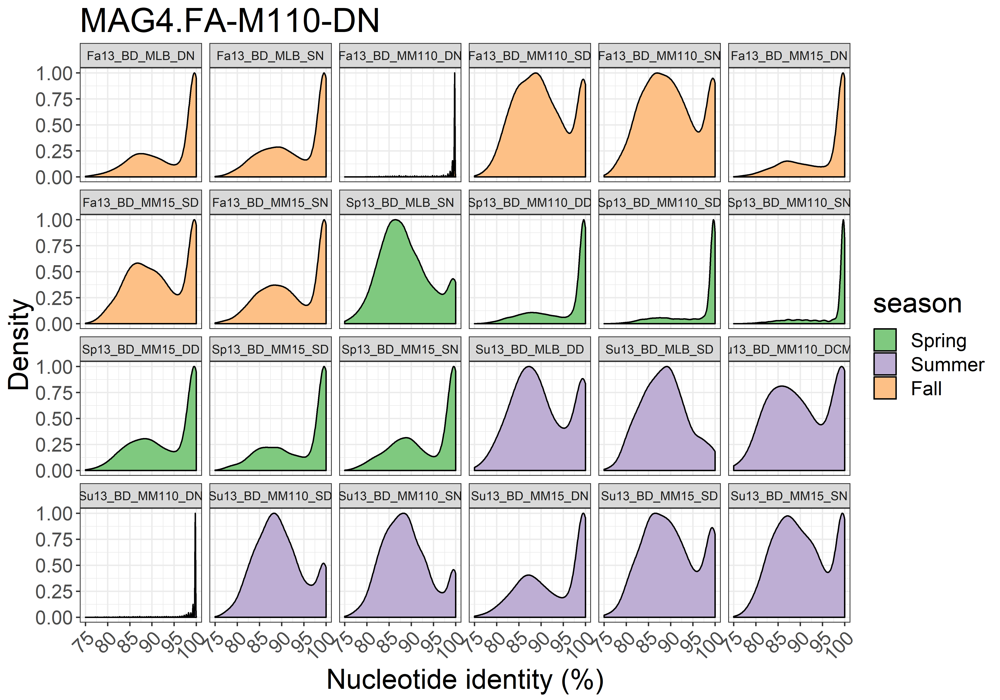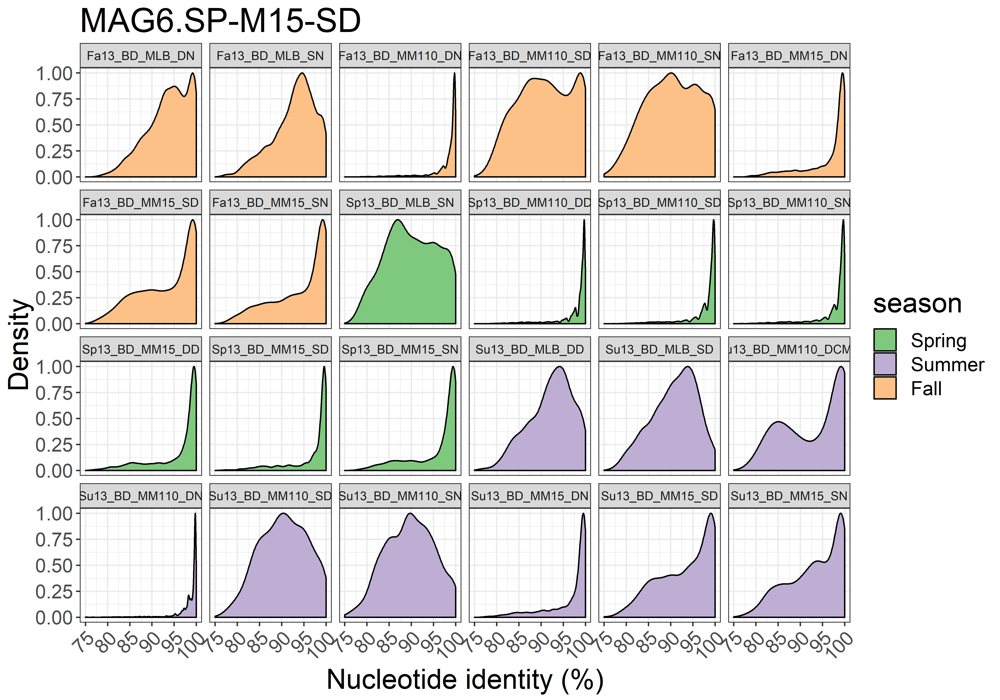


```r
# Plot one combined figure with proportions normalized for genome size
p_blast_sdisc_merged <- blast_df_sum %>% 
     ggplot(aes(x = bin_xcoord, ..density.., color = bin))+
      theme_gray()+
      scale_color_brewer("", palette = "Paired")+
      facet_wrap(~Sample, nrow = 4)+
      geom_density()+
      ggtitle("Merged bins per sample")+
      theme(axis.text=element_text(size=14), axis.title=element_text(size=20),
        title=element_text(size=20), legend.text=element_text(size=14),
        legend.background = element_rect(fill="transparent"),
        axis.text.x = element_text(angle = 45, hjust = 1),
        strip.text.y=element_text(size=14),
        legend.position = "bottom")+
      ylab("Reads per Mbp")+
      xlab("Nucleotide identity (%)")+
    xlim(75,100)+
  guides(color=guide_legend(ncol=3))
     
print(p_blast_sdisc_merged)
```


```r
# Plot for most abundant bin (B63)
p_blast_sdisc_B63 <- blast_df_sum %>% dplyr::filter(bin == "B63_Su13.BD.MM110.DCMD_rebin1") %>% 
  ggplot(aes(x = bin_xcoord, ..density.., fill = season, group = Sample,
             shape = Depth))+
  theme_bw()+
  facet_grid(season~Site)+
  geom_density(alpha = 0.4, color = "black", size = 1)+
  scale_shape_manual("", values = c(21,22,24))+
  scale_fill_brewer(palette = "Accent")+
  guides(color = FALSE, fill = FALSE)+
  theme(axis.text=element_text(size=14), axis.title=element_text(size=20),
        title=element_text(size=20), legend.text=element_text(size=14),
        legend.background = element_rect(fill="transparent"),
        axis.text.x = element_text(angle = 45, hjust = 1),
        strip.text=element_text(size=16),
        panel.grid.minor = element_blank(),
        legend.position = "bottom")+
  ylab("Density")+
  xlab("Nucleotide identity (%)")+
  xlim(75,100)

p_blast_sdisc_B63
```


```r
# Plot for most Muskegon Lake for all bins
p_blast_sdisc_ML <- blast_df_sum %>% dplyr::filter(Site == "Muskegon Lake") %>% 
  ggplot(aes(x = bin_xcoord, ..scaled.., fill = new_bin_name, group = Sample,
             shape = Depth))+
  theme_bw()+
  facet_grid(new_bin_name~season, scales = "free_y")+
  geom_density(alpha = 0.3, color = "black", size = 1)+
  # geom_point(size = 3, alpha = 0.6)+
  scale_shape_manual("", values = c(21,22,24))+
  scale_fill_manual(values = fill_palette)+
  guides(color = FALSE, fill = FALSE)+
  # ggtitle(bin2plot)+
  theme(axis.text=element_text(size=14), axis.title=element_text(size=20),
        title=element_text(size=20), legend.text=element_text(size=14),
        legend.background = element_rect(fill="transparent"),
        axis.text.x = element_text(angle = 45, hjust = 1),
        strip.text=element_text(size=14),
        panel.grid.minor = element_blank(),
        legend.position = "bottom")+
  ylab("Scaled density")+
  xlab("Nucleotide identity (%)")+
  xlim(75,100)

p_blast_sdisc_ML
```

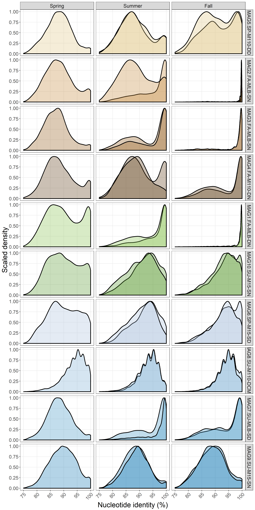


```r
blast_df_sum_comp <- blast_df_sum %>% group_by(Sample, bin) %>% dplyr::count(bin_xcoord)
blast_df_sum_comp <-  dplyr::left_join(blast_df_sum_comp, bin_size, by = c("bin" = "bins"))
blast_df_sum_comp <- left_join(blast_df_sum_comp, new_bin_names, by = c("bin" = "bins"))
blast_df_sum_comp$new_bin_name <- as.character(blast_df_sum_comp$new_bin_name)
blast_df_sum_comp$new_bin_name <- factor(blast_df_sum_comp$new_bin_name, levels =
                                      c("MAG1.FA-MLB-DN","MAG2.FA-MLB-SN",
                                        "MAG3.FA-MLB-SN", "MAG4.FA-M110-DN",
                                        "MAG5.SP-M110-DD","MAG6.SP-M15-SD",
                                        "MAG7.SU-MLB-SD","MAG8.SU-M110-DCMD",
                                        "MAG9.SU-M15-SN","MAG10.SU-M15-SN"))
blast_df_sum_comp <- dplyr::left_join(blast_df_sum_comp, meta_blast, by = c("Sample" = "Sample_ID"))

# Reorder site factor
blast_df_sum_comp$Site <- as.character(blast_df_sum_comp$Site)
blast_df_sum_comp$Site <- gsub("Buoy","Muskegon Lake", blast_df_sum_comp$Site)
blast_df_sum_comp$Site <- gsub("110","Lake Michigan\nsite M110", blast_df_sum_comp$Site)
blast_df_sum_comp$Site <- gsub("15","Lake Michigan\nsite M15", blast_df_sum_comp$Site)
blast_df_sum_comp$Site <- factor(blast_df_sum_comp$Site, 
                                 levels = c("Muskegon Lake",
                                            "Lake Michigan\nsite M15",
                                            "Lake Michigan\nsite M110"))
blast_df_sum_comp$Depth <- as.character(blast_df_sum_comp$Depth)
blast_df_sum_comp$Depth <- factor(blast_df_sum_comp$Depth, 
                                  levels = c("Surface", "Mid", "Deep"))
blast_df_sum_comp$Season <- as.character(blast_df_sum_comp$Season)
blast_df_sum_comp$Season <- factor(blast_df_sum_comp$Season, levels = c("Spring", "Summer", "Fall"))

# Normalize mapped reads per sample based on genome size
blast_df_sum_comp <- blast_df_sum_comp %>% group_by(bin) %>%
mutate(n_norm = 1e6*n/bin_size)

blast_df_sum_comp <- left_join(blast_df_sum_comp, total_reads, by = c("Sample" = "sample"))

# Divide normalized reads by 1M (fixed blast census)
blast_df_sum_comp <- blast_df_sum_comp %>% mutate(n_norm_perc = 100*n_norm/1e6)
```


```r
# Plot % reads corrected for genome size over threshold of 0.95
id_thresh <- 95-0.25
map_disc_cum <- blast_df_sum_comp  %>% dplyr::filter(bin_xcoord > id_thresh) %>% group_by(Sample, bin) %>% 
  mutate(cum_rel_reads_mapped = cumsum(n_norm_perc))%>% 
  dplyr::filter(bin_xcoord == 100-0.25)
sum_cum <- map_disc_cum %>% group_by(Sample, bin) %>% mutate(cum_bins_rel_reads_mapped = sum(cum_rel_reads_mapped))

p_sdisc_cum3 <- ggplot(map_disc_cum, aes(x = new_bin_name, 
                                         y = cum_rel_reads_mapped, 
                                        fill = new_bin_name))+
  theme_bw()+
  scale_fill_manual("", values = fill_palette)+
  geom_jitter(size = 4, shape = 21, color = "black", alpha = 0.7, width = 0.15)+
  theme(axis.text=element_text(size=14), axis.title=element_text(size=20),
      title=element_text(size=20), legend.text=element_text(size=12),
      legend.background = element_rect(fill="transparent"),
      axis.text.x = element_blank(),
      strip.text=element_text(size=14), legend.position = "bottom",
      strip.background = element_rect(fill = adjustcolor("gray", 0.15)))+
  ylab(paste0("Norm. relative abundance ( > ", id_thresh, "% NI)"))+
  xlab("")+
  guides(fill=guide_legend(nrow = 3))+
  facet_grid(Season~Site, scales ="free")+
  scale_y_continuous(labels=scaleFUN, limits = c(0,3))+
  coord_trans(y = "sqrt")

print(p_sdisc_cum3)
```

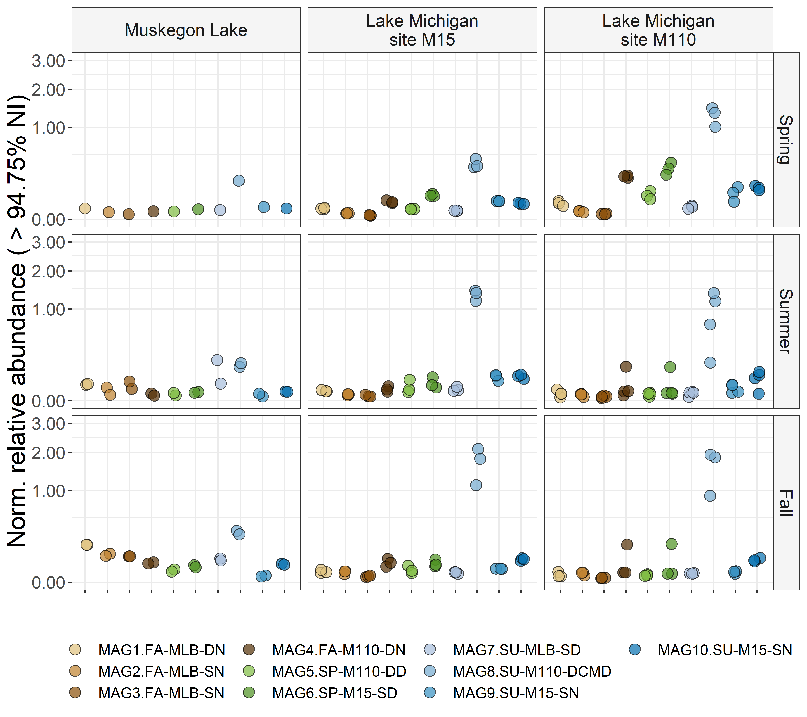

```r
# Plot % reads over threshold of 0.99
id_thresh <- 99-0.25
map_disc_cum <- blast_df_sum_comp  %>% dplyr::filter(bin_xcoord > id_thresh) %>% group_by(Sample, bin) %>% 
  mutate(cum_rel_reads_mapped = cumsum(n_norm_perc))%>% 
  dplyr::filter(bin_xcoord == 100-0.25)
sum_cum <- map_disc_cum %>% group_by(Sample, bin) %>% mutate(cum_bins_rel_reads_mapped = sum(cum_rel_reads_mapped))

p_sdisc_cum4 <- ggplot(map_disc_cum, aes(x = new_bin_name, 
                                         y = cum_rel_reads_mapped, 
                                        fill = new_bin_name))+
  theme_bw()+
  scale_fill_manual("", values = fill_palette)+
  geom_jitter(size = 4, shape = 21, color = "black", alpha = 0.7, width = 0.15)+
  theme(axis.text=element_text(size=14), axis.title=element_text(size=20),
      title=element_text(size=20), legend.text=element_text(size=12),
      legend.background = element_rect(fill="transparent"),
      axis.text.x = element_blank(),
      strip.text=element_text(size=14), legend.position = "bottom",
      strip.background = element_rect(fill = adjustcolor("gray", 0.15)))+
  ylab(paste0("Norm. relative abundance ( > ", id_thresh, "% NI)"))+
  xlab("")+
  guides(fill=guide_legend(nrow = 3))+
  facet_grid(Season~Site, scales ="free")+
  scale_y_continuous(labels=scaleFUN, limits = c(0,1.25))+
  coord_trans(y = "sqrt")

print(p_sdisc_cum4)
```


### Filter out bins using MClust  

** Here we will use model-based clustering to determine whether there is a MAG present or not in a certain sample. ** 


```r
# Perform gaussian mixture clustering on whole dataset.
mod1 <- densityMclust(blast_df_sum$bin_xcoord)
summary(mod1)
```

```
## -------------------------------------------------------
## Density estimation via Gaussian finite mixture modeling 
## -------------------------------------------------------
## 
## Mclust V (univariate, unequal variance) model with 3 components:
## 
##  log.likelihood      n df      BIC      ICL
##        -2219529 946589  8 -4439168 -4675702
## 
## Clustering table:
##      1      2      3 
## 329524 251916 365149
```

```r
par(mfrow=c(2,2))
plot(mod1, what = "density", data = blast_df_sum$bin_xcoord, breaks = 15)
plot(mod1, what = "BIC")
plot(mod1, what = "diagnostic", type = "cdf")
plot(mod1, what = "diagnostic", type = "qq")
```


```r
par(mfrow=c(1,1))

# Return cluster labels and plot the Sequence discrete populations again.
blast_df_sum$cluster_label <- mod1$classification
blast_df_sum$model_density <- mod1$density

# Add cluster labels to blast_df_sum_comp
tmp <- blast_df_sum[, c("bin_xcoord", "cluster_label", "model_density")] %>% distinct()
tmp$bin_xcoord <- as.factor(tmp$bin_xcoord)
blast_df_sum_comp$bin_xcoord <- as.factor(blast_df_sum_comp$bin_xcoord)
blast_df_sum_comp <- left_join(blast_df_sum_comp, tmp, by = "bin_xcoord")
blast_df_sum_comp$bin_xcoord <- 
  as.numeric(as.character(blast_df_sum_comp$bin_xcoord))
blast_df_sum_comp$cluster_label <- as.factor(blast_df_sum_comp$cluster_label)

# Plot for global analysis
p_blast_sdisc_glob_clust <- blast_df_sum_comp %>% 
  ggplot(aes(x = bin_xcoord, y = model_density, 
             color = cluster_label, group = Sample))+
  theme_bw()+
  geom_line(alpha = 1, size = 1)+
  scale_color_brewer(palette = "Dark2")+
  guides(color = FALSE, fill = FALSE)+
  theme(axis.text=element_text(size=14), axis.title=element_text(size=20),
        title=element_text(size=20), legend.text=element_text(size=14),
        legend.background = element_rect(fill="transparent"),
        axis.text.x = element_text(angle = 45, hjust = 1),
        strip.text=element_text(size=16),
        panel.grid.minor = element_blank(),
        legend.position = "bottom")+
  ylab("Density")+
  xlab("Nucleotide identity (%)")+
  xlim(75,100)

print(p_blast_sdisc_glob_clust)
```


```r
# Plot for most abundant bin (B63)
p_blast_sdisc_B63_clust <- blast_df_sum_comp %>% dplyr::filter(bin == "B63_Su13.BD.MM110.DCMD_rebin1") %>% 
  ggplot(aes(x = bin_xcoord, y = n, color = cluster_label, group = Sample))+
  theme_bw()+
  facet_grid(Season~Site)+
  geom_line(alpha = 1, size = 1)+
  scale_color_brewer(palette = "Dark2")+
  guides(color = FALSE, fill = FALSE)+
  theme(axis.text=element_text(size=14), axis.title=element_text(size=20),
        title=element_text(size=20), legend.text=element_text(size=14),
        legend.background = element_rect(fill="transparent"),
        axis.text.x = element_text(angle = 45, hjust = 1),
        strip.text=element_text(size=16),
        panel.grid.minor = element_blank(),
        legend.position = "bottom")+
  ylab("Density")+
  xlab("Nucleotide identity (%)")+
  xlim(75,100)

print(p_blast_sdisc_B63_clust)
```


### Compare blast to bwa results  


```r
# Compare blast inferred abundances with bwa inferred abundances
grid_arrange_shared_legend(p_abs2, p_sdisc_cum4, ncol = 2)
```

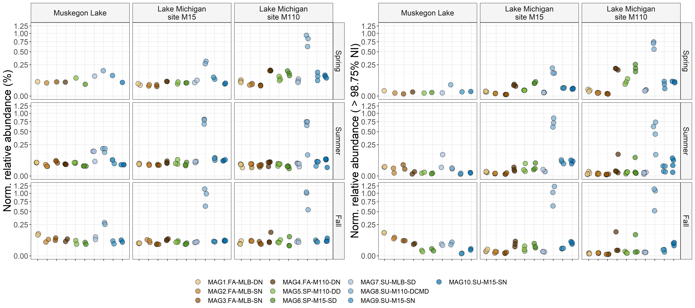


```r
# Merge those two dataframes and make scatter plot highlighting the differences 
df_map_merged_sm <- df_map_merged[, c("Bin","Sample","rel_norm_abundance", "Season", "Site")]
df_map_merged_sm$Sample <- gsub(".", "_", df_map_merged_sm$Sample, fixed = TRUE)
df_map_merged_sm <- data.frame(df_map_merged_sm, 
                               interaction = interaction(df_map_merged_sm$Bin,
                                                                         df_map_merged_sm$Sample),
                              method = "bwa")

map_disc_cum_sm <- map_disc_cum[, c("bin","Sample","cum_rel_reads_mapped")] 
map_disc_cum_sm <- data.frame(map_disc_cum_sm, 
                              interaction = interaction(map_disc_cum_sm$bin,
                                                                         map_disc_cum_sm$Sample),
                              method = "blastn")

abs_merged <- left_join(df_map_merged_sm, map_disc_cum_sm, by = "interaction")
abs_merged <- abs_merged[,c("Bin","Sample.x","rel_norm_abundance","cum_rel_reads_mapped",
                            "Season", "Site")]
colnames(abs_merged) <- c("Bin","Sample",
                          "bwa_norm_abundance","blastn_norm_abundance",
                          "Season", "Site")


# Plot
p_scat_abund <- ggplot(abs_merged, aes(x = bwa_norm_abundance, y = blastn_norm_abundance))+
  theme_bw()+
  geom_point(size = 4, shape = 21, color = "black", alpha = 0.7,
             aes(fill = Bin))+
  scale_fill_manual("", values = fill_palette)+
  theme(axis.text=element_text(size=14), axis.title=element_text(size=20),
      title=element_text(size=20), legend.text=element_text(size=12),
      legend.background = element_rect(fill="transparent"),
      strip.text=element_text(size=14), legend.position = "bottom",
      strip.background = element_rect(fill = adjustcolor("gray", 0.15)))+
  ylab(paste0("Norm. relative abundance (blastn, > ", id_thresh, "% NI)"))+
  xlab("Norm. relative abundance (BWA)")+
  guides(fill=guide_legend(nrow = 3))+
  facet_grid(Season~Site, scales ="free")+
  scale_y_continuous(labels=scaleFUN)+
  scale_x_continuous(labels=scaleFUN)+
  geom_smooth(method = "lm", color = "black")
  # coord_trans(x = "atanh", y = "atanh")

print(p_scat_abund)
```


<!-- ### Calculate temporospatial diversity in Lhab -->

<!-- ```{r diversity-Lhab, dpi = 500, warning = FALSE, fig.width = 9, fig.height = 5} -->
<!-- abs_merged_div <- map_disc_cum[, c("Sample", "new_bin_name", "n_norm")] -->
<!-- abs_merged_div$n_norm <- as.integer(abs_merged_div$n_norm ) -->

<!-- # Format long to wide format -->
<!-- abs_table <- spread(abs_merged_div, Sample, n_norm) -->
<!-- abs_table <- data.frame(abs_table) -->
<!-- rownames(abs_table) <- abs_table[, 1]; abs_table <- abs_table[, -1] -->
<!-- tax.table <- data.frame(MAGs = rownames(abs_table)) -->
<!-- rownames(tax.table) <- tax.table$MAGs -->

<!-- # Make phyloseq object -->
<!-- MAG_phy <- phyloseq(otu_table(abs_table, taxa_are_rows = TRUE),  -->
<!--          tax_table(as.matrix(tax.table))) -->

<!-- # Run Diversity_16S() -->
<!-- MAG_div <- Diversity_16S(MAG_phy, ncore = 3, parallel = TRUE, -->
<!--                          R = 100, brea = FALSE) -->

<!-- MAG_div <- data.frame(Sample = rownames(MAG_div), MAG_div[,-c(3:6)]) -->

<!-- # Merge with metadata -->
<!-- MAG_div <- left_join(MAG_div, meta_blast, by = c("Sample" = "Sample_ID")) -->

<!-- # Annotate and order metavariables -->
<!-- MAG_div$Site <- as.character(MAG_div$Site) -->
<!-- MAG_div$Site <- gsub("Buoy","Muskegon Lake", MAG_div$Site) -->
<!-- MAG_div$Site <- gsub("110","Lake Michigan\nsite M110", MAG_div$Site) -->
<!-- MAG_div$Site <- gsub("15","Lake Michigan\nsite M15", MAG_div$Site) -->
<!-- MAG_div$Site <- factor(MAG_div$Site, levels = c("Muskegon Lake", -->
<!--                                                           "Lake Michigan\nsite M15", -->
<!--                                                           "Lake Michigan\nsite M110")) -->
<!-- MAG_div$Depth <- as.character(MAG_div$Depth) -->
<!-- MAG_div$Depth <- factor(MAG_div$Depth, levels = c("Surface", "Mid", "Deep")) -->
<!-- MAG_div$Season <- as.character(MAG_div$Season) -->
<!-- MAG_div$Season <- factor(MAG_div$Season, levels = c("Spring", "Summer", "Fall")) -->

<!-- # Plot results -->
<!-- p_MAG_div <- ggplot(MAG_div, aes(x = Season, y = D2,  -->
<!--                                         fill = Season, shape = Depth))+ -->
<!--   theme_bw()+ -->
<!--   scale_fill_brewer(palette = "Accent")+ -->
<!--   geom_point(size = 4, color = "black", alpha = 0.7)+ -->
<!--   scale_shape_manual(values = c(21,24,23))+ -->
<!--   # geom_boxplot(alpha = 0.4)+ -->
<!--   theme(axis.text=element_text(size=14), axis.title=element_text(size=20), -->
<!--       title=element_text(size=20), legend.text=element_text(size=12), -->
<!--       legend.background = element_rect(fill="transparent"), -->
<!--       axis.text.x = element_text(size = 14, angle = 45, hjust = 1), -->
<!--       strip.text=element_text(size=14), legend.position = "bottom", -->
<!--       strip.background = element_rect(fill = adjustcolor("gray", 0.15)))+ -->
<!--   ylab(paste0("Limnohabitans population\n diversity (D2)"))+ -->
<!--   guides(fill=FALSE)+ -->
<!--   facet_grid(~Site, scales ="free")+ -->
<!--   xlab("")+ -->
<!--   geom_errorbar(aes(ymin = D2 - sd.D2, ymax = D2 + sd.D2), width = 0.05)+ -->
<!--   scale_y_continuous(labels=scaleFUN, limits = c(0,6.5)) -->
<!--   # coord_trans(y = "sqrt") -->

<!-- print(p_MAG_div) -->
<!-- ``` -->

# 8. DESMAN


```r
# Import data
results_desm <- read.csv("./DESMAN/MAG8_scg_10_9/Gamma_meanR.csv", header = TRUE)
colnames(results_desm)[1] <- "Samples"
colnames(results_desm) <- gsub("X", "Strain", colnames(results_desm))
colnames(results_desm) <- c("Samples", "Strain 1", "Strain 2", "Strain 3", "Strain 4",
                            "Strain 5")
results_desm$Samples <- gsub(".sorted.MAG8","",results_desm$Samples, fixed = TRUE)

# Import library prep data
library_prep <- read.table("./mapping_files/Libraries.tsv",header = TRUE)

# Wide to long format
results_desm_long <- tidyr::gather(results_desm, Strain, Freq, 
                             2:(ncol(results_desm)), factor_key=TRUE)
# Merge with metadata
results_desm_long <- dplyr::left_join(results_desm_long, library_prep, by = "Samples")
results_desm_long$Samples <- gsub(".A", "", results_desm_long$Samples, fixed = TRUE)
results_desm_long$Samples <- gsub(".C", "", results_desm_long$Samples, fixed = TRUE)
results_desm_long <- dplyr::left_join(results_desm_long, meta_em, by = c("Samples" = "Sample_ID"))

results_desm_long$Site <- as.character(results_desm_long$Site)
results_desm_long$Site <- gsub("110", "Lake Michigan\nsite M110", results_desm_long$Site)
results_desm_long$Site <- gsub("15", "Lake Michigan\nsite M15", results_desm_long$Site)
results_desm_long$Site <- gsub("Buoy", "Muskegon Lake", results_desm_long$Site)
results_desm_long$Site <- factor(results_desm_long$Site, levels = c("Muskegon Lake",
                                                            "Lake Michigan\nsite M15",
                                                            "Lake Michigan\nsite M110"))
results_desm_long$Season <- as.character(results_desm_long$Season)
results_desm_long$Season <- factor(results_desm_long$Season, levels = c("Spring", "Summer","Fall"))

# Factor to numeric
results_desm_long$Temperature..C. <- as.numeric(as.character(results_desm_long$Temperature..C.))
results_desm_long$PAR <- as.numeric(as.character(results_desm_long$PAR))
results_desm_long$Chl.Lab..ug.L. <- as.numeric(as.character(results_desm_long$Chl.Lab..ug.L.))
results_desm_long$DO.Probe..mg.L. <- as.numeric(as.character(results_desm_long$DO.Probe..mg.L.))
results_desm_long$TP.ug.L <- as.numeric(as.character(results_desm_long$TP.ug.L))
results_desm_long$DOC.mg.L <- as.numeric(as.character(results_desm_long$DOC.mg.L))
```

## Check correlation with environmental variables 


```r
desm_p1b <- ggplot(results_desm_long, aes(x = Season, y = Freq, 
                                         fill = Strain, 
                                         col = Strain))+
  geom_point(color = "black", alpha = 0.7, size = 3, shape = 21)+
  # scale_shape_manual(values = c(21,22,23))+
  geom_boxplot(alpha = 0.3, col = "black", outlier.shape = NA, size = 0.3)+
  scale_fill_brewer("", palette = "Accent")+
  scale_color_brewer("",palette = "Accent")+
  theme_bw()+
  # geom_point(size = 4, color = "black", alpha = 0.7)+
  # scale_shape_manual(values = c(21,24,23))+
  # geom_boxplot(alpha = 0.4)+
  theme(axis.text=element_text(size=12), axis.title=element_text(size=16),
      title=element_text(size=16), legend.text=element_text(size=10),
      legend.background = element_rect(fill="transparent"),
      axis.text.x = element_text(size = 12, angle = 45, hjust = 1),
      strip.text=element_text(size=12), legend.position = "bottom",
      strip.background = element_rect(fill = adjustcolor("gray", 0.15)))+
  ylab(paste0("Strain frequency"))+
  guides(fill=FALSE)+
  facet_grid(Site~Strain, scales ="free")+
  xlab("")+
  scale_y_continuous(labels=scaleFUN, limits = c(0,1))+
  # geom_smooth(se = FALSE)+
  guides(fill=FALSE)
  # coord_trans(y = "sqrt")

print(desm_p1b)
```

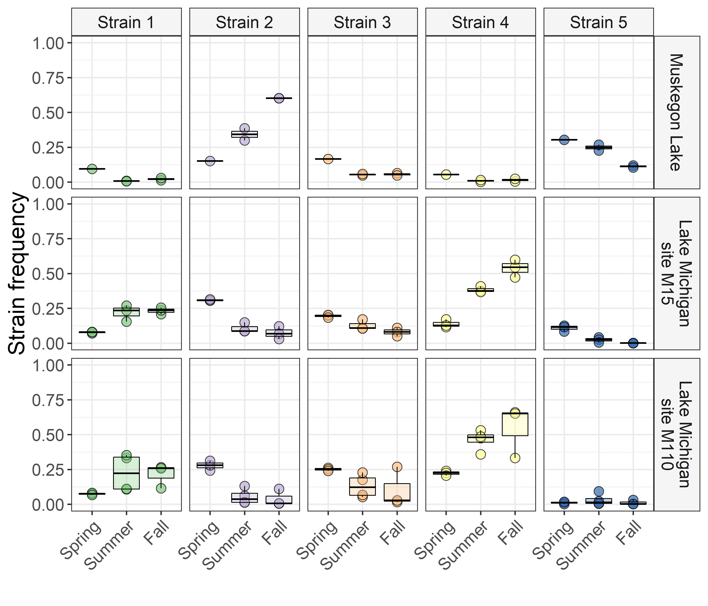


```r
# Make correlation plot of strain variances alone
p.mat_t <- cor.mtest(results_desm[-1],method = "pearson", use="pairwise")
corrplot(cor(results_desm[-1], method = "pearson"), order = "hclust", addrect = 2,
         tl.col="black", tl.srt=45, 
         sig.level = 0.05,
         diag=TRUE)
```


```r
print(cor(results_desm[-1], method = "pearson"))
```

```
##            Strain 1   Strain 2    Strain 3   Strain 4    Strain 5
## Strain 1  1.0000000 -0.8202727 -0.41160714  0.8601689 -0.61595753
## Strain 2 -0.8202727  1.0000000  0.10207177 -0.8626241  0.48346894
## Strain 3 -0.4116071  0.1020718  1.00000000 -0.2628128 -0.06622574
## Strain 4  0.8601689 -0.8626241 -0.26281282  1.0000000 -0.76358889
## Strain 5 -0.6159575  0.4834689 -0.06622574 -0.7635889  1.00000000
```

```r
results_desm$Samples <- gsub(".A", "", results_desm$Samples, fixed = TRUE)
results_desm$Samples <- gsub(".C", "", results_desm$Samples, fixed = TRUE)

# Make correlation plot of strain variances with environmental parameters
results_desm_env <- left_join(results_desm, meta_em, by = c("Samples" = "Sample_ID"))
results_desm_env <- results_desm_env %>% 
  dplyr::select(Samples:`Strain 5`, Temperature..C., `Cond..µS.cm.`,
                                   TP.ug.L, DOC.mg.L, PAR, DO.Probe..mg.L.,
                Chl.Lab..ug.L.) %>% 
  apply(., 2, function(x) as.numeric(as.character(x))) %>% data.frame()

corrplot(cor(results_desm_env[-1], method = "pearson", use="pairwise"), 
          addrect = 2, order = "hclust",
         tl.col="black", tl.srt=45, 
         sig.level = 0.05,
         diag=TRUE)
```


```r
print(cor(results_desm_env[-1], method = "pearson", use="pairwise")[1:5, ])
```

```
##            Strain.1   Strain.2    Strain.3   Strain.4    Strain.5
## Strain.1  1.0000000 -0.8202727 -0.41160715  0.8601689 -0.61595750
## Strain.2 -0.8202727  1.0000000  0.10207178 -0.8626241  0.48346889
## Strain.3 -0.4116071  0.1020718  1.00000000 -0.2628128 -0.06622572
## Strain.4  0.8601689 -0.8626241 -0.26281282  1.0000000 -0.76358887
## Strain.5 -0.6159575  0.4834689 -0.06622572 -0.7635889  1.00000000
##          Temperature..C. Cond..µS.cm.    TP.ug.L    DOC.mg.L         PAR
## Strain.1      0.34481960   -0.4860871 -0.3861337  0.13104041  0.14442728
## Strain.2     -0.07366979    0.5616745  0.6354257  0.13681522 -0.18508745
## Strain.3     -0.90955092   -0.3110741  0.1936932 -0.07672245 -0.36314128
## Strain.4      0.09272609   -0.3154406 -0.5826171 -0.31330645 -0.04343812
## Strain.5      0.25378964    0.4672220  0.7396795  0.30023012  0.20455637
##          DO.Probe..mg.L. Chl.Lab..ug.L.
## Strain.1     -0.03438865    -0.25151040
## Strain.2     -0.06078842     0.38969012
## Strain.3      0.42427714     0.04255277
## Strain.4      0.21315075    -0.40976670
## Strain.5     -0.50569631     0.65365968
```

```r
colnames(results_desm_env)[-1]
```

```
##  [1] "Strain.1"        "Strain.2"        "Strain.3"       
##  [4] "Strain.4"        "Strain.5"        "Temperature..C."
##  [7] "Cond..µS.cm."    "TP.ug.L"         "DOC.mg.L"       
## [10] "PAR"             "DO.Probe..mg.L." "Chl.Lab..ug.L."
```

```r
print(cor.mtest(results_desm_env[-1],method = "pearson", use="pairwise")$p)
```

```
##               [,1]         [,2]         [,3]         [,4]         [,5]
##  [1,] 0.000000e+00 9.239903e-07 4.567366e-02 7.108310e-08 1.352611e-03
##  [2,] 9.239903e-07 0.000000e+00 6.350749e-01 5.920205e-08 1.669098e-02
##  [3,] 4.567366e-02 6.350749e-01 0.000000e+00 2.147037e-01 7.584960e-01
##  [4,] 7.108310e-08 5.920205e-08 2.147037e-01 0.000000e+00 1.417411e-05
##  [5,] 1.352611e-03 1.669098e-02 7.584960e-01 1.417411e-05 0.000000e+00
##  [6,] 1.160468e-01 7.445643e-01 4.534080e-09 6.814959e-01 2.544210e-01
##  [7,] 7.801333e-02 3.659950e-02 2.790026e-01 2.719500e-01 9.209330e-02
##  [8,] 1.551432e-01 1.090805e-02 4.891349e-01 2.265657e-02 1.621215e-03
##  [9,] 6.415704e-01 6.268178e-01 7.858018e-01 2.555027e-01 2.769303e-01
## [10,] 5.935779e-01 4.925486e-01 1.668248e-01 8.730920e-01 4.472885e-01
## [11,] 8.823569e-01 7.935129e-01 5.524854e-02 3.535678e-01 1.935020e-02
## [12,] 3.473915e-01 1.356871e-01 8.756597e-01 1.149672e-01 6.027313e-03
##               [,6]       [,7]         [,8]       [,9]      [,10]
##  [1,] 1.160468e-01 0.07801333 1.551432e-01 0.64157041 0.59357792
##  [2,] 7.445643e-01 0.03659950 1.090805e-02 0.62681784 0.49254864
##  [3,] 4.534080e-09 0.27900255 4.891349e-01 0.78580179 0.16682479
##  [4,] 6.814959e-01 0.27195000 2.265657e-02 0.25550268 0.87309199
##  [5,] 2.544210e-01 0.09209330 1.621215e-03 0.27693035 0.44728845
##  [6,] 0.000000e+00 0.46841256 3.470042e-01 0.42301090 0.02338948
##  [7,] 4.684126e-01 0.00000000 6.918041e-01 0.97959502 0.69252132
##  [8,] 3.470042e-01 0.69180406 0.000000e+00 0.29030153 0.72210624
##  [9,] 4.230109e-01 0.97959502 2.903015e-01 0.00000000 0.14215923
## [10,] 2.338948e-02 0.69252132 7.221062e-01 0.14215923 0.00000000
## [11,] 7.414131e-03 0.01218690 2.385871e-01 0.06807210 0.45911626
## [12,] 6.392885e-01 0.63632415 4.665197e-07 0.08948707 0.87398504
##             [,11]        [,12]
##  [1,] 0.882356890 3.473915e-01
##  [2,] 0.793512882 1.356871e-01
##  [3,] 0.055248542 8.756597e-01
##  [4,] 0.353567755 1.149672e-01
##  [5,] 0.019350202 6.027313e-03
##  [6,] 0.007414131 6.392885e-01
##  [7,] 0.012186900 6.363242e-01
##  [8,] 0.238587083 4.665197e-07
##  [9,] 0.068072096 8.948707e-02
## [10,] 0.459116263 8.739850e-01
## [11,] 0.000000000 6.159640e-01
## [12,] 0.615964034 0.000000e+00
```


```r
desm_p2 <- ggplot(results_desm_long, aes(x = Temperature..C., y = Freq, 
                                         fill = Strain, 
                                         col = Strain))+
  geom_point(color = "black", alpha = 0.7, shape = 21, size = 4, col = "black")+
  scale_fill_brewer("", palette = "Accent")+
  scale_color_brewer("", palette = "Accent")+
  theme_bw()+
  # geom_point(size = 4, color = "black", alpha = 0.7)+
  # scale_shape_manual(values = c(21,24,23))+
  # geom_boxplot(alpha = 0.4)+
  theme(axis.text=element_text(size=12), axis.title=element_text(size=16),
      title=element_text(size=16), legend.text=element_text(size=10),
      legend.background = element_rect(fill="transparent"),
      axis.text.x = element_text(size = 12),
      strip.text=element_text(size=12), legend.position = "bottom",
      strip.background = element_rect(fill = adjustcolor("gray", 0.15)))+
  ylab(paste0("Strain frequency"))+
  guides(fill=FALSE)+
  # facet_grid(Season~Site, scales ="free")+
  xlab("Temperature (°C)")+
  scale_y_continuous(labels=scaleFUN, limits = c(0,1))+
  geom_smooth(se = FALSE)+
  guides(fill=guide_legend(nrow=2))
  # coord_trans(y = "sqrt")

desm_p3 <- results_desm_long %>% mutate(Chl.Lab..ug.L. =
                                          as.numeric(as.character(Chl.Lab..ug.L.))) %>% 
  ggplot(., aes(x = Chl.Lab..ug.L. , y = Freq, 
                                         fill = Strain, 
                                         col = Strain))+
  geom_point(color = "black", alpha = 0.7, shape = 21, size = 4, col = "black")+
  scale_fill_brewer("", palette = "Accent")+
  scale_color_brewer("", palette = "Accent")+
  theme_bw()+
  # geom_point(size = 4, color = "black", alpha = 0.7)+
  # scale_shape_manual(values = c(21,24,23))+
  # geom_boxplot(alpha = 0.4)+
  theme(axis.text=element_text(size=12), axis.title=element_text(size=16),
      title=element_text(size=16), legend.text=element_text(size=10),
      legend.background = element_rect(fill="transparent"),
      axis.text.x = element_text(size = 12),
      strip.text=element_text(size=12), legend.position = "bottom",
      strip.background = element_rect(fill = adjustcolor("gray", 0.15)))+
  ylab(paste0("Strain frequency"))+
  guides(fill=FALSE)+
  # facet_grid(Season~Site, scales ="free")+
  xlab("Chl a concentration (µg/L)")+
  scale_y_continuous(labels=scaleFUN, limits = c(0,1))+
  geom_smooth(se = FALSE, span = 1)+
  guides(fill=guide_legend(nrow=2))
  # coord_trans(y = "sqrt")

desm_p4 <- results_desm_long %>% mutate(TDP.SRP = as.numeric(as.character(TDP.SRP))) %>% 
  ggplot(., aes(x = TDP.SRP, y = Freq, 
                                         fill = Strain, 
                                         col = Strain))+
  geom_point(color = "black", alpha = 0.7, shape = 21, size = 4, col = "black")+
  scale_fill_brewer("", palette = "Accent")+
  scale_color_brewer("",palette = "Accent")+
  theme_bw()+
  # geom_point(size = 4, color = "black", alpha = 0.7)+
  # scale_shape_manual(values = c(21,24,23))+
  # geom_boxplot(alpha = 0.4)+
  theme(axis.text=element_text(size=12), axis.title=element_text(size=16),
      title=element_text(size=16), legend.text=element_text(size=10),
      legend.background = element_rect(fill="transparent"),
      axis.text.x = element_text(size = 12),
      strip.text=element_text(size=12), legend.position = "bottom",
      strip.background = element_rect(fill = adjustcolor("gray", 0.15)))+
  ylab(paste0("Strain frequency"))+
  guides(fill=FALSE)+
  # facet_grid(Season~Site, scales ="free")+
  xlab("Soluble Reactive Phosphorus (SRP - µg/L)")+
  scale_y_continuous(labels=scaleFUN, limits = c(0,1))+
  geom_smooth(se = FALSE, span = 0.75)+
  guides(fill=guide_legend(nrow=2))
  # coord_trans(y = "sqrt")

desm_p5 <- results_desm_long %>% mutate(PON.mg.L = as.numeric(as.character(PON.mg.L))) %>% 
  ggplot(., aes(x = PON.mg.L, y = Freq, 
                                         fill = Strain, 
                                         col = Strain))+
  geom_point(color = "black", alpha = 0.7, shape = 21, size = 4, col = "black")+
  scale_fill_brewer("", palette = "Accent")+
  scale_color_brewer("",palette = "Accent")+
  theme_bw()+
  # geom_point(size = 4, color = "black", alpha = 0.7)+
  # scale_shape_manual(values = c(21,24,23))+
  # geom_boxplot(alpha = 0.4)+
  theme(axis.text=element_text(size=12), axis.title=element_text(size=16),
      title=element_text(size=16), legend.text=element_text(size=10),
      legend.background = element_rect(fill="transparent"),
      axis.text.x = element_text(size = 12),
      strip.text=element_text(size=12), legend.position = "bottom",
      strip.background = element_rect(fill = adjustcolor("gray", 0.15)))+
  ylab(paste0("Strain frequency"))+
  guides(fill=FALSE)+
  # facet_grid(Season~Site, scales ="free")+
  xlab("Particulate Organic Nitrogen (PON - mg/L)")+
  scale_y_continuous(labels=scaleFUN, limits = c(0,1))+
  geom_smooth(se = FALSE, span = 0.75)+
  guides(fill=guide_legend(nrow=2))
  # coord_trans(y = "sqrt")

desm_p6 <- results_desm_long %>% mutate(POC.mg.L = as.numeric(as.character(POC.mg.L))) %>%
  ggplot(., aes(x = POC.mg.L, y = Freq, 
                                         fill = Strain, 
                                         col = Strain))+
  geom_point(color = "black", alpha = 0.7, shape = 21, size = 4, col = "black")+
  scale_fill_brewer("", palette = "Accent")+
  scale_color_brewer("",palette = "Accent")+
  theme_bw()+
  # geom_point(size = 4, color = "black", alpha = 0.7)+
  # scale_shape_manual(values = c(21,24,23))+
  # geom_boxplot(alpha = 0.4)+
  theme(axis.text=element_text(size=12), axis.title=element_text(size=16),
      title=element_text(size=16), legend.text=element_text(size=10),
      legend.background = element_rect(fill="transparent"),
      axis.text.x = element_text(size = 12),
      strip.text=element_text(size=12), legend.position = "bottom",
      strip.background = element_rect(fill = adjustcolor("gray", 0.15)))+
  ylab(paste0("Strain frequency"))+
  guides(fill=FALSE)+
  # facet_grid(Season~Site, scales ="free")+
  xlab("Particulate Organic Carbon (POC - mg/L)")+
  scale_y_continuous(labels=scaleFUN, limits = c(0,1))+
  geom_smooth(se = FALSE, span = 0.75)+
  guides(fill=guide_legend(nrow=2))
  # coord_trans(y = "sqrt")

# Combine all exploratory plots
cowplot::plot_grid(desm_p3, desm_p4, desm_p5, desm_p6, ncol = 2, align = 'hv')
```

```
## `geom_smooth()` using method = 'loess'
## `geom_smooth()` using method = 'loess'
## `geom_smooth()` using method = 'loess'
## `geom_smooth()` using method = 'loess'
```


## Ordination plots 


```r
# Make PCoA
variants <- results_desm[,2:ncol(results_desm)]
rownames(variants) <- results_desm[, 1]
taxa <- as.matrix(data.frame(variant_name = colnames(results_desm)[2:ncol(results_desm)]))
rownames(taxa) <- colnames(results_desm)[2:ncol(results_desm)]

# Store as phyloseq object
physeq_desm <- phyloseq(otu_table(variants, taxa_are_rows = FALSE),
         tax_table(taxa)
)

# Run beta diversity analysis on 16s data
pcoa <- ordinate(
  physeq = physeq_desm, 
  method = "PCoA", 
  distance = "bray",
  correction = "lingoes",
  k=2
)
pcoa.df <- data.frame(Samples = sample_names(physeq_desm), pcoa$vectors)
var <- round(pcoa$values$Eigenvalues/sum(pcoa$values$Eigenvalues)*100,1)

# Add metadata
pcoa.df$Samples <- gsub(".A", "", pcoa.df$Samples, fixed = TRUE)
pcoa.df$Samples <- gsub(".C", "", pcoa.df$Samples, fixed = TRUE)
pcoa.df <- dplyr::left_join(pcoa.df, meta_em, by = c("Samples" = "Sample_ID"))

# Run permanova
x <- results_desm[,2:ncol(results_desm)]
rownames(x) <- results_desm[, 1]
dist_desm <- vegan::vegdist(x)
perm <- permute::how(nperm = 999)
permanova_desm <- vegan::adonis(dist_desm ~ Season * Site, 
                        data = meta_em, 
                        permutations = perm)

# Plot PCoA
my_grob = grobTree(textGrob(bquote(paste(r[Season]^2 == 
    .(round(100 * permanova_desm$aov.tab[1, 5], 1)), 
    "%")), x = 0.7, y = 0.95, hjust = 0, gp = gpar(col = "black", 
    fontsize = 14, fontface = "italic")))
my_grob2 = grobTree(textGrob(bquote(paste(r[Site]^2 == 
    .(format(round(100 * permanova_desm$aov.tab[2, 5], 
        1), nsmall = 1)), "%")), x = 0.7, y = 0.87, 
    hjust = 0, gp = gpar(col = "black", fontsize = 14, 
        fontface = "italic")))
my_grob3 = grobTree(textGrob(bquote(paste(r[Season:Site]^2 == 
    .(round(100 * permanova_desm$aov.tab[3, 5], 1)), 
    "%")), x = 0.7, y = 0.79, hjust = 0, gp = gpar(col = "black", 
    fontsize = 14, fontface = "italic")))

pcoa.ord <- ggplot(data=pcoa.df, aes(x=Axis.1, y=Axis.2, shape = Site))+
  scale_shape_manual(values=c(21,23, 24))+
  geom_point(size=7, alpha=0.7, aes(fill = Season))+
  theme_bw()+
  scale_fill_brewer(palette = "Accent")+
  labs(x = paste0("PCoA axis 1 (",var[1], "%)"),
       y = paste0("PCoA axis 2 (",var[2], "%)"), fill="", shape = "", colour="")+
  theme(axis.text=element_text(size=14), axis.title=element_text(size=16),
        title=element_text(size=16), legend.text=element_text(size=16))+ 
  guides(fill = guide_legend(override.aes = list(shape = 22)))+
  annotation_custom(my_grob)+
  annotation_custom(my_grob2)+
  annotation_custom(my_grob3)+
  ggtitle("PCoA of resolved MAG8 variant composition")

print(pcoa.ord)
```

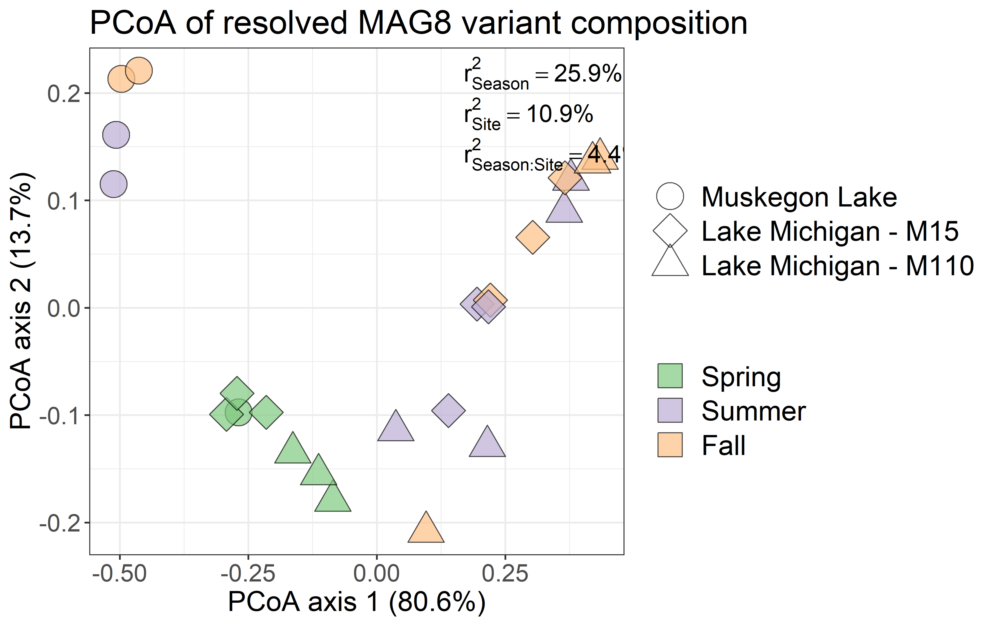

## Gene assignment  

Whip out multivariate abundance testing for hypopthesis test on environmental variables?  


```r
# Import etaS.csv which contains gene assignment
geneAssign_df <- read.csv("./DESMAN/MAG8_scg_10_9/MAG8.SU-M110-DCMDetaS_df.csv",
                         header = TRUE)
colnames(geneAssign_df) <- gsub("X", "Variant", colnames(geneAssign_df))
geneAssign_df <- geneAssign_df[, c(1,6,8,9,10,11)]
colnames(geneAssign_df) <- c("Gene", "Strain 1", "Strain 2", "Strain 3", "Strain 4",
                            "Strain 5")
# Wide to long format
geneAssign_df <- tidyr::gather(geneAssign_df, Variant, Presence, 
                             `Strain 1`:`Strain 5`, factor_key=TRUE)

# Import blast results
blast_desman <- read.delim("./DESMAN/MAG8_scg_10_9/desman2img_genes.blast", 
                         header = FALSE)
colnames(blast_desman) <- c("qseqid", "sseqid", "pident", "length", "mismatch",
                          "gapopen", "qstart", "qend", "sstart", "send", 
                          "evalue", "bitscore")
blast_desman_sb <- blast_desman %>% dplyr::select("qseqid", "sseqid") %>%  distinct()

# Merge IMG gene IDs with 
geneAssign_df <- left_join(geneAssign_df, blast_desman_sb, by = c("Gene" = "qseqid"))
geneAssign_df$sseqid <- as.character(geneAssign_df$sseqid)

# Merge with functional annotation (KO & COG)
geneAssign_df_annot <- left_join(geneAssign_df, merged_file_annot, 
                           by = c("sseqid" = "gene_oid"))

# Merge with metaT data
geneAssign_df_annot <- left_join(geneAssign_df, expr_cov_long, 
                           by = c("sseqid" = "gene_oid"))
```

### **upset diagram**  


```r
# Long to wide
geneAssign_df_wide <- tidyr::spread(geneAssign_df, Variant, Presence)

# Plot
upset(geneAssign_df_wide, sets = c("Strain 1", "Strain 2", "Strain 3", "Strain 4",
                                   "Strain 5"), mb.ratio = c(0.6, 0.45), 
      order.by = "freq", point.size = 3.5,
      mainbar.y.label = "Gene intersections", sets.x.label = "Number of genes",
      text.scale = c(1.5, 1.5, 1.5, 1.4, 2, 1.5),
      scale.intersections = "log2",
      keep.order = FALSE,
      line.size = 1.5)
```

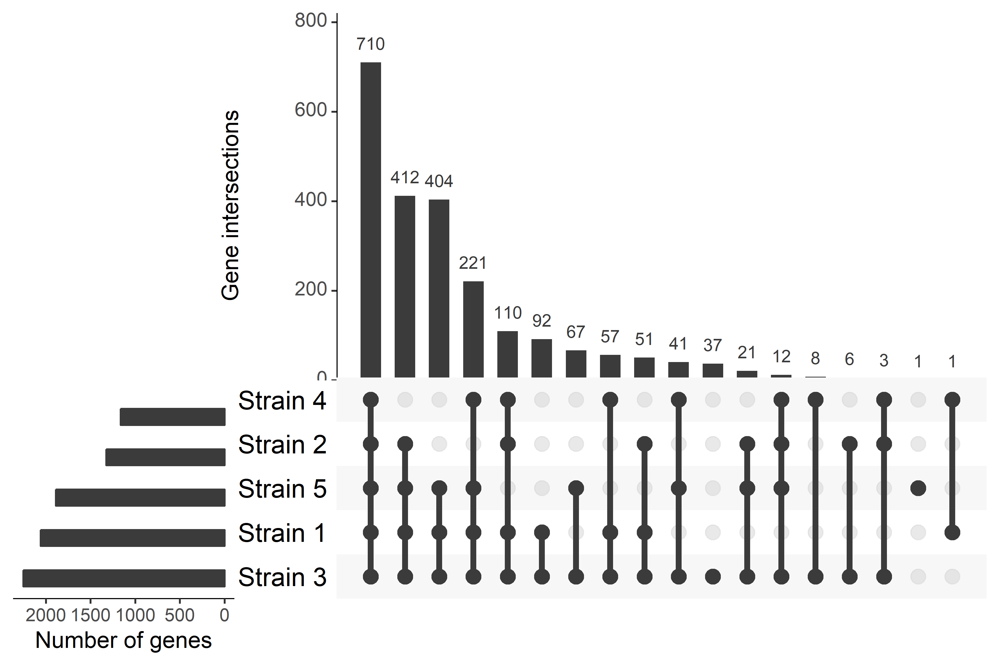

```r
upset(geneAssign_df_wide, sets = c("Strain 1", "Strain 4"), mb.ratio = c(0.6, 0.45), 
      order.by = "freq", point.size = 3.5,
      mainbar.y.label = "Gene intersections", sets.x.label = "Number of genes",
      text.scale = c(1.5, 1.5, 1.5, 1.4, 2, 2),
      scale.intersections = "log2",
      keep.order = FALSE,
      line.size = 1.5)
```


```r
upset(geneAssign_df_wide, sets = c("Strain 2", "Strain 5"), mb.ratio = c(0.6, 0.45), 
      order.by = "freq", point.size = 3.5,
      mainbar.y.label = "Gene intersections", sets.x.label = "Number of genes",
      text.scale = c(1.5, 1.5, 1.5, 1.4, 2, 2),
      scale.intersections = "log2",
      keep.order = FALSE,
      line.size = 1.5)
```


```r
# Indicate site and season-specific differential abundant genes
geneAssign_df_wide <- left_join(geneAssign_df_wide, res_deseq, 
                                by = c("sseqid" = "gene_oid"))
```

#### **Site downregulation**


```r
# Make upset plot for site-specific downregulation controlled for seasons
geneAssign_df_wide %>% dplyr::filter(regulation == "downregulation",
                                     Design == "~ Season + Site") %>% 
  upset(., sets = c("Strain 1", "Strain 2", "Strain 3", "Strain 4",
                                   "Strain 5"), mb.ratio = c(0.55, 0.45), 
      order.by = "freq", number.angles = 30, point.size = 3.5,
      mainbar.y.label = "Gene intersections", sets.x.label = "Number of genes",
      text.scale = c(1.5, 1.5, 1.5, 1.4, 2, 0.75),
      show.numbers = FALSE,
      scale.intersections = "log2",
      keep.order = FALSE,
      boxplot.summary = "log2FoldChange",
      line.size = NA)
```


#### **Site upregulation**


```r
# Make upset plot for site-specific upregulation controlled for seasons
geneAssign_df_wide %>% dplyr::filter(regulation == "upregulation",
                                     Design == "~ Season + Site") %>% 
  upset(., sets = c("Strain 1", "Strain 2", "Strain 3", "Strain 4",
                                   "Strain 5"), mb.ratio = c(0.55, 0.45), 
      order.by = "freq", number.angles = 30, point.size = 3.5, 
      mainbar.y.label = "Gene intersections", sets.x.label = "Number of genes",
      text.scale = c(1.5, 1.5, 1.5, 1.4, 2, 0.75),
      show.numbers = FALSE,
      scale.intersections = "log2",
      keep.order = FALSE,
      boxplot.summary = "log2FoldChange",
      line.size = NA)
```


#### **Seasonal downregulation**


```r
# Make upset plot for seasonal downregulation controlled for site
geneAssign_df_wide %>% dplyr::filter(regulation == "downregulation",
                                     Design == "~ Site + Season") %>% 
  upset(., sets = c("Strain 1", "Strain 2", "Strain 3", "Strain 4",
                                   "Strain 5"), mb.ratio = c(0.55, 0.45), 
      order.by = "freq", number.angles = 30, point.size = 3.5, 
      mainbar.y.label = "Gene intersections", sets.x.label = "Number of genes",
      text.scale = c(1.5, 1.5, 1.5, 1.4, 2, 0.75),
      show.numbers = FALSE,
      scale.intersections = "log2",
      keep.order = FALSE,
      boxplot.summary = "log2FoldChange",
      line.size = NA)
```


#### **Depth downregulation**  


```r
# Make upset plot for depth-specific downregulation controlled for seasons
geneAssign_df_wide %>% dplyr::filter(regulation == "downregulation",
                                     Design == "~ Site + Depth") %>% 
  upset(., sets = c("Strain 1", "Strain 2", "Strain 3", "Strain 4",
                                   "Strain 5"), mb.ratio = c(0.55, 0.45), 
      order.by = "freq", number.angles = 30, point.size = 3.5,
      mainbar.y.label = "Gene intersections", sets.x.label = "Number of genes",
      text.scale = c(1.5, 1.5, 1.5, 1.4, 2, 0.75),
      show.numbers = FALSE,
      scale.intersections = "log2",
      keep.order = FALSE,
      boxplot.summary = "log2FoldChange",
      line.size = NA)
```


#### **Depth upregulation** 


```r
# Make upset plot for depth-specific upregulation controlled for sites
geneAssign_df_wide %>% dplyr::filter(regulation == "upregulation",
                                     Design == "~ Site + Depth") %>% 
  upset(., sets = c("Strain 1", "Strain 2", "Strain 3", "Strain 4",
                                   "Strain 5"), mb.ratio = c(0.55, 0.45), 
      order.by = "freq", number.angles = 30, point.size = 3.5, 
      mainbar.y.label = "Gene intersections", sets.x.label = "Number of genes",
      text.scale = c(1.5, 1.5, 1.5, 1.4, 2, 0.75),
      show.numbers = FALSE,
      scale.intersections = "log2",
      keep.order = FALSE,
      boxplot.summary = "log2FoldChange",
      line.size = NA)
```


### Transcript assignment


```r
# Extract upregulated genes of depth comparison
geneAssign_df_wide_transcripts_depth <- geneAssign_df_wide %>% 
  dplyr::filter(sseqid %in% unique(MAG8_deseq_results_depth_fin$gene_oid)) %>% 
  dplyr::select(sseqid:`Strain 5`)

geneAssign_df_wide_transcripts_depth <- MAG8_deseq_results_depth_fin %>% 
  dplyr::select(log2FoldChange, gene_oid, regulation) %>% 
  left_join(geneAssign_df_wide_transcripts_depth, ., by = c("sseqid" = "gene_oid"))

# Extract upregulated genes of surface comparison
geneAssign_df_wide_transcripts_temp <- geneAssign_df_wide %>% 
  dplyr::filter(sseqid %in% unique(MAG8_deseq_results_temp_fin$gene_oid)) %>% 
  dplyr::select(sseqid:`Strain 5`)

geneAssign_df_wide_transcripts_temp <- MAG8_deseq_results_temp_fin %>% 
  dplyr::select(log2FoldChange, gene_oid, regulation) %>% 
  left_join(geneAssign_df_wide_transcripts_temp, ., by = c("sseqid" = "gene_oid"))

# Add functional annotation of genes


# Evaluate distribution of transcripts expression over strains
# Plot upregulated genes
geneAssign_df_wide_transcripts_depth %>% dplyr::filter(regulation == "Upregulated") %>% 
  upset(., 
      sets = c("Strain 1", "Strain 2", "Strain 3", "Strain 4",
                                   "Strain 5"), mb.ratio = c(0.55, 0.45), 
      order.by = "freq", number.angles = 30, point.size = 3.5,
      mainbar.y.label = "Gene intersections", sets.x.label = "Number of genes",
      text.scale = c(1.5, 1.5, 1.5, 1.4, 2, 0.75),
      show.numbers = FALSE,
      scale.intersections = "log2",
      keep.order = FALSE,
      line.size = 1.2,
      boxplot.summary = "log2FoldChange")
```


```r
geneAssign_df_wide_transcripts_temp %>% dplyr::filter(regulation == "Upregulated") %>%
  upset(., 
      sets = c("Strain 1", "Strain 2", "Strain 3", "Strain 4",
                                   "Strain 5"), mb.ratio = c(0.55, 0.45), 
      order.by = "freq", number.angles = 30, point.size = 3.5,
      mainbar.y.label = "Gene intersections", sets.x.label = "Number of genes",
      text.scale = c(1.5, 1.5, 1.5, 1.4, 2, 0.75),
      show.numbers = FALSE,
      scale.intersections = "log2",
      keep.order = FALSE,
      line.size = 1.2,
      boxplot.summary = "log2FoldChange")
```


```r
# Evaluate distribution of transcripts expression over strains
# Plot down regulated genes
geneAssign_df_wide_transcripts_depth %>% dplyr::filter(regulation == "Downregulated") %>% 
  upset(., 
      sets = c("Strain 1", "Strain 2", "Strain 3", "Strain 4",
                                   "Strain 5"), mb.ratio = c(0.55, 0.45), 
      order.by = "freq", number.angles = 30, point.size = 3.5,
      mainbar.y.label = "Gene intersections", sets.x.label = "Number of genes",
      text.scale = c(1.5, 1.5, 1.5, 1.4, 2, 0.75),
      show.numbers = FALSE,
      scale.intersections = "log2",
      keep.order = FALSE,
      line.size = 1.2,
      boxplot.summary = "log2FoldChange")
```


```r
geneAssign_df_wide_transcripts_temp %>% dplyr::filter(regulation == "Downregulated") %>%
  upset(., 
      sets = c("Strain 1", "Strain 2", "Strain 3", "Strain 4",
                                   "Strain 5"), mb.ratio = c(0.55, 0.45), 
      order.by = "freq", number.angles = 30, point.size = 3.5,
      mainbar.y.label = "Gene intersections", sets.x.label = "Number of genes",
      text.scale = c(1.5, 1.5, 1.5, 1.4, 2, 0.75),
      show.numbers = FALSE,
      scale.intersections = "log2",
      keep.order = FALSE,
      line.size = 1.2,
      boxplot.summary = "log2FoldChange")
```


### Abundance of variants


```r
# Evaluate abundance of variants in the samples used to infer phenotypic plasticity
p_strain_pheno <- results_desm_long %>% 
  dplyr::filter(Site == "Lake Michigan\nsite M110" & Depth != "Mid") %>% 
  ggplot(aes(x = Strain, y = Freq, fill = Depth))+
  geom_point(size = 4, shape = 21)+
  facet_grid(Season~Time)+
  scale_fill_brewer("", palette = "Accent")+
  theme_bw()+
  theme(axis.text=element_text(size=12), axis.title=element_text(size=16),
        title=element_text(size=16), legend.text=element_text(size=16),
        strip.text = element_text(size = 16))+
  ylab("Strain frequency")
  
print(p_strain_pheno)
```


# 9. iRep analysis

```r
# Import data
irep_files <- list.files("./iRep/results", pattern = "irep_")
irep_sample_order <- read.table("./iRep/results/sample_order.tsv")
for(file in irep_files){
  # print(file)
  file_tmp <- read.table(paste("./iRep/results/", file, sep = ""),
                         stringsAsFactors = FALSE)
  bin_name <- gsub("irep_results_|.tsv", "", file)
  # print(bin_name)
  file_tmp <- data.frame(Genome_bin = bin_name, iRep_value = file_tmp[,2],
                         iRep_type = rep(c("iRep_filtered","iRep_unfiltered"), 24),
                         Sample = rep(irep_sample_order$V1, each = 2))
  if(file == irep_files[1]) results_irep <- file_tmp else{
    results_irep <- rbind(results_irep, file_tmp)
  }
}

# Rename sample names
results_irep$Sample <- gsub(".A", "", results_irep$Sample, fixed = TRUE)
results_irep$Sample <- gsub(".C", "", results_irep$Sample, fixed = TRUE)

# Rename genome bins
results_irep <- dplyr::left_join(results_irep, new_bin_names, by = c("Genome_bin" = "bins"))
results_irep$new_bin_name <- as.character(results_irep$new_bin_name)
results_irep$new_bin_name <- factor(results_irep$new_bin_name, levels =
                                      c("MAG1.FA-MLB-DN","MAG2.FA-MLB-SN",
                                        "MAG3.FA-MLB-SN", "MAG4.FA-M110-DN",
                                        "MAG5.SP-M110-DD","MAG6.SP-M15-SD",
                                        "MAG7.SU-MLB-SD","MAG8.SU-M110-DCMD",
                                        "MAG9.SU-M15-SN","MAG10.SU-M15-SN"))

# Merge with metadata
results_irep <- dplyr::left_join(results_irep, meta, by = "Sample")
results_irep$iRep_value <- as.numeric(as.character(results_irep$iRep_value))

# Format metadata
results_irep$Site <- as.character(results_irep$Site)
results_irep$Site <- gsub("110", "Lake Michigan\nsite M110", results_irep$Site)
results_irep$Site <- gsub("15", "Lake Michigan\nsite M15", results_irep$Site)
results_irep$Site <- gsub("Buoy", "Muskegon Lake", results_irep$Site)
results_irep$Site <- factor(results_irep$Site, levels = c("Muskegon Lake",
                                                            "Lake Michigan\nsite M15",
                                                            "Lake Michigan\nsite M110"))
results_irep$Season <- as.character(results_irep$Season)
results_irep$Season <- factor(results_irep$Season, levels = c("Spring", "Summer","Fall"))
```

## Plot results  


```r
# Plot unfiltered iRep
irep_p1 <- results_irep %>% 
  dplyr::filter(iRep_type == "iRep_unfiltered") %>% 
  ggplot(aes(x = new_bin_name, y = iRep_value, fill = new_bin_name, col = new_bin_name))+
  geom_point(color = "black", alpha = 0.7, size = 4, shape = 21)+
  # scale_shape_manual(values = c(21,22,23))+
  geom_boxplot(alpha = 0.3, col = "black", outlier.shape = NA, size = 0.3)+
  scale_fill_manual("", values = fill_palette)+
  scale_color_brewer("",palette = "Accent")+
  theme_bw()+
  # geom_point(size = 4, color = "black", alpha = 0.7)+
  # scale_shape_manual(values = c(21,24,23))+
  # geom_boxplot(alpha = 0.4)+
  theme(axis.text=element_text(size=12), axis.title=element_text(size=16),
      title=element_text(size=16), legend.text=element_text(size=10),
      legend.background = element_rect(fill="transparent"),
      axis.text.x = element_text(size = 12, angle = 45, hjust = 1),
      strip.text=element_text(size=12), legend.position = "bottom",
      strip.background = element_rect(fill = adjustcolor("gray", 0.15)))+
  ylab(paste0("iRep"))+
  guides(fill=FALSE)+
  facet_grid(Season~Site, scales ="free")+
  xlab("")+
  scale_y_continuous(labels=scaleFUN, limits = c(1,4.5))+
  # geom_smooth(se = FALSE)+
  guides(fill=FALSE)
  # coord_trans(y = "sqrt")

print(irep_p1)
```


```r
# Plot filtered irep
irep_p2 <- results_irep %>% 
  dplyr::filter(iRep_type == "iRep_filtered") %>% 
  ggplot(aes(x = new_bin_name, y = iRep_value, fill = new_bin_name, col = new_bin_name))+
  geom_point(color = "black", alpha = 0.7, size = 4, shape = 21)+
  # scale_shape_manual(values = c(21,22,23))+
  geom_boxplot(alpha = 0.3, col = "black", outlier.shape = NA, size = 0.3)+
  scale_fill_manual("", values = fill_palette)+
  scale_color_brewer("",palette = "Accent")+
  theme_bw()+
  # geom_point(size = 4, color = "black", alpha = 0.7)+
  # scale_shape_manual(values = c(21,24,23))+
  # geom_boxplot(alpha = 0.4)+
  theme(axis.text=element_text(size=12), axis.title=element_text(size=16),
      title=element_text(size=16), legend.text=element_text(size=10),
      legend.background = element_rect(fill="transparent"),
      axis.text.x = element_text(size = 12, angle = 45, hjust = 1),
      strip.text=element_text(size=12), legend.position = "bottom",
      strip.background = element_rect(fill = adjustcolor("gray", 0.15)))+
  ylab(paste0("iRep"))+
  guides(fill=FALSE)+
  facet_grid(Season~Site, scales ="free")+
  xlab("")+
  scale_y_continuous(labels=scaleFUN, limits = c(1,4.5))+
  # geom_smooth(se = FALSE)+
  guides(fill=FALSE)
  # coord_trans(y = "sqrt")

print(irep_p2)
```

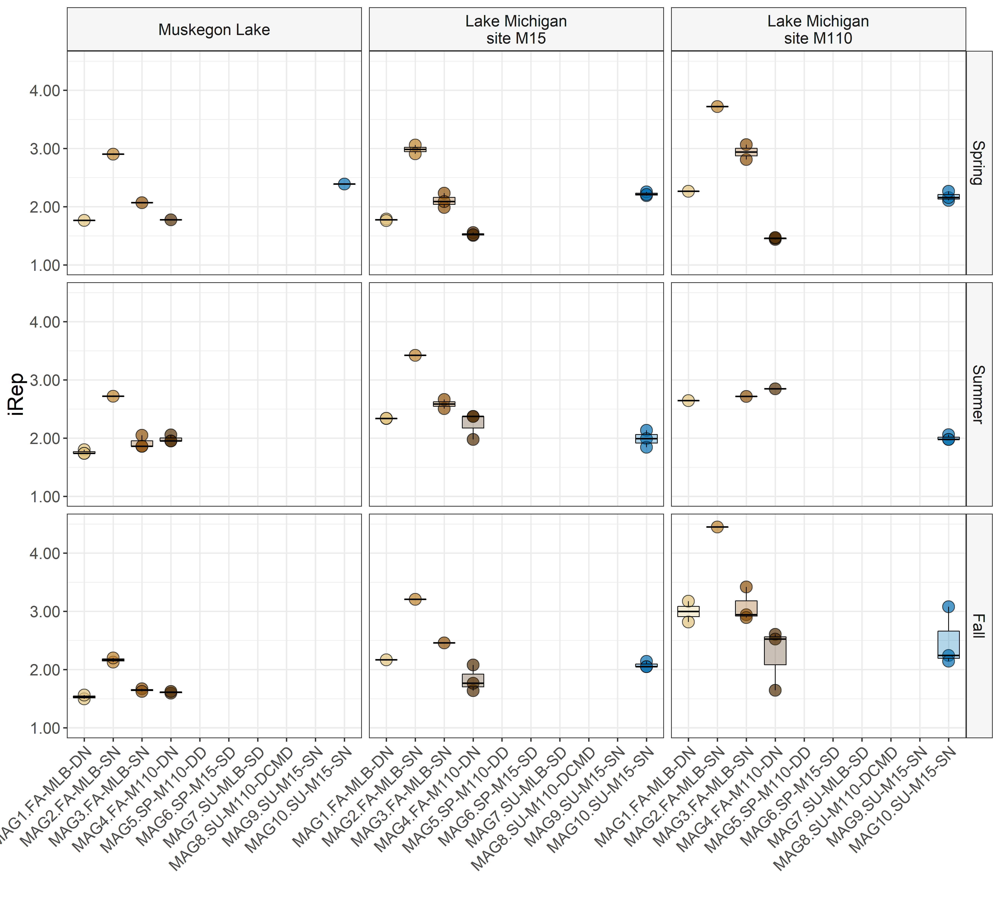


```r
# Only focus on MAGs for which we can determine accurate iRep values 
irep_p3 <- results_irep %>% 
  dplyr::filter(iRep_type == "iRep_filtered") %>% 
  dplyr::filter(!is.na(iRep_value)) %>% 
  ggplot(aes(x = Season, y = iRep_value, fill = new_bin_name, col = new_bin_name))+
  geom_point(color = "black", alpha = 0.7, size = 4, shape = 21)+
  # scale_shape_manual(values = c(21,22,23))+
  geom_boxplot(alpha = 0.3, col = "black", outlier.shape = NA, size = 0.3)+
  scale_fill_manual("", values = fill_palette)+
  scale_color_brewer("",palette = "Accent")+
  theme_bw()+
  # geom_point(size = 4, color = "black", alpha = 0.7)+
  # scale_shape_manual(values = c(21,24,23))+
  # geom_boxplot(alpha = 0.4)+
  theme(axis.text=element_text(size=12), axis.title=element_text(size=16),
      title=element_text(size=16), legend.text=element_text(size=10),
      legend.background = element_rect(fill="transparent"),
      axis.text.x = element_text(size = 12, angle = 45, hjust = 1),
      strip.text=element_text(size=12), legend.position = "bottom",
      strip.background = element_rect(fill = adjustcolor("gray", 0.15)))+
  ylab(paste0("iRep"))+
  guides(fill=FALSE)+
  facet_grid(new_bin_name~Site, scales ="free")+
  xlab("")+
  scale_y_continuous(labels=scaleFUN, limits = c(1,4.5))+
  # geom_smooth(se = FALSE)+
  guides(fill=FALSE)
  # coord_trans(y = "sqrt")

print(irep_p3)
```


```r
# Only focus on MAGs for which we can determine accurate iRep values 
irep_p4 <- results_irep %>% 
  dplyr::filter(iRep_type == "iRep_filtered") %>% 
  dplyr::filter(!is.na(iRep_value)) %>% 
  ggplot(aes(x = new_bin_name, y = iRep_value, fill = Site, col = Site))+
  # geom_point(color = "black", alpha = 0.7, size = 4, shape = 21)+
  # scale_shape_manual(values = c(21,22,23))+
  geom_boxplot(alpha = 0.3, col = "black", outlier.shape = NA, size = 0.3)+
  scale_fill_brewer("", palette = "Accent")+
  scale_color_brewer("",palette = "Accent")+
  theme_bw()+
  # geom_point(size = 4, color = "black", alpha = 0.7)+
  # scale_shape_manual(values = c(21,24,23))+
  # geom_boxplot(alpha = 0.4)+
  theme(axis.text=element_text(size=12), axis.title=element_text(size=16),
      title=element_text(size=16), legend.text=element_text(size=10),
      legend.background = element_rect(fill="transparent"),
      axis.text.x = element_text(size = 12, angle = 45, hjust = 1),
      strip.text=element_text(size=12), legend.position = "bottom",
      strip.background = element_rect(fill = adjustcolor("gray", 0.15)))+
  ylab(paste0("iRep"))+
  # facet_grid(new_bin_name~Site, scales ="free")+
  xlab("")+
  scale_y_continuous(labels=scaleFUN, limits = c(1,4.5))
  # geom_smooth(se = FALSE)+
  # guides(fill=FALSE)
  # coord_trans(y = "sqrt")

print(irep_p4)
```


```r
# Focus on all MAGs
irep_p5 <- results_irep %>% 
  dplyr::filter(iRep_type == "iRep_unfiltered") %>% 
  dplyr::filter(!is.na(iRep_value)) %>% 
  ggplot(aes(x = new_bin_name, y = iRep_value, fill = Site, col = Site))+
  # geom_point(color = "black", alpha = 0.7, size = 4, shape = 21)+
  # scale_shape_manual(values = c(21,22,23))+
  geom_boxplot(alpha = 0.3, col = "black", outlier.shape = NA, size = 0.3)+
  scale_fill_brewer("", palette = "Accent")+
  scale_color_brewer("",palette = "Accent")+
  theme_bw()+
  # geom_point(size = 4, color = "black", alpha = 0.7)+
  # scale_shape_manual(values = c(21,24,23))+
  # geom_boxplot(alpha = 0.4)+
  theme(axis.text=element_text(size=12), axis.title=element_text(size=16),
      title=element_text(size=16), legend.text=element_text(size=10),
      legend.background = element_rect(fill="transparent"),
      axis.text.x = element_text(size = 12, angle = 45, hjust = 1),
      strip.text=element_text(size=12), legend.position = "bottom",
      strip.background = element_rect(fill = adjustcolor("gray", 0.15)))+
  ylab(paste0("iRep"))+
  # facet_grid(new_bin_name~Site, scales ="free")+
  xlab("")+
  scale_y_continuous(labels=scaleFUN, limits = c(1,4.5))
  # geom_smooth(se = FALSE)+
  # guides(fill=FALSE)
  # coord_trans(y = "sqrt")

print(irep_p5)
```


## Abundances  


```r
# Merge irep results with abundance estimates

# Correlate abundances with iRep estimates

# Plot
```


# Pangenome analysis  


<!-- # Phenotypic diversity -->

<!-- ```{r PhenoD-1, dpi = 500, warning = FALSE, fig.width = 10, fig.height = 10, include = FALSE} -->
<!-- expr_cov_pd <- expr_cov_long %>% dplyr::select(c("gene_oid", "Sample", -->
<!--                                                  "mapped_reads", "Genome_ID")) -->
<!-- expr_cov_pd <- tidyr::spread(expr_cov_pd, Genome_ID, mapped_reads) -->

<!-- # Loop through all samples and calculate diversity for each sample -->
<!-- for(i in 1:length(unique(expr_cov_pd$Sample))){ -->
<!--   phy_tmp <- expr_cov_pd %>% dplyr::filter(Sample == unique(expr_cov_pd$Sample)[i]) -->
<!--   phy_tmp[is.na(phy_tmp)] <- 0   -->
<!--   phylo_expr_cov_pd <- phyloseq::phyloseq(phyloseq::otu_table(phy_tmp[ ,-c(1,2)], taxa_are_rows = TRUE),  -->
<!--                                          as.matrix(phyloseq::tax_table(phy_tmp[,1]))) -->
<!--   pd_tmp <- Phenoflow::Diversity_16S(phylo_expr_cov_pd, R = 10, brea = FALSE) -->
<!--   pd_tmp <- data.frame(Sample = unique(expr_cov_pd$Sample)[i], Genome_ID = sample_names(phylo_expr_cov_pd), -->
<!--                        pd_tmp) -->
<!--   if(i == 1) results_pd <- pd_tmp else results_pd <- rbind(results_pd, pd_tmp) -->
<!-- } -->

<!-- # Merge with metadata -->
<!-- meta_metaT2 <- distinct(meta[, 2:nrow(meta)]) -->
<!-- meta_metaT2$Sample_ID <- gsub("_",".", meta_metaT2$Sample_ID) -->
<!-- results_pd <- left_join(results_pd, meta_metaT2, by = c("Sample" = "Sample_ID")) -->

<!-- new_bin_names2 <- read.table("./anvio_output/rebin/general_bins_summary_selected_final.tsv", header = TRUE)[, c(3,8:10)]; new_bin_names2$IMG_taxID <- as.character(new_bin_names2$IMG_taxID) -->
<!-- results_pd <- left_join(results_pd, new_bin_names2, by = c("Genome_ID" = "IMG_taxID")) -->
<!-- results_pd$new_bin_name <- as.character(results_pd$new_bin_name) -->
<!-- results_pd$new_bin_name <- factor(results_pd$new_bin_name, levels = -->
<!--                                       c("MAG1.FA-MLB-DN","MAG2.FA-MLB-SN", -->
<!--                                         "MAG3.FA-MLB-SN", "MAG4.FA-M110-DN", -->
<!--                                         "MAG5.SP-M110-DD", "MAG6.SP-M15-SD", -->
<!--                                         "MAG7.SU-MLB-SD", "MAG8.SU-M110-DCMD", -->
<!--                                         "MAG9.SU-M15-SN", "MAG10.SU-M15-SN")) -->
<!-- ``` -->

<!-- ### Plot phenoD -->

<!-- ```{r PhenoD-2, dpi = 500, warning = FALSE, fig.width = 10, fig.height = 10} -->
<!-- # Plot results -->
<!-- p_MAG_Pdiv <- ggplot(results_pd, aes(x = new_bin_name, y = D2))+ -->
<!--   theme_bw()+ -->
<!--   scale_fill_brewer(palette = "Accent")+ -->
<!--   geom_point(size = 4, color = "black", alpha = 0.7, aes(fill = Season,  -->
<!--                                                          shape = Depth))+ -->
<!--   scale_shape_manual(values = c(21,24,23))+ -->
<!--   geom_boxplot(alpha = 0.4, width = 0.2, fill = "lightgray")+ -->
<!--   theme(axis.text=element_text(size=14), axis.title=element_text(size=20), -->
<!--       title=element_text(size=20), legend.text=element_text(size=12), -->
<!--       legend.background = element_rect(fill="transparent"), -->
<!--       axis.text.x = element_text(size = 14, angle = 45, hjust = 1), -->
<!--       strip.text=element_text(size=14), legend.position = "bottom", -->
<!--       strip.background = element_rect(fill = adjustcolor("gray", 0.15)))+ -->
<!--   ylab(paste0("Limnohabitans population\n phenotypic diversity (D2)"))+ -->
<!--   guides(shape=FALSE,  -->
<!--          fill = guide_legend(override.aes=list(colour=brewer.pal(3,"Accent"))))+ -->
<!--   facet_grid(Site~., scales ="free")+ -->
<!--   xlab("")+ -->
<!--   geom_errorbar(aes(ymin = D2 - sd.D2, ymax = D2 + sd.D2), width = 0.05)+ -->
<!--   scale_y_continuous(labels=scaleFUN) -->
<!--   # coord_trans(y = "sqrt") -->

<!-- print(p_MAG_Pdiv) -->


<!-- # Plot results -->
<!-- p_MAG_Pdiv2 <- ggplot(results_pd, aes(x = new_bin_name, y = D2))+ -->
<!--   theme_bw()+ -->
<!--   scale_fill_brewer(palette = "Accent")+ -->
<!--   geom_point(size = 4, color = "black", alpha = 0.7, aes(fill = Season,  -->
<!--                                                          shape = Depth))+ -->
<!--   scale_shape_manual(values = c(21,24,23))+ -->
<!--   geom_boxplot(alpha = 0.4, width = 0.2, fill = "lightgray")+ -->
<!--   theme(axis.text=element_text(size=14), axis.title=element_text(size=20), -->
<!--       title=element_text(size=20), legend.text=element_text(size=12), -->
<!--       legend.background = element_rect(fill="transparent"), -->
<!--       axis.text.x = element_text(size = 14, angle = 45, hjust = 1), -->
<!--       strip.text=element_text(size=14), legend.position = "bottom", -->
<!--       strip.background = element_rect(fill = adjustcolor("gray", 0.15)))+ -->
<!--   ylab(paste0("Limnohabitans population\n phenotypic diversity (D2)"))+ -->
<!--   guides(shape=FALSE,  -->
<!--          fill = guide_legend(override.aes=list(colour=brewer.pal(3,"Accent"))))+ -->
<!--   facet_grid(Site~Time, scales ="free")+ -->
<!--   xlab("")+ -->
<!--   geom_errorbar(aes(ymin = D2 - sd.D2, ymax = D2 + sd.D2), width = 0.05)+ -->
<!--   scale_y_continuous(labels=scaleFUN) -->
<!--   # coord_trans(y = "sqrt") -->

<!-- print(p_MAG_Pdiv2) -->
<!-- ``` -->

<!-- ### Example expression profiles -->
<!-- ```{r PhenoD-3, dpi = 500, warning = FALSE, fig.width = 12, fig.height = 12} -->
<!-- new_bin_names2 <- read.table("./anvio_output/rebin/general_bins_summary_selected_final.tsv", header = TRUE)[, c(3,8:10)]; new_bin_names2$IMG_taxID <- as.character(new_bin_names2$IMG_taxID) -->
<!-- expr_cov_long_sb <- left_join(expr_cov_long, new_bin_names2, by = c("Genome_ID" = "IMG_taxID")) -->

<!-- p_Pdist <- expr_cov_long_sb %>% dplyr::filter(new_bin_name %in% c("MAG6.SP-M15-SD", "MAG8.SU-M110-DCMD", -->
<!--                                                        "MAG4.FA-M110-DN") &  -->
<!--                                    Sample == "Fa13.BD.MM15.SD") %>%  -->
<!--   group_by(new_bin_name) %>% dplyr::mutate(rank = rank(-mapped_reads/sum(mapped_reads))) %>%  -->
<!--   dplyr::mutate(mapped_reads_norm = mapped_reads/sum(mapped_reads)) %>%  -->
<!--   ggplot(aes(x = rank, y = mapped_reads_norm, color = new_bin_name))+ -->
<!--   geom_line(size = 2, linetype = 2)+ -->
<!--   theme_bw()+ -->
<!--   scale_color_brewer("", palette = "Accent")+ -->
<!--   theme(axis.text=element_text(size=12), axis.title=element_text(size=12), -->
<!--       title=element_text(size=12), legend.text=element_text(size=12), -->
<!--       legend.background = element_rect(fill="transparent"), -->
<!--       axis.text.x = element_text(size = 12, angle = 45, hjust = 1), -->
<!--       strip.text=element_text(size=12), legend.position = "bottom", -->
<!--       strip.background = element_rect(fill = adjustcolor("gray", 0.15)))+ -->
<!--   ylab("Relative number of mapped reads")+ -->
<!--   xlab("Genes ranked by mapped reads")+ -->
<!--   scale_y_continuous(labels=scaleFUN)+ -->
<!--   xlim(0,300) -->
<!--   # coord_trans(y = "sqrt") -->

<!-- print(p_Pdist) -->

<!-- # Add 16S-estimated taxonomic diversity -->
<!-- diversity_df_phy <- data.frame(Sample = rownames(diversity_df_phy), diversity_df_phy) -->
<!-- diversity16S_df_phy <- diversity_df_phy[grep(".1", diversity_df_phy$Sample,  -->
<!--                                              fixed = TRUE), ] -->
<!-- diversity16S_df_phy$Sample <- gsub(".1.renamed", "", diversity16S_df_phy$Sample) -->
<!-- colnames(diversity16S_df_phy)[2:ncol(diversity16S_df_phy)] <- paste("16S", colnames(diversity16S_df_phy)[2:ncol(diversity16S_df_phy)], sep = "_") -->
<!-- results_pd_16S <- left_join(results_pd, diversity16S_df_phy, by = "Sample") -->

<!-- # Plot taxonomic vs. phenotypic diversity -->
<!-- p_MAG_Pdiv3 <- ggplot(results_pd_16S, aes(x = `16S_D2`, y = D2, fill = new_bin_name.x))+ -->
<!--   theme_bw()+ -->
<!--   scale_fill_brewer(palette = "Paired")+ -->
<!--   scale_color_brewer(palette = "Paired")+ -->
<!--   geom_point(size = 4, color = "black", alpha = 0.7, shape = 21)+ -->
<!--   scale_shape_manual(values = c(21,24,23))+ -->
<!--   theme(axis.text=element_text(size=14), axis.title=element_text(size=20), -->
<!--       title=element_text(size=20), legend.text=element_text(size=12), -->
<!--       legend.background = element_rect(fill="transparent"), -->
<!--       axis.text.x = element_text(size = 14, angle = 45, hjust = 1), -->
<!--       strip.text=element_text(size=14), legend.position = "bottom", -->
<!--       strip.background = element_rect(fill = adjustcolor("gray", 0.15)))+ -->
<!--   ylab(paste0("Limnohabitans population\n phenotypic diversity (D2)"))+ -->
<!--   guides(shape=FALSE)+ -->
<!--   xlab("")+ -->
<!--   facet_grid(Site~new_bin_name.x)+ -->
<!--   geom_errorbar(aes(ymin = D2 - sd.D2, ymax = D2 + sd.D2), width = 0.05)+ -->
<!--   scale_y_continuous(labels=scaleFUN)+ -->
<!--   geom_smooth(method = "loess", aes(color = new_bin_name.x)) -->
<!--   # coord_trans(y = "sqrt") -->

<!-- print(p_MAG_Pdiv3) -->
<!-- ``` -->
