```r
# Read data
mean_coverage <- read.table("./anvio_output/rebin/mean_coverage_selected_final.tsv", header = TRUE)
std_coverage <- read.table("./anvio_output/rebin/std_coverage_selected_final.tsv", header = TRUE)
bin_size <- read.table("./anvio_output/rebin/general_bins_summary_selected_final.tsv", header = TRUE)[, c(2,5)]
total_reads <- read.table("./anvio_output/sample_reads.tsv", header = TRUE)
read_length <- 150

# From wide to long format
mean_coverage_long <- tidyr::gather(mean_coverage, Sample_ID, coverage, 
                             Fa13_BD_MLB_DN:Su13_BD_MM15_SN_C, factor_key=TRUE)
mean_coverage_long[,2] <- gsub(mean_coverage_long[,2], pattern = "_C", 
                               replacement = "")

std_coverage_long <- tidyr::gather(std_coverage, Sample_ID, std_coverage, 
                            Fa13_BD_MLB_DN:Su13_BD_MM15_SN_C, 
                            factor_key=TRUE)
std_coverage_long[,2] <- gsub(std_coverage_long[,2], pattern = "_C", 
                            replacement = "")
 
coverage_data <- data.frame(mean_coverage_long, 
                            std_coverage = std_coverage_long[,3])

# Read and add metadata
meta <- read.csv2("metadata.csv")
meta$Sample_ID <- gsub(meta$Sample_ID, pattern = ".", replacement = "_", fixed = TRUE)
data_total <- left_join(coverage_data, total_reads, by = c("Sample_ID" = "sample"))
data_total <- left_join(data_total, bin_size, by = "bins")
data_total <- left_join(data_total, meta, by =  "Sample_ID")

# Calculate relative abundance of the bins
data_total$mean_rel_abundance <- 100*(data_total$coverage*data_total$bin_size)/(read_length*data_total$Total_reads)
data_total$upper_rel_abundance <- 100*((data_total$coverage+data_total$std_coverage)*data_total$bin_size)/(read_length*data_total$Total_reads)
data_total$lower_rel_abundance <- 100*((data_total$coverage-data_total$std_coverage)*data_total$bin_size)/(read_length*data_total$Total_reads)
```

# 1a. Phylogeny

## Phylogenomic tree  


## 16S rRNA gene phylogenetic tree
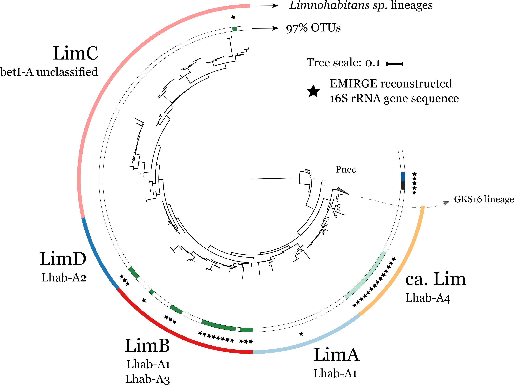

### Microdiversity in LimB

**At each iteration, SSU sequences were merged into one sequence if the identity of non-gapped positions in a global alignment was greater than 97%. A single SSU sequence (and its prior probability) was divided into two sequences if the second most probable base in more than 4% of all positions had a probability greater than 10%. In this way, sequences that evolved over iterations to be the same were merged, and sequences with evidence from the reads for multiple OTUs were duplicated and allowed to evolve as separate OTUs in future iterations.** [Reference](https://genomebiology.biomedcentral.com/articles/10.1186/gb-2011-12-5-r44)  

The workflow for postprocessing the `EMIRGE` reconstructed 16S rRNA gene sequences:  


```r
# Import seq-table that was generated after EMIRGE post-processing
EMIRGE_OTU <- read.table("./Tree/EMIRGE/read.info.txt", 
                         stringsAsFactors = FALSE)
colnames(EMIRGE_OTU) <- c("Sample",  "Sequence", "Prior", "Length", "Prior_norm")
EMIRGE_names <- read.table("./Tree/EMIRGE/EMIRGE_Limno.names")

EMIRGE_OTU_97 <- read.table("./Tree/EMIRGE/final.otu.emirge.pick.an.0.03.rep.names",
                            stringsAsFactors = FALSE)
EMIRGE_OTU_99 <- read.table("./Tree/EMIRGE/final.otu.emirge.pick.an.0.01.rep.names",
                            stringsAsFactors = FALSE)

# Filter out putative Limnohabitans OTUs
EMIRGE_OTU <- EMIRGE_OTU[EMIRGE_OTU$Sequence %in% EMIRGE_names$V1, ]

# Formate sample names
EMIRGE_OTU$Sample <- gsub(".A","", EMIRGE_OTU$Sample, fixed = TRUE)
EMIRGE_OTU$Sample <- gsub(".C","", EMIRGE_OTU$Sample, fixed = TRUE)

# Add OTU cluster results as new columns (0.97 level and 0.99 level)
EMIRGE_OTU$OTU_97 <- EMIRGE_OTU$Sequence

for(i in 1:nrow(EMIRGE_OTU_97)){
   EMIRGE_OTU$OTU_97[EMIRGE_OTU$Sequence %in% 
                            do.call(rbind, strsplit(EMIRGE_OTU_97$V2[i], ","))] <-
     EMIRGE_OTU_97$V3[i]
}

EMIRGE_OTU$OTU_99 <- EMIRGE_OTU$Sequence

for(i in 1:nrow(EMIRGE_OTU_99)){
  EMIRGE_OTU$OTU_99[EMIRGE_OTU$Sequence %in% 
                            do.call(rbind, strsplit(EMIRGE_OTU_99$V2[i], ","))] <-
     EMIRGE_OTU_99$V3[i]
}


# Calculate new abundance for the relative abundance of each OTU (0.97 and 0.99 level)
EMIRGE_OTU <- EMIRGE_OTU %>% dplyr::group_by(OTU_97, Sample) %>% 
  dplyr::mutate(Prior_norm_OTU97 = sum(Prior_norm))

EMIRGE_OTU <- EMIRGE_OTU %>% dplyr::group_by(OTU_99, Sample) %>% 
  dplyr::mutate(Prior_norm_OTU99 = sum(Prior_norm))

# Add metadata variables as new column
meta_em <- meta[-1]; meta_em$Sample_ID <- gsub("_",".", meta_em$Sample_ID)
meta_em <- meta_em %>% dplyr::distinct()
EMIRGE_OTU <- dplyr::left_join(EMIRGE_OTU, meta_em, by = c("Sample" = "Sample_ID"))

# to change
```


```r
# Plot
p_emirge_abund_otu97 <- ggplot(EMIRGE_OTU, aes(x = Sample, y = 100*Prior_norm, fill = OTU_97))+
  theme_bw()+
  geom_bar(stat = "identity", size = 1, color = "black", alpha = 0.7)+
  scale_fill_brewer(palette = "Accent")+
  theme(axis.text=element_text(size=14), axis.title=element_text(size=20),
        axis.text.x = element_text(size = 14, angle = 45, hjust = 1),
      title=element_text(size=20), legend.text=element_text(size=12),
      legend.background = element_rect(fill="transparent"),
      strip.text=element_text(size=14), legend.position = "right",
      strip.background = element_rect(fill = adjustcolor("gray", 0.15)))+
  guides(fill=guide_legend(nrow = 3))+
  facet_grid(.~Site, scales = "free_x")+
  ylab("Length-normalized prior (%)")+
  xlab("")+
  ggtitle("97% clustered OTUs")
  # coord_trans(x = "atanh", y = "atanh")

# Plot
p_emirge_abund_otu99 <- ggplot(EMIRGE_OTU, aes(x = Sample, y = 100*Prior_norm, fill = OTU_99))+
  theme_bw()+
  geom_bar(stat = "identity", size = 1, color = "black", alpha = 0.7)+
  # geom_point(size = 4, shape = 21, color = "black", alpha = 0.7)+
  scale_fill_brewer(palette = "Accent")+
  theme(axis.text=element_text(size=14), axis.title=element_text(size=20),
        axis.text.x = element_text(size = 14, angle = 45, hjust = 1),
      title=element_text(size=20), legend.text=element_text(size=12),
      legend.background = element_rect(fill="transparent"),
      strip.text=element_text(size=14), legend.position = "right",
      strip.background = element_rect(fill = adjustcolor("gray", 0.15)))+
  guides(fill=guide_legend(nrow = 3))+
  facet_grid(.~Site, scales = "free_x")+
  ylab("Length-normalized prior (%)")+
  xlab("")+
  ggtitle("99% clustered OTUs")
  # coord_trans(x = "atanh", y = "atanh")

# Plot
p_emirge_abund_seq <- ggplot(EMIRGE_OTU, aes(x = Sample, y = 100*Prior_norm, fill = OTU_97))+
  theme_bw()+
  # geom_point(size = 4, shape = 21, color = "black", alpha = 0.7)+
  geom_bar(stat = "identity", size = 1, color = "black", alpha = 0.7)+
  scale_fill_brewer(palette = "Accent")+
  theme(axis.text=element_text(size=14), axis.title=element_text(size=20),
        axis.text.x = element_text(size = 14, angle = 45, hjust = 1),
      title=element_text(size=20), legend.text=element_text(size=12),
      legend.background = element_rect(fill="transparent"),
      strip.text=element_text(size=14), legend.position = "right",
      strip.background = element_rect(fill = adjustcolor("gray", 0.15)))+
  guides(fill=guide_legend(nrow = 3))+
  facet_grid(.~Site, scales = "free_x")+
  ylab("Length-normalized prior (%)")+
  xlab("")+
  ggtitle("Unique sequences")
  # coord_trans(x = "atanh", y = "atanh")

grid.arrange(p_emirge_abund_otu97, p_emirge_abund_otu99, p_emirge_abund_seq ,nrow = 3)
```


```r
# Import blast results
blast_emirge <- read.csv("./Tree/EMIRGE/blast_table.csv", header = FALSE)[, 1:3]
colnames(blast_emirge) <- c("seq1", "seq2", "pid")
# Annotate based on 97% clusters
EMIRGE_OTU_annot <- EMIRGE_OTU %>% dplyr::select(Sequence, OTU_97) %>%
  distinct() %>% 
  left_join(., EMIRGE_OTU_97[, c("V3", "V4")], by = c("OTU_97" = "V3"))
```

```
## Adding missing grouping variables: `OTU_99`, `Sample`
```

```r
# label sequence 1
blast_emirge_annot <- left_join(blast_emirge, EMIRGE_OTU_annot,
                              by = c("seq1" = "Sequence")) %>% 
  dplyr::filter(V4 != "not_limno")
colnames(blast_emirge_annot)[7] <- "seq1_label"
# label sequence 2
blast_emirge_annot <- left_join(blast_emirge_annot, EMIRGE_OTU_annot[, c(3,5)],
                              by = c("seq2" = "Sequence")) %>% 
  dplyr::filter(V4 != "not_limno")
colnames(blast_emirge_annot)[8] <- "seq2_label"

# Create interaction effect
blast_emirge_annot$label_interaction <- interaction(blast_emirge_annot$seq1_label,
                                                    blast_emirge_annot$seq2_label,
                                                    sep= "-")
# Only visualize within-group blast identities
subset_seq_labels <- c("LimB-LimB", "Lhab-A4-Lhab-A4")
blast_emirge_annot %>% 
  dplyr::filter(label_interaction %in% subset_seq_labels &
                                       seq1 != seq2) %>% 
ggplot(aes(x = label_interaction, y = pid, fill = label_interaction))+
  geom_jitter(size = 2.5,
             color = "black", shape = 21, width = 0.1, alpha = 0.5)+
  geom_violin(alpha = 0.4, adjust = 1, draw_quantiles = TRUE, width = 0.3)+
  stat_summary(fun.data=mean_sdl, fun.args = list(mult = 1), 
                 geom="pointrange", color="black")+
  ylim(95,100)+
  scale_fill_manual("", values = rev(c("#e31a1c","#fdbf6f")))+
  theme_bw()+
  theme(axis.text=element_text(size=14), axis.title=element_text(size=20),
        axis.text.x=element_text(size=14),
        title=element_text(size=16), legend.text=element_text(size=14),
        legend.background = element_rect(fill="transparent"),
        strip.text.x=element_text(size=18))+
  guides(fill = FALSE)+
  labs(x="")
```

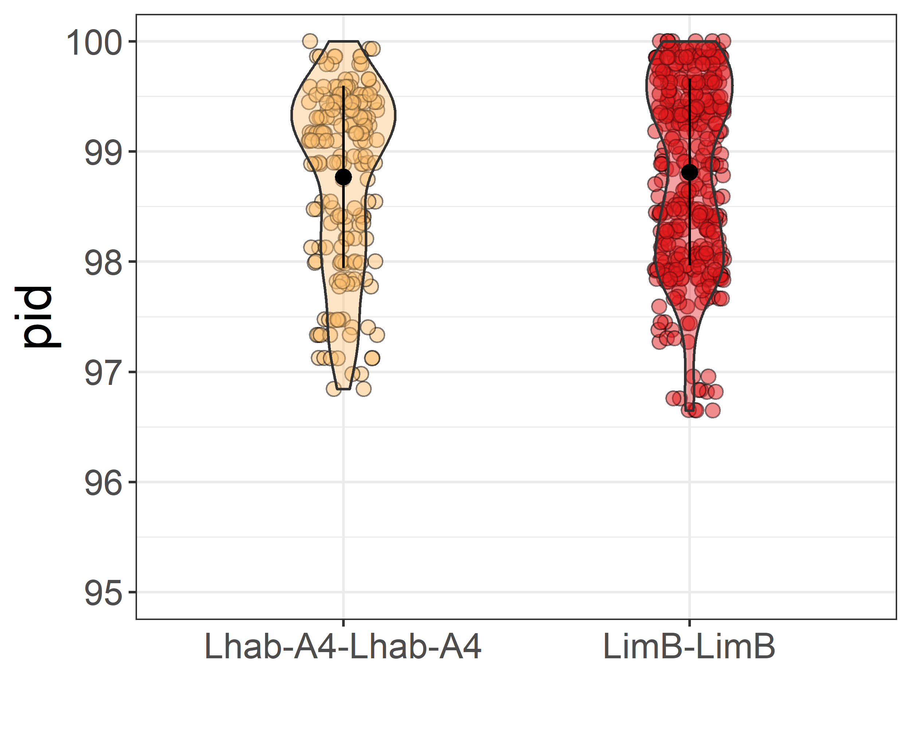

```r
blast_emirge_annot %>% dplyr::filter(label_interaction %in% subset_seq_labels &
                                       seq1 != seq2) %>% 
  group_by(label_interaction) %>% 
  summarize(mean(pid), sd(pid))
```

```
## # A tibble: 2 x 3
##   label_interaction `mean(pid)` `sd(pid)`
##   <fct>                   <dbl>     <dbl>
## 1 Lhab-A4-Lhab-A4          98.8     0.826
## 2 LimB-LimB                98.8     0.850
```

```r
# Only look at the outlying sequence of LimB
# 10|JN626652.1.1352
blast_emirge_annot$label_interaction <- interaction(blast_emirge_annot$seq1_label,
                                                    blast_emirge_annot$seq2_label,
                                                    sep= "-")
# Only visualize within-group blast identities
subset_seq_labels <- c("LimB-LimB", "Lhab-A4-Lhab-A4")
blast_emirge_annot %>% dplyr::filter(label_interaction %in% subset_seq_labels &
                                      seq1 == "10|JN626652.1.1352") %>% 
  summarize(mean(pid), sd(pid))
```

```
##   mean(pid)   sd(pid)
## 1  97.96535 0.6247723
```

# ANI analysis


```r
# read file
data.ANI <- read.table("./ANI/ANIb_percentage_identity.tab")

# Replace genome names by better annotated names
map_ani <- read.delim("./ANI/pyani_ref_names.tsv", stringsAsFactors = FALSE)
for(i in 1:nrow(map_ani)){
 colnames(data.ANI)[colnames(data.ANI) %in% map_ani$ani_file[i]] <- map_ani$ref_name[i]
 rownames(data.ANI)[rownames(data.ANI) %in% map_ani$ani_file[i]] <- map_ani$ref_name[i]
}

# Remove pnec and root genomes from dataframe
data.ANI <- data.ANI[grep("MAG|Lim", rownames(data.ANI)), grep("MAG|Lim", rownames(data.ANI))]

# Order y-axis according to phylogenetic tree order
ord_list_bin <- c(
  "MAG5.SP-M110-DD", "MAG2.FA-MLB-SN",
  "MAG3.FA-MLB-SN", "MAG4.FA-M110-DN",
  "MAG1.FA-MLB-DN", "MAG10.SU-M15-SN",
  "MAG6.SP-M15-SD","MAG8.SU-M110-DCMD",
  "Lim. sp. Rim11", "Lim. sp. 103DPR2",
  "MAG7.SU-MLB-SD", "Lim. sp. Rim47",
  "MAG9.SU-M15-SN", "Lim. sp. Rim28",
  "Lim. sp. 63ED37-2","Lim. sp. 2KL-27",
  "Lim. sp. 2KL-3", "Lim. sp. DM1",
  "Lim. sp. II-D5"
  )

# order rows and columns
data.ANI <- data.ANI[, order(match(colnames(data.ANI), ord_list_bin))]
data.ANI <- data.ANI[order(match(rownames(data.ANI), ord_list_bin)), ]

data.ANI <- get_upper_tri(data.ANI)

# melt to dataframe
df_pyani <- melt(as.matrix(data.ANI), na.rm = TRUE) # reshape into dataframe
names(df_pyani)[c(1:3)] <- c("bin1", "bin2", "ANI")
df_pyani[, 1] <- as.character(df_pyani[, 1]); df_pyani[, 2] <- as.character(df_pyani[, 2])
df_pyani$bin2 <- factor(df_pyani$bin2, levels = ord_list_bin)
df_pyani$bin1 <- factor(df_pyani$bin1, levels = rev(ord_list_bin))

# make plot
p_ani <- ggplot(data = df_pyani,
       aes(x = bin2, y = bin1, fill = 100*ANI))+ 
  geom_raster()+
  scale_fill_distiller(palette = "RdBu", name = "Average\nNucleotide\nIdentity (%)\n",
                       limits = 100*c(0.75,1.0), oob=squish) +
  geom_text(aes(label = round(100*ANI, 0)), size = 4.5)+
  xlab("")+
  ylab("")+
  scale_x_discrete(position = "top") +
  theme(axis.title=element_text(size=14), strip.text.x=element_text(size=14),
        legend.title=element_text(size=14), legend.text=element_text(size=14),
        axis.text.y = element_blank(),
        axis.text.x = element_text(size=14, angle = 55, hjust = 0),
        title=element_text(size=20),
        plot.margin = unit(c(1.1,1.1,1.1,1.1), "cm"),
        panel.grid.major = element_blank(), 
        panel.grid.minor = element_blank(),
        panel.background = element_rect(fill = "transparent",colour = NA),
        plot.background = element_rect(fill = "transparent",colour = NA)
  )

# png("ANI_heatmap.png", height= 9, width = 9, res = 500, units = "in", bg = "transparent")
print(p_ani)
```


```r
# dev.off()
```

# 1b. Investigate predicted generation time (MGT)

```r
MGT_df <- read.table("./Growthpred/GP_results.tsv", header = TRUE,
                     stringsAsFactors = FALSE, sep = "\t")

# Order genome_ids according to the phylogenetic clustering
MGT_df$Genome_ID <- factor(MGT_df$Genome_ID, levels = ord_list_bin)
MGT_df$Lineage <- factor(MGT_df$Lineage, levels = c("LimDEA_1", "LimDEA_2",
                                                    "LimB", "LimC"))

# Make barplot with st.dev to visualize MGT and optimal temperature
selected_points <- data.frame(Genome_ID = MGT_df$Genome_ID, 
                              ypos = c(rep(0.25, 10), rep(NA,9)))

p_MGT <- ggplot(MGT_df, aes(x = Genome_ID, y = log(2)/MGT, fill = Lineage, group = Genome_ID))+
  theme_bw()+
  geom_bar(alpha = 1, stat = "identity", color = "black",
           position = position_dodge(width = 1), width = 0.7)+
  scale_fill_manual(expression("Growth rate - "~"h"^-1),
                    values = c(rgb(red=t(col2rgb("#deebf7ff")), maxColorValue  = 255), 
                               rgb(red=t(col2rgb("#c6dbefff")), maxColorValue  = 255),
                               rgb(red=t(col2rgb("#9ecae1ff")), maxColorValue  = 255),
                               rgb(red=t(col2rgb("#6baed6ff")), maxColorValue  = 255)
                              ))+
  theme(axis.text=element_text(size=15, face = "bold"), axis.title=element_text(size=20),
        title=element_text(size=20), legend.text=element_text(size=14),
        legend.background = element_rect(fill="transparent"),
        # axis.text.x = element_text(angle = 65, hjust = 1),
        strip.text.x=element_text(size = 18),
        legend.position="bottom",
        axis.text.x=element_text(size = 13, angle =45, hjust= 1),
        axis.title.x=element_blank(),
        plot.title = element_text(hjust = 0, size=18))+
  guides(fill=FALSE)+
  geom_errorbar(aes(ymin = log(2)/(MGT - sd.MGT), ymax = log(2)/(MGT + sd.MGT)), width = 0.15,
                position = position_dodge(width = 1))+
  ylab("")+
  xlab("")+
  ggtitle(expression("Growth rate - h"^-1))+
  geom_point(data = selected_points, aes(x = Genome_ID, y = ypos),
             shape = 25, fill = "black", col = "black", size = 3)

# svg(filename = "MGT_figure.svg", width = 9.5, height = 4)
print(p_MGT)
```

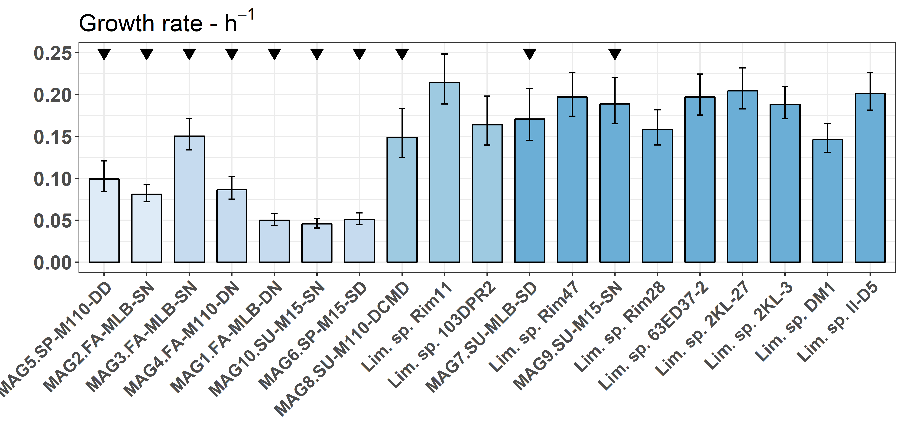

```r
# dev.off()

# Make the same plot for optimal growth temperature
selected_points <- data.frame(Genome_ID = MGT_df$Genome_ID, 
                              ypos = c(rep(30, 10), rep(NA,9)))

p_Topt <- ggplot(MGT_df, aes(x = Genome_ID, y = Topt, fill = Lineage, group = Genome_ID))+
  theme_bw()+
  geom_bar(alpha = 0.4, stat = "identity", color = "black",
           position = position_dodge(width = 1), width = 0.7)+
  scale_fill_manual("Optimal growth temperature (°C)",
                    values = c("#deebf7ff", "#c6dbefff","#9ecae1ff",
                               "#6baed6ff"))+
  theme(axis.text=element_text(size=15, face = "bold"), axis.title=element_text(size=20),
        title=element_text(size=20), legend.text=element_text(size=14),
        legend.background = element_rect(fill="transparent"),
        # axis.text.x = element_text(angle = 65, hjust = 1),
        strip.text.x=element_text(size = 18),
        legend.position="bottom",
        axis.text.x=element_text(size = 13, angle =45, hjust= 1),
        axis.title.x=element_blank(),
        plot.title = element_text(hjust = 0, size=18))+
  guides(fill=FALSE)+
  ylab("")+
  xlab("")+
  ggtitle("Optimal growth temperature (°C)")+
  geom_point(data = selected_points, aes(x = Genome_ID, y = ypos),
             shape = 25, fill = "black", col = "black", size = 3)

print(p_Topt)
```


# 1c. Network analysis based on 16S data


```r
# import data
df_phy <- import_mothur(mothur_shared_file = "./16S/stability.trim.contigs.good.unique.good.filter.unique.precluster.pick.pick.an.unique_list.shared",
                        mothur_constaxonomy_file = "./16S/stability.trim.contigs.good.unique.good.filter.unique.precluster.pick.pick.an.unique_list.0.03.cons.taxonomy")

# Filter out 2013 samples
df_phy <- prune_samples(grep(pattern = ".", sample_names(df_phy), fixed = TRUE,
     value = TRUE), df_phy)
df_phy <- prune_samples(grep(pattern = "cD", sample_names(df_phy), fixed = TRUE,
     value = TRUE, invert = TRUE), df_phy)
df_phy <- prune_samples(grep(pattern = "ED", sample_names(df_phy), fixed = TRUE,
     value = TRUE, invert = TRUE), df_phy)

# Calculate diversity
diversity_df_phy <- Diversity_16S(df_phy, brea = FALSE, R = 100)
```

```
## 	**WARNING** this functions assumes that rows are samples and columns
##       	are taxa in your phyloseq object, please verify.
## Sat Dec 29 15:43:59 2018	Calculating diversity for sample 1/41 --- Fa13.BD.MLB.DN.1.renamed
## Sat Dec 29 15:44:18 2018	Calculating diversity for sample 2/41 --- Fa13.BD.MLB.SN.1.renamed
## Sat Dec 29 15:44:38 2018	Calculating diversity for sample 3/41 --- Fa13.BD.MM110.DN.1.renamed
## Sat Dec 29 15:44:58 2018	Calculating diversity for sample 4/41 --- Fa13.BD.MM110.DN.2.renamed
## Sat Dec 29 15:45:17 2018	Calculating diversity for sample 5/41 --- Fa13.BD.MM110.SD.1.renamed
## Sat Dec 29 15:45:37 2018	Calculating diversity for sample 6/41 --- Fa13.BD.MM110.SD.2.renamed
## Sat Dec 29 15:45:57 2018	Calculating diversity for sample 7/41 --- Fa13.BD.MM110.SN.1.renamed
## Sat Dec 29 15:46:15 2018	Calculating diversity for sample 8/41 --- Fa13.BD.MM110.SN.2.renamed
## Sat Dec 29 15:46:34 2018	Calculating diversity for sample 9/41 --- Fa13.BD.MM15.DN.1.renamed
## Sat Dec 29 15:46:52 2018	Calculating diversity for sample 10/41 --- Fa13.BD.MM15.DN.2.renamed
## Sat Dec 29 15:47:11 2018	Calculating diversity for sample 11/41 --- Fa13.BD.MM15.SD.1.renamed
## Sat Dec 29 15:47:29 2018	Calculating diversity for sample 12/41 --- Fa13.BD.MM15.SD.2.renamed
## Sat Dec 29 15:47:47 2018	Calculating diversity for sample 13/41 --- Fa13.BD.MM15.SN.1.renamed
## Sat Dec 29 15:48:04 2018	Calculating diversity for sample 14/41 --- Fa13.BD.MM15.SN.2.renamed
## Sat Dec 29 15:48:22 2018	Calculating diversity for sample 15/41 --- Sp13.BD.MLB.SN.1.renamed
## Sat Dec 29 15:48:41 2018	Calculating diversity for sample 16/41 --- Sp13.BD.MLB.SN.2.renamed
## Sat Dec 29 15:49:00 2018	Calculating diversity for sample 17/41 --- Sp13.BD.MM110.DD.1.renamed
## Sat Dec 29 15:49:19 2018	Calculating diversity for sample 18/41 --- Sp13.BD.MM110.SD.1.renamed
## Sat Dec 29 15:49:37 2018	Calculating diversity for sample 19/41 --- Sp13.BD.MM110.SD.2.renamed
## Sat Dec 29 15:49:56 2018	Calculating diversity for sample 20/41 --- Sp13.BD.MM110.SN.1.renamed
## Sat Dec 29 15:50:15 2018	Calculating diversity for sample 21/41 --- Sp13.BD.MM110.SN.2.renamed
## Sat Dec 29 15:50:33 2018	Calculating diversity for sample 22/41 --- Sp13.BD.MM15.DD.1.renamed
## Sat Dec 29 15:50:52 2018	Calculating diversity for sample 23/41 --- Sp13.BD.MM15.SD.1.renamed
## Sat Dec 29 15:51:12 2018	Calculating diversity for sample 24/41 --- Sp13.BD.MM15.SN.1.renamed
## Sat Dec 29 15:51:31 2018	Calculating diversity for sample 25/41 --- Sp13.BD.MM15.SN.2.renamed
## Sat Dec 29 15:51:50 2018	Calculating diversity for sample 26/41 --- Su13.BD.MLB.DD.1.renamed
## Sat Dec 29 15:52:08 2018	Calculating diversity for sample 27/41 --- Su13.BD.MLB.SD.1.renamed
## Sat Dec 29 15:52:27 2018	Calculating diversity for sample 28/41 --- Su13.BD.MM110.DCMD.1.renamed
## Sat Dec 29 15:52:46 2018	Calculating diversity for sample 29/41 --- Su13.BD.MM110.DCMD.2.renamed
## Sat Dec 29 15:53:04 2018	Calculating diversity for sample 30/41 --- Su13.BD.MM110.DN.1.renamed
## Sat Dec 29 15:53:23 2018	Calculating diversity for sample 31/41 --- Su13.BD.MM110.DN.2.renamed
## Sat Dec 29 15:53:42 2018	Calculating diversity for sample 32/41 --- Su13.BD.MM110.SD.1.renamed
## Sat Dec 29 15:54:00 2018	Calculating diversity for sample 33/41 --- Su13.BD.MM110.SD.2.renamed
## Sat Dec 29 15:54:19 2018	Calculating diversity for sample 34/41 --- Su13.BD.MM110.SN.1.renamed
## Sat Dec 29 15:54:37 2018	Calculating diversity for sample 35/41 --- Su13.BD.MM110.SN.2.renamed
## Sat Dec 29 15:54:56 2018	Calculating diversity for sample 36/41 --- Su13.BD.MM15.DN.1.renamed
## Sat Dec 29 15:55:15 2018	Calculating diversity for sample 37/41 --- Su13.BD.MM15.DN.2.renamed
## Sat Dec 29 15:55:34 2018	Calculating diversity for sample 38/41 --- Su13.BD.MM15.SD.1.renamed
## Sat Dec 29 15:55:52 2018	Calculating diversity for sample 39/41 --- Su13.BD.MM15.SD.2.renamed
## Sat Dec 29 15:56:11 2018	Calculating diversity for sample 40/41 --- Su13.BD.MM15.SN.1.renamed
## Sat Dec 29 15:56:30 2018	Calculating diversity for sample 41/41 --- Su13.BD.MM15.SN.2.renamed
## Sat Dec 29 15:56:49 2018 	Done with all 41 samples
```

```r
# Perform prevalence filtering
df_phy <- filter_taxa(df_phy, function(x) sum(x > 30) > (0.25*length(x)), TRUE)

# Run spiec-easi
sp_easi <- spiec.easi(df_phy, method='mb', lambda.min.ratio=1e-2,
                           nlambda=20, icov.select.params=list(rep.num=50))
```

```
## Applying data transformations...
```

```
## Selecting model with pulsar using stars...
```

```
## Fitting final estimate with mb...
```

```
## done
```

```r
ig.mb <- adj2igraph(sp_easi$refit,  vertex.attr = list(name=taxa_names(df_phy)))
```

```
## Error in mde(x): (list) object cannot be coerced to type 'double'
```

```r
vsize <- Biobase::rowMax(clr(t(otu_table(df_phy)), 1))+10
Lineage_rel <- tax_table(df_phy)[,"Rank2"]
Lineage_rel <- factor(Lineage_rel, levels = unique(Lineage_rel))

# OTUs that are Limnohabitans
limno_otus <- taxa_names(df_phy)[tax_table(df_phy)[,"Rank6"] == "betI_A"]
limno_otus <- limno_otus[!is.na(limno_otus)]

# Make Limno label
limno_labs <- c()
limno_labs[vertex.attributes(ig.mb)$name %in% limno_otus] <- "Limnohabitans sp."
```

```
## Error in "igraph" %in% class(graph): object 'ig.mb' not found
```

```r
limno_labs[is.na(limno_labs)] <- ""

# Plot network
p_16S_network <- plot_network_custom(ig.mb, df_phy, type='taxa',
             line_weight = 2, hjust = 0.5,
             point_size = 0.1, alpha = 0.01, label=NULL, label_size = 3.95)+
  scale_fill_brewer(palette = "Paired")+
  scale_color_brewer(palette = "Paired")+
  geom_point(aes(size = vsize, fill = Lineage_rel), alpha = 0.5,
             colour="black", shape=21)+
  guides(size = FALSE,
    fill  = guide_legend(title = "Phylum", override.aes = list(size = 5),
                         nrow = 4),
    color = FALSE)+
  theme(legend.position="bottom", legend.text=element_text(size=12),
        text = element_text(size = 12),
        plot.margin = unit(c(1,1,1,1), "cm"))+
  scale_size(range = c(5, 15))+
  geom_label_repel(aes(label = limno_labs), 
                   fontface = 'bold', color = 'black',
                   box.padding = 0.35, point.padding = 0.5,
                   segment.color = 'black',
                   size = 4,
                       # Width of the line segments.
                   segment.size = 1.5,
                   # Draw an arrow from the label to the data point.
                   arrow = arrow(length = unit(0.015, 'npc')),
                   nudge_x = -0.1,
                   nudge_y = 0.6
  )
```

```
## Error in "igraph" %in% class(graph): object 'ig.mb' not found
```

```r
print(p_16S_network)
```

```
## Error in print(p_16S_network): object 'p_16S_network' not found
```

# 2. Investigate MAG- and 16S-based abundances  

## 2.1. From coverage info (anvi'o)  

Formula used to calculate relative abundances:
$$Relative\ abundance =100*(\frac{mean\ coverage * bin\ size}{read\ length*total\ sample\ reads })$$


```r
# Normalize for bin sizes
data_total_abund <- data_total %>% group_by(bins) %>% 
  mutate(norm_mean_rel_abundance = mean_rel_abundance/(bin_size/1e6),
         norm_upper_rel_abundance = upper_rel_abundance/(bin_size/1e6),
         norm_lower_rel_abundance = lower_rel_abundance/(bin_size/1e6)
         )

# Import bin name file used in manuscript
new_bin_names <- read.table("./anvio_output/rebin/general_bins_summary_selected_final.tsv", header = TRUE)[, c(2,3)]
data_total_abund <- left_join(data_total_abund,
                              new_bin_names, by = c("bins" = "bins"))

# Remove non-Limno bin
data_total_abund <- data_total_abund %>% 
  dplyr::filter(new_bin_name != "MAG.noLIM")

# Add putative limnohabitans lineage ID
data_total_abund <- dplyr::left_join(data_total_abund, MGT_df,
                                     by = c("new_bin_name" = "Genome_ID"))

# Order names for phylogenomic tree
data_total_abund$new_bin_name <- as.character(data_total_abund$new_bin_name)
data_total_abund$new_bin_name <- factor(data_total_abund$new_bin_name,
                                        levels = c(
                                          "MAG5.SP-M110-DD",
                                          "MAG2.FA-MLB-SN",
                                          "MAG3.FA-MLB-SN",
                                          "MAG4.FA-M110-DN",
                                          "MAG1.FA-MLB-DN",
                                          "MAG10.SU-M15-SN",
                                          "MAG6.SP-M15-SD",
                                          "MAG8.SU-M110-DCMD",
                                          "MAG7.SU-MLB-SD", 
                                          "MAG9.SU-M15-SN"
                                          )
)

# Plot abundance distributions of all bins
p_season1 <- ggplot(data = data_total_abund, 
                    aes(x = new_bin_name, y = norm_mean_rel_abundance,
                        fill = Lineage))+
  geom_point(size = 4, shape = 21, alpha = 0.7)+
  geom_boxplot(alpha = 0.7, outlier.shape = NA)+
  theme_bw()+
    scale_fill_manual(values = c(rgb(red=t(col2rgb("#deebf7ff")),
                                   maxColorValue  = 255), 
                               rgb(red=t(col2rgb("#c6dbefff")), 
                                   maxColorValue  = 255),
                               rgb(red=t(col2rgb("#9ecae1ff")), 
                                   maxColorValue  = 255),
                               rgb(red=t(col2rgb("#6baed6ff")), 
                                   maxColorValue  = 255)
                              ))+
  # ylim(0,1)+ 
  theme(axis.text=element_text(size=14), axis.title=element_text(size=20),
        title=element_text(size=20), legend.text=element_text(size=14),
        legend.background = element_rect(fill="transparent"),
        axis.text.x = element_text(angle = 90, hjust = 1),
        strip.text=element_text(size=18),
        axis.line = element_line(size = 1, colour = "grey80"),
        panel.border = element_blank())+
  ylab("Normalized relative abundance (%)")+
  scale_y_sqrt()+
  xlab("")

p_season1
```

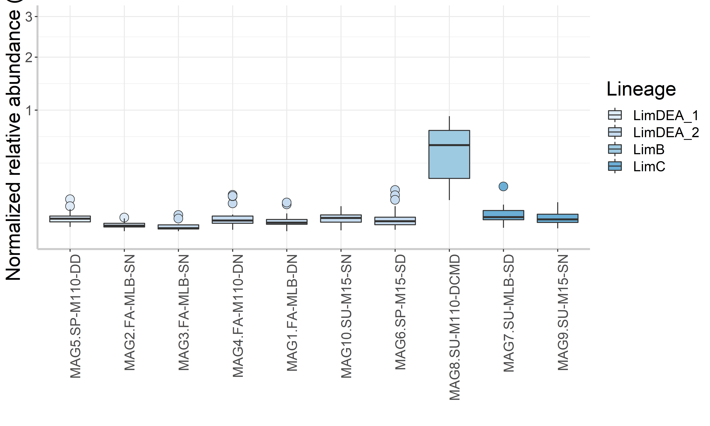

## 2.1. From mapped reads info (BBmap - `pileup.sh`)  

From: https://doi.org/10.1186/s13059-015-0834-7  

*"The relative abundance of each MAG was estimated using the fraction of reads in each sample mapping to the respective MAG. Normalized on the size of that bin, this yielded the measure fraction of reads per nucleotide in bin. This measure was chosen since it is comparable across samples with varying sequencing output and different bin sizes. Using the CONCOCT input table, multiplying the average coverage per nucleotide with the length of the contig in question and summing over all contigs within a bin and within a sample gave the number of reads per bin within a sample. The fraction of reads in each sample mapping to each bin was then calculated by dividing this value with the total number of reads from each sample, after having removed duplicated reads."*


```r
# Generated from SAM file with pileup.sh from BBmap toolset
df_map_reads <- read.delim("./anvio_output/collection_vizbin_pileup_cov.tsv",
                           stringsAsFactors = FALSE)
df_map_reads$Sample <- gsub(df_map_reads$Sample, pattern = "_cov.tsv",
                            replacement = "")

# This file was generated in anvio with anvi-export-collections
lab_map_reads <- read.delim("./anvio_output/collection_vizbin.tsv",
                            header = FALSE)
colnames(lab_map_reads) <- c("contig_split", "Bin")

# Select Limnohabitans bins
lab_map_reads <- lab_map_reads[lab_map_reads$Bin %in% data_total$bins, ]
lab_map_reads$contig <- paste(
  do.call(rbind, strsplit(as.character(lab_map_reads$contig_split), "_"))[, 1],
  do.call(rbind, strsplit(as.character(lab_map_reads$contig_split), "_"))[, 2],
  sep = "_"
  )

lab_map_reads <- lab_map_reads[ ,2:3] %>% distinct()

# Merge dataframes
df_map_merged <- left_join(lab_map_reads, df_map_reads, by = c("contig" = "X.ID")
)
df_map_merged[, 4:13] <- apply(df_map_merged[, 4:13], 2, FUN = function(x) as.numeric(x))

df_map_merged <- df_map_merged %>% group_by(Bin, Sample) %>% summarise(sum_map_read = sum(Plus_reads))

# Merge with metadata/bin sizes
meta$Sample <- gsub(".C", "", meta$Sample, fixed = TRUE)
meta$Sample <- gsub(".A", "", meta$Sample, fixed = TRUE)
df_map_merged$Sample <- gsub(".C", "", df_map_merged$Sample, fixed = TRUE)
df_map_merged <- left_join(df_map_merged, bin_size, by = c("Bin" = "bins"))
df_map_merged <- left_join(df_map_merged, meta, "Sample")
total_reads$sample <- gsub("_", ".", fixed = TRUE,total_reads$sample)
df_map_merged <- left_join(df_map_merged, total_reads, c("Sample" = "sample"))

df_map_merged <- df_map_merged %>% group_by(Bin, Sample) %>%
  mutate(rel_abundance = 100*sum_map_read/Total_reads)

df_map_merged <- df_map_merged %>% group_by(Bin, Sample) %>%
  mutate(rel_norm_abundance = 100*sum_map_read/Total_reads/(bin_size/1e6))

# Rename bin names to more sensible names
# Add extra column with new bin names
new_bin_names <- read.table("./anvio_output/rebin/general_bins_summary_selected_final.tsv", header = TRUE)[, c(2,3)]
df_map_merged <- left_join(df_map_merged, new_bin_names, by = c("Bin" = "bins"))
df_map_merged$new_bin_name <- as.character(df_map_merged$new_bin_name)
df_map_merged$new_bin_name <- factor(df_map_merged$new_bin_name, levels =
                                      c("MAG1.FA-MLB-DN","MAG2.FA-MLB-SN",
                                        "MAG3.FA-MLB-SN", "MAG4.FA-M110-DN",
                                        "MAG5.SP-M110-DD","MAG6.SP-M15-SD",
                                        "MAG7.SU-MLB-SD","MAG8.SU-M110-DCMD",
                                        "MAG9.SU-M15-SN","MAG10.SU-M15-SN"))
df_map_merged$Site <- as.character(df_map_merged$Site)
df_map_merged$Site <- gsub("110", "Lake Michigan\nsite M110", df_map_merged$Site)
df_map_merged$Site <- gsub("15", "Lake Michigan\nsite M15", df_map_merged$Site)
df_map_merged$Site <- gsub("Buoy", "Muskegon Lake", df_map_merged$Site)
df_map_merged$Site <- factor(df_map_merged$Site, levels = c("Muskegon Lake",
                                                            "Lake Michigan\nsite M15",
                                                            "Lake Michigan\nsite M110"))
df_map_merged$Season <- as.character(df_map_merged$Season)
df_map_merged$Season <- factor(df_map_merged$Season, levels = c("Spring", "Summer","Fall"))

# Remove non-limno bin
df_map_merged <- df_map_merged %>% dplyr::filter(new_bin_name != "MAG.noLIM")

# Make plots
p_abs2 <- ggplot(data = df_map_merged, aes(x = new_bin_name, y = rel_norm_abundance, fill = new_bin_name))+
  theme_bw()+
  scale_fill_manual("", values = fill_palette)+
  geom_jitter(size = 4, shape = 21, color = "black", alpha = 0.7, width = 0.15)+
  theme(axis.text=element_text(size=14), axis.title=element_text(size=20),
      title=element_text(size=20), legend.text=element_text(size=12),
      legend.background = element_rect(fill="transparent"),
      axis.text.x = element_blank(),
      strip.text=element_text(size=14), legend.position = "bottom",
      strip.background = element_rect(fill = adjustcolor("gray", 0.15)))+
  ylab(paste0("Norm. relative abundance (%)"))+
  xlab("")+
  guides(fill=guide_legend(nrow = 3))+
  facet_grid(Season~Site, scales ="free")+
  scale_y_continuous(labels=scaleFUN, limits = c(0,1.25))+
  coord_trans(y = "sqrt")

p_abs2
```


# 3. Expression analysis  

One way: 
  1. Get total nr. of reads through the `samtools flagstat command`.
  2. Get gene length through the DESMAN command: `python $DESMAN/scripts/Lengths.py -i CDS.fa > CDS.len`

Chosen way:
  1. Map reads with `bwa`
  2. Extract mapping statistics with `pileup.sh` from `BBtools`  

## Import and process data  

The file needed to map `genome_ids` to `gene_ids` was generated with this code individually for each IMG `genes.fna` file and the concatenated with `cat`:  
```
grep ">" 2757320404.genes.fna | sed "s/>//g" | awk '{ print $1, $2 }' > 2757320404.genes.ids
awk -F ' ' -v samname="2757320404" '{$(1)=samname FS $1;}1' OFS=" " 2757320404.genes.ids > 2757320404.genes.names
```


```r
expr_cov <- read.delim("./metaT/metaT_pileup.tsv", header = TRUE,
                       stringsAsFactors = FALSE)

# Merge gene annotations from all genomes in one file
file_list <- list.files(path = "./IMG_annotation", recursive = FALSE, 
                        pattern = "IMG", full.names = TRUE)

# Import annotations of all MAG genes
merged_file <- merge_annotations(file_list[1:10], genoid_seqid = FALSE)
```

```
##  --- I will merge the annotation files from the following genomes:
##                            Genomes
## 1  ./IMG_annotation/IMG_2757320395
## 2  ./IMG_annotation/IMG_2757320396
## 3  ./IMG_annotation/IMG_2757320397
## 4  ./IMG_annotation/IMG_2757320398
## 5  ./IMG_annotation/IMG_2757320399
## 6  ./IMG_annotation/IMG_2757320400
## 7  ./IMG_annotation/IMG_2757320401
## 8  ./IMG_annotation/IMG_2757320402
## 9  ./IMG_annotation/IMG_2757320403
## 10 ./IMG_annotation/IMG_2757320404
## [1] 2322
## [1] 3720
## [1] 5259
## [1] 7208
## [1] 9745
## [1] 12405
## [1] 14858
## [1] 17644
## [1] 19813
## [1] 21848
## Sat Dec 29 15:57:54 2018  --- Sucessfully merged files
```

```r
merged_file$ko_id <- gsub(merged_file$ko_id, pattern = "KO:", 
                          replacement = "")

# import KO annotation hierarchy 
ko_df <- format_ko(path = "./Mapping_files/ko00000.keg")

# Annotated merged_file
merged_file_annot <- dplyr::left_join(merged_file, ko_df, by = "ko_id")

# Genes that were not annotated can be assigned a genome ID using another file
# made from the genes.fna IMG generated files
genome_gene_map <- read.table("IMG_annotation/genome_geneids.txt",
                              header = FALSE)[, 1:2]
colnames(genome_gene_map) <- c("Genome_ID", "gene_oid")
genome_gene_map <- data.frame(apply(genome_gene_map, 2, as.character))

# Add genome_ID to all genes
expr_cov <- dplyr::left_join(expr_cov, genome_gene_map, by = "gene_oid")

# Annotate this expression table with Kegg Orthology
# expr_cov <- dplyr::left_join(expr_cov, merged_file[, c(1,9)], by = c("gene_oid"))
expr_cov$Plus_reads <- as.integer(expr_cov$Plus_reads)
expr_cov$Length <- as.integer(expr_cov$Length)
expr_cov <- expr_cov[!is.na(expr_cov$Plus_reads),]

expr_cov_long <- dplyr::mutate(expr_cov, 
                               reads_per_kb = Plus_reads/Length/1000
                               )
expr_cov_long <- expr_cov_long %>% group_by(Sample) %>% 
  mutate(RPK_scaling = sum(reads_per_kb)/1e6
         )
expr_cov_long <- expr_cov_long %>% 
  mutate(TPM = reads_per_kb/RPK_scaling
         )

# Now add the metadata to this long dataframe
# Metadata file
meta_metaT <- distinct(meta[, 2:nrow(meta)])
meta_metaT$Sample_ID <- gsub(meta_metaT$Sample_ID, pattern="_", replacement = ".")
rownames(meta_metaT) <- meta_metaT$Sample_ID
expr_cov_long <- left_join(expr_cov_long, meta_metaT[, 1:11], 
                           by = c("Sample" = "Sample_ID"))
expr_cov_long$Genome_ID <- as.factor(expr_cov_long$Genome_ID)

# Remove duplicate rows
expr_cov_long <- expr_cov_long %>% distinct()
```

## Calculate dissimarility between expression profiles


```r
colnames(expr_cov_long)[colnames(expr_cov_long) == "Plus_reads"] <- "mapped_reads"
# For each MAG calculate the dissimarilties in expression profiles between samples
for(i in 1:nlevels(expr_cov_long$Genome_ID)){
  tmp_table <-  expr_cov_long %>% 
  dplyr::filter(Genome_ID == levels(expr_cov_long$Genome_ID)[i]) %>% 
  dplyr::select(gene_oid, Sample, mapped_reads) %>% 
  tidyr::spread(Sample, mapped_reads)
  r.geneoid <- tmp_table$gene_oid
  min_sample_size <- min(colSums(tmp_table[,-1]))
  tmp_table <- vegan::rrarefy(t(tmp_table[, -1]), min_sample_size)
  tmp_table <- scale(tmp_table)
  tmp_dist <- dist(tmp_table, method = "euclidean")
  
  if(i == 1) results_diss <- data.frame(dist_m = matrix(tmp_dist), 
                           Genome = levels(expr_cov_long$Genome_ID)[i]) else {
    results_diss <- rbind(results_diss, 
                          data.frame(dist_m = matrix(tmp_dist),
                                     Genome = levels(expr_cov_long$Genome_ID)[i]))
                           }
  remove(tmp_table)
}

# Merge with correct sample names
new_bin_names2 <- read.table("./anvio_output/rebin/general_bins_summary_selected_final.tsv", header = TRUE)[, c(3,8:10)]; 
new_bin_names2$IMG_taxID <- as.character(new_bin_names2$IMG_taxID)
results_diss <- left_join(results_diss, new_bin_names2, 
                          by = c("Genome" = "IMG_taxID"))
results_diss$new_bin_name <- as.character(results_diss$new_bin_name)
results_diss$new_bin_name <- factor(results_diss$new_bin_name, levels =
                                      c("MAG5.SP-M110-DD","MAG2.FA-MLB-SN",
                                        "MAG3.FA-MLB-SN", "MAG4.FA-M110-DN",
                                        "MAG1.FA-MLB-DN", "MAG10.SU-M15-SN",
                                        "MAG6.SP-M15-SD", "MAG8.SU-M110-DCMD",
                                        "MAG7.SU-MLB-SD","MAG9.SU-M15-SN"))

# Plot
results_diss %>% 
  ggplot(aes(x = new_bin_name, y = dist_m, fill = new_bin_name))+
  # geom_jitter(size = 2.5,
             # color = "black", shape = 21, width = 0.1, alpha = 0.5)+
  geom_violin(alpha = 0.4, adjust = 1, draw_quantiles = TRUE)+
  stat_summary(fun.data=mean_sdl, fun.args = list(mult = 1), 
                 geom="pointrange", color="#333333", size = 1.05)+
  # ylim(0,120)+
  scale_fill_manual("",
                    values = c(rep(rgb(red=t(col2rgb("#deebf7ff")), 
                                       maxColorValue  = 255), 2), 
                               rep(rgb(red=t(col2rgb("#c6dbefff")), 
                                       maxColorValue  = 255),5),
                               rgb(red=t(col2rgb("#9ecae1ff")), maxColorValue  = 255),
                               rep(rgb(red=t(col2rgb("#6baed6ff")), 
                                       maxColorValue  = 255),2)
                              ))+
  theme_bw()+
  theme(axis.text.y=element_text(size=14), axis.title=element_text(size=20),
        axis.text.x=element_text(size=14, angle = 45, hjust = 1),
        title=element_text(size=16), legend.text=element_text(size=14),
        legend.background = element_rect(fill="transparent"),
        strip.text.x=element_text(size=18))+
  guides(fill = FALSE)+
  labs(x="", y = "Euclidean distance")
```

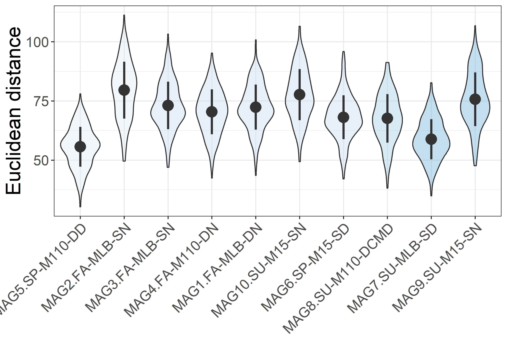


```r
# For each MAG calculate the Z-score of each gene in each sample
for(i in 1:nlevels(expr_cov_long$Genome_ID)){
  tmp_table <-  expr_cov_long %>% 
  dplyr::filter(Genome_ID == levels(expr_cov_long$Genome_ID)[i]) %>% 
  dplyr::select(gene_oid, Sample, mapped_reads) %>% 
  tidyr::spread(Sample, mapped_reads)
  r.geneoid <- tmp_table$gene_oid
  min_sample_size <- min(colSums(tmp_table[,-1]))
  tmp_table <- vegan::rrarefy(t(tmp_table[, -1]), min_sample_size)
  # Remove genes with less than 100 counts over 24 samples
  tmp_table <- tmp_table[, colSums(tmp_table)>100]
  tmp_table <- base::scale(tmp_table)
  tmp_zscore <- tidyr::gather(data.frame(tmp_table), gene, Zscore)
  if(i == 1) results_Zscore <- data.frame(Zscore = tmp_zscore$Zscore, 
                           Genome = levels(expr_cov_long$Genome_ID)[i]) else {
    results_Zscore <- rbind(results_Zscore, 
                          data.frame(Zscore = tmp_zscore$Zscore,
                                     Genome = levels(expr_cov_long$Genome_ID)[i]))
                           }
  remove(tmp_table, tmp_zscore)
}

# Merge with correct sample names
new_bin_names2 <- read.table("./anvio_output/rebin/general_bins_summary_selected_final.tsv", header = TRUE)[, c(3,8:10)]; 
new_bin_names2$IMG_taxID <- as.character(new_bin_names2$IMG_taxID)
results_Zscore <- left_join(results_Zscore, new_bin_names2, 
                          by = c("Genome" = "IMG_taxID"))
results_Zscore$new_bin_name <- as.character(results_Zscore$new_bin_name)
results_Zscore$new_bin_name <- factor(results_Zscore$new_bin_name, levels =
                                      c("MAG5.SP-M110-DD","MAG2.FA-MLB-SN",
                                        "MAG3.FA-MLB-SN", "MAG4.FA-M110-DN",
                                        "MAG1.FA-MLB-DN", "MAG10.SU-M15-SN",
                                        "MAG6.SP-M15-SD", "MAG8.SU-M110-DCMD",
                                        "MAG7.SU-MLB-SD","MAG9.SU-M15-SN"))

# Plot
results_Zscore %>% 
  ggplot(aes(x = new_bin_name, y = abs(Zscore), fill = new_bin_name))+
  # geom_jitter(size = 2.5,
             # color = "black", shape = 21, width = 0.1, alpha = 0.5)+
  geom_violin(alpha = 0.4, adjust = 1, draw_quantiles = TRUE)+
  stat_summary(fun.data=mean_sdl, fun.args = list(mult = 1), 
                 geom="pointrange", color="#333333", size = 1.05)+
  # ylim(0,120)+
  scale_fill_manual("",
                    values = c(rep(rgb(red=t(col2rgb("#deebf7ff")), 
                                       maxColorValue  = 255), 2), 
                               rep(rgb(red=t(col2rgb("#c6dbefff")), 
                                       maxColorValue  = 255),5),
                               rgb(red=t(col2rgb("#9ecae1ff")), maxColorValue  = 255),
                               rep(rgb(red=t(col2rgb("#6baed6ff")), 
                                       maxColorValue  = 255),2)
                              ))+
  theme_bw()+
  theme(axis.text.y=element_text(size=14), axis.title=element_text(size=20),
        axis.text.x=element_text(size=14, angle = 45, hjust = 1),
        title=element_text(size=16), legend.text=element_text(size=14),
        legend.background = element_rect(fill="transparent"),
        strip.text.x=element_text(size=18))+
  guides(fill = FALSE)+
  labs(x="", y = "Zscore")
```

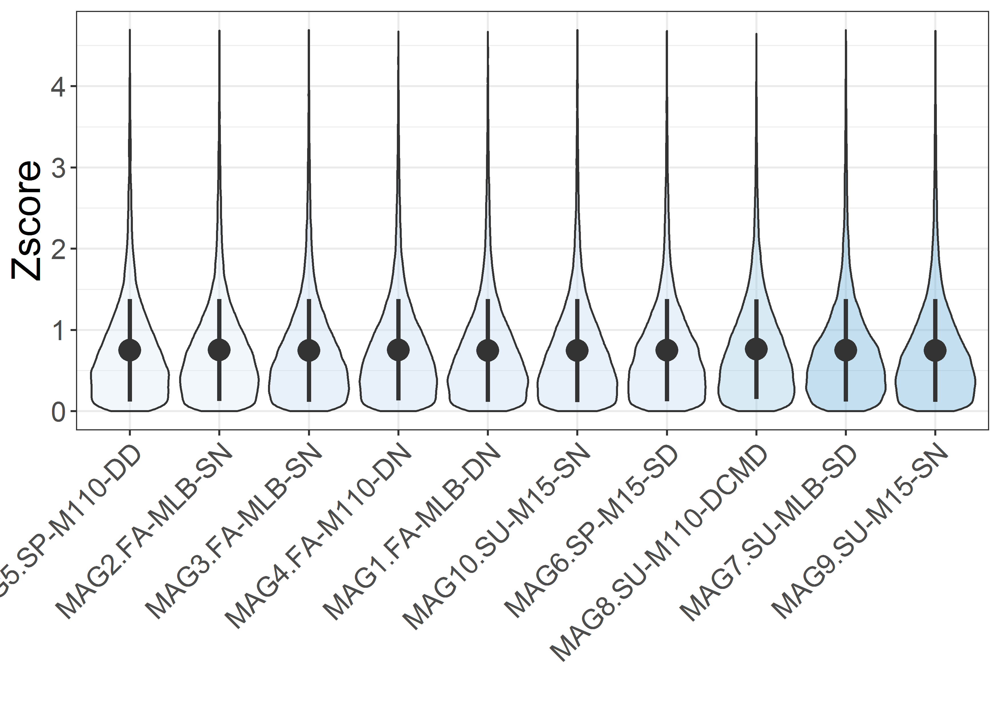

## Run DESeq  

__Don't forget:__   
__In order to benefit from the default settings of the package, you should put__ 
__the variable of interest at the end of the formula and make sure the control__ 
__level is the first level.__ 

Manual can be found [here](file:///C:/Users/rprops/Desktop/metaG_lakeMI/Limno_lakeMI/Analysis.html#run_deseq)  


```r
# Format data for DESeq2
## Put count matrices in list including a count matrix for each bin 
expr_cov_bins <- list()
for(i in 1:nlevels(expr_cov_long$Genome_ID)){
  expr_cov_bins[[i]] <-  expr_cov_long %>% 
  dplyr::filter(Genome_ID == levels(expr_cov_long$Genome_ID)[i]) %>% 
  dplyr::select(gene_oid, Sample, mapped_reads) %>% 
  tidyr::spread(Sample, mapped_reads)
  r.bin <- expr_cov_bins[[i]]$gene_oid
  expr_cov_bins[[i]] <- as.matrix(expr_cov_bins[[i]][, -1])
  rownames(expr_cov_bins[[i]]) <- r.bin
}

# Check order of colnames in count and rownames in metadata matrix 
# and make sure these are in the same order!
meta_metaT <- as.matrix(meta_metaT)
meta_metaT <- meta_metaT[match(colnames(expr_cov_bins[[1]]), rownames(meta_metaT)), ]
all(rownames(meta_metaT) %in% colnames(expr_cov_bins[[1]]))
```

```
## [1] TRUE
```

```r
# Perform DESeq2 for differential abundance testing for each genome separately
sel_env <- meta_metaT[, "Site"] == "110" & meta_metaT[, "Depth"] != "Mid" & meta_metaT[, "Season"] != "Spring" & meta_metaT[, "Time"] == "Night"
expr_cov_MAG8[[1]] <- expr_cov_MAG8[[1]][, sel_env]
```

```
## Error in eval(expr, envir, enclos): object 'expr_cov_MAG8' not found
```

```r
meta_metaT_subs <- meta_metaT[sel_env, ]
for(i in 1:nlevels(expr_cov_long$Genome_ID)){
}


## Season effect
General_deseq_results_season <- list()
deseq_comparisons_season <- list()
for(i in 1:nlevels(expr_cov_long$Genome_ID)){
  cat(" --- Running DESeq2 on Genome_ID:",levels(expr_cov_long$Genome_ID)[i], "\n",sep = " ")

  # Test for season but controlling for site
  dds <- DESeq2::DESeqDataSetFromMatrix(countData = expr_cov_bins[[i]],
                              colData = meta_metaT,
                              design= ~ Site + Season) 
  # Run DESeq
  dds <- DESeq2::DESeq(dds, quiet = TRUE)
  
  # Calculate contrasts for all comparisons
  comp1 <- DESeq2::results(dds, contrast=c("Season","Fall","Summer"))[order(results(dds)$padj), ]
  comp2 <- DESeq2::results(dds, contrast=c("Season","Fall","Spring"))[order(results(dds)$padj), ]
  comp3 <- DESeq2::results(dds, contrast=c("Season","Spring","Summer"))[order(results(dds)$padj), ]
  
  # Store data in single list with dataframes
  General_deseq_results_season[[i]] <- rbind(comp1, comp2, comp3)
  deseq_comparisons_season[[i]] <- data.frame(comparison = 
                                           c(rep("Fall-Summer", nrow(comp1)),
                                           rep("Fall-Spring", nrow(comp2)),
                                           rep("Spring-Summer", nrow(comp3))),
                                         design = "~ Site + Season"
                                         )
}
```

```
##  --- Running DESeq2 on Genome_ID: 2757320395 
##  --- Running DESeq2 on Genome_ID: 2757320396 
##  --- Running DESeq2 on Genome_ID: 2757320397 
##  --- Running DESeq2 on Genome_ID: 2757320398 
##  --- Running DESeq2 on Genome_ID: 2757320399 
##  --- Running DESeq2 on Genome_ID: 2757320400 
##  --- Running DESeq2 on Genome_ID: 2757320401 
##  --- Running DESeq2 on Genome_ID: 2757320402 
##  --- Running DESeq2 on Genome_ID: 2757320403 
##  --- Running DESeq2 on Genome_ID: 2757320404
```

```r
## Site effect
General_deseq_results_site <- list()
deseq_comparisons_site <- list()
for(i in 1:nlevels(expr_cov_long$Genome_ID)){
  cat(" --- Running DESeq2 on Genome_ID:",levels(expr_cov_long$Genome_ID)[i], "\n",sep = " ")
  dds <- DESeq2::DESeqDataSetFromMatrix(countData = expr_cov_bins[[i]],
                              colData = meta_metaT,
                              design= ~ Season + Site) # Test for site but controlling for season
  dds <- DESeq2::DESeq(dds, quiet = TRUE)
  
    # Calculate contrasts for all comparisons
  comp1 <- DESeq2::results(dds, 
                   contrast=c("Site","Buoy","110"))[order(results(dds)$padj), ]
  comp2 <- DESeq2::results(dds, 
                   contrast=c("Site","Buoy","15"))[order(results(dds)$padj), ]
  comp3 <- DESeq2::results(dds, 
                   contrast=c("Site","15","110"))[order(results(dds)$padj), ]
  
  # Store data in single list with dataframes
  General_deseq_results_site[[i]] <- rbind(comp1, comp2, comp3)
  deseq_comparisons_site[[i]] <- data.frame(comparison = 
                                           c(rep("Muskegon Lake\nVs\nM110",
                                                 nrow(comp1)),
                                           rep("Muskegon Lake\nVs\nM15", 
                                               nrow(comp2)),
                                           rep("M15\nVs\nM110", 
                                               nrow(comp3))),
                                         design = "~ Season + Site"
  )
}
```

```
##  --- Running DESeq2 on Genome_ID: 2757320395 
##  --- Running DESeq2 on Genome_ID: 2757320396 
##  --- Running DESeq2 on Genome_ID: 2757320397 
##  --- Running DESeq2 on Genome_ID: 2757320398 
##  --- Running DESeq2 on Genome_ID: 2757320399 
##  --- Running DESeq2 on Genome_ID: 2757320400 
##  --- Running DESeq2 on Genome_ID: 2757320401 
##  --- Running DESeq2 on Genome_ID: 2757320402 
##  --- Running DESeq2 on Genome_ID: 2757320403 
##  --- Running DESeq2 on Genome_ID: 2757320404
```

```r
## Depth effect
General_deseq_results_depth <- list()
deseq_comparisons_depth <- list()
for(i in 1:nlevels(expr_cov_long$Genome_ID)){
  cat(" --- Running DESeq2 on Genome_ID:",levels(expr_cov_long$Genome_ID)[i], "\n",sep = " ")

  # Test for Depth but controlling for site
  dds <- DESeq2::DESeqDataSetFromMatrix(countData = expr_cov_bins[[i]],
                              colData = meta_metaT,
                              design= ~ Site + Depth) 
  # Run DESeq
  dds <- DESeq2::DESeq(dds, quiet = TRUE)
  
  # Calculate contrasts for all comparisons
  comp1 <- DESeq2::results(dds, contrast=c("Depth","Surface","Deep"))[order(results(dds)$padj), ]
  comp2 <- DESeq2::results(dds, contrast=c("Depth","Mid","Deep"))[order(results(dds)$padj), ]
  comp3 <- DESeq2::results(dds, contrast=c("Depth","Surface","Mid"))[order(results(dds)$padj), ]
  
  # Store data in single list with dataframes
  General_deseq_results_depth[[i]] <- rbind(comp1, comp2, comp3)
  deseq_comparisons_depth[[i]] <- data.frame(comparison = 
                                           c(rep("Surface-Deep", nrow(comp1)),
                                           rep("Mid-Deep", nrow(comp2)),
                                           rep("Surface-Mid", nrow(comp3))),
                                         design = "~ Site + Depth"
                                         )
}
```

```
##  --- Running DESeq2 on Genome_ID: 2757320395 
##  --- Running DESeq2 on Genome_ID: 2757320396 
##  --- Running DESeq2 on Genome_ID: 2757320397 
##  --- Running DESeq2 on Genome_ID: 2757320398 
##  --- Running DESeq2 on Genome_ID: 2757320399 
##  --- Running DESeq2 on Genome_ID: 2757320400 
##  --- Running DESeq2 on Genome_ID: 2757320401 
##  --- Running DESeq2 on Genome_ID: 2757320402 
##  --- Running DESeq2 on Genome_ID: 2757320403 
##  --- Running DESeq2 on Genome_ID: 2757320404
```

```r
# Pool results for each genome into a single result dataframe
res_deseq <- data.frame()

for(i in 1:length(General_deseq_results_season)){
  tmp <- data.frame(gene_oid = General_deseq_results_season[[i]]@rownames,
                    baseMean = General_deseq_results_season[[i]]@listData$baseMean,
                    log2FoldChange = General_deseq_results_season[[i]]@listData$log2FoldChange,
                    pvalue = General_deseq_results_season[[i]]@listData$pvalue,
                    padj = General_deseq_results_season[[i]]@listData$padj,
                    Genome_ID = levels(expr_cov_long$Genome_ID)[i],
                    Comparison = deseq_comparisons_season[[i]]$comparison,
                    Design = deseq_comparisons_season[[i]]$design)
  if(i == 1) res_deseq <- tmp else{
    res_deseq <- rbind(res_deseq, tmp)
  }
}
for(i in 1:length(General_deseq_results_site)){
  tmp <- data.frame(gene_oid = General_deseq_results_site[[i]]@rownames,
                    baseMean = General_deseq_results_site[[i]]@listData$baseMean,
                    log2FoldChange = General_deseq_results_site[[i]]@listData$log2FoldChange,
                    pvalue = General_deseq_results_site[[i]]@listData$pvalue,
                    padj = General_deseq_results_site[[i]]@listData$padj,
                    Genome_ID = levels(expr_cov_long$Genome_ID)[i],
                    Comparison = deseq_comparisons_site[[i]]$comparison,
                    Design = deseq_comparisons_site[[i]]$design)
  res_deseq <- rbind(res_deseq, tmp)
}

for(i in 1:length(General_deseq_results_depth)){
  tmp <- data.frame(gene_oid = General_deseq_results_depth[[i]]@rownames,
                    baseMean = General_deseq_results_depth[[i]]@listData$baseMean,
                    log2FoldChange = General_deseq_results_depth[[i]]@listData$log2FoldChange,
                    pvalue = General_deseq_results_depth[[i]]@listData$pvalue,
                    padj = General_deseq_results_depth[[i]]@listData$padj,
                    Genome_ID = levels(expr_cov_long$Genome_ID)[i],
                    Comparison = deseq_comparisons_depth[[i]]$comparison,
                    Design = deseq_comparisons_depth[[i]]$design)
  res_deseq <- rbind(res_deseq, tmp)
}

# Only retain significantly differentially expressed genes
res_deseq <- res_deseq %>% dplyr::filter(padj < 0.01)

new_bin_names2 <- read.table("./anvio_output/rebin/general_bins_summary_selected_final.tsv", header = TRUE)[, c(3,8:10)]; new_bin_names2$IMG_taxID <- as.character(new_bin_names2$IMG_taxID)
res_deseq <- left_join(res_deseq, new_bin_names2, by = c("Genome_ID" = "IMG_taxID"))
res_deseq$new_bin_name <- as.character(res_deseq$new_bin_name)
res_deseq$new_bin_name <- factor(res_deseq$new_bin_name, levels =
                                      c("MAG1.FA-MLB-DN","MAG2.FA-MLB-SN",
                                        "MAG3.FA-MLB-SN", "MAG4.FA-M110-DN",
                                        "MAG5.SP-M110-DD", "MAG6.SP-M15-SD",
                                        "MAG7.SU-MLB-SD", "MAG8.SU-M110-DCMD",
                                        "MAG9.SU-M15-SN", "MAG10.SU-M15-SN"))
res_deseq$regulation <- res_deseq$log2FoldChange > 0
res_deseq$regulation[res_deseq$regulation == "TRUE"] <- "upregulation"
res_deseq$regulation[res_deseq$regulation == "FALSE"] <- "downregulation"

# Add KO/COG/pfam/tigrfam gene annotations to DeSEQ2 results
res_deseq_anott <- dplyr::left_join(res_deseq, merged_file_annot, by = c("gene_oid"))

metaT_reads_mapped <- expr_cov_long %>% 
  group_by(Sample, Genome_ID) %>% 
  dplyr::summarise(sum_mapped_reads = sum(mapped_reads))

metaT_reads_mapped <- left_join(metaT_reads_mapped, new_bin_names2, by = c("Genome_ID" = "IMG_taxID"))
metaT_reads_mapped$new_bin_name <- as.character(metaT_reads_mapped$new_bin_name)
metaT_reads_mapped$new_bin_name <- factor(metaT_reads_mapped$new_bin_name, 
                                          levels =
                                      c("MAG1.FA-MLB-DN","MAG2.FA-MLB-SN",
                                        "MAG3.FA-MLB-SN", "MAG4.FA-M110-DN",
                                        "MAG5.SP-M110-DD", "MAG6.SP-M15-SD",
                                        "MAG7.SU-MLB-SD", "MAG8.SU-M110-DCMD",
                                        "MAG9.SU-M15-SN", "MAG10.SU-M15-SN"))

p_deseq_reads <- ggplot2::ggplot(metaT_reads_mapped, aes(x = new_bin_name, y = sum_mapped_reads, fill = new_bin_name))+
  geom_bar(color = "black", stat = "identity")+
  theme_bw()+
  scale_fill_brewer(palette = "Paired")+
  theme(axis.text.x = element_blank(),
        axis.text.y = element_text(size = 14),
        legend.title = element_blank(),
        axis.title = element_text(size = 14),
        strip.text = element_text(size = 12),
        axis.title.x = element_blank())+
  ylab("Number of mapped reads")+
  xlab("")+
  facet_wrap(~Sample, nrow = 4)

print(p_deseq_reads)
```


```r
selected_ko <- c("Carbohydrate metabolism", "Energy metabolism",
                 "Amino acid metabolism", "Membrane transport",
                 "Replication and repair", "Translation",
                 "Energy metabolism")
# for(genome in levels(unique(res_deseq_anott$new_bin_name))){
p_deseq_1 <- res_deseq_anott %>% dplyr::filter(!is.na(ko_id) & ko_level_B %in% selected_ko & Design == "~ Season + Site") %>% 
  ggplot2::ggplot(aes(x = ko_level_C, fill = ko_level_B))+
  geom_bar(color = "black")+
  theme_bw()+
  scale_fill_brewer("", palette = "Paired")+
  theme(axis.text.x =  element_text(size = 10.5, angle = 45, hjust =1),
        axis.text.y = element_text(size = 14),
        legend.title = element_blank(),
        axis.title = element_text(size = 14),
        strip.text = element_text(size = 14)) +
  ylab("Number of genes")+
  xlab("")+
  facet_wrap(~new_bin_name, ncol = 2)+
  guides(fill = FALSE)+
  ggtitle("Muskegon lake vs. M110")

print(p_deseq_1)
```

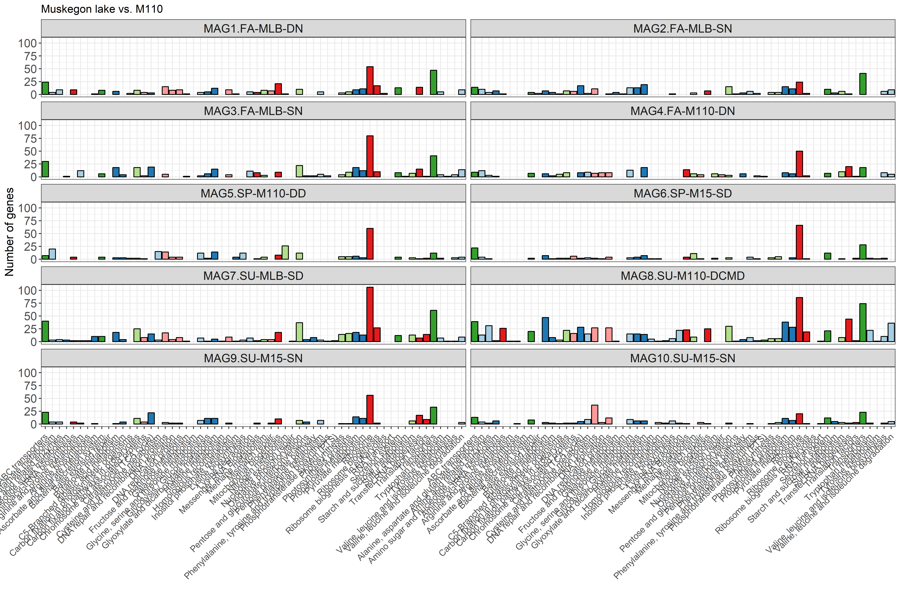

```r
# }

# Plot for each genome the number of differentially expressed genes according to:
# season and site
# p_deseq_1 <- ggplot2::ggplot(res_deseq, aes(x = new_bin_name, fill = new_bin_name))+
#   geom_bar(color = "black")+
#   theme_bw()+
#   scale_fill_brewer(palette = "Paired")+
#   theme(axis.text.x = element_blank(),
#         axis.text.y = element_text(size = 14),
#         legend.title = element_blank(),
#         axis.title = element_text(size = 14),
#         strip.text = element_text(size = 14)) +
#   ylab("Number of mapped reads")+
#   xlab("")+
#   facet_grid(Design~Comparison)
# 
# print(p_deseq_1)

# p_deseq_2 <- ggplot2::ggplot(res_deseq, aes(x = new_bin_name, shape = regulation,
#                                             y = log2FoldChange))+
#   # geom_jitter(size = 3, width = 0.25, shape = 21)+
#   geom_boxplot(alpha= 1, aes(fill = new_bin_name))+
#   theme_bw()+
#   scale_fill_brewer(palette = "Paired")+
#   theme(axis.text.x = element_blank(),
#         axis.text.y = element_text(size = 14),
#         legend.title = element_blank(),
#         axis.title = element_text(size = 14),
#         strip.text = element_text(size = 14))+
#   ylab("log2FoldChange")+
#   xlab("")+
#   facet_grid(Design~Comparison)+
#   guides(shape = FALSE)
# 
# print(p_deseq_2)
```

### Overview figure


```r
res_deseq_anott_changed <- res_deseq_anott
res_deseq_anott_changed$new_bin_name <- factor(res_deseq_anott_changed$new_bin_name,
                                               levels =
                                      c("MAG5.SP-M110-DD","MAG2.FA-MLB-SN",
                                        "MAG3.FA-MLB-SN", "MAG4.FA-M110-DN",
                                        "MAG1.FA-MLB-DN", "MAG10.SU-M15-SN",
                                        "MAG6.SP-M15-SD", "MAG8.SU-M110-DCMD",
                                        "MAG7.SU-MLB-SD","MAG9.SU-M15-SN"))

  
p_deseq_overview <- res_deseq_anott_changed %>% 
  dplyr::select(gene_oid, log2FoldChange, new_bin_name, Comparison, Design) %>% 
  dplyr::filter(Design == "~ Season + Site" 
                & Comparison == "Muskegon Lake\nVs\nM110") %>% 
  ggplot2::ggplot(aes(x = new_bin_name, y= abs(log2FoldChange)))+
  geom_boxplot(fill = "#333333", alpha = 0.5, outlier.shape = NA, size = 1.25)+
  theme_bw()+
  scale_fill_brewer("", palette = "Paired")+
  theme(axis.text.x =  element_text(size = 14),
        axis.text.y = element_text(size = 14),
        legend.title = element_blank(),
        axis.title = element_text(size = 14),
        strip.text = element_text(size = 14))+
  ylab("log2FoldChange")+
  ylim(0,5)+
  xlab("")+
  guides(fill = FALSE)+
  coord_flip()

print(p_deseq_overview)
```

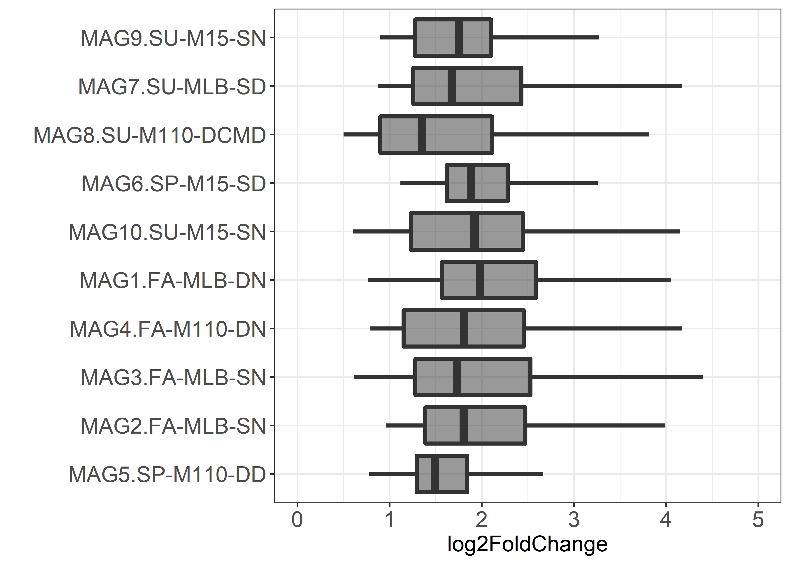

```r
# Add up and down regulation
res_deseq_anott_changed$regulation <- res_deseq_anott_changed$log2FoldChange > 0
res_deseq_anott_changed$regulation[res_deseq_anott_changed$regulation == TRUE] <- "Upregulated"
res_deseq_anott_changed$regulation[res_deseq_anott_changed$regulation == FALSE] <- "Downregulated"

p_deseq_overview2 <- res_deseq_anott_changed %>% 
  dplyr::select(gene_oid, log2FoldChange, new_bin_name, Comparison, Design) %>% 
  dplyr::filter(Design == "~ Site + Season" 
                & Comparison == "Fall-Spring") %>% 
  ggplot2::ggplot(aes(x = new_bin_name, y= log2FoldChange, fill = regulation))+
  geom_boxplot(fill = "#333333", alpha = 0.5, outlier.shape = NA, size = 1.25)+
  # geom_violin(fill = "#333333", alpha = 0.5, scale = "count")+
  theme_bw()+
  # scale_fill_brewer("", palette = "Paired")+
  theme(axis.text.x =  element_text(size = 14),
        axis.text.y = element_text(size = 14),
        legend.title = element_blank(),
        axis.title = element_text(size = 20),
        strip.text = element_text(size = 14))+
  ylab("log2FoldChange")+
  ylim(0,5)+
  xlab("")+
  guides(fill = FALSE)+
  coord_flip()
  # stat_summary(fun.data=mean_sdl, fun.args = list(mult = 1),
  #                geom="pointrange", color="#333333", size = 1.5)

print(p_deseq_overview2)
```

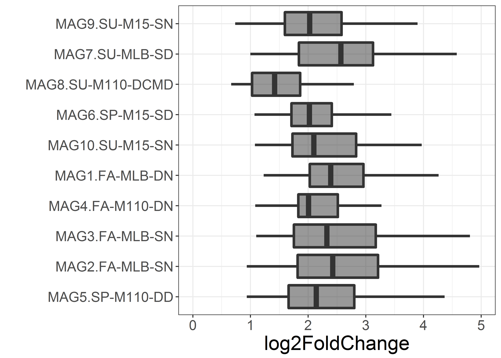

```r
p_deseq_overview3 <- res_deseq_anott_changed %>% 
  dplyr::select(gene_oid, log2FoldChange, new_bin_name, Comparison, Design,
                regulation) %>% 
  dplyr::filter(Design == "~ Site + Season" 
                & Comparison == "Fall-Spring") %>% 
  ggplot2::ggplot(aes(x = new_bin_name, y= log2FoldChange, fill = regulation))+
  geom_boxplot( alpha = 0.5, outlier.shape = NA, size = 1.25)+
  # geom_violin(fill = "#333333", alpha = 0.5, scale = "count")+
  theme_bw()+
  # scale_fill_brewer("", palette = "Paired")+
  theme(axis.text.x =  element_text(size = 14),
        axis.text.y = element_text(size = 14),
        legend.title = element_blank(),
        axis.title = element_text(size = 20),
        strip.text = element_text(size = 14))+
  ylab("log2FoldChange")+
  ylim(-5,5)+
  xlab("")+
  guides(fill = FALSE)+
  coord_flip()
  # stat_summary(fun.data=mean_sdl, fun.args = list(mult = 1),
  #                geom="pointrange", color="#333333", size = 1.5)

print(p_deseq_overview3)
```

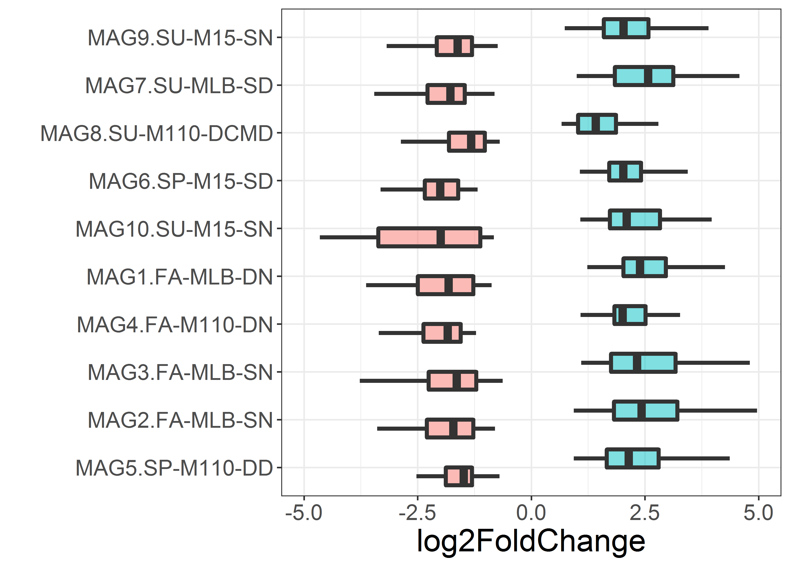

```r
res_deseq_anott_changed %>% 
    dplyr::select(gene_oid, new_bin_name, Comparison, Design) %>% 
    dplyr::filter(Design == "~ Site + Season" 
                & Comparison == "Fall-Spring") %>% 
  distinct() %>% 
  group_by(new_bin_name) %>% summarise(sum_genes = n())
```

```
## # A tibble: 10 x 2
##    new_bin_name      sum_genes
##    <fct>                 <int>
##  1 MAG5.SP-M110-DD          77
##  2 MAG2.FA-MLB-SN          247
##  3 MAG3.FA-MLB-SN          150
##  4 MAG4.FA-M110-DN          84
##  5 MAG1.FA-MLB-DN           79
##  6 MAG10.SU-M15-SN          62
##  7 MAG6.SP-M15-SD           69
##  8 MAG8.SU-M110-DCMD        75
##  9 MAG7.SU-MLB-SD          151
## 10 MAG9.SU-M15-SN          247
```

```r
# Run statistics
test <- res_deseq_anott_changed %>% 
  dplyr::select(gene_oid, log2FoldChange, new_bin_name, Comparison, Design,
                regulation) %>% 
  dplyr::filter(Design == "~ Site + Season" 
                & Comparison == "Fall-Spring") 

pairwise.wilcox.test(test$log2FoldChange, g = test$new_bin_name,
                   p.adjust = "hochberg")
```

```
## 
## 	Pairwise comparisons using Wilcoxon rank sum test 
## 
## data:  test$log2FoldChange and test$new_bin_name 
## 
##                   MAG5.SP-M110-DD MAG2.FA-MLB-SN MAG3.FA-MLB-SN
## MAG2.FA-MLB-SN    0.69305         -              -             
## MAG3.FA-MLB-SN    0.99860         0.01815        -             
## MAG4.FA-M110-DN   0.84676         0.99860        0.01865       
## MAG1.FA-MLB-DN    0.29879         0.99860        0.01923       
## MAG10.SU-M15-SN   0.99860         0.07291        0.99860       
## MAG6.SP-M15-SD    0.99860         0.99860        0.99860       
## MAG8.SU-M110-DCMD 0.63177         9.6e-07        0.09017       
## MAG7.SU-MLB-SD    0.01369         1.3e-08        0.59756       
## MAG9.SU-M15-SN    0.06185         9.7e-14        0.11481       
##                   MAG4.FA-M110-DN MAG1.FA-MLB-DN MAG10.SU-M15-SN
## MAG2.FA-MLB-SN    -               -              -              
## MAG3.FA-MLB-SN    -               -              -              
## MAG4.FA-M110-DN   -               -              -              
## MAG1.FA-MLB-DN    0.99860         -              -              
## MAG10.SU-M15-SN   0.05425         0.04236        -              
## MAG6.SP-M15-SD    0.99860         0.99860        0.69803        
## MAG8.SU-M110-DCMD 3.9e-10         0.00013        0.55235        
## MAG7.SU-MLB-SD    9.0e-06         3.6e-05        0.99860        
## MAG9.SU-M15-SN    2.5e-11         7.9e-07        0.99860        
##                   MAG6.SP-M15-SD MAG8.SU-M110-DCMD MAG7.SU-MLB-SD
## MAG2.FA-MLB-SN    -              -                 -             
## MAG3.FA-MLB-SN    -              -                 -             
## MAG4.FA-M110-DN   -              -                 -             
## MAG1.FA-MLB-DN    -              -                 -             
## MAG10.SU-M15-SN   -              -                 -             
## MAG6.SP-M15-SD    -              -                 -             
## MAG8.SU-M110-DCMD 2.0e-05        -                 -             
## MAG7.SU-MLB-SD    0.04236        0.99860           -             
## MAG9.SU-M15-SN    0.00033        0.99860           0.99860       
## 
## P value adjustment method: hochberg
```

```r
# Run statistics
test <- res_deseq_anott_changed %>%
  dplyr::select(gene_oid, log2FoldChange, new_bin_name, Comparison, Design,
                regulation) %>%
  dplyr::filter(Design == "~ Season + Site"
                & Comparison == "Muskegon Lake\nVs\nM110" &
                  new_bin_name == "MAG8.SU-M110-DCMD") %>% 
  distinct()
```

## Run MAG8-DESeq


```r
# Select MAG8 genome and temperature gradient
expr_cov_MAG8 <- expr_cov_bins[levels(expr_cov_long$Genome_ID) == "2757320398"]
sel_MAG8 <- meta_metaT[, "Site"] == "110" & meta_metaT[, "Depth"] != "Mid" & meta_metaT[, "Season"] != "Spring" & meta_metaT[, "Time"] == "Night"
expr_cov_MAG8[[1]] <- expr_cov_MAG8[[1]][, sel_MAG8]
meta_metaT_MAG8 <- meta_metaT[sel_MAG8, ]


## Depth (temperature effect) effect and control for Seasonal variation
dds <- DESeq2::DESeqDataSetFromMatrix(countData = expr_cov_MAG8[[1]],
                              colData = meta_metaT_MAG8,
                              design= ~ Season + Depth)
# Run DESeq
dds <- DESeq2::DESeq(dds, quiet = TRUE)
  
# Calculate contrasts for all comparisons (deep vs surface logFC)
comp1 <- DESeq2::results(dds, 
                         contrast=c("Depth", "Deep","Surface"))[order(DESeq2::results(dds)$padj), ]
# comp2 <- DESeq2::results(dds, contrast=c("Time.Depth", "Night.Deep", "Night.Surface"))[order(results(dds)$padj), ]

# Store data in single dataframes
MAG8_deseq_results_depth_comp1 <- data.frame(gene_oid = comp1@rownames,
                    baseMean = comp1@listData$baseMean,
                    log2FoldChange = comp1@listData$log2FoldChange,
                    pvalue = comp1@listData$pvalue,
                    padj = comp1@listData$padj,
                    Genome_ID = "2757320398",
                    Comparison = "Day.Deep - Day.Surface",
                    Time_of_day = "Day"
)

# MAG8_deseq_results_depth_comp2 <- data.frame(gene_oid = comp2@rownames,
#                     baseMean = comp2@listData$baseMean,
#                     log2FoldChange = comp2@listData$log2FoldChange,
#                     pvalue = comp2@listData$pvalue,
#                     padj = comp2@listData$padj,
#                     Genome_ID = "2757320398",
#                     Comparison = "Night.Deep - Night.Surface",
#                     Time_of_day = "Night"
# )
# MAG8_deseq_results_depth <- rbind(MAG8_deseq_results_depth_comp1,
                                  # MAG8_deseq_results_depth_comp2)

MAG8_deseq_results_depth <- MAG8_deseq_results_depth_comp1

# Filter at p < 0.01
MAG8_deseq_results_depth <- MAG8_deseq_results_depth %>% dplyr::filter(padj < 0.01)
```


```r
# Select MAG8 genome and MLB vs M110 at the surface
expr_cov_MAG8 <- expr_cov_bins[levels(expr_cov_long$Genome_ID) == "2757320398"]
sel_MAG8 <- meta_metaT[, "Depth"] == "Surface"
expr_cov_MAG8[[1]] <- expr_cov_MAG8[[1]][, sel_MAG8]
meta_metaT_MAG8 <- meta_metaT[sel_MAG8, ]


## Depth (temperature effect) effect and control for Seasonal variation
dds <- DESeq2::DESeqDataSetFromMatrix(countData = expr_cov_MAG8[[1]],
                              colData = meta_metaT_MAG8,
                              design= ~ Season + Site)
# Run DESeq
dds <- DESeq2::DESeq(dds, quiet = TRUE)
  
# Calculate contrasts for all comparisons (deep vs surface logFC)
comp1 <- DESeq2::results(dds, contrast=c("Site", "110", "Buoy"))[order(DESeq2::results(dds)$padj), ]
# comp2 <- DESeq2::results(dds, contrast=c("Time.Depth", "Night.Deep", "Night.Surface"))[order(results(dds)$padj), ]

# Store data in single dataframes
MAG8_deseq_results_nutrient_comp1 <- data.frame(gene_oid = comp1@rownames,
                    baseMean = comp1@listData$baseMean,
                    log2FoldChange = comp1@listData$log2FoldChange,
                    pvalue = comp1@listData$pvalue,
                    padj = comp1@listData$padj,
                    Genome_ID = "2757320398",
                    Comparison = "M110 - MLB"
)

MAG8_deseq_results_nutrient <- MAG8_deseq_results_nutrient_comp1

# Filter at p < 0.01
MAG8_deseq_results_nutrient <- MAG8_deseq_results_nutrient %>% dplyr::filter(padj < 0.01)

# Check share DE genes between MLB/M110 and bottom/surface M110
sum(MAG8_deseq_results_nutrient$gene_oid %in% MAG8_deseq_results_depth$gene_oid)
```

```
## [1] 13
```

```r
sum(!MAG8_deseq_results_nutrient$gene_oid %in% MAG8_deseq_results_depth$gene_oid)
```

```
## [1] 146
```

```r
sum(MAG8_deseq_results_depth$gene_oid %in% MAG8_deseq_results_nutrient$gene_oid)
```

```
## [1] 13
```

```r
sum(!MAG8_deseq_results_depth$gene_oid %in% MAG8_deseq_results_nutrient$gene_oid)
```

```
## [1] 164
```


```r
# Merge with Kegg and COG annotations
# Import COG mapping file
cogid_2_cogcat <- read.csv("./Mapping_files/cogid_2_cogcat.csv", sep = ",", header = FALSE, fill = TRUE,col.names = c("COG_ID", "COG_class", "function"))[, 1:2]
cogid_2_cogcat <- cogid_2_cogcat[(cogid_2_cogcat$COG_class)!="", ]
cogid_2_cogcat <- droplevels(cogid_2_cogcat)

# Read COG category file
cog_categories <- read.table("./Mapping_files/cog_categories.tsv", header = TRUE, sep = "\t")

# Merge COG metadata
cog_meta <- dplyr::left_join(cog_categories, cogid_2_cogcat, by = c("COG_class" = "COG_class"))
cog_meta <- droplevels(cog_meta)

# Import KO hierarchical data
ko_path_df <- format_ko(path = "./Mapping_files/ko00000.keg")

# Import COG and KEGG annotation data of MAG8
MAG8_KO <- read.table("./IMG_annotation/IMG_2757320398/IMG Data/2757320398/2757320398.ko.tab.txt",
                              header = TRUE, fill = TRUE, sep = "\t" )
MAG8_KO$ko_id <- gsub("KO:", "", MAG8_KO$ko_id)

MAG8_COG <- read.table("./IMG_annotation/IMG_2757320398/IMG Data/2757320398/2757320398.cog.tab.txt",
                              stringsAsFactors = FALSE,  
                       sep = "\t", header = TRUE,
                       quote=NULL, comment='')

# add hierarchy to cog and KO annotations
MAG8_KO <- left_join(MAG8_KO, ko_path_df, by = "ko_id")
MAG8_COG <- left_join(MAG8_COG, cog_meta, by = c("cog_id" = "COG_ID"))

# Merge annotations and remove duplicate columns
MAG8_annot <- full_join(MAG8_KO[, c(1,10:11, 14:18)], 
                        MAG8_COG[, c(1,10:11, 13:15)], by = "gene_oid")
MAG8_annot$gene_oid <- as.character(MAG8_annot$gene_oid)

# Annotate differentially expressed genes
MAG8_deseq_results_depth_fin <- left_join(MAG8_deseq_results_depth, MAG8_annot,
                                      by = c("gene_oid") ) %>% distinct()
MAG8_deseq_results_nutrient_fin <- left_join(MAG8_deseq_results_nutrient, MAG8_annot,
                                      by = c("gene_oid") ) %>% distinct()
# Change NA to unknown
MAG8_deseq_results_depth_fin[,9:20] <- apply(MAG8_deseq_results_depth_fin[,9:20], 
                                             2, function(x) as.character(x))
MAG8_deseq_results_nutrient_fin[,8:19] <- apply(MAG8_deseq_results_nutrient_fin[,8:19], 
                                             2, function(x) as.character(x))
MAG8_deseq_results_depth_fin[is.na(MAG8_deseq_results_depth_fin)] <- "Unknown"
MAG8_deseq_results_nutrient_fin[is.na(MAG8_deseq_results_nutrient_fin)] <- "Unknown"

# Add label for up or downregulation
MAG8_deseq_results_depth_fin$regulation <- MAG8_deseq_results_depth_fin$log2FoldChange > 0
MAG8_deseq_results_depth_fin$regulation[MAG8_deseq_results_depth_fin$regulation == TRUE] <- "Upregulated"
MAG8_deseq_results_depth_fin$regulation[MAG8_deseq_results_depth_fin$regulation == FALSE] <- "Downregulated"
MAG8_deseq_results_depth_fin$regulation <- factor(MAG8_deseq_results_depth_fin$regulation,
                                                  levels =
                                         c("Upregulated", "Downregulated"))

MAG8_deseq_results_nutrient_fin$regulation <-
  MAG8_deseq_results_nutrient_fin$log2FoldChange > 0
MAG8_deseq_results_nutrient_fin$regulation[MAG8_deseq_results_nutrient_fin$regulation == TRUE] <- "Upregulated"
MAG8_deseq_results_nutrient_fin$regulation[MAG8_deseq_results_nutrient_fin$regulation == FALSE] <- "Downregulated"
MAG8_deseq_results_nutrient_fin$regulation <-
  factor(MAG8_deseq_results_nutrient_fin$regulation,
         levels =c("Upregulated", "Downregulated"))
```


```r
# Overview
## Log fold changes deep vs surface
p_mag8_deseq_ov <- MAG8_deseq_results_depth_fin %>% 
  dplyr::select(gene_oid:Time_of_day) %>% 
  distinct() %>% 
  ggplot(aes(x = gene_oid, y = log2FoldChange, fill = log2FoldChange))+
  geom_bar(size = 0.1, stat = "identity", color = "black")+
  # geom_boxplot(alpha = 0.5)+
 scale_fill_distiller(palette = "RdBu", name = "Fold Change",
                       limits = c(-15,15), oob=squish,
                      direction = -1) +
  theme_bw()+
  facet_grid(Time_of_day~.)+
  theme(axis.text.x = element_blank())+
  labs(x = "", y = "Fold Change (log2)")

print(p_mag8_deseq_ov)
```


```r
# Focus on COG annotation and pool per level
p_mag8_deseq_cog <- MAG8_deseq_results_depth_fin %>% dplyr::select(gene_oid:Time_of_day, contains("cog")) %>% 
  distinct() %>% 
  ggplot(aes(x = COG_functional_category, y = log2FoldChange, fill = log2FoldChange))+
  geom_point(size = 3, color = "black", shape = 21)+
  # geom_boxplot(alpha = 0.5)+
 scale_fill_distiller(palette = "RdBu", name = "Fold Change",
                       limits = c(-15,15), oob=squish,
                      direction = -1) +
  theme_bw()+
  facet_grid(Time_of_day~.)+
  theme(axis.text.x = element_text(size = 12, angle = 90, hjust = 1))+
  labs(x = "", y = "Fold Change (log2)")

print(p_mag8_deseq_cog)
```


```r
p_mag8_deseq_nutrient_cog <- MAG8_deseq_results_nutrient_fin %>% dplyr::select(gene_oid:Comparison, contains("cog")) %>% 
  distinct() %>% 
  ggplot(aes(x = COG_functional_category, y = log2FoldChange, fill = log2FoldChange))+
  geom_point(size = 3, color = "black", shape = 21)+
  # geom_boxplot(alpha = 0.5)+
 scale_fill_distiller(palette = "RdBu", name = "Fold Change",
                       limits = c(-15,15), oob=squish,
                      direction = -1) +
  theme_bw()+
  theme(axis.text.x = element_text(size = 12, angle = 90, hjust = 1))+
  labs(x = "", y = "Fold Change (log2)")

print(p_mag8_deseq_temp_cog)
```

```
## Error in print(p_mag8_deseq_temp_cog): object 'p_mag8_deseq_temp_cog' not found
```

```r
# Focus on KO annotation and pool per level
p_mag8_deseq_KO <- MAG8_deseq_results_depth_fin %>% 
  dplyr::select(gene_oid:Time_of_day, contains("ko")) %>% 
  distinct() %>% 
  ggplot(aes(x = ko_level_B, y = log2FoldChange, fill = log2FoldChange))+
  geom_point(size = 3, color = "black", shape = 21)+
  # geom_boxplot(alpha = 0.5)+
 scale_fill_distiller(palette = "RdBu", name = "Fold Change",
                       limits = c(-15,15), oob=squish,
                      direction = -1) +
  theme_bw()+
  facet_grid(Time_of_day~.)+
  theme(axis.text.x = element_text(size = 12, angle = 90, hjust = 1))+
  labs(x = "", y = "Fold Change (log2)")

print(p_mag8_deseq_KO)
```

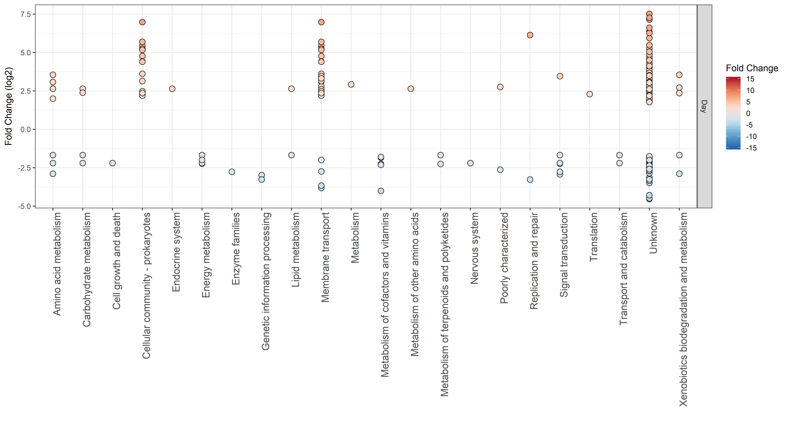

### Plot


```r
# Test for enrichment of functional categories in differentially expressed gene pool
## Test for enrichment of KO level C terms in transcriptome
bg_gsea <- MAG8_annot %>% 
  dplyr::select(ko_level_C, gene_oid) %>% 
  distinct()
bg_gsea[is.na(bg_gsea)] <- "Unknown"

metaT_gsea <- enricher(gene = unique(MAG8_deseq_results_depth_fin$gene_oid),
         universe = bg_gsea$gene_oid, 
         TERM2GENE = bg_gsea,
         pvalueCutoff = 0.05,
         qvalueCutoff = 0.2)
metaT_gsea_KO <- data.frame(metaT_gsea@result)
metaT_gsea_KO %>% 
  dplyr::select(Description, GeneRatio, BgRatio, p.adjust, qvalue, Count)%>%
  print()
```

```
##                                                                               Description
## Quorum sensing                                                            Quorum sensing 
## Transporters                                                                Transporters 
## ABC transporters                                                        ABC transporters 
## Two-component system                                                Two-component system 
## Porphyrin and chlorophyll metabolism                Porphyrin and chlorophyll metabolism 
## Tryptophan metabolism                                              Tryptophan metabolism 
## Benzoate degradation                                                Benzoate degradation 
## Fatty acid degradation                                            Fatty acid degradation 
## Phenylalanine metabolism                                        Phenylalanine metabolism 
## Exosome                                                                          Exosome 
## Propanoate metabolism                                              Propanoate metabolism 
## Valine, leucine and isoleucine degradation    Valine, leucine and isoleucine degradation 
## Glyoxylate and dicarboxylate metabolism          Glyoxylate and dicarboxylate metabolism 
## Alanine, aspartate and glutamate metabolism  Alanine, aspartate and glutamate metabolism 
## DNA replication proteins                                        DNA replication proteins 
## Histidine metabolism                                                Histidine metabolism 
## Pyruvate metabolism                                                  Pyruvate metabolism 
## Function unknown                                                         Function unknown
## Carbon fixation pathways in prokaryotes          Carbon fixation pathways in prokaryotes 
## Butanoate metabolism                                                Butanoate metabolism 
## DNA repair and recombination proteins              DNA repair and recombination proteins 
## Transfer RNA biogenesis                                          Transfer RNA biogenesis 
##                                              GeneRatio BgRatio
## Quorum sensing                                  14/108 36/1467
## Transporters                                    23/108 96/1467
## ABC transporters                                16/108 50/1467
## Two-component system                             6/108 20/1467
## Porphyrin and chlorophyll metabolism             4/108 10/1467
## Tryptophan metabolism                            3/108 12/1467
## Benzoate degradation                             2/108 10/1467
## Fatty acid degradation                           2/108 11/1467
## Phenylalanine metabolism                         2/108 11/1467
## Exosome                                          2/108 13/1467
## Propanoate metabolism                            2/108 16/1467
## Valine, leucine and isoleucine degradation       2/108 16/1467
## Glyoxylate and dicarboxylate metabolism          2/108 25/1467
## Alanine, aspartate and glutamate metabolism      1/108 12/1467
## DNA replication proteins                         1/108 12/1467
## Histidine metabolism                             1/108 12/1467
## Pyruvate metabolism                              1/108 13/1467
## Function unknown                                 2/108 30/1467
## Carbon fixation pathways in prokaryotes          1/108 15/1467
## Butanoate metabolism                             1/108 19/1467
## DNA repair and recombination proteins            1/108 20/1467
## Transfer RNA biogenesis                          1/108 26/1467
##                                                  p.adjust       qvalue
## Quorum sensing                               1.036930e-06 8.434356e-07
## Transporters                                 1.036930e-06 8.434356e-07
## ABC transporters                             1.103524e-06 8.976037e-07
## Two-component system                         1.260791e-02 1.025524e-02
## Porphyrin and chlorophyll metabolism         1.816558e-02 1.477583e-02
## Tryptophan metabolism                        1.919981e-01 1.561707e-01
## Benzoate degradation                         4.680617e-01 3.807201e-01
## Fatty acid degradation                       4.680617e-01 3.807201e-01
## Phenylalanine metabolism                     4.680617e-01 3.807201e-01
## Exosome                                      5.443781e-01 4.427956e-01
## Propanoate metabolism                        6.085794e-01 4.950168e-01
## Valine, leucine and isoleucine degradation   6.085794e-01 4.950168e-01
## Glyoxylate and dicarboxylate metabolism      7.922815e-01 6.444395e-01
## Alanine, aspartate and glutamate metabolism  7.922815e-01 6.444395e-01
## DNA replication proteins                     7.922815e-01 6.444395e-01
## Histidine metabolism                         7.922815e-01 6.444395e-01
## Pyruvate metabolism                          7.922815e-01 6.444395e-01
## Function unknown                             7.922815e-01 6.444395e-01
## Carbon fixation pathways in prokaryotes      7.922815e-01 6.444395e-01
## Butanoate metabolism                         8.229834e-01 6.694124e-01
## DNA repair and recombination proteins        8.229834e-01 6.694124e-01
## Transfer RNA biogenesis                      8.654811e-01 7.039798e-01
##                                              Count
## Quorum sensing                                  14
## Transporters                                    23
## ABC transporters                                16
## Two-component system                             6
## Porphyrin and chlorophyll metabolism             4
## Tryptophan metabolism                            3
## Benzoate degradation                             2
## Fatty acid degradation                           2
## Phenylalanine metabolism                         2
## Exosome                                          2
## Propanoate metabolism                            2
## Valine, leucine and isoleucine degradation       2
## Glyoxylate and dicarboxylate metabolism          2
## Alanine, aspartate and glutamate metabolism      1
## DNA replication proteins                         1
## Histidine metabolism                             1
## Pyruvate metabolism                              1
## Function unknown                                 2
## Carbon fixation pathways in prokaryotes          1
## Butanoate metabolism                             1
## DNA repair and recombination proteins            1
## Transfer RNA biogenesis                          1
```

```r
## Test for enrichment of COG functional categories
bg_gsea <- MAG8_annot %>% 
  dplyr::select(COG_functional_category, gene_oid) %>% 
  distinct()
bg_gsea <- apply(bg_gsea, 2, function(x) as.character(x))
bg_gsea[is.na(bg_gsea)] <- "Unknown"
bg_gsea <- data.frame(bg_gsea)

metaT_gsea <- enricher(gene = unique(MAG8_deseq_results_depth_fin$gene_oid),
         universe = bg_gsea$gene_oid, 
         TERM2GENE = bg_gsea,
         pvalueCutoff = 0.05,
         qvalueCutoff = 0.2)

metaT_gsea_COG <- data.frame(metaT_gsea@result)
metaT_gsea_COG %>% 
  dplyr::select(Description, GeneRatio, BgRatio, p.adjust, qvalue, Count)%>%
  print()
```

```
##                                                                                                                         Description
## Amino acid transport and metabolism                                                             Amino acid transport and metabolism
## Carbohydrate transport and metabolism                                                         Carbohydrate transport and metabolism
## Signal transduction mechanisms                                                                       Signal transduction mechanisms
## Inorganic ion transport and metabolism                                                       Inorganic ion transport and metabolism
## Unknown                                                                                                                     Unknown
## Energy production and conversion                                                                   Energy production and conversion
## Function unknown                                                                                                   Function unknown
## Post-translational modification, protein turnover, and chaperones Post-translational modification, protein turnover, and chaperones
## Replication, recombination and repair                                                         Replication, recombination and repair
## Lipid transport and metabolism                                                                       Lipid transport and metabolism
## Secondary metabolites biosynthesis, transport, and catabolism         Secondary metabolites biosynthesis, transport, and catabolism
## Coenzyme transport and metabolism                                                                 Coenzyme transport and metabolism
## Intracellular trafficking, secretion, and vesicular transport         Intracellular trafficking, secretion, and vesicular transport
## General function prediction only                                                                   General function prediction only
## Translation, ribosomal structure and biogenesis                                     Translation, ribosomal structure and biogenesis
##                                                                   GeneRatio
## Amino acid transport and metabolism                                  22/108
## Carbohydrate transport and metabolism                                11/108
## Signal transduction mechanisms                                        4/108
## Inorganic ion transport and metabolism                                8/108
## Unknown                                                              16/108
## Energy production and conversion                                      8/108
## Function unknown                                                     11/108
## Post-translational modification, protein turnover, and chaperones     4/108
## Replication, recombination and repair                                 3/108
## Lipid transport and metabolism                                        5/108
## Secondary metabolites biosynthesis, transport, and catabolism         2/108
## Coenzyme transport and metabolism                                     3/108
## Intracellular trafficking, secretion, and vesicular transport         1/108
## General function prediction only                                      7/108
## Translation, ribosomal structure and biogenesis                       2/108
##                                                                    BgRatio
## Amino acid transport and metabolism                               169/1467
## Carbohydrate transport and metabolism                              70/1467
## Signal transduction mechanisms                                     18/1467
## Inorganic ion transport and metabolism                             59/1467
## Unknown                                                           190/1467
## Energy production and conversion                                   98/1467
## Function unknown                                                  144/1467
## Post-translational modification, protein turnover, and chaperones  57/1467
## Replication, recombination and repair                              43/1467
## Lipid transport and metabolism                                     73/1467
## Secondary metabolites biosynthesis, transport, and catabolism      29/1467
## Coenzyme transport and metabolism                                  51/1467
## Intracellular trafficking, secretion, and vesicular transport      23/1467
## General function prediction only                                  149/1467
## Translation, ribosomal structure and biogenesis                   113/1467
##                                                                    p.adjust
## Amino acid transport and metabolism                               0.0594385
## Carbohydrate transport and metabolism                             0.0826176
## Signal transduction mechanisms                                    0.1901436
## Inorganic ion transport and metabolism                            0.2349609
## Unknown                                                           0.8768303
## Energy production and conversion                                  0.8768303
## Function unknown                                                  0.8768303
## Post-translational modification, protein turnover, and chaperones 0.8768303
## Replication, recombination and repair                             0.8768303
## Lipid transport and metabolism                                    0.8768303
## Secondary metabolites biosynthesis, transport, and catabolism     0.8768303
## Coenzyme transport and metabolism                                 0.9246769
## Intracellular trafficking, secretion, and vesicular transport     0.9578324
## General function prediction only                                  0.9986733
## Translation, ribosomal structure and biogenesis                   0.9986733
##                                                                       qvalue
## Amino acid transport and metabolism                               0.05005347
## Carbohydrate transport and metabolism                             0.06957271
## Signal transduction mechanisms                                    0.16012090
## Inorganic ion transport and metabolism                            0.19786180
## Unknown                                                           0.73838343
## Energy production and conversion                                  0.73838343
## Function unknown                                                  0.73838343
## Post-translational modification, protein turnover, and chaperones 0.73838343
## Replication, recombination and repair                             0.73838343
## Lipid transport and metabolism                                    0.73838343
## Secondary metabolites biosynthesis, transport, and catabolism     0.73838343
## Coenzyme transport and metabolism                                 0.77867527
## Intracellular trafficking, secretion, and vesicular transport     0.80659571
## General function prediction only                                  0.84098800
## Translation, ribosomal structure and biogenesis                   0.84098800
##                                                                   Count
## Amino acid transport and metabolism                                  22
## Carbohydrate transport and metabolism                                11
## Signal transduction mechanisms                                        4
## Inorganic ion transport and metabolism                                8
## Unknown                                                              16
## Energy production and conversion                                      8
## Function unknown                                                     11
## Post-translational modification, protein turnover, and chaperones     4
## Replication, recombination and repair                                 3
## Lipid transport and metabolism                                        5
## Secondary metabolites biosynthesis, transport, and catabolism         2
## Coenzyme transport and metabolism                                     3
## Intracellular trafficking, secretion, and vesicular transport         1
## General function prediction only                                      7
## Translation, ribosomal structure and biogenesis                       2
```

```r
# Focus on enriched KO level
p_mag8_deseq_depth_KO_gsea <- MAG8_deseq_results_depth_fin %>% 
  dplyr::select(regulation, gene_oid:Time_of_day, contains("ko")) %>% 
  distinct() %>% 
  dplyr::filter(ko_level_C %in% metaT_gsea_KO$Description) %>% 
  ggplot(aes(x = ko_level_C, y = log2FoldChange, fill = regulation))+
  geom_point(shape = 21, size = 3, position=position_jitterdodge(dodge.width=0.9,
                                                                 jitter.width=0.25)) +
  geom_boxplot(outlier.colour = NA, width = 0.5,
                        position = position_dodge(width=0.9), alpha = 0.3)+
  # geom_boxplot(alpha = 0.5)+
  scale_fill_manual(values = brewer.pal(11, "RdBu")[c(2,10)], name = "Fold Change\n") +
  theme_bw()+
  theme(axis.text.x = element_text(size = 12, angle = 45, hjust = 1),
        axis.text.y = element_text(size = 12),
        strip.text = element_text(size = 14),
        legend.text = element_text(size = 12),
        legend.title = element_blank(),
        legend.position = "top")+
  labs(x = "", y = "Fold Change (log2)")+
  ylim(-7, 7)

print(p_mag8_deseq_depth_KO_gsea)
```

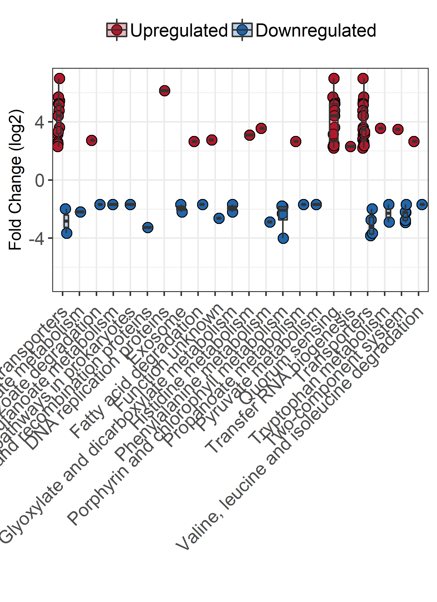

```r
# Focus on enriched KO level in sprin-summer samples too
p_mag8_deseq_temp_KO_gsea <- MAG8_deseq_results_nutrient_fin %>% 
  dplyr::select(regulation, gene_oid:Comparison, contains("ko")) %>% 
  distinct() %>% 
  dplyr::filter(ko_level_C %in% metaT_gsea_KO$Description) %>% 
  ggplot(aes(x = ko_level_C, y = log2FoldChange, fill = regulation))+
  geom_point(shape = 21, size = 3, position=position_jitterdodge(dodge.width=0.9,
                                                                 jitter.width=0.25)) +
  geom_boxplot(outlier.colour = NA, width = 0.5,
                        position = position_dodge(width=0.9), alpha = 0.3)+
  # geom_boxplot(alpha = 0.5)+
  scale_fill_manual(values = brewer.pal(11, "RdBu")[c(2,10)], name = "Fold Change\n") +
  theme_bw()+
  theme(axis.text.x = element_text(size = 12, angle = 45, hjust = 1),
        axis.text.y = element_text(size = 12),
        strip.text = element_text(size = 14),
        legend.text = element_text(size = 12),
        legend.title = element_blank(),
        legend.position = "top")+
  labs(x = "", y = "Fold Change (log2)")+
  ylim(-7, 7)

print(p_mag8_deseq_temp_KO_gsea)
```


```r
# M110 vs MLB station

# Test for enrichment of functional categories in differentially expressed gene pool
## Test for enrichment of KO level C terms in transcriptome
bg_gsea <- MAG8_annot %>% 
  dplyr::select(ko_level_C, gene_oid) %>% 
  distinct()
bg_gsea[is.na(bg_gsea)] <- "Unknown"

metaT_gsea <- enricher(gene = unique(MAG8_deseq_results_nutrient_fin$gene_oid),
         universe = bg_gsea$gene_oid, 
         TERM2GENE = bg_gsea,
         pvalueCutoff = 0.05,
         qvalueCutoff = 0.2)
metaT_gsea_KO <- data.frame(metaT_gsea@result)
metaT_gsea_KO %>% 
  dplyr::select(Description, GeneRatio, BgRatio, p.adjust, qvalue, Count)%>%
  print()
```

```
##                                                                                               Description
## Oxidative phosphorylation                                                      Oxidative phosphorylation 
## Benzoate degradation                                                                Benzoate degradation 
## Butanoate metabolism                                                                Butanoate metabolism 
## Chromosome and associated proteins                                    Chromosome and associated proteins 
## Carbon fixation pathways in prokaryotes                          Carbon fixation pathways in prokaryotes 
## Propanoate metabolism                                                              Propanoate metabolism 
## Valine, leucine and isoleucine degradation                    Valine, leucine and isoleucine degradation 
## Citrate cycle (TCA cycle)                                                      Citrate cycle (TCA cycle) 
## Fatty acid degradation                                                            Fatty acid degradation 
## Alanine, aspartate and glutamate metabolism                  Alanine, aspartate and glutamate metabolism 
## DNA replication proteins                                                        DNA replication proteins 
## Histidine metabolism                                                                Histidine metabolism 
## Tryptophan metabolism                                                              Tryptophan metabolism 
## Exosome                                                                                          Exosome 
## Pyruvate metabolism                                                                  Pyruvate metabolism 
## ABC transporters                                                                        ABC transporters 
## Pyrimidine metabolism                                                              Pyrimidine metabolism 
## Quorum sensing                                                                            Quorum sensing 
## Transporters                                                                                Transporters 
## Peptidoglycan biosynthesis and degradation proteins  Peptidoglycan biosynthesis and degradation proteins 
## Cysteine and methionine metabolism                                    Cysteine and methionine metabolism 
## Peptidases                                                                                    Peptidases 
## Function unknown                                                                         Function unknown
## Bacterial secretion system                                                    Bacterial secretion system 
## Amino acid related enzymes                                                    Amino acid related enzymes 
## Glycine, serine and threonine metabolism                        Glycine, serine and threonine metabolism 
## Secretion system                                                                        Secretion system 
## Two-component system                                                                Two-component system 
## Glyoxylate and dicarboxylate metabolism                          Glyoxylate and dicarboxylate metabolism 
##                                                      GeneRatio BgRatio
## Oxidative phosphorylation                                 4/94 14/1467
## Benzoate degradation                                      3/94 10/1467
## Butanoate metabolism                                      4/94 19/1467
## Chromosome and associated proteins                        4/94 19/1467
## Carbon fixation pathways in prokaryotes                   3/94 15/1467
## Propanoate metabolism                                     3/94 16/1467
## Valine, leucine and isoleucine degradation                3/94 16/1467
## Citrate cycle (TCA cycle)                                 2/94 11/1467
## Fatty acid degradation                                    2/94 11/1467
## Alanine, aspartate and glutamate metabolism               2/94 12/1467
## DNA replication proteins                                  2/94 12/1467
## Histidine metabolism                                      2/94 12/1467
## Tryptophan metabolism                                     2/94 12/1467
## Exosome                                                   2/94 13/1467
## Pyruvate metabolism                                       2/94 13/1467
## ABC transporters                                          5/94 50/1467
## Pyrimidine metabolism                                     2/94 14/1467
## Quorum sensing                                            3/94 36/1467
## Transporters                                              7/94 96/1467
## Peptidoglycan biosynthesis and degradation proteins       1/94 10/1467
## Cysteine and methionine metabolism                        1/94 11/1467
## Peptidases                                                1/94 12/1467
## Function unknown                                          2/94 30/1467
## Bacterial secretion system                                1/94 14/1467
## Amino acid related enzymes                                1/94 15/1467
## Glycine, serine and threonine metabolism                  1/94 15/1467
## Secretion system                                          1/94 20/1467
## Two-component system                                      1/94 20/1467
## Glyoxylate and dicarboxylate metabolism                   1/94 25/1467
##                                                       p.adjust    qvalue
## Oxidative phosphorylation                            0.2111202 0.1915791
## Benzoate degradation                                 0.2111202 0.1915791
## Butanoate metabolism                                 0.2111202 0.1915791
## Chromosome and associated proteins                   0.2111202 0.1915791
## Carbon fixation pathways in prokaryotes              0.3218983 0.2921037
## Propanoate metabolism                                0.3218983 0.2921037
## Valine, leucine and isoleucine degradation           0.3218983 0.2921037
## Citrate cycle (TCA cycle)                            0.3833508 0.3478683
## Fatty acid degradation                               0.3833508 0.3478683
## Alanine, aspartate and glutamate metabolism          0.3833508 0.3478683
## DNA replication proteins                             0.3833508 0.3478683
## Histidine metabolism                                 0.3833508 0.3478683
## Tryptophan metabolism                                0.3833508 0.3478683
## Exosome                                              0.3833508 0.3478683
## Pyruvate metabolism                                  0.3833508 0.3478683
## ABC transporters                                     0.3833508 0.3478683
## Pyrimidine metabolism                                0.3833508 0.3478683
## Quorum sensing                                       0.6398201 0.5805990
## Transporters                                         0.6398201 0.5805990
## Peptidoglycan biosynthesis and degradation proteins  0.7037986 0.6386557
## Cysteine and methionine metabolism                   0.7043407 0.6391476
## Peptidases                                           0.7043407 0.6391476
## Function unknown                                     0.7043407 0.6391476
## Bacterial secretion system                           0.7043407 0.6391476
## Amino acid related enzymes                           0.7043407 0.6391476
## Glycine, serine and threonine metabolism             0.7043407 0.6391476
## Secretion system                                     0.7627148 0.6921187
## Two-component system                                 0.7627148 0.6921187
## Glyoxylate and dicarboxylate metabolism              0.8116961 0.7365664
##                                                      Count
## Oxidative phosphorylation                                4
## Benzoate degradation                                     3
## Butanoate metabolism                                     4
## Chromosome and associated proteins                       4
## Carbon fixation pathways in prokaryotes                  3
## Propanoate metabolism                                    3
## Valine, leucine and isoleucine degradation               3
## Citrate cycle (TCA cycle)                                2
## Fatty acid degradation                                   2
## Alanine, aspartate and glutamate metabolism              2
## DNA replication proteins                                 2
## Histidine metabolism                                     2
## Tryptophan metabolism                                    2
## Exosome                                                  2
## Pyruvate metabolism                                      2
## ABC transporters                                         5
## Pyrimidine metabolism                                    2
## Quorum sensing                                           3
## Transporters                                             7
## Peptidoglycan biosynthesis and degradation proteins      1
## Cysteine and methionine metabolism                       1
## Peptidases                                               1
## Function unknown                                         2
## Bacterial secretion system                               1
## Amino acid related enzymes                               1
## Glycine, serine and threonine metabolism                 1
## Secretion system                                         1
## Two-component system                                     1
## Glyoxylate and dicarboxylate metabolism                  1
```

```r
## Test for enrichment of COG functional categories
bg_gsea <- MAG8_annot %>% 
  dplyr::select(COG_functional_category, gene_oid) %>% 
  distinct()
bg_gsea <- apply(bg_gsea, 2, function(x) as.character(x))
bg_gsea[is.na(bg_gsea)] <- "Unknown"
bg_gsea <- data.frame(bg_gsea)

metaT_gsea <- enricher(gene = unique(MAG8_deseq_results_temp_fin$gene_oid),
         universe = bg_gsea$gene_oid, 
         TERM2GENE = bg_gsea,
         pvalueCutoff = 0.05,
         qvalueCutoff = 0.2)
```

```
## Error in unique(MAG8_deseq_results_temp_fin$gene_oid): object 'MAG8_deseq_results_temp_fin' not found
```

```r
metaT_gsea_COG <- data.frame(metaT_gsea@result)
metaT_gsea_COG %>% 
  dplyr::select(Description, GeneRatio, BgRatio, p.adjust, qvalue, Count)%>%
  print()
```

```
##                                                                                               Description
## Oxidative phosphorylation                                                      Oxidative phosphorylation 
## Benzoate degradation                                                                Benzoate degradation 
## Butanoate metabolism                                                                Butanoate metabolism 
## Chromosome and associated proteins                                    Chromosome and associated proteins 
## Carbon fixation pathways in prokaryotes                          Carbon fixation pathways in prokaryotes 
## Propanoate metabolism                                                              Propanoate metabolism 
## Valine, leucine and isoleucine degradation                    Valine, leucine and isoleucine degradation 
## Citrate cycle (TCA cycle)                                                      Citrate cycle (TCA cycle) 
## Fatty acid degradation                                                            Fatty acid degradation 
## Alanine, aspartate and glutamate metabolism                  Alanine, aspartate and glutamate metabolism 
## DNA replication proteins                                                        DNA replication proteins 
## Histidine metabolism                                                                Histidine metabolism 
## Tryptophan metabolism                                                              Tryptophan metabolism 
## Exosome                                                                                          Exosome 
## Pyruvate metabolism                                                                  Pyruvate metabolism 
## ABC transporters                                                                        ABC transporters 
## Pyrimidine metabolism                                                              Pyrimidine metabolism 
## Quorum sensing                                                                            Quorum sensing 
## Transporters                                                                                Transporters 
## Peptidoglycan biosynthesis and degradation proteins  Peptidoglycan biosynthesis and degradation proteins 
## Cysteine and methionine metabolism                                    Cysteine and methionine metabolism 
## Peptidases                                                                                    Peptidases 
## Function unknown                                                                         Function unknown
## Bacterial secretion system                                                    Bacterial secretion system 
## Amino acid related enzymes                                                    Amino acid related enzymes 
## Glycine, serine and threonine metabolism                        Glycine, serine and threonine metabolism 
## Secretion system                                                                        Secretion system 
## Two-component system                                                                Two-component system 
## Glyoxylate and dicarboxylate metabolism                          Glyoxylate and dicarboxylate metabolism 
##                                                      GeneRatio BgRatio
## Oxidative phosphorylation                                 4/94 14/1467
## Benzoate degradation                                      3/94 10/1467
## Butanoate metabolism                                      4/94 19/1467
## Chromosome and associated proteins                        4/94 19/1467
## Carbon fixation pathways in prokaryotes                   3/94 15/1467
## Propanoate metabolism                                     3/94 16/1467
## Valine, leucine and isoleucine degradation                3/94 16/1467
## Citrate cycle (TCA cycle)                                 2/94 11/1467
## Fatty acid degradation                                    2/94 11/1467
## Alanine, aspartate and glutamate metabolism               2/94 12/1467
## DNA replication proteins                                  2/94 12/1467
## Histidine metabolism                                      2/94 12/1467
## Tryptophan metabolism                                     2/94 12/1467
## Exosome                                                   2/94 13/1467
## Pyruvate metabolism                                       2/94 13/1467
## ABC transporters                                          5/94 50/1467
## Pyrimidine metabolism                                     2/94 14/1467
## Quorum sensing                                            3/94 36/1467
## Transporters                                              7/94 96/1467
## Peptidoglycan biosynthesis and degradation proteins       1/94 10/1467
## Cysteine and methionine metabolism                        1/94 11/1467
## Peptidases                                                1/94 12/1467
## Function unknown                                          2/94 30/1467
## Bacterial secretion system                                1/94 14/1467
## Amino acid related enzymes                                1/94 15/1467
## Glycine, serine and threonine metabolism                  1/94 15/1467
## Secretion system                                          1/94 20/1467
## Two-component system                                      1/94 20/1467
## Glyoxylate and dicarboxylate metabolism                   1/94 25/1467
##                                                       p.adjust    qvalue
## Oxidative phosphorylation                            0.2111202 0.1915791
## Benzoate degradation                                 0.2111202 0.1915791
## Butanoate metabolism                                 0.2111202 0.1915791
## Chromosome and associated proteins                   0.2111202 0.1915791
## Carbon fixation pathways in prokaryotes              0.3218983 0.2921037
## Propanoate metabolism                                0.3218983 0.2921037
## Valine, leucine and isoleucine degradation           0.3218983 0.2921037
## Citrate cycle (TCA cycle)                            0.3833508 0.3478683
## Fatty acid degradation                               0.3833508 0.3478683
## Alanine, aspartate and glutamate metabolism          0.3833508 0.3478683
## DNA replication proteins                             0.3833508 0.3478683
## Histidine metabolism                                 0.3833508 0.3478683
## Tryptophan metabolism                                0.3833508 0.3478683
## Exosome                                              0.3833508 0.3478683
## Pyruvate metabolism                                  0.3833508 0.3478683
## ABC transporters                                     0.3833508 0.3478683
## Pyrimidine metabolism                                0.3833508 0.3478683
## Quorum sensing                                       0.6398201 0.5805990
## Transporters                                         0.6398201 0.5805990
## Peptidoglycan biosynthesis and degradation proteins  0.7037986 0.6386557
## Cysteine and methionine metabolism                   0.7043407 0.6391476
## Peptidases                                           0.7043407 0.6391476
## Function unknown                                     0.7043407 0.6391476
## Bacterial secretion system                           0.7043407 0.6391476
## Amino acid related enzymes                           0.7043407 0.6391476
## Glycine, serine and threonine metabolism             0.7043407 0.6391476
## Secretion system                                     0.7627148 0.6921187
## Two-component system                                 0.7627148 0.6921187
## Glyoxylate and dicarboxylate metabolism              0.8116961 0.7365664
##                                                      Count
## Oxidative phosphorylation                                4
## Benzoate degradation                                     3
## Butanoate metabolism                                     4
## Chromosome and associated proteins                       4
## Carbon fixation pathways in prokaryotes                  3
## Propanoate metabolism                                    3
## Valine, leucine and isoleucine degradation               3
## Citrate cycle (TCA cycle)                                2
## Fatty acid degradation                                   2
## Alanine, aspartate and glutamate metabolism              2
## DNA replication proteins                                 2
## Histidine metabolism                                     2
## Tryptophan metabolism                                    2
## Exosome                                                  2
## Pyruvate metabolism                                      2
## ABC transporters                                         5
## Pyrimidine metabolism                                    2
## Quorum sensing                                           3
## Transporters                                             7
## Peptidoglycan biosynthesis and degradation proteins      1
## Cysteine and methionine metabolism                       1
## Peptidases                                               1
## Function unknown                                         2
## Bacterial secretion system                               1
## Amino acid related enzymes                               1
## Glycine, serine and threonine metabolism                 1
## Secretion system                                         1
## Two-component system                                     1
## Glyoxylate and dicarboxylate metabolism                  1
```

```r
# # Focus on enriched KO level
# p_mag8_deseq_KO_gsea <- MAG8_deseq_results_temp_fin %>% 
#   dplyr::select(regulation, gene_oid:Comparison, contains("ko")) %>% 
#   distinct() %>% 
#   dplyr::filter(ko_level_C %in% metaT_gsea_KO$Description) %>% 
#   ggplot(aes(x = ko_level_C, y = log2FoldChange, fill = regulation))+
#   geom_point(shape = 21, size = 3, position=position_jitterdodge(dodge.width=0.9,
#                                                                  jitter.width=0.25)) +
#   geom_boxplot(outlier.colour = NA, width = 0.5,
#                         position = position_dodge(width=0.9), alpha = 0.3)+
#   # geom_boxplot(alpha = 0.5)+
#   scale_fill_manual(values = brewer.pal(11, "RdBu")[c(2,10)], name = "Fold Change\n") +
#   theme_bw()+
#   theme(axis.text.x = element_text(size = 12, angle = 45, hjust = 1),
#         axis.text.y = element_text(size = 12),
#         strip.text = element_text(size = 14),
#         legend.text = element_text(size = 12),
#         legend.title = element_blank(),
#         legend.position = "top")+
#   labs(x = "", y = "Fold Change (log2)")+
#   ylim(-7, 7)
# 
# print(p_mag8_deseq_KO_gsea)
```

# 7. Sequence discrete populations

**In order to check unspecific mapping sample reads were mapped consecutively to
every bin using `BBmap.sh`.** This approach allows us to check the mapping specificity by evaluating the distribution of read identity to the putative genome bin.  

Competitive mapping was performed through `blastn` searches against a 1M and 10M read subsample from the interleaved fasta generated after QC (`seqtk`). Shell script used to achieve this:
```
#!/bin/bash
set -e

for file in `cat map.list`
        do
        echo $file
		db=/scratch/vdenef_fluxm/rprops/DESMAN/metaG/vizbin_rebin_anvio_v230/SEQ_discrete/contigs/merged_bins-fixed.db
		seqtk sample -s 777 /scratch/vdenef_fluxm/rprops/DESMAN/metaG/data/${file}/dt_int.fasta 1000000 > /scratch/vdenef_fluxm/rprops/DESMAN/metaG/data/${file}/dt_int_subs_1000000.fasta
        qseqs=/scratch/vdenef_fluxm/rprops/DESMAN/metaG/data/${file}/dt_int_subs_1000000.fasta
		blastn -query ${qseqs} -task megablast -db ${db} -out ./blast_output/${file}_blast.tsv -outfmt 6 -max_target_seqs 1 -num_threads 40 -perc_identity 60
		rm ${qseqs}
done
```

<!-- # ```{r sequence discrete populations, dpi = 500, warning = FALSE, fig.width = 10, fig.height = 7} -->
<!-- # map_disc <- read.table("./SEQs_discrete/final.idhist", header = FALSE, -->
<!-- #                        row.names = NULL) -->
<!-- # colnames(map_disc) <- c("bin","sample", "identity", "reads_mapped", "bases_mapped") -->
<!-- #  -->
<!-- # # Add season metadata -->
<!-- # map_disc$season <- "Summer" -->
<!-- # map_disc$season[grep("Fa", map_disc$sample)] <- "Fall" -->
<!-- # map_disc$season[grep("Su", map_disc$sample)] <- "Summer" -->
<!-- # map_disc$season[grep("Sp", map_disc$sample)] <- "Spring" -->
<!-- # map_disc$sample <- gsub(".C","", map_disc$sample, fixed = TRUE) -->
<!-- # total_reads2 <- total_reads -->
<!-- # total_reads2$sample <- gsub("_", ".", fixed = TRUE,total_reads$sample) -->
<!-- # map_disc <- dplyr::left_join(map_disc, total_reads2, by = "sample") -->
<!-- #  -->
<!-- # # Throw away all %identity below 60% -->
<!-- # # map_disc <- map_disc %>% filter(identity > 60) -->
<!-- #  -->
<!-- # # Normalize reads_mapped to library sizes -->
<!-- # map_disc <- map_disc %>% group_by(sample) %>%  -->
<!-- #   mutate(rel_reads_mapped = 100*reads_mapped/Total_reads) -->
<!-- #  -->
<!-- # # Add observed genome size -->
<!-- # map_disc$bin <- gsub(".fa","",map_disc$bin) -->
<!-- # map_disc <- left_join(map_disc, bin_size, by = c("bin" = "bins")) -->
<!-- #  -->
<!-- # # Plot distributions -->
<!-- # for(bin2plot in unique(map_disc$bin)){ -->
<!-- #     p_sdisc <- map_disc %>% filter(bin == bin2plot) %>%  -->
<!-- #       ggplot(aes(x = identity, y = rel_reads_mapped, color = season))+ -->
<!-- #       theme_bw()+ -->
<!-- #       scale_color_brewer(palette = "Accent")+ -->
<!-- #       facet_wrap(~sample, nrow = 4)+ -->
<!-- #       geom_line(size = 1.5)+ -->
<!-- #       guides(color = FALSE)+ -->
<!-- #       ggtitle(bin2plot)+ -->
<!-- #       theme(axis.text=element_text(size=14), axis.title=element_text(size=20), -->
<!-- #         title=element_text(size=20), legend.text=element_text(size=14), -->
<!-- #         legend.background = element_rect(fill="transparent"), -->
<!-- #         axis.text.x = element_text(angle = 45, hjust = 1), -->
<!-- #         strip.text.y=element_text(size=14))+ -->
<!-- #       ylab("Proportion of reads mapped (%)")+ -->
<!-- #       xlab("Nucleotide identity (%)") -->
<!-- #       # ylim(0,.5) -->
<!-- #    -->
<!-- #   print(p_sdisc) -->
<!-- # } -->
<!-- # ``` -->
<!-- #  -->
<!-- # ```{r plot-cum-discrete, dpi = 500, warning = FALSE, fig.width = 7, fig.height = 10} -->
<!-- # # Plot % reads corrected for genome size over threshold of 0.95 -->
<!-- # id_thresh <- 95 -->
<!-- # map_disc_cum <- map_disc  %>% filter(identity > id_thresh) %>% group_by(sample) %>%  -->
<!-- #   mutate(cum_rel_reads_mapped = cumsum(rel_reads_mapped))%>%  -->
<!-- #   filter(identity == 100) -->
<!-- # sum_cum <- map_disc_cum %>% group_by(sample, bin) %>% mutate(cum_bins_rel_reads_mapped = sum(cum_rel_reads_mapped)) -->
<!-- # colnames(sum_cum)[c(2)] <- "Sample2" -->
<!-- #  -->
<!-- # p_sdisc_cum1 <- ggplot(map_disc_cum, aes(x = sample, y = 1e6*cum_rel_reads_mapped/bin_size,  -->
<!-- #                                         fill = bin))+ -->
<!-- #   theme_bw()+ -->
<!-- #   scale_fill_brewer(palette = "Paired")+ -->
<!-- #   geom_point(size = 4, shape = 21, color = "black")+ -->
<!-- #   theme(axis.text=element_text(size=14), axis.title=element_text(size=20), -->
<!-- #       title=element_text(size=20), legend.text=element_text(size=14), -->
<!-- #       legend.background = element_rect(fill="transparent"), -->
<!-- #       axis.text.x = element_text(angle = 45, hjust = 1), -->
<!-- #       strip.text.y=element_text(size=14), legend.position = "bottom")+ -->
<!-- #   ylab(paste0("Proportion of reads mapped > ", id_thresh, "% NI"))+ -->
<!-- #   xlab("Sample")+ -->
<!-- #   guides(fill=guide_legend(nrow = 11))+ -->
<!-- #   # geom_point(data = sum_cum, aes(x = Sample2, y = cum_bins_rel_reads_mapped), -->
<!-- #              # shape = 22, fill = "black", size = 4)+ -->
<!-- #   ylim(0,2.5) -->
<!-- #  -->
<!-- # print(p_sdisc_cum1) -->
<!-- #  -->
<!-- # # Plot % reads over threshold of 0.99 -->
<!-- # id_thresh <- 99 -->
<!-- # map_disc_cum2 <- map_disc  %>% filter(identity > id_thresh) %>% group_by(sample) %>%  -->
<!-- #   mutate(cum_rel_reads_mapped = cumsum(rel_reads_mapped))%>%  -->
<!-- #   filter(identity == 100) -->
<!-- # sum_cum <- map_disc_cum2 %>% group_by(sample, bin) %>% mutate(cum_bins_rel_reads_mapped = sum(cum_rel_reads_mapped)) -->
<!-- # colnames(sum_cum)[c(2)] <- "Sample2" -->
<!-- #  -->
<!-- # p_sdisc_cum2 <- ggplot(map_disc_cum2, aes(x = sample, y = 1e6*cum_rel_reads_mapped/bin_size,  -->
<!-- #                                         fill = bin))+ -->
<!-- #   theme_bw()+ -->
<!-- #   scale_fill_brewer(palette = "Paired")+ -->
<!-- #   geom_point(size = 4, shape = 21, color = "black")+ -->
<!-- #   theme(axis.text=element_text(size=14), axis.title=element_text(size=20), -->
<!-- #       title=element_text(size=20), legend.text=element_text(size=14), -->
<!-- #       legend.background = element_rect(fill="transparent"), -->
<!-- #       axis.text.x = element_text(angle = 45, hjust = 1), -->
<!-- #       strip.text.y=element_text(size=14), legend.position = "bottom")+ -->
<!-- #   ylab(paste0("Proportion of reads mapped > ", id_thresh, "% NI"))+ -->
<!-- #   xlab("Sample")+ -->
<!-- #   guides(fill=guide_legend(nrow = 11))+ -->
<!-- #   # geom_point(data = sum_cum, aes(x = Sample2, y = cum_bins_rel_reads_mapped), -->
<!-- #              # shape = 22, fill = "black", size = 4)+ -->
<!-- #   ylim(0,1.0) -->
<!-- #  -->
<!-- # print(p_sdisc_cum2) -->
<!-- # ``` -->

### Competitive mapping using `blast` with 1M reads of interleaved fasta.  


```r
blast_df <- read.table("./SEQs_discrete/merged_blast_1M.tsv", header = FALSE)
colnames(blast_df) <- c("Sample", "Contig", "Identity")
blast_df_map <- read.table("./SEQs_discrete/merged_contig_list.tsv", header = FALSE)
colnames(blast_df_map) <- c("m_contig", "o_contig", "bin")

# Round identity to integer
# blast_df$Identity <- round(blast_df$Identity, 1)
# blast_df$Identity <- factor(blast_df$Identity)
blast_df <- left_join(blast_df, blast_df_map, by = c("Contig" = "m_contig"))

# Bin the %Identity in intervals of 0.5%
blast_df_sum <- transform(blast_df, bin_group=cut(Identity,  breaks=seq(0, 100, 0.5)))

# Format sample names and convert to data.frame
blast_df_sum$Sample <- gsub("_blast.tsv", "", blast_df_sum$Sample)
blast_df_sum <- data.frame(blast_df_sum)
# blast_df_sum$Identity <- as.numeric(as.character(blast_df_sum$Identity))
blast_df_sum$bin <- gsub(".fa","",blast_df_sum$bin)
blast_df_sum <- dplyr::left_join(blast_df_sum, bin_size, by = c("bin" = "bins"))

# Add extra column that converts the binning range to a numeric x-coordinate that
# is positioned in the middle of the binning interval
blast_df_sum$bin_group <- gsub("\\(|]", "", 
                               as.character(blast_df_sum$bin_group))
blast_df_sum$bin_xcoord <- as.numeric(do.call(rbind,
                                              strsplit(blast_df_sum$bin_group,
                                                       ","))[,1])+0.25

# Normalize mapped reads per sample based on sample reads
# blast_subs <- 1e6
# blast_df_sum <- blast_df_sum %>% ungroup %>% group_by(Sample) %>% 
#   mutate(n_prop = 100*n/blast_subs)

# Add season variable
blast_df_sum$season <- "Summer"
blast_df_sum$season[grep("Fa", blast_df_sum$Sample)] <- "Fall"
blast_df_sum$season[grep("Su", blast_df_sum$Sample)] <- "Summer"
blast_df_sum$season[grep("Sp", blast_df_sum$Sample)] <- "Spring"

# Reformat sample names
blast_df_sum$Sample <- gsub(".C", "", blast_df_sum$Sample, fixed = TRUE)
blast_df_sum$Sample <- gsub(".A", "", blast_df_sum$Sample, fixed = TRUE)
blast_df_sum$Sample <- gsub(".", "_", blast_df_sum$Sample, fixed = TRUE)

# Add metadata to dataframe
meta_blast <- meta[, -1] %>% distinct()
blast_df_sum <- dplyr::left_join(blast_df_sum, meta_blast, by = c("Sample" = "Sample_ID"))

# Reorder site factor
blast_df_sum$Site <- as.character(blast_df_sum$Site)
blast_df_sum$Site <- gsub("Buoy","Muskegon Lake", blast_df_sum$Site)
blast_df_sum$Site <- gsub("110","Lake Michigan\nsite M110", blast_df_sum$Site)
blast_df_sum$Site <- gsub("15","Lake Michigan\nsite M15", blast_df_sum$Site)
blast_df_sum$Site <- factor(blast_df_sum$Site, levels = c("Muskegon Lake",
                                                          "Lake Michigan\nsite M15",
                                                          "Lake Michigan\nsite M110"))
blast_df_sum$Depth <- as.character(blast_df_sum$Depth)
blast_df_sum$Depth <- factor(blast_df_sum$Depth, levels = c("Surface", "Mid", "Deep"))
blast_df_sum$season <- as.character(blast_df_sum$season)
blast_df_sum$season <- factor(blast_df_sum$season, levels = c("Spring", "Summer", "Fall"))

# remove non-Limnohabbitans bin
blast_df_sum <- blast_df_sum %>% dplyr::filter(bin != "B2_Fa13.BD.MLB.DN_rebin10")

# Add extra column with new bin names
new_bin_names <- read.table("./anvio_output/rebin/general_bins_summary_selected_final.tsv", header = TRUE)[, c(2,3)]
blast_df_sum <- left_join(blast_df_sum, new_bin_names, by = c("bin" = "bins"))
blast_df_sum$new_bin_name <- as.character(blast_df_sum$new_bin_name)
blast_df_sum$new_bin_name <- factor(blast_df_sum$new_bin_name, levels =
                                      c("MAG1.FA-MLB-DN","MAG2.FA-MLB-SN",
                                        "MAG3.FA-MLB-SN", "MAG4.FA-M110-DN",
                                        "MAG5.SP-M110-DD","MAG6.SP-M15-SD",
                                        "MAG7.SU-MLB-SD","MAG8.SU-M110-DCMD",
                                        "MAG9.SU-M15-SN","MAG10.SU-M15-SN"))
# plot for individual bins
for(bin2plot in unique(blast_df_sum$new_bin_name)){
  p_blast_sdisc <- blast_df_sum %>% dplyr::filter(new_bin_name == bin2plot) %>% 
     ggplot(aes(x = bin_xcoord, ..scaled.., fill = season))+
      theme_bw()+
      scale_fill_brewer(palette = "Accent")+
      facet_wrap(~Sample, nrow = 4)+
      geom_density(color = "black")+
      guides(color = FALSE)+
      ggtitle(bin2plot)+
      theme(axis.text=element_text(size=14), axis.title=element_text(size=20),
        title=element_text(size=20), legend.text=element_text(size=14),
        legend.background = element_rect(fill="transparent"),
        axis.text.x = element_text(angle = 45, hjust = 1),
        strip.text.y=element_text(size=14))+
      ylab("Density")+
      xlab("Nucleotide identity (%)")+
    xlim(75,100)
     
print(p_blast_sdisc)
}
```

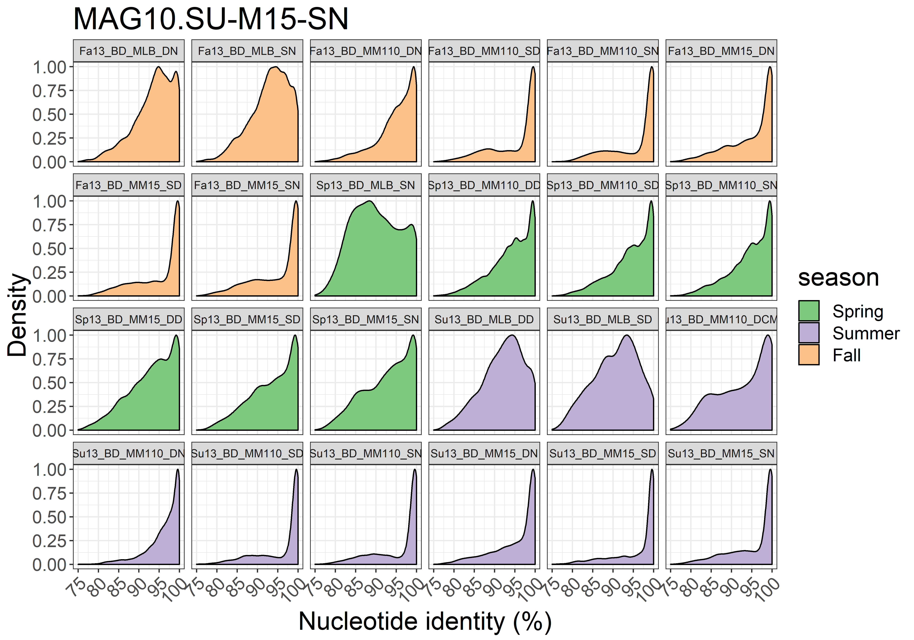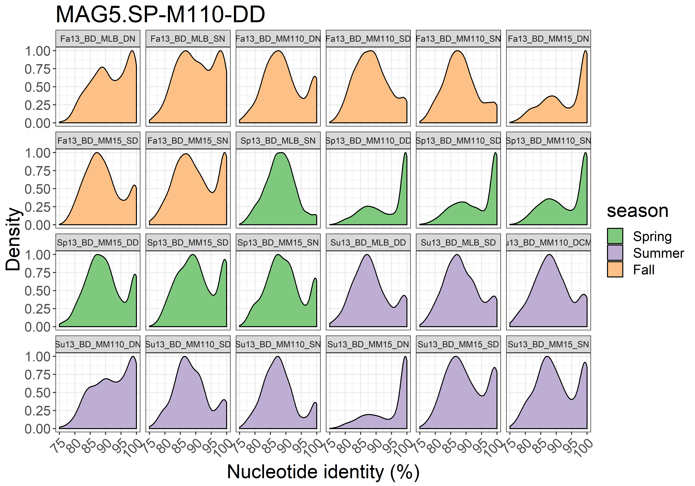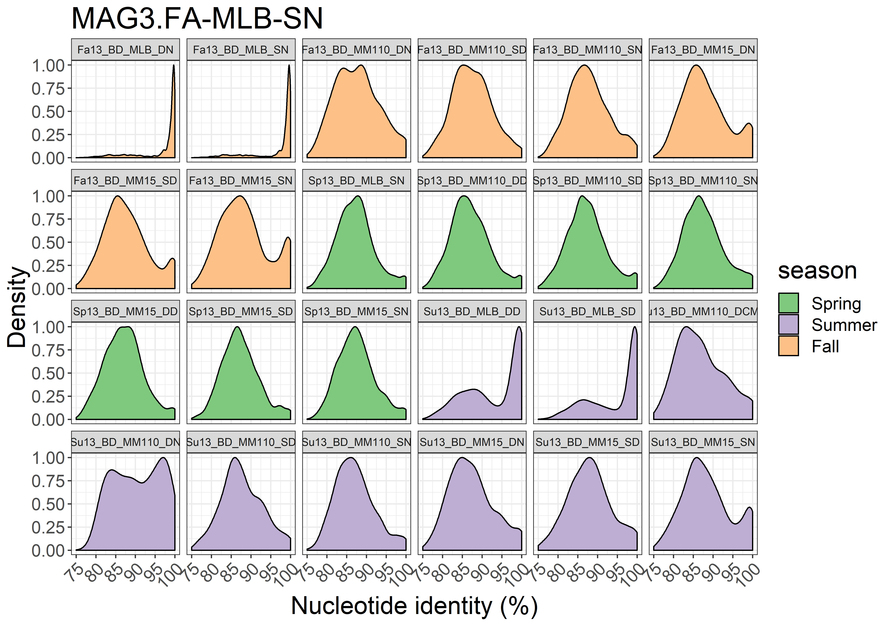


```r
# Plot one combined figure with proportions normalized for genome size
p_blast_sdisc_merged <- blast_df_sum %>% 
     ggplot(aes(x = bin_xcoord, ..density.., color = bin))+
      theme_gray()+
      scale_color_brewer("", palette = "Paired")+
      facet_wrap(~Sample, nrow = 4)+
      geom_density()+
      ggtitle("Merged bins per sample")+
      theme(axis.text=element_text(size=14), axis.title=element_text(size=20),
        title=element_text(size=20), legend.text=element_text(size=14),
        legend.background = element_rect(fill="transparent"),
        axis.text.x = element_text(angle = 45, hjust = 1),
        strip.text.y=element_text(size=14),
        legend.position = "bottom")+
      ylab("Reads per Mbp")+
      xlab("Nucleotide identity (%)")+
    xlim(75,100)+
  guides(color=guide_legend(ncol=3))
     
print(p_blast_sdisc_merged)
```


```r
# Plot for most abundant bin (B63)
p_blast_sdisc_B63 <- blast_df_sum %>% 
  dplyr::filter(bin == "B63_Su13.BD.MM110.DCMD_rebin1") %>% 
  ggplot(aes(x = bin_xcoord, ..density..))+
  theme_bw()+
  # facet_grid(season~Site)+
  geom_density(alpha = 0.4, size = 0.75, color = "#333333")+
  scale_shape_manual("", values = c(21,22,24))+
  scale_color_brewer("", palette = "Accent")+
  guides(fill = FALSE)+
  theme(axis.text.y=element_text(size=14), axis.title=element_text(size=20),
        title=element_text(size=20), legend.text=element_text(size=14),
        legend.background = element_rect(fill="transparent"),
        axis.text.x = element_text(size = 14),
        strip.text=element_text(size=16),
        panel.grid.minor = element_blank(),
        legend.position = "bottom")+
  ylab("Density")+
  xlab("Nucleotide identity (%)")+
  xlim(75,100)

p_blast_sdisc_B63
```

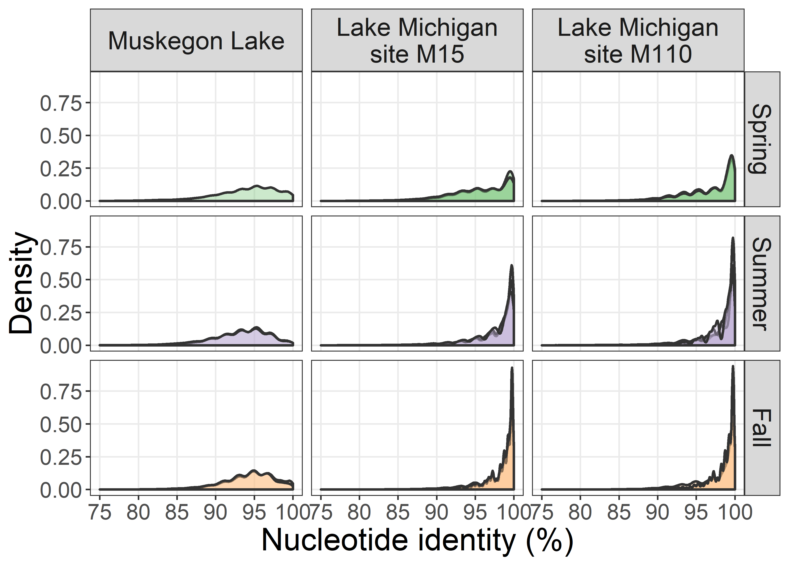

```r
blast_df_sum$new_bin_name <- factor(blast_df_sum$new_bin_name, levels =
                                      c("MAG5.SP-M110-DD","MAG2.FA-MLB-SN",
                                        "MAG3.FA-MLB-SN", "MAG4.FA-M110-DN",
                                        "MAG1.FA-MLB-DN", "MAG10.SU-M15-SN",
                                        "MAG6.SP-M15-SD", "MAG8.SU-M110-DCMD",
                                        "MAG7.SU-MLB-SD","MAG9.SU-M15-SN"))
# Plot for most abundant bin (B63)
p_blast_all_violin <- blast_df_sum %>% 
  ggplot(aes(x = new_bin_name, y= Identity, fill = new_bin_name))+
  theme_bw()+
  # facet_grid(season~Site)+
  # geom_density(alpha = 0.4, size = 0.75, color = "#333333")+
  geom_violin(alpha = 0.4, size = 0.75, color = "#333333",
              scale = "area", fill = "#333333")+
  scale_color_brewer("", palette = "Paired")+
  guides(fill = FALSE)+
  # facet_grid(new_bin_name~., scales = "free")+
  theme(axis.text.y=element_text(size=14), axis.title=element_text(size=20),
        title=element_text(size=20), legend.text=element_text(size=14),
        legend.background = element_rect(fill="transparent"),
        axis.text.x = element_text(size = 14),
        strip.text=element_text(size=16),
        panel.grid.minor = element_blank(),
        legend.position = "bottom")+
  # scale_x_log10()+
  ylab("% Identity")+
  xlab("")+
  scale_y_continuous(limits = c(90,100))+
  guides(shape = FALSE)+
  # stat_summary(fun.data=mean_sdl, fun.args = list(mult = 1), 
                 # geom="pointrange", color="#333333", size = 1)+
  coord_flip()
  # xlim(90,100)

p_blast_all_violin
```

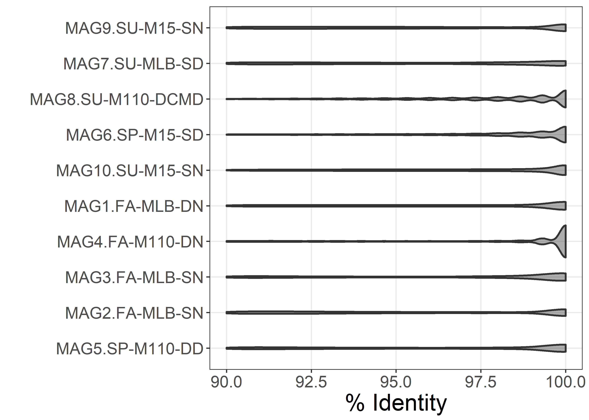


```r
# Plot for all bins density plots
p_blast_all_dens <- blast_df_sum %>% 
  ggplot(aes(x = bin_xcoord, shape = Sample))+
  theme_bw()+
  # facet_grid(season~Site)+
  geom_density(alpha = 0.4, size = 0.4, color = "#333333",
               bw = "nrd0")+
  # geom_violin(alpha = 0.4, size = 0.75, color = "#333333",
  #             scale = "area", fill = "#333333")+
  scale_color_brewer("", palette = "Paired")+
  guides(fill = FALSE)+
  facet_wrap(~new_bin_name, ncol = 2, scales = "free")+
  theme(axis.text.y=element_text(size=14), axis.title=element_text(size=20),
        title=element_text(size=20), legend.text=element_text(size=14),
        legend.background = element_rect(fill="transparent"),
        axis.text.x = element_text(size = 14),
        strip.text=element_text(size=14),
        panel.grid.minor = element_blank(),
        legend.position = "bottom")+
  # scale_x_log10()+
  ylab("% Identity")+
  xlab("")+
  scale_x_continuous(limits = c(90,100))+
  guides(shape = FALSE)
  # stat_summary(fun.data=mean_sdl, fun.args = list(mult = 1), 
                 # geom="pointrange", color="#333333", size = 1)+
  # coord_flip()
  # xlim(90,100)

p_blast_all_dens
```

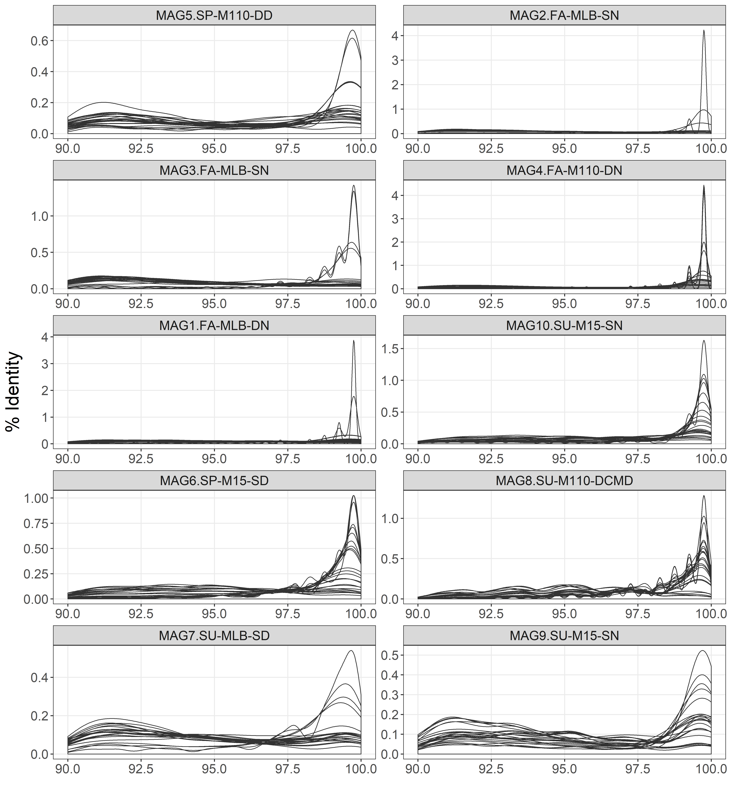


```r
# Plot for most Muskegon Lake for all bins
p_blast_sdisc_ML <- blast_df_sum %>% dplyr::filter(Site == "Muskegon Lake") %>% 
  ggplot(aes(x = bin_xcoord, ..scaled.., fill = new_bin_name, group = Sample,
             shape = Depth))+
  theme_bw()+
  facet_grid(new_bin_name~season, scales = "free_y")+
  geom_density(alpha = 0.3, color = "black", size = 1)+
  # geom_point(size = 3, alpha = 0.6)+
  scale_shape_manual("", values = c(21,22,24))+
  scale_fill_manual(values = fill_palette)+
  guides(color = FALSE, fill = FALSE)+
  # ggtitle(bin2plot)+
  theme(axis.text=element_text(size=14), axis.title=element_text(size=20),
        title=element_text(size=20), legend.text=element_text(size=14),
        legend.background = element_rect(fill="transparent"),
        axis.text.x = element_text(angle = 45, hjust = 1),
        strip.text=element_text(size=14),
        panel.grid.minor = element_blank(),
        legend.position = "bottom")+
  ylab("Scaled density")+
  xlab("Nucleotide identity (%)")+
  xlim(75,100)

p_blast_sdisc_ML
```


```r
blast_df_sum_comp <- blast_df_sum %>% group_by(Sample, bin) %>% dplyr::count(bin_xcoord)
blast_df_sum_comp <-  dplyr::left_join(blast_df_sum_comp, bin_size, by = c("bin" = "bins"))
blast_df_sum_comp <- left_join(blast_df_sum_comp, new_bin_names, by = c("bin" = "bins"))
blast_df_sum_comp$new_bin_name <- as.character(blast_df_sum_comp$new_bin_name)
blast_df_sum_comp$new_bin_name <- factor(blast_df_sum_comp$new_bin_name, levels =
                                      c("MAG1.FA-MLB-DN","MAG2.FA-MLB-SN",
                                        "MAG3.FA-MLB-SN", "MAG4.FA-M110-DN",
                                        "MAG5.SP-M110-DD","MAG6.SP-M15-SD",
                                        "MAG7.SU-MLB-SD","MAG8.SU-M110-DCMD",
                                        "MAG9.SU-M15-SN","MAG10.SU-M15-SN"))
blast_df_sum_comp <- dplyr::left_join(blast_df_sum_comp, meta_blast, by = c("Sample" = "Sample_ID"))

# Reorder site factor
blast_df_sum_comp$Site <- as.character(blast_df_sum_comp$Site)
blast_df_sum_comp$Site <- gsub("Buoy","Muskegon Lake", blast_df_sum_comp$Site)
blast_df_sum_comp$Site <- gsub("110","Lake Michigan\nsite M110", blast_df_sum_comp$Site)
blast_df_sum_comp$Site <- gsub("15","Lake Michigan\nsite M15", blast_df_sum_comp$Site)
blast_df_sum_comp$Site <- factor(blast_df_sum_comp$Site, 
                                 levels = c("Muskegon Lake",
                                            "Lake Michigan\nsite M15",
                                            "Lake Michigan\nsite M110"))
blast_df_sum_comp$Depth <- as.character(blast_df_sum_comp$Depth)
blast_df_sum_comp$Depth <- factor(blast_df_sum_comp$Depth, 
                                  levels = c("Surface", "Mid", "Deep"))
blast_df_sum_comp$Season <- as.character(blast_df_sum_comp$Season)
blast_df_sum_comp$Season <- factor(blast_df_sum_comp$Season, levels = c("Spring", "Summer", "Fall"))

# Normalize mapped reads per sample based on genome size
blast_df_sum_comp <- blast_df_sum_comp %>% group_by(bin) %>%
mutate(n_norm = 1e6*n/bin_size)

blast_df_sum_comp <- left_join(blast_df_sum_comp, total_reads, by = c("Sample" = "sample"))

# Divide normalized reads by 1M (fixed blast census)
blast_df_sum_comp <- blast_df_sum_comp %>% mutate(n_norm_perc = 100*n_norm/1e6)
```


```r
# Plot % reads corrected for genome size over threshold of 0.95
id_thresh <- 95-0.25
map_disc_cum <- blast_df_sum_comp  %>% dplyr::filter(bin_xcoord > id_thresh) %>% group_by(Sample, bin) %>% 
  mutate(cum_rel_reads_mapped = cumsum(n_norm_perc))%>% 
  dplyr::filter(bin_xcoord == 100-0.25)
sum_cum <- map_disc_cum %>% group_by(Sample, bin) %>% mutate(cum_bins_rel_reads_mapped = sum(cum_rel_reads_mapped))

p_sdisc_cum3 <- ggplot(map_disc_cum, aes(x = new_bin_name, 
                                         y = cum_rel_reads_mapped, 
                                        fill = new_bin_name))+
  theme_bw()+
  scale_fill_manual("", values = fill_palette)+
  geom_jitter(size = 4, shape = 21, color = "black", alpha = 0.7, width = 0.15)+
  theme(axis.text=element_text(size=14), axis.title=element_text(size=20),
      title=element_text(size=20), legend.text=element_text(size=12),
      legend.background = element_rect(fill="transparent"),
      axis.text.x = element_blank(),
      strip.text=element_text(size=14), legend.position = "bottom",
      strip.background = element_rect(fill = adjustcolor("gray", 0.15)))+
  ylab(paste0("Norm. relative abundance ( > ", id_thresh, "% NI)"))+
  xlab("")+
  guides(fill=guide_legend(nrow = 3))+
  facet_grid(Season~Site, scales ="free")+
  scale_y_continuous(labels=scaleFUN, limits = c(0,3))+
  coord_trans(y = "sqrt")

print(p_sdisc_cum3)
```


```r
# Plot % reads over threshold of 0.99
id_thresh <- 99-0.25
map_disc_cum <- blast_df_sum_comp  %>% dplyr::filter(bin_xcoord > id_thresh) %>% group_by(Sample, bin) %>% 
  mutate(cum_rel_reads_mapped = cumsum(n_norm_perc))%>% 
  dplyr::filter(bin_xcoord == 100-0.25)
sum_cum <- map_disc_cum %>% group_by(Sample, bin) %>% mutate(cum_bins_rel_reads_mapped = sum(cum_rel_reads_mapped))

p_sdisc_cum4 <- ggplot(map_disc_cum, aes(x = new_bin_name, 
                                         y = cum_rel_reads_mapped, 
                                        fill = new_bin_name))+
  theme_bw()+
  scale_fill_manual("", values = fill_palette)+
  geom_jitter(size = 4, shape = 21, color = "black", alpha = 0.7, width = 0.15)+
  theme(axis.text=element_text(size=14), axis.title=element_text(size=20),
      title=element_text(size=20), legend.text=element_text(size=12),
      legend.background = element_rect(fill="transparent"),
      axis.text.x = element_blank(),
      strip.text=element_text(size=14), legend.position = "bottom",
      strip.background = element_rect(fill = adjustcolor("gray", 0.15)))+
  ylab(paste0("Norm. relative abundance ( > ", id_thresh, "% NI)"))+
  xlab("")+
  guides(fill=guide_legend(nrow = 3))+
  facet_grid(Season~Site, scales ="free")+
  scale_y_continuous(labels=scaleFUN, limits = c(0,1.25))+
  coord_trans(y = "sqrt")

print(p_sdisc_cum4)
```

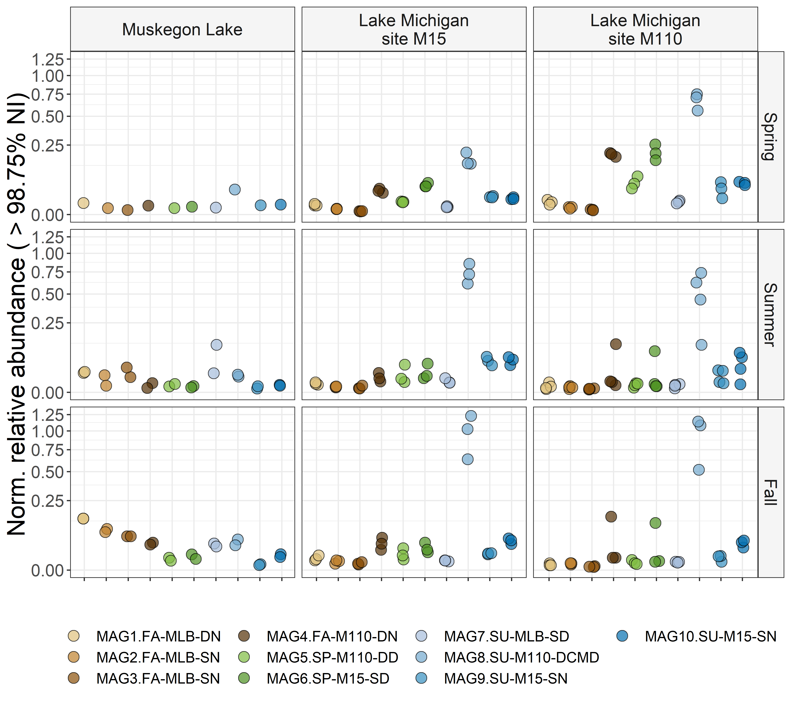

<!-- ### Filter out bins using MClust   -->

<!-- ** Here we will use model-based clustering to determine whether there is a MAG present or not in a certain sample. **  -->

<!-- ```{r filter-bins-1, dpi = 500, warning = FALSE, fig.width = 7, fig.height = 6} -->
<!-- # Perform gaussian mixture clustering on whole dataset. -->
<!-- mod1 <- densityMclust(blast_df_sum$bin_xcoord) -->
<!-- summary(mod1) -->
<!-- par(mfrow=c(2,2)) -->
<!-- plot(mod1, what = "density", data = blast_df_sum$bin_xcoord, breaks = 15) -->
<!-- plot(mod1, what = "BIC") -->
<!-- plot(mod1, what = "diagnostic", type = "cdf") -->
<!-- plot(mod1, what = "diagnostic", type = "qq") -->
<!-- par(mfrow=c(1,1)) -->

<!-- # Return cluster labels and plot the Sequence discrete populations again. -->
<!-- blast_df_sum$cluster_label <- mod1$classification -->
<!-- blast_df_sum$model_density <- mod1$density -->

<!-- # Add cluster labels to blast_df_sum_comp -->
<!-- tmp <- blast_df_sum[, c("bin_xcoord", "cluster_label", "model_density")] %>% distinct() -->
<!-- tmp$bin_xcoord <- as.factor(tmp$bin_xcoord) -->
<!-- blast_df_sum_comp$bin_xcoord <- as.factor(blast_df_sum_comp$bin_xcoord) -->
<!-- blast_df_sum_comp <- left_join(blast_df_sum_comp, tmp, by = "bin_xcoord") -->
<!-- blast_df_sum_comp$bin_xcoord <-  -->
<!--   as.numeric(as.character(blast_df_sum_comp$bin_xcoord)) -->
<!-- blast_df_sum_comp$cluster_label <- as.factor(blast_df_sum_comp$cluster_label) -->

<!-- # Plot for global analysis -->
<!-- p_blast_sdisc_glob_clust <- blast_df_sum_comp %>%  -->
<!--   ggplot(aes(x = bin_xcoord, y = model_density,  -->
<!--              color = cluster_label, group = Sample))+ -->
<!--   theme_bw()+ -->
<!--   geom_line(alpha = 1, size = 1)+ -->
<!--   scale_color_brewer(palette = "Dark2")+ -->
<!--   guides(color = FALSE, fill = FALSE)+ -->
<!--   theme(axis.text=element_text(size=14), axis.title=element_text(size=20), -->
<!--         title=element_text(size=20), legend.text=element_text(size=14), -->
<!--         legend.background = element_rect(fill="transparent"), -->
<!--         axis.text.x = element_text(angle = 45, hjust = 1), -->
<!--         strip.text=element_text(size=16), -->
<!--         panel.grid.minor = element_blank(), -->
<!--         legend.position = "bottom")+ -->
<!--   ylab("Density")+ -->
<!--   xlab("Nucleotide identity (%)")+ -->
<!--   xlim(75,100) -->

<!-- print(p_blast_sdisc_glob_clust) -->

<!-- ``` -->

<!-- ```{r filter-bins-2, dpi = 500, warning = FALSE, fig.width = 10, fig.height = 20} -->
<!-- # Plot for most abundant bin (B63) -->
<!-- p_blast_sdisc_B63_clust <- blast_df_sum_comp %>% dplyr::filter(bin == "B63_Su13.BD.MM110.DCMD_rebin1") %>%  -->
<!--   ggplot(aes(x = bin_xcoord, y = n, color = cluster_label, group = Sample))+ -->
<!--   theme_bw()+ -->
<!--   facet_grid(Season~Site)+ -->
<!--   geom_line(alpha = 1, size = 1)+ -->
<!--   scale_color_brewer(palette = "Dark2")+ -->
<!--   guides(color = FALSE, fill = FALSE)+ -->
<!--   theme(axis.text=element_text(size=14), axis.title=element_text(size=20), -->
<!--         title=element_text(size=20), legend.text=element_text(size=14), -->
<!--         legend.background = element_rect(fill="transparent"), -->
<!--         axis.text.x = element_text(angle = 45, hjust = 1), -->
<!--         strip.text=element_text(size=16), -->
<!--         panel.grid.minor = element_blank(), -->
<!--         legend.position = "bottom")+ -->
<!--   ylab("Density")+ -->
<!--   xlab("Nucleotide identity (%)")+ -->
<!--   xlim(75,100) -->

<!-- print(p_blast_sdisc_B63_clust) -->
<!-- ``` -->

### Compare blast to bwa results  


```r
# Compare blast inferred abundances with bwa inferred abundances
grid_arrange_shared_legend(p_abs2, p_sdisc_cum4, ncol = 2)
```


```r
# Merge those two dataframes and make scatter plot highlighting the differences 
df_map_merged_sm <- df_map_merged[, c("Bin","Sample","rel_norm_abundance", "Season", "Site")]
df_map_merged_sm$Sample <- gsub(".", "_", df_map_merged_sm$Sample, fixed = TRUE)
df_map_merged_sm <- data.frame(df_map_merged_sm, 
                               interaction = interaction(df_map_merged_sm$Bin,
                                                                         df_map_merged_sm$Sample),
                              method = "bwa")

map_disc_cum_sm <- map_disc_cum[, c("bin","Sample","cum_rel_reads_mapped")] 
map_disc_cum_sm <- data.frame(map_disc_cum_sm, 
                              interaction = interaction(map_disc_cum_sm$bin,
                                                                         map_disc_cum_sm$Sample),
                              method = "blastn")

abs_merged <- left_join(df_map_merged_sm, map_disc_cum_sm, by = "interaction")
abs_merged <- abs_merged[,c("Bin","Sample.x","rel_norm_abundance","cum_rel_reads_mapped",
                            "Season", "Site")]
colnames(abs_merged) <- c("Bin","Sample",
                          "bwa_norm_abundance","blastn_norm_abundance",
                          "Season", "Site")


# Plot
p_scat_abund <- ggplot(abs_merged, aes(x = bwa_norm_abundance, y = blastn_norm_abundance))+
  theme_bw()+
  geom_point(size = 4, shape = 21, color = "black", alpha = 0.7,
             aes(fill = Bin))+
  scale_fill_manual("", values = fill_palette)+
  theme(axis.text=element_text(size=14), axis.title=element_text(size=20),
      title=element_text(size=20), legend.text=element_text(size=12),
      legend.background = element_rect(fill="transparent"),
      strip.text=element_text(size=14), legend.position = "bottom",
      strip.background = element_rect(fill = adjustcolor("gray", 0.15)))+
  ylab(paste0("Norm. relative abundance (blastn, > ", id_thresh, "% NI)"))+
  xlab("Norm. relative abundance (BWA)")+
  guides(fill=guide_legend(nrow = 3))+
  facet_grid(Season~Site, scales ="free")+
  scale_y_continuous(labels=scaleFUN)+
  scale_x_continuous(labels=scaleFUN)+
  geom_smooth(method = "lm", color = "black")
  # coord_trans(x = "atanh", y = "atanh")

print(p_scat_abund)
```

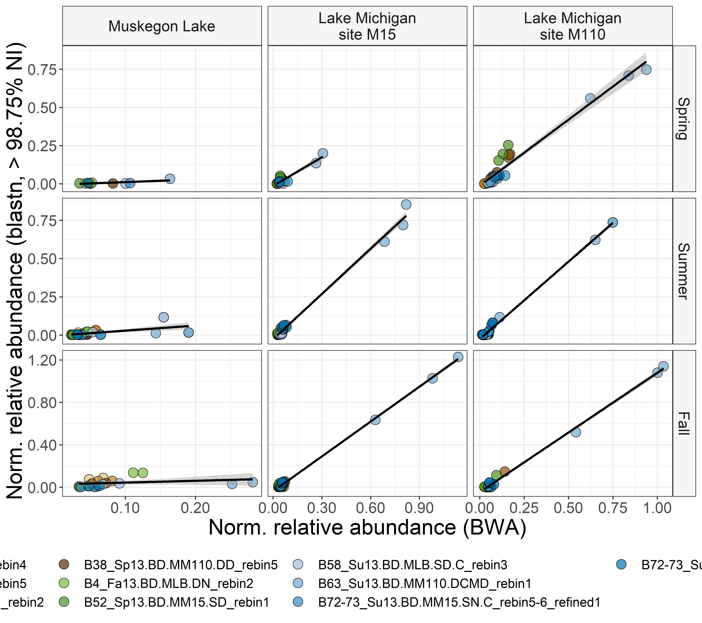

<!-- ### Calculate temporospatial diversity in Lhab -->

<!-- ```{r diversity-Lhab, dpi = 500, warning = FALSE, fig.width = 9, fig.height = 5} -->
<!-- abs_merged_div <- map_disc_cum[, c("Sample", "new_bin_name", "n_norm")] -->
<!-- abs_merged_div$n_norm <- as.integer(abs_merged_div$n_norm ) -->

<!-- # Format long to wide format -->
<!-- abs_table <- spread(abs_merged_div, Sample, n_norm) -->
<!-- abs_table <- data.frame(abs_table) -->
<!-- rownames(abs_table) <- abs_table[, 1]; abs_table <- abs_table[, -1] -->
<!-- tax.table <- data.frame(MAGs = rownames(abs_table)) -->
<!-- rownames(tax.table) <- tax.table$MAGs -->

<!-- # Make phyloseq object -->
<!-- MAG_phy <- phyloseq(otu_table(abs_table, taxa_are_rows = TRUE),  -->
<!--          tax_table(as.matrix(tax.table))) -->

<!-- # Run Diversity_16S() -->
<!-- MAG_div <- Diversity_16S(MAG_phy, ncore = 3, parallel = TRUE, -->
<!--                          R = 100, brea = FALSE) -->

<!-- MAG_div <- data.frame(Sample = rownames(MAG_div), MAG_div[,-c(3:6)]) -->

<!-- # Merge with metadata -->
<!-- MAG_div <- left_join(MAG_div, meta_blast, by = c("Sample" = "Sample_ID")) -->

<!-- # Annotate and order metavariables -->
<!-- MAG_div$Site <- as.character(MAG_div$Site) -->
<!-- MAG_div$Site <- gsub("Buoy","Muskegon Lake", MAG_div$Site) -->
<!-- MAG_div$Site <- gsub("110","Lake Michigan\nsite M110", MAG_div$Site) -->
<!-- MAG_div$Site <- gsub("15","Lake Michigan\nsite M15", MAG_div$Site) -->
<!-- MAG_div$Site <- factor(MAG_div$Site, levels = c("Muskegon Lake", -->
<!--                                                           "Lake Michigan\nsite M15", -->
<!--                                                           "Lake Michigan\nsite M110")) -->
<!-- MAG_div$Depth <- as.character(MAG_div$Depth) -->
<!-- MAG_div$Depth <- factor(MAG_div$Depth, levels = c("Surface", "Mid", "Deep")) -->
<!-- MAG_div$Season <- as.character(MAG_div$Season) -->
<!-- MAG_div$Season <- factor(MAG_div$Season, levels = c("Spring", "Summer", "Fall")) -->

<!-- # Plot results -->
<!-- p_MAG_div <- ggplot(MAG_div, aes(x = Season, y = D2,  -->
<!--                                         fill = Season, shape = Depth))+ -->
<!--   theme_bw()+ -->
<!--   scale_fill_brewer(palette = "Accent")+ -->
<!--   geom_point(size = 4, color = "black", alpha = 0.7)+ -->
<!--   scale_shape_manual(values = c(21,24,23))+ -->
<!--   # geom_boxplot(alpha = 0.4)+ -->
<!--   theme(axis.text=element_text(size=14), axis.title=element_text(size=20), -->
<!--       title=element_text(size=20), legend.text=element_text(size=12), -->
<!--       legend.background = element_rect(fill="transparent"), -->
<!--       axis.text.x = element_text(size = 14, angle = 45, hjust = 1), -->
<!--       strip.text=element_text(size=14), legend.position = "bottom", -->
<!--       strip.background = element_rect(fill = adjustcolor("gray", 0.15)))+ -->
<!--   ylab(paste0("Limnohabitans population\n diversity (D2)"))+ -->
<!--   guides(fill=FALSE)+ -->
<!--   facet_grid(~Site, scales ="free")+ -->
<!--   xlab("")+ -->
<!--   geom_errorbar(aes(ymin = D2 - sd.D2, ymax = D2 + sd.D2), width = 0.05)+ -->
<!--   scale_y_continuous(labels=scaleFUN, limits = c(0,6.5)) -->
<!--   # coord_trans(y = "sqrt") -->

<!-- print(p_MAG_div) -->
<!-- ``` -->

# 8. DESMAN


```r
# Import data
results_desm <- read.csv("./DESMAN/MAG8_scg_10_9/Gamma_meanR.csv", header = TRUE)
colnames(results_desm)[1] <- "Samples"
colnames(results_desm) <- gsub("X", "Strain", colnames(results_desm))
colnames(results_desm) <- c("Samples", "Strain 1", "Strain 2", "Strain 3", "Strain 4",
                            "Strain 5")
results_desm$Samples <- gsub(".sorted.MAG8","",results_desm$Samples, fixed = TRUE)

# Import library prep data
library_prep <- read.table("./mapping_files/Libraries.tsv",header = TRUE)

# Wide to long format
results_desm_long <- tidyr::gather(results_desm, Strain, Freq, 
                             2:(ncol(results_desm)), factor_key=TRUE)
# Merge with metadata
results_desm_long <- dplyr::left_join(results_desm_long, library_prep, by = "Samples")
results_desm_long$Samples <- gsub(".A", "", results_desm_long$Samples, fixed = TRUE)
results_desm_long$Samples <- gsub(".C", "", results_desm_long$Samples, fixed = TRUE)
results_desm_long <- dplyr::left_join(results_desm_long, meta_em, by = c("Samples" = "Sample_ID"))

results_desm_long$Site <- as.character(results_desm_long$Site)
results_desm_long$Site <- gsub("110", "Lake Michigan\nsite M110", results_desm_long$Site)
results_desm_long$Site <- gsub("15", "Lake Michigan\nsite M15", results_desm_long$Site)
results_desm_long$Site <- gsub("Buoy", "Muskegon Lake", results_desm_long$Site)
results_desm_long$Site <- factor(results_desm_long$Site, levels = c("Muskegon Lake",
                                                            "Lake Michigan\nsite M15",
                                                            "Lake Michigan\nsite M110"))
results_desm_long$Season <- as.character(results_desm_long$Season)
results_desm_long$Season <- factor(results_desm_long$Season, levels = c("Spring", "Summer","Fall"))

# Factor to numeric
results_desm_long$Temperature..C. <- as.numeric(as.character(results_desm_long$Temperature..C.))
results_desm_long$PAR <- as.numeric(as.character(results_desm_long$PAR))
results_desm_long$Chl.Lab..ug.L. <- as.numeric(as.character(results_desm_long$Chl.Lab..ug.L.))
results_desm_long$DO.Probe..mg.L. <- as.numeric(as.character(results_desm_long$DO.Probe..mg.L.))
results_desm_long$TP.ug.L <- as.numeric(as.character(results_desm_long$TP.ug.L))
results_desm_long$DOC.mg.L <- as.numeric(as.character(results_desm_long$DOC.mg.L))
```

## Check correlation with environmental variables 


```r
desm_p1b <- ggplot(results_desm_long, aes(x = Season, y = Freq, 
                                         fill = Strain, 
                                         col = Strain))+
  geom_point(color = "black", alpha = 0.7, size = 3, shape = 21)+
  # scale_shape_manual("", values = c(24,22,21))+
  # scale_shape_manual(values = c(21,22,23))+
  geom_boxplot(alpha = 0.3, col = "black", outlier.shape = NA, size = 0.3)+
  scale_fill_brewer("", palette = "Accent")+
  scale_color_brewer("",palette = "Accent")+
  theme_bw()+
  # geom_point(size = 4, color = "black", alpha = 0.7)+
  # scale_shape_manual(values = c(21,24,23))+
  # geom_boxplot(alpha = 0.4)+
  theme(axis.text=element_text(size=12), axis.title=element_text(size=16),
      title=element_text(size=16), legend.text=element_text(size=10),
      legend.background = element_rect(fill="transparent"),
      axis.text.x = element_text(size = 12, angle = 45, hjust = 1),
      strip.text=element_text(size=12), legend.position = "bottom",
      strip.background = element_rect(fill = adjustcolor("gray", 0.15)))+
  ylab(paste0("Strain frequency"))+
  guides(fill=FALSE)+
  facet_grid(Site~Strain, scales ="free")+
  xlab("")+
  scale_y_continuous(labels=scaleFUN, limits = c(0,1))+
  # geom_smooth(se = FALSE)+
  guides(fill=FALSE)
  # coord_trans(y = "sqrt")

print(desm_p1b)
```


```r
# Just depth profile for M110 station
desm_p2b <- results_desm_long %>% dplyr::filter(Site == "Lake Michigan\nsite M110"& 
                                                  Depth != "Mid") %>% 
  ggplot(., aes(x = Season, y = Freq, 
                                         fill = Strain, 
                                         col = Strain))+
  geom_point(color = "black", alpha = 0.7, size = 4, shape = 21)+
  scale_fill_brewer("", palette = "Accent")+
  scale_color_brewer("",palette = "Accent")+
  theme_bw()+
  # geom_point(size = 4, color = "black", alpha = 0.7)+
  # scale_shape_manual(values = c(21,24,23))+
  # geom_boxplot(alpha = 0.4)+
  theme(axis.text=element_text(size=12), axis.title=element_text(size=16),
      title=element_text(size=16), legend.text=element_text(size=10),
      legend.background = element_rect(fill="transparent"),
      axis.text.x = element_text(size = 12, angle = 45, hjust = 1),
      strip.text=element_text(size=12), legend.position = "bottom",
      strip.background = element_rect(fill = adjustcolor("gray", 0.15)))+
  ylab(paste0("Strain frequency"))+
  guides(fill=FALSE)+
  facet_grid(Depth~Strain, scales ="free")+
  xlab("")+
  scale_y_continuous(labels=scaleFUN, limits = c(0,1))+
  # geom_smooth(se = FALSE)+
  guides(fill=FALSE)
  # coord_trans(y = "sqrt")

print(desm_p2b)
```

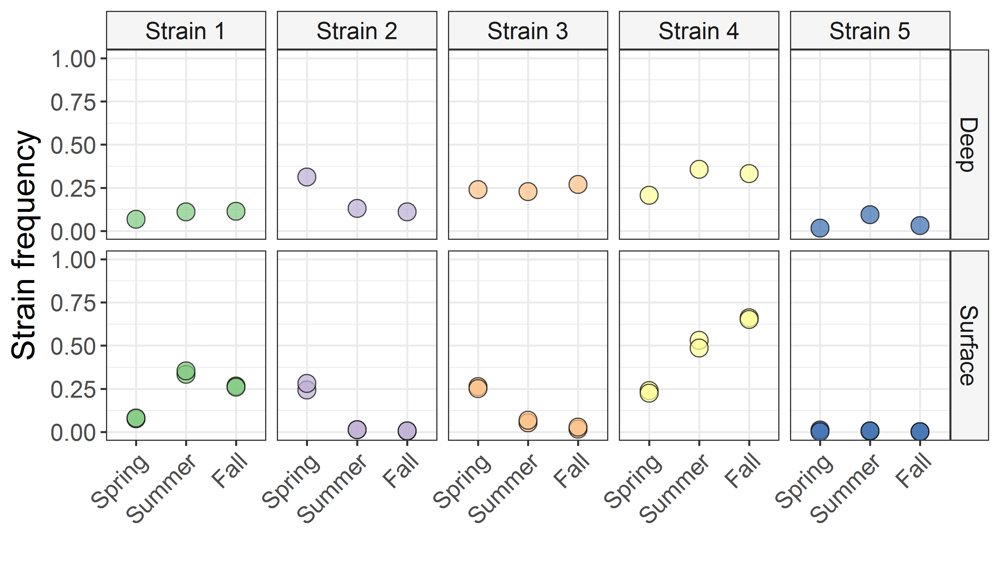


```r
# Make correlation plot of strain variances alone
p.mat_t <- cor.mtest(results_desm[-1],method = "pearson", use="pairwise")
corrplot(cor(results_desm[-1], method = "pearson"), order = "hclust", addrect = 2,
         tl.col="black", tl.srt=45, 
         sig.level = 0.05,
         diag=TRUE)
```


```r
print(cor(results_desm[-1], method = "pearson"))
```

```
##            Strain 1   Strain 2    Strain 3   Strain 4    Strain 5
## Strain 1  1.0000000 -0.8202727 -0.41160714  0.8601689 -0.61595753
## Strain 2 -0.8202727  1.0000000  0.10207177 -0.8626241  0.48346894
## Strain 3 -0.4116071  0.1020718  1.00000000 -0.2628128 -0.06622574
## Strain 4  0.8601689 -0.8626241 -0.26281282  1.0000000 -0.76358889
## Strain 5 -0.6159575  0.4834689 -0.06622574 -0.7635889  1.00000000
```

```r
results_desm$Samples <- gsub(".A", "", results_desm$Samples, fixed = TRUE)
results_desm$Samples <- gsub(".C", "", results_desm$Samples, fixed = TRUE)

# Make correlation plot of strain variances with environmental parameters
results_desm_env <- left_join(results_desm, meta_em, by = c("Samples" = "Sample_ID"))
results_desm_env <- results_desm_env %>% 
  dplyr::select(Samples:`Strain 5`, Temperature..C., `Cond..µS.cm.`,
                                   TP.ug.L, DOC.mg.L, PAR, DO.Probe..mg.L.,
                Chl.Lab..ug.L.) %>% 
  apply(., 2, function(x) as.numeric(as.character(x))) %>% data.frame()

corrplot(cor(results_desm_env[-1], method = "pearson", use="pairwise"), 
          addrect = 2, order = "hclust",
         tl.col="black", tl.srt=45, 
         sig.level = 0.05,
         diag=TRUE)
```

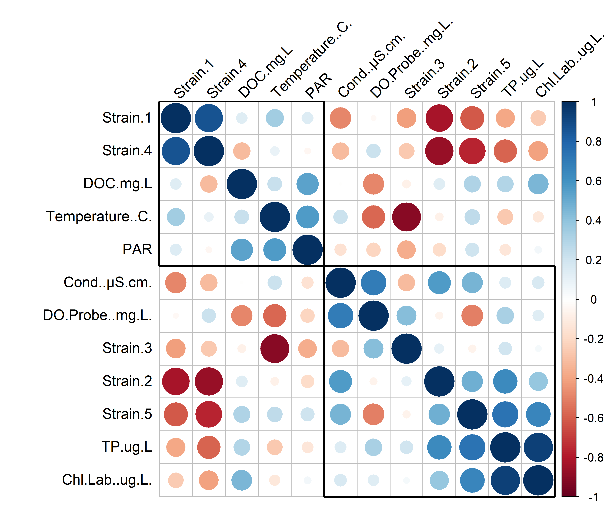

```r
print(cor(results_desm_env[-1], method = "pearson", use="pairwise")[1:5, ])
```

```
##            Strain.1   Strain.2    Strain.3   Strain.4    Strain.5
## Strain.1  1.0000000 -0.8202727 -0.41160715  0.8601689 -0.61595750
## Strain.2 -0.8202727  1.0000000  0.10207178 -0.8626241  0.48346889
## Strain.3 -0.4116071  0.1020718  1.00000000 -0.2628128 -0.06622572
## Strain.4  0.8601689 -0.8626241 -0.26281282  1.0000000 -0.76358887
## Strain.5 -0.6159575  0.4834689 -0.06622572 -0.7635889  1.00000000
##          Temperature..C. Cond..µS.cm.    TP.ug.L    DOC.mg.L         PAR
## Strain.1      0.34481960   -0.4860871 -0.3861337  0.13104041  0.14442728
## Strain.2     -0.07366979    0.5616745  0.6354257  0.13681522 -0.18508745
## Strain.3     -0.90955092   -0.3110741  0.1936932 -0.07672245 -0.36314128
## Strain.4      0.09272609   -0.3154406 -0.5826171 -0.31330645 -0.04343812
## Strain.5      0.25378964    0.4672220  0.7396795  0.30023012  0.20455637
##          DO.Probe..mg.L. Chl.Lab..ug.L.
## Strain.1     -0.03438865    -0.25151040
## Strain.2     -0.06078842     0.38969012
## Strain.3      0.42427714     0.04255277
## Strain.4      0.21315075    -0.40976670
## Strain.5     -0.50569631     0.65365968
```

```r
colnames(results_desm_env)[-1]
```

```
##  [1] "Strain.1"        "Strain.2"        "Strain.3"       
##  [4] "Strain.4"        "Strain.5"        "Temperature..C."
##  [7] "Cond..µS.cm."    "TP.ug.L"         "DOC.mg.L"       
## [10] "PAR"             "DO.Probe..mg.L." "Chl.Lab..ug.L."
```

```r
print(cor.mtest(results_desm_env[-1],method = "pearson", use="pairwise")$p)
```

```
##               [,1]         [,2]         [,3]         [,4]         [,5]
##  [1,] 0.000000e+00 9.239903e-07 4.567366e-02 7.108310e-08 1.352611e-03
##  [2,] 9.239903e-07 0.000000e+00 6.350749e-01 5.920205e-08 1.669098e-02
##  [3,] 4.567366e-02 6.350749e-01 0.000000e+00 2.147037e-01 7.584960e-01
##  [4,] 7.108310e-08 5.920205e-08 2.147037e-01 0.000000e+00 1.417411e-05
##  [5,] 1.352611e-03 1.669098e-02 7.584960e-01 1.417411e-05 0.000000e+00
##  [6,] 1.160468e-01 7.445643e-01 4.534080e-09 6.814959e-01 2.544210e-01
##  [7,] 7.801333e-02 3.659950e-02 2.790026e-01 2.719500e-01 9.209330e-02
##  [8,] 1.551432e-01 1.090805e-02 4.891349e-01 2.265657e-02 1.621215e-03
##  [9,] 6.415704e-01 6.268178e-01 7.858018e-01 2.555027e-01 2.769303e-01
## [10,] 5.935779e-01 4.925486e-01 1.668248e-01 8.730920e-01 4.472885e-01
## [11,] 8.823569e-01 7.935129e-01 5.524854e-02 3.535678e-01 1.935020e-02
## [12,] 3.473915e-01 1.356871e-01 8.756597e-01 1.149672e-01 6.027313e-03
##               [,6]       [,7]         [,8]       [,9]      [,10]
##  [1,] 1.160468e-01 0.07801333 1.551432e-01 0.64157041 0.59357792
##  [2,] 7.445643e-01 0.03659950 1.090805e-02 0.62681784 0.49254864
##  [3,] 4.534080e-09 0.27900255 4.891349e-01 0.78580179 0.16682479
##  [4,] 6.814959e-01 0.27195000 2.265657e-02 0.25550268 0.87309199
##  [5,] 2.544210e-01 0.09209330 1.621215e-03 0.27693035 0.44728845
##  [6,] 0.000000e+00 0.46841256 3.470042e-01 0.42301090 0.02338948
##  [7,] 4.684126e-01 0.00000000 6.918041e-01 0.97959502 0.69252132
##  [8,] 3.470042e-01 0.69180406 0.000000e+00 0.29030153 0.72210624
##  [9,] 4.230109e-01 0.97959502 2.903015e-01 0.00000000 0.14215923
## [10,] 2.338948e-02 0.69252132 7.221062e-01 0.14215923 0.00000000
## [11,] 7.414131e-03 0.01218690 2.385871e-01 0.06807210 0.45911626
## [12,] 6.392885e-01 0.63632415 4.665197e-07 0.08948707 0.87398504
##             [,11]        [,12]
##  [1,] 0.882356890 3.473915e-01
##  [2,] 0.793512882 1.356871e-01
##  [3,] 0.055248542 8.756597e-01
##  [4,] 0.353567755 1.149672e-01
##  [5,] 0.019350202 6.027313e-03
##  [6,] 0.007414131 6.392885e-01
##  [7,] 0.012186900 6.363242e-01
##  [8,] 0.238587083 4.665197e-07
##  [9,] 0.068072096 8.948707e-02
## [10,] 0.459116263 8.739850e-01
## [11,] 0.000000000 6.159640e-01
## [12,] 0.615964034 0.000000e+00
```


```r
desm_p2 <- ggplot(results_desm_long, aes(x = Temperature..C., y = Freq, 
                                         fill = Strain, 
                                         col = Strain))+
  geom_point(color = "black", alpha = 0.7, shape = 21, size = 4, col = "black")+
  scale_fill_brewer("", palette = "Accent")+
  scale_color_brewer("", palette = "Accent")+
  theme_bw()+
  # geom_point(size = 4, color = "black", alpha = 0.7)+
  # scale_shape_manual(values = c(21,24,23))+
  # geom_boxplot(alpha = 0.4)+
  theme(axis.text=element_text(size=12), axis.title=element_text(size=16),
      title=element_text(size=16), legend.text=element_text(size=10),
      legend.background = element_rect(fill="transparent"),
      axis.text.x = element_text(size = 12),
      strip.text=element_text(size=12), legend.position = "bottom",
      strip.background = element_rect(fill = adjustcolor("gray", 0.15)))+
  ylab(paste0("Strain frequency"))+
  guides(fill=FALSE)+
  # facet_grid(Season~Site, scales ="free")+
  xlab("Temperature (°C)")+
  scale_y_continuous(labels=scaleFUN, limits = c(0,1))+
  geom_smooth(se = FALSE)+
  guides(fill=guide_legend(nrow=2))
  # coord_trans(y = "sqrt")

desm_p3 <- results_desm_long %>% mutate(Chl.Lab..ug.L. =
                                          as.numeric(as.character(Chl.Lab..ug.L.))) %>% 
  ggplot(., aes(x = Chl.Lab..ug.L. , y = Freq, 
                                         fill = Strain, 
                                         col = Strain))+
  geom_point(color = "black", alpha = 0.7, shape = 21, size = 4, col = "black")+
  scale_fill_brewer("", palette = "Accent")+
  scale_color_brewer("", palette = "Accent")+
  theme_bw()+
  # geom_point(size = 4, color = "black", alpha = 0.7)+
  # scale_shape_manual(values = c(21,24,23))+
  # geom_boxplot(alpha = 0.4)+
  theme(axis.text=element_text(size=12), axis.title=element_text(size=16),
      title=element_text(size=16), legend.text=element_text(size=10),
      legend.background = element_rect(fill="transparent"),
      axis.text.x = element_text(size = 12),
      strip.text=element_text(size=12), legend.position = "bottom",
      strip.background = element_rect(fill = adjustcolor("gray", 0.15)))+
  ylab(paste0("Strain frequency"))+
  guides(fill=FALSE)+
  # facet_grid(Season~Site, scales ="free")+
  xlab("Chl a concentration (µg/L)")+
  scale_y_continuous(labels=scaleFUN, limits = c(0,1))+
  geom_smooth(se = FALSE, span = 1)+
  guides(fill=guide_legend(nrow=2))
  # coord_trans(y = "sqrt")

desm_p4 <- results_desm_long %>% mutate(TDP.SRP = as.numeric(as.character(TDP.SRP))) %>% 
  ggplot(., aes(x = TDP.SRP, y = Freq, 
                                         fill = Strain, 
                                         col = Strain))+
  geom_point(color = "black", alpha = 0.7, shape = 21, size = 4, col = "black")+
  scale_fill_brewer("", palette = "Accent")+
  scale_color_brewer("",palette = "Accent")+
  theme_bw()+
  # geom_point(size = 4, color = "black", alpha = 0.7)+
  # scale_shape_manual(values = c(21,24,23))+
  # geom_boxplot(alpha = 0.4)+
  theme(axis.text=element_text(size=12), axis.title=element_text(size=16),
      title=element_text(size=16), legend.text=element_text(size=10),
      legend.background = element_rect(fill="transparent"),
      axis.text.x = element_text(size = 12),
      strip.text=element_text(size=12), legend.position = "bottom",
      strip.background = element_rect(fill = adjustcolor("gray", 0.15)))+
  ylab(paste0("Strain frequency"))+
  guides(fill=FALSE)+
  # facet_grid(Season~Site, scales ="free")+
  xlab("Soluble Reactive Phosphorus (SRP - µg/L)")+
  scale_y_continuous(labels=scaleFUN, limits = c(0,1))+
  geom_smooth(se = FALSE, span = 0.75)+
  guides(fill=guide_legend(nrow=2))
  # coord_trans(y = "sqrt")

desm_p5 <- results_desm_long %>% mutate(PON.mg.L = as.numeric(as.character(PON.mg.L))) %>% 
  ggplot(., aes(x = PON.mg.L, y = Freq, 
                                         fill = Strain, 
                                         col = Strain))+
  geom_point(color = "black", alpha = 0.7, shape = 21, size = 4, col = "black")+
  scale_fill_brewer("", palette = "Accent")+
  scale_color_brewer("",palette = "Accent")+
  theme_bw()+
  # geom_point(size = 4, color = "black", alpha = 0.7)+
  # scale_shape_manual(values = c(21,24,23))+
  # geom_boxplot(alpha = 0.4)+
  theme(axis.text=element_text(size=12), axis.title=element_text(size=16),
      title=element_text(size=16), legend.text=element_text(size=10),
      legend.background = element_rect(fill="transparent"),
      axis.text.x = element_text(size = 12),
      strip.text=element_text(size=12), legend.position = "bottom",
      strip.background = element_rect(fill = adjustcolor("gray", 0.15)))+
  ylab(paste0("Strain frequency"))+
  guides(fill=FALSE)+
  # facet_grid(Season~Site, scales ="free")+
  xlab("Particulate Organic Nitrogen (PON - mg/L)")+
  scale_y_continuous(labels=scaleFUN, limits = c(0,1))+
  geom_smooth(se = FALSE, span = 0.75)+
  guides(fill=guide_legend(nrow=2))
  # coord_trans(y = "sqrt")

desm_p6 <- results_desm_long %>% mutate(POC.mg.L = as.numeric(as.character(POC.mg.L))) %>%
  ggplot(., aes(x = POC.mg.L, y = Freq, 
                                         fill = Strain, 
                                         col = Strain))+
  geom_point(color = "black", alpha = 0.7, shape = 21, size = 4, col = "black")+
  scale_fill_brewer("", palette = "Accent")+
  scale_color_brewer("",palette = "Accent")+
  theme_bw()+
  # geom_point(size = 4, color = "black", alpha = 0.7)+
  # scale_shape_manual(values = c(21,24,23))+
  # geom_boxplot(alpha = 0.4)+
  theme(axis.text=element_text(size=12), axis.title=element_text(size=16),
      title=element_text(size=16), legend.text=element_text(size=10),
      legend.background = element_rect(fill="transparent"),
      axis.text.x = element_text(size = 12),
      strip.text=element_text(size=12), legend.position = "bottom",
      strip.background = element_rect(fill = adjustcolor("gray", 0.15)))+
  ylab(paste0("Strain frequency"))+
  guides(fill=FALSE)+
  # facet_grid(Season~Site, scales ="free")+
  xlab("Particulate Organic Carbon (POC - mg/L)")+
  scale_y_continuous(labels=scaleFUN, limits = c(0,1))+
  geom_smooth(se = FALSE, span = 0.75)+
  guides(fill=guide_legend(nrow=2))
  # coord_trans(y = "sqrt")

# Combine all exploratory plots
cowplot::plot_grid(desm_p3, desm_p4, desm_p5, desm_p6, ncol = 2, align = 'hv')
```

```
## `geom_smooth()` using method = 'loess' and formula 'y ~ x'
## `geom_smooth()` using method = 'loess' and formula 'y ~ x'
## `geom_smooth()` using method = 'loess' and formula 'y ~ x'
## `geom_smooth()` using method = 'loess' and formula 'y ~ x'
```

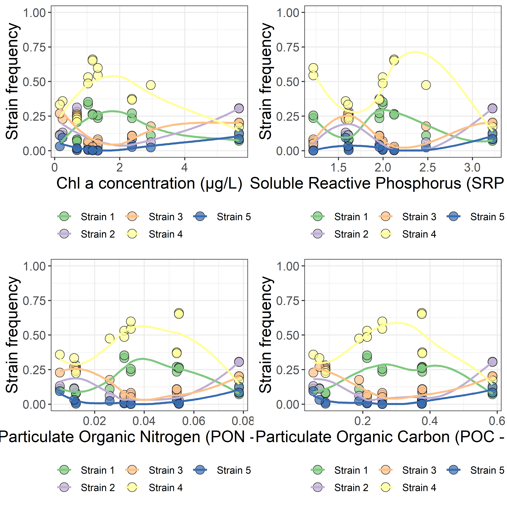


## Diversity plots 


```r
alpha_div_desman <- data.frame(Sample = results_desm[,1], 
      D2 = vegan::diversity(results_desm[,2:ncol(results_desm)], index = "invsimpson")
)

alpha_div_desman <- left_join(alpha_div_desman, meta_em,
                              by = c("Sample" = "Sample_ID"))

alpha_div_desman$Site <- as.character(alpha_div_desman$Site)
alpha_div_desman$Site <- gsub("110", "Lake Michigan\nsite M110", alpha_div_desman$Site)
alpha_div_desman$Site <- gsub("15", "Lake Michigan\nsite M15", alpha_div_desman$Site)
alpha_div_desman$Site <- gsub("Buoy", "Muskegon Lake", alpha_div_desman$Site)
alpha_div_desman$Site <- factor(alpha_div_desman$Site, levels = c("Muskegon Lake",
                                                            "Lake Michigan\nsite M15",
                                                            "Lake Michigan\nsite M110"))
alpha_div_desman$Season <- as.character(alpha_div_desman$Season)
alpha_div_desman$Season <- factor(alpha_div_desman$Season, levels = c("Spring", "Summer","Fall"))

p_alpha_desman <- alpha_div_desman %>% 
  ggplot(., aes(x = Season, y = D2, fill = Season, shape = Depth))+
  geom_point(size = 4) +
  scale_shape_manual("", values = c(21,22,24))+
  facet_grid(.~Site)+
  theme_bw()+
  scale_fill_brewer(palette = "Accent")+
  labs(y = expression("LimB strain diversity (D"[2]*")"), x = "")+
  theme(axis.text=element_text(size=12), axis.title=element_text(size=16),
        title=element_text(size=16), legend.text=element_text(size=16),
        strip.text = element_text(size = 16))+
  ylim(0,4.2)+
  guides(fill  = guide_legend(title = "", override.aes = list(size = 4, shape = 21),
                         nrow = 4)
   )

print(p_alpha_desman)
```

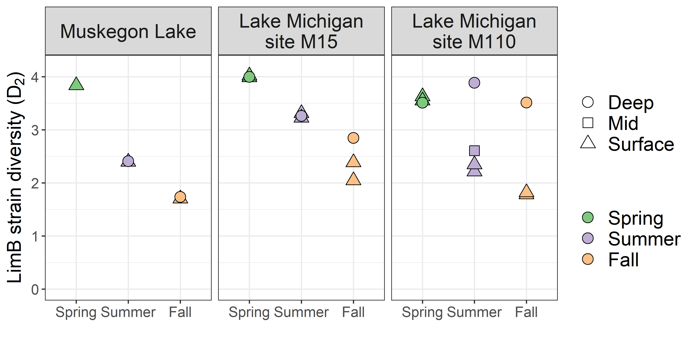


```r
# Make PCoA
variants <- results_desm[,2:ncol(results_desm)]
rownames(variants) <- results_desm[, 1]
taxa <- as.matrix(data.frame(variant_name = colnames(results_desm)[2:ncol(results_desm)]))
rownames(taxa) <- colnames(results_desm)[2:ncol(results_desm)]

# Store as phyloseq object
physeq_desm <- phyloseq(otu_table(variants, taxa_are_rows = FALSE),
         tax_table(taxa)
)

# Run beta diversity analysis on 16s data
pcoa <- ordinate(
  physeq = physeq_desm, 
  method = "PCoA", 
  distance = "bray",
  correction = "lingoes",
  k=2
)
pcoa.df <- data.frame(Samples = sample_names(physeq_desm), pcoa$vectors)
var <- round(pcoa$values$Eigenvalues/sum(pcoa$values$Eigenvalues)*100,1)

# Add metadata
pcoa.df$Samples <- gsub(".A", "", pcoa.df$Samples, fixed = TRUE)
pcoa.df$Samples <- gsub(".C", "", pcoa.df$Samples, fixed = TRUE)
pcoa.df <- dplyr::left_join(pcoa.df, meta_em, by = c("Samples" = "Sample_ID"))

pcoa.df$Site <- as.character(pcoa.df$Site)
pcoa.df$Site <- gsub("110", "Lake Michigan - M110", pcoa.df$Site)
pcoa.df$Site <- gsub("15", "Lake Michigan - M15", pcoa.df$Site)
pcoa.df$Site <- gsub("Buoy", "Muskegon Lake", pcoa.df$Site)
pcoa.df$Site <- factor(pcoa.df$Site, levels = c("Muskegon Lake",
                                                            "Lake Michigan - M15",
                                                            "Lake Michigan - M110"))
pcoa.df$Season <- as.character(pcoa.df$Season)
pcoa.df$Season <- factor(pcoa.df$Season, levels = c("Spring", "Summer","Fall"))

# Run permanova
x <- results_desm[,2:ncol(results_desm)]
rownames(x) <- results_desm[, 1]
dist_desm <- vegan::vegdist(x)
perm <- permute::how(nperm = 999)
permanova_desm <- vegan::adonis(dist_desm ~ Season * Site, 
                        data = meta_em, 
                        permutations = perm)

# Plot PCoA
my_grob = grobTree(textGrob(bquote(paste(r[Season]^2 == 
    .(round(100 * permanova_desm$aov.tab[1, 5], 1)), 
    "%")), x = 0.7, y = 0.95, hjust = 0, gp = gpar(col = "black", 
    fontsize = 14, fontface = "italic")))
my_grob2 = grobTree(textGrob(bquote(paste(r[Site]^2 == 
    .(format(round(100 * permanova_desm$aov.tab[2, 5], 
        1), nsmall = 1)), "%")), x = 0.7, y = 0.87, 
    hjust = 0, gp = gpar(col = "black", fontsize = 14, 
        fontface = "italic")))
my_grob3 = grobTree(textGrob(bquote(paste(r[Season:Site]^2 == 
    .(round(100 * permanova_desm$aov.tab[3, 5], 1)), 
    "%")), x = 0.7, y = 0.79, hjust = 0, gp = gpar(col = "black", 
    fontsize = 14, fontface = "italic")))

pcoa.ord <- ggplot(data=pcoa.df, aes(x=Axis.1, y=Axis.2, shape = Site))+
  scale_shape_manual(values=c(21,23, 24))+
  geom_point(size=7, alpha=0.7, aes(fill = Season))+
  theme_bw()+
  scale_fill_brewer(palette = "Accent")+
  labs(x = paste0("PCoA axis 1 (",var[1], "%)"),
       y = paste0("PCoA axis 2 (",var[2], "%)"), fill="", shape = "", colour="")+
  theme(axis.text=element_text(size=14), axis.title=element_text(size=16),
        title=element_text(size=16), legend.text=element_text(size=16))+ 
  guides(fill = guide_legend(override.aes = list(shape = 22)))+
  annotation_custom(my_grob)+
  annotation_custom(my_grob2)+
  annotation_custom(my_grob3)+
  ggtitle("PCoA of resolved MAG8 variant composition")

print(pcoa.ord)
```


## Gene assignment  


```r
# Import etaS.csv which contains gene assignment
geneAssign_df <- read.csv("./DESMAN/MAG8_scg_10_9/MAG8.SU-M110-DCMDetaS_df.csv",
                         header = TRUE)
colnames(geneAssign_df) <- gsub("X", "Variant", colnames(geneAssign_df))
geneAssign_df <- geneAssign_df[, c(1,6,8,9,10,11)]
colnames(geneAssign_df) <- c("Gene", "Strain 1", "Strain 2", "Strain 3", "Strain 4",
                            "Strain 5")

# Check for presence of core gene presence in strains
core_cogs_lim <- unique(read.csv("./DESMAN/MAG8_scg_10_9/Filtered_Tau_star.csv")[,1])

# Check predicted presence of core genes
geneAssign_df %>% dplyr::filter(Gene %in% core_cogs_lim)
```

```
##              Gene Strain 1 Strain 2 Strain 3 Strain 4 Strain 5
## 1  contig_20975_3        1        1        1        0        1
## 2  contig_20975_2        1        1        1        1        1
## 3  contig_20975_5        1        1        1        1        1
## 4  contig_20975_4        1        1        1        1        1
## 5  contig_20975_7        1        1        1        1        1
## 6  contig_21188_3        1        1        1        1        1
## 7  contig_21188_1        1        1        1        1        1
## 8  contig_21188_4        1        1        1        1        1
## 9  contig_21013_3        1        1        1        0        1
## 10 contig_21099_3        1        1        1        1        1
## 11 contig_20877_2        1        1        1        1        1
## 12 contig_20877_3        1        1        1        1        1
## 13 contig_20984_3        1        1        1        0        1
## 14 contig_20984_7        1        1        1        1        1
## 15 contig_20984_6        1        1        1        1        1
## 16 contig_20984_8        1        1        1        1        1
## 17 contig_20881_1        1        1        1        1        1
## 18 contig_20915_2        1        1        1        0        1
```

```r
# Wide to long format
geneAssign_df <- tidyr::gather(geneAssign_df, Variant, Presence, 
                             `Strain 1`:`Strain 5`, factor_key=TRUE)

# Import blast results
blast_desman <- read.delim("./DESMAN/MAG8_scg_10_9/desman2img_genes.blast", 
                         header = FALSE)
colnames(blast_desman) <- c("qseqid", "sseqid", "pident", "length", "mismatch",
                          "gapopen", "qstart", "qend", "sstart", "send", 
                          "evalue", "bitscore")
blast_desman_sb <- blast_desman %>% dplyr::select("qseqid", "sseqid") %>%  distinct()

# Merge IMG gene IDs with 
geneAssign_df <- left_join(geneAssign_df, blast_desman_sb, by = c("Gene" = "qseqid"))
geneAssign_df$sseqid <- as.character(geneAssign_df$sseqid)

# Merge with functional annotation (KO & COG)
geneAssign_df_annot <- left_join(geneAssign_df, merged_file_annot, 
                           by = c("sseqid" = "gene_oid"))

# Merge with metaT data
geneAssign_df_annot <- left_join(geneAssign_df, expr_cov_long, 
                           by = c("sseqid" = "gene_oid"))
```

### **upset diagram**  


```r
# Long to wide
geneAssign_df_wide <- tidyr::spread(geneAssign_df, Variant, Presence)

# Plot
upset(geneAssign_df_wide, sets = c("Strain 1", "Strain 2", "Strain 3", "Strain 4",
                                   "Strain 5"), mb.ratio = c(0.6, 0.45), 
      order.by = "freq", point.size = 3.5,
      mainbar.y.label = "Gene intersections", sets.x.label = "Number of genes",
      text.scale = c(1.5, 1.5, 1.5, 1.4, 2, 1.5),
      scale.intersections = "log2",
      keep.order = FALSE,
      line.size = 1.5)
```


```r
upset(geneAssign_df_wide, sets = c("Strain 1", "Strain 4"), mb.ratio = c(0.6, 0.45), 
      order.by = "freq", point.size = 3.5,
      mainbar.y.label = "Gene intersections", sets.x.label = "Number of genes",
      text.scale = c(1.5, 1.5, 1.5, 1.4, 2, 2),
      scale.intersections = "log2",
      keep.order = FALSE,
      line.size = 1.5)
```

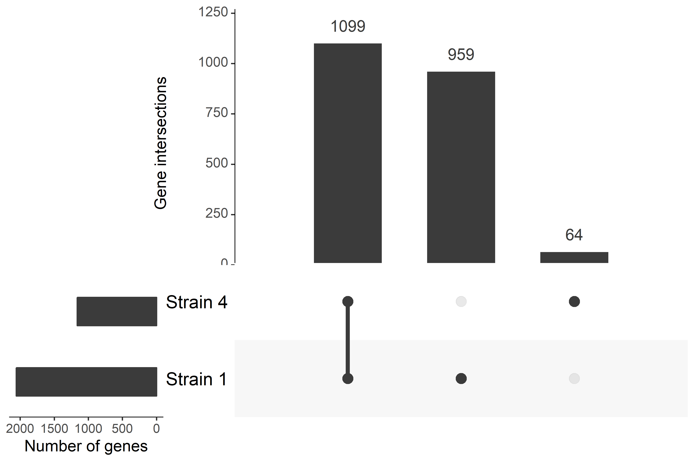

```r
upset(geneAssign_df_wide, sets = c("Strain 2", "Strain 5"), mb.ratio = c(0.6, 0.45), 
      order.by = "freq", point.size = 3.5,
      mainbar.y.label = "Gene intersections", sets.x.label = "Number of genes",
      text.scale = c(1.5, 1.5, 1.5, 1.4, 2, 2),
      scale.intersections = "log2",
      keep.order = FALSE,
      line.size = 1.5)
```

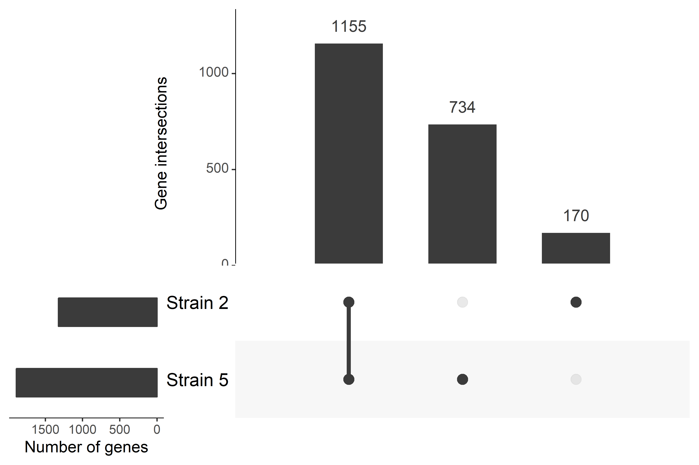

```r
# Indicate site and season-specific differential abundant genes
geneAssign_df_wide <- left_join(geneAssign_df_wide, res_deseq, 
                                by = c("sseqid" = "gene_oid"))
```

#### **Site downregulation**


```r
# Make upset plot for site-specific downregulation controlled for seasons
geneAssign_df_wide %>% dplyr::filter(regulation == "downregulation",
                                     Design == "~ Season + Site") %>% 
  upset(., sets = c("Strain 1", "Strain 2", "Strain 3", "Strain 4",
                                   "Strain 5"), mb.ratio = c(0.55, 0.45), 
      order.by = "freq", number.angles = 30, point.size = 3.5,
      mainbar.y.label = "Gene intersections", sets.x.label = "Number of genes",
      text.scale = c(1.5, 1.5, 1.5, 1.4, 2, 0.75),
      show.numbers = FALSE,
      scale.intersections = "log2",
      keep.order = FALSE,
      boxplot.summary = "log2FoldChange",
      line.size = NA)
```

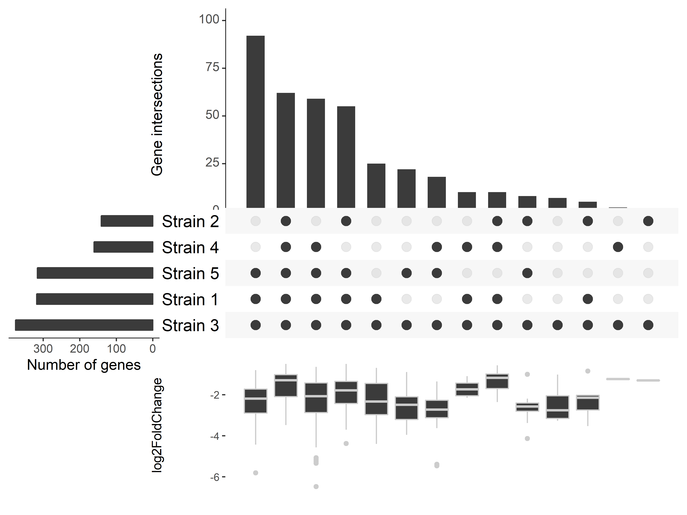

#### **Site upregulation**


```r
# Make upset plot for site-specific upregulation controlled for seasons
geneAssign_df_wide %>% dplyr::filter(regulation == "upregulation",
                                     Design == "~ Season + Site") %>% 
  upset(., sets = c("Strain 1", "Strain 2", "Strain 3", "Strain 4",
                                   "Strain 5"), mb.ratio = c(0.55, 0.45), 
      order.by = "freq", number.angles = 30, point.size = 3.5, 
      mainbar.y.label = "Gene intersections", sets.x.label = "Number of genes",
      text.scale = c(1.5, 1.5, 1.5, 1.4, 2, 0.75),
      show.numbers = FALSE,
      scale.intersections = "log2",
      keep.order = FALSE,
      boxplot.summary = "log2FoldChange",
      line.size = NA)
```

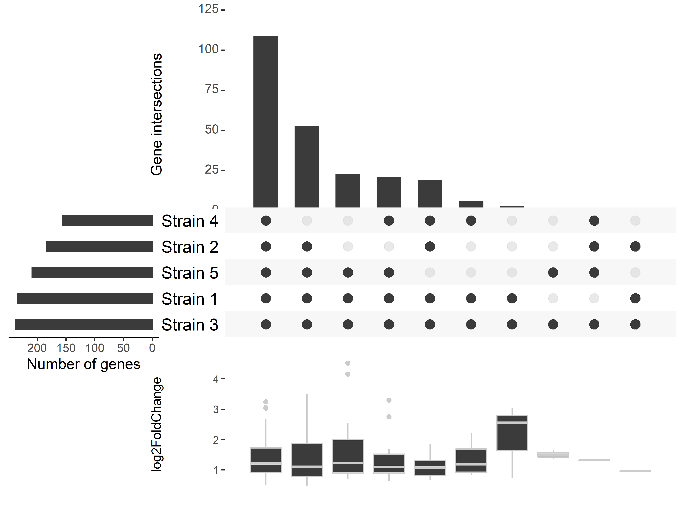

#### **Seasonal downregulation**


```r
# Make upset plot for seasonal downregulation controlled for site
geneAssign_df_wide %>% dplyr::filter(regulation == "downregulation",
                                     Design == "~ Site + Season") %>% 
  upset(., sets = c("Strain 1", "Strain 2", "Strain 3", "Strain 4",
                                   "Strain 5"), mb.ratio = c(0.55, 0.45), 
      order.by = "freq", number.angles = 30, point.size = 3.5, 
      mainbar.y.label = "Gene intersections", sets.x.label = "Number of genes",
      text.scale = c(1.5, 1.5, 1.5, 1.4, 2, 0.75),
      show.numbers = FALSE,
      scale.intersections = "log2",
      keep.order = FALSE,
      boxplot.summary = "log2FoldChange",
      line.size = NA)
```

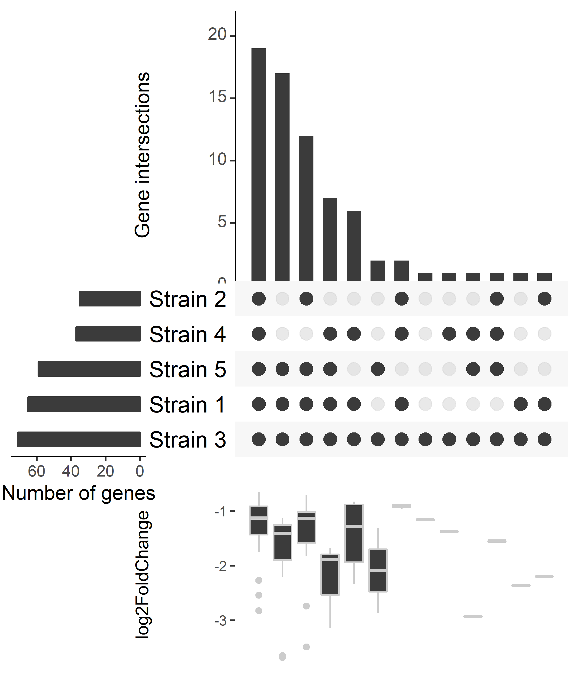

#### **Depth downregulation**  


```r
# Make upset plot for depth-specific downregulation controlled for seasons
geneAssign_df_wide %>% dplyr::filter(regulation == "downregulation",
                                     Design == "~ Site + Depth") %>% 
  upset(., sets = c("Strain 1", "Strain 2", "Strain 3", "Strain 4",
                                   "Strain 5"), mb.ratio = c(0.55, 0.45), 
      order.by = "freq", number.angles = 30, point.size = 3.5,
      mainbar.y.label = "Gene intersections", sets.x.label = "Number of genes",
      text.scale = c(1.5, 1.5, 1.5, 1.4, 2, 0.75),
      show.numbers = FALSE,
      scale.intersections = "log2",
      keep.order = FALSE,
      boxplot.summary = "log2FoldChange",
      line.size = NA)
```


#### **Depth upregulation** 


```r
# Make upset plot for depth-specific upregulation controlled for sites
geneAssign_df_wide %>% dplyr::filter(regulation == "upregulation",
                                     Design == "~ Site + Depth") %>% 
  upset(., sets = c("Strain 1", "Strain 2", "Strain 3", "Strain 4",
                                   "Strain 5"), mb.ratio = c(0.55, 0.45), 
      order.by = "freq", number.angles = 30, point.size = 3.5, 
      mainbar.y.label = "Gene intersections", sets.x.label = "Number of genes",
      text.scale = c(1.5, 1.5, 1.5, 1.4, 2, 0.75),
      show.numbers = FALSE,
      scale.intersections = "log2",
      keep.order = FALSE,
      boxplot.summary = "log2FoldChange",
      line.size = NA)
```

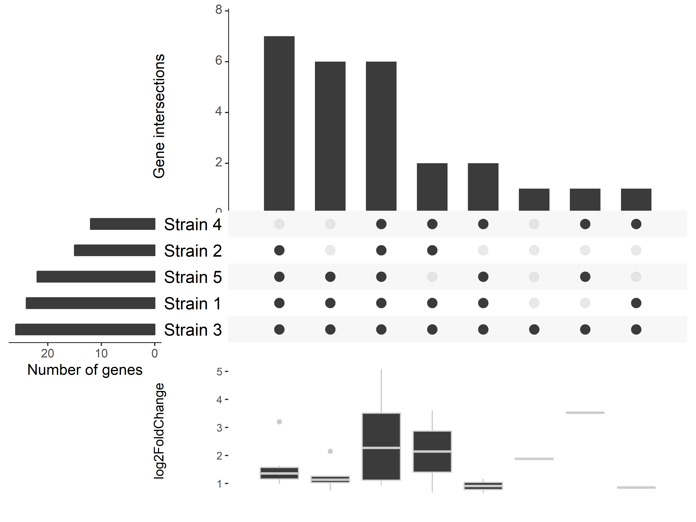

### Transcript assignment


```r
# Extract upregulated genes of depth comparison
geneAssign_df_wide_transcripts_depth <- geneAssign_df_wide %>% 
  dplyr::filter(sseqid %in% unique(MAG8_deseq_results_depth_fin$gene_oid)) %>% 
  dplyr::select(sseqid:`Strain 5`)

geneAssign_df_wide_transcripts_depth <- MAG8_deseq_results_depth_fin %>% 
  dplyr::select(log2FoldChange, gene_oid, regulation) %>% 
  left_join(geneAssign_df_wide_transcripts_depth, ., by = c("sseqid" = "gene_oid"))

# Extract upregulated genes of surface comparison
geneAssign_df_wide_transcripts_temp <- geneAssign_df_wide %>% 
  dplyr::filter(sseqid %in% unique(MAG8_deseq_results_temp_fin$gene_oid)) %>% 
  dplyr::select(sseqid:`Strain 5`)
```

```
## Error in filter_impl(.data, quo): Evaluation error: object 'MAG8_deseq_results_temp_fin' not found.
```

```r
geneAssign_df_wide_transcripts_temp <- MAG8_deseq_results_temp_fin %>% 
  dplyr::select(log2FoldChange, gene_oid, regulation) %>% 
  left_join(geneAssign_df_wide_transcripts_temp, ., by = c("sseqid" = "gene_oid"))
```

```
## Error in eval(lhs, parent, parent): object 'MAG8_deseq_results_temp_fin' not found
```

```r
# Evaluate distribution of transcripts expression over strains
# Plot upregulated genes
geneAssign_df_wide_transcripts_depth %>% 
  unique() %>% 
  upset(., 
      sets = c("Strain 1", "Strain 2","Strain 3", "Strain 4", "Strain 5"), 
      mb.ratio = c(0.55, 0.45), 
      order.by = "freq", point.size = 3.5,
      mainbar.y.label = "Gene intersections", sets.x.label = "Number of genes",
      text.scale = c(1.5, 1.5, 1.5, 1.4, 2, 3),
      scale.intersections = "log2",
      keep.order = FALSE,
      line.size = 1.2)
```

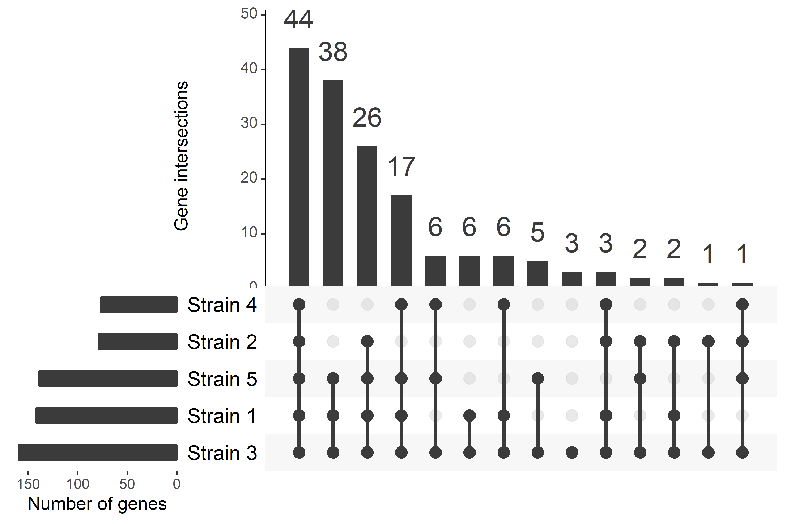

```r
geneAssign_df_wide_transcripts_depth %>% 
  dplyr::filter(regulation == "Downregulated") %>%
  unique() %>% 
  summary()
```

```
##     sseqid             Strain 1         Strain 2         Strain 3     
##  Length:45          Min.   :0.0000   Min.   :0.0000   Min.   :0.0000  
##  Class :character   1st Qu.:1.0000   1st Qu.:0.0000   1st Qu.:1.0000  
##  Mode  :character   Median :1.0000   Median :1.0000   Median :1.0000  
##                     Mean   :0.9333   Mean   :0.5778   Mean   :0.9778  
##                     3rd Qu.:1.0000   3rd Qu.:1.0000   3rd Qu.:1.0000  
##                     Max.   :1.0000   Max.   :1.0000   Max.   :1.0000  
##     Strain 4         Strain 5      log2FoldChange           regulation
##  Min.   :0.0000   Min.   :0.0000   Min.   :-4.535   Upregulated  : 0  
##  1st Qu.:0.0000   1st Qu.:1.0000   1st Qu.:-3.143   Downregulated:45  
##  Median :1.0000   Median :1.0000   Median :-2.521                     
##  Mean   :0.6444   Mean   :0.9111   Mean   :-2.689                     
##  3rd Qu.:1.0000   3rd Qu.:1.0000   3rd Qu.:-2.179                     
##  Max.   :1.0000   Max.   :1.0000   Max.   :-1.684
```

```r
# 
# geneAssign_df_wide_transcripts_temp %>% dplyr::filter(regulation == "Upregulated") %>%
#   upset(., 
#       sets = c("Strain 1", "Strain 2", "Strain 3", "Strain 4",
#                                    "Strain 5"), mb.ratio = c(0.55, 0.45), 
#       order.by = "freq", number.angles = 30, point.size = 3.5,
#       mainbar.y.label = "Gene intersections", sets.x.label = "Number of genes",
#       text.scale = c(1.5, 1.5, 1.5, 1.4, 2, 0.75),
#       show.numbers = FALSE,
#       scale.intersections = "log2",
#       keep.order = FALSE,
#       line.size = 1.2,
#       boxplot.summary = "log2FoldChange")


# geneAssign_df_wide_transcripts_temp %>% dplyr::filter(regulation == "Downregulated") %>%
#   upset(., 
#       sets = c("Strain 1", "Strain 2", "Strain 3", "Strain 4",
#                                    "Strain 5"), mb.ratio = c(0.55, 0.45), 
#       order.by = "freq", number.angles = 30, point.size = 3.5,
#       mainbar.y.label = "Gene intersections", sets.x.label = "Number of genes",
#       text.scale = c(1.5, 1.5, 1.5, 1.4, 2, 0.75),
#       show.numbers = FALSE,
#       scale.intersections = "log2",
#       keep.order = FALSE,
#       line.size = 1.2,
#       boxplot.summary = "log2FoldChange")
```

### Assign functions

```r
# Assign interactins for each strain
geneAssign_df_wide_transcripts_depth$Strain_interaction <-
  interaction(geneAssign_df_wide_transcripts_depth$`Strain 1`,
              geneAssign_df_wide_transcripts_depth$`Strain 2`,
              geneAssign_df_wide_transcripts_depth$`Strain 3`,
              geneAssign_df_wide_transcripts_depth$`Strain 4`,
              geneAssign_df_wide_transcripts_depth$`Strain 5`,
              sep = "-")

# Assign functions
geneAssign_df_wide_transcripts_depth <- left_join(geneAssign_df_wide_transcripts_depth,
                                                  merged_file_annot,
                                                  by = c("sseqid" = "gene_oid"))

# Check for gene enrichment in interactions of strain 1 - 4 / strain 2 - 5 / strain 3
# these interactions correspond to interaction term 1-0-0-1-0 / 0-1-0-0-1 / 0-0-1-0-0

# geneAssign_df_wide_transcripts_depth %>% 
#   dplyr::filter(grepl("1-.-.-1-.", Strain_interaction))

geneAssign_df_wide_transcripts_depth %>% 
  # dplyr::filter(!grepl("0-0-0-0-0", Strain_interaction)) %>% 
  # dplyr::filter(grepl("1-0-1-0-0", Strain_interaction)) %>% 
  dplyr::select(sseqid:ko_name) %>% 
  # dplyr::filter(!is.na(ko_name)) %>%
  unique() %>% 
  ggplot(., aes(x = Strain_interaction, y = log2FoldChange, fill = regulation))+
  # geom_point(shape = 21, size = 4)+
  geom_boxplot(alpha = 0.4, outlier.shape = NA)+
  # geom_bar(stat = "count")+
  scale_fill_brewer("", palette = "Set1")+
  theme_bw()+
  theme(axis.text.x=element_text(size=12, angle = 30, hjust = 1),
        axis.text.y = element_text(size = 12),
        axis.title=element_text(size=16),
        title=element_text(size=16), legend.text=element_text(size=16),
        strip.text = element_text(size = 16))+
  guides(fill = FALSE)
```

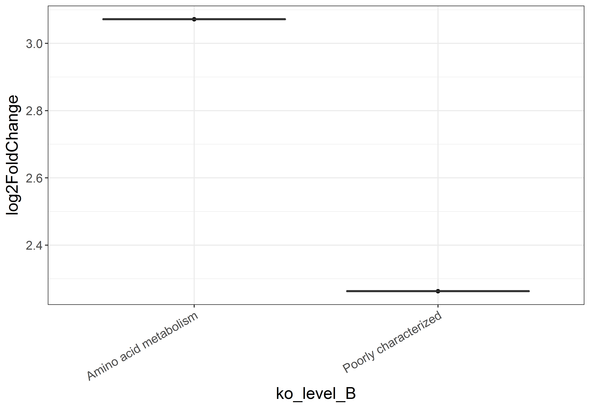

```r
  # ylim(0,40)
```

### Black Queen Hypothesis?


```r
geneAssign_df_annot_func <- geneAssign_df_wide[, 1:7]
geneAssign_df_annot_func$Strain_interaction <- 
  interaction(geneAssign_df_annot_func$`Strain 1`,
              geneAssign_df_annot_func$`Strain 2`,
              geneAssign_df_annot_func$`Strain 3`,
              geneAssign_df_annot_func$`Strain 4`,
              geneAssign_df_annot_func$`Strain 5`,
              sep = "-")

# Annotate full accessory genomes
geneAssign_df_annot_func <- left_join(geneAssign_df_annot_func, 
                                 merged_file_annot, by = c("sseqid" = "gene_oid"))

# Compare only strain 1 and 4
p_unique_s1 <- geneAssign_df_annot_func %>% 
  dplyr::filter(grepl("1-.-.-0-.", Strain_interaction)) %>% 
  dplyr::select(sseqid, ko_name, ko_function_abbrev:ko_level_C) %>% 
  dplyr::filter(!is.na(ko_name)) %>% 
  unique() %>% 
  ggplot(., aes(x = ko_level_C, fill = ko_level_B))+
  # geom_point()+
  # geom_boxplot()+
  geom_bar(stat = "count", col = "black")+
  scale_fill_brewer("", palette = "Paired")+
  theme_bw()+
  theme(axis.text.x=element_text(size=12, angle = 30, hjust = 1),
        axis.text.y = element_text(size = 12),
        axis.title=element_text(size=16),
        title=element_text(size=16), legend.text=element_text(size=16),
        strip.text = element_text(size = 16))+
  guides(fill = FALSE)
  # ylim(0,40)

p_unique_s2 <- geneAssign_df_annot_func %>% 
  dplyr::filter(grepl("0-.-.-1-.", Strain_interaction)) %>% 
  dplyr::select(sseqid, ko_name, ko_function_abbrev:ko_level_C) %>% 
  dplyr::filter(!is.na(ko_name)) %>% 
  unique() %>% 
  ggplot(., aes(x = ko_level_C, fill = ko_level_B))+
  # geom_point()+
  # geom_boxplot()+
  geom_bar(stat = "count", col = "black")+
  scale_fill_brewer("", palette = "Paired")+
  theme_bw()+
  theme(axis.text.x=element_text(size=12, angle = 30, hjust = 1),
        axis.text.y = element_text(size = 12),
        axis.title=element_text(size=16),
        title=element_text(size=16), legend.text=element_text(size=16),
        strip.text = element_text(size = 16))+
  guides(fill = FALSE)
  # ylim(0,40)

cowplot::plot_grid(p_unique_s1, p_unique_s2, align = "hv", ncol = 2)
```


### Gene enrichment


```r
# Test for enrichment of functional categories in strains with small inferred genomes
## Test for enrichment of KO level C terms 
bg_gsea <- geneAssign_df_annot_func %>% 
  dplyr::select(ko_level_C, sseqid) %>% 
  distinct()
bg_gsea[is.na(bg_gsea)] <- "Unknown"

s1g <- geneAssign_df_annot_func %>% 
  dplyr::filter(`Strain 5` == 1) %>% 
  dplyr::select(sseqid) %>% 
  unique() 

strain1_gsea <- enricher(gene = s1g$sseqid,
         universe = bg_gsea$sseqid, 
         TERM2GENE = bg_gsea,
         pvalueCutoff = 0.05,
         qvalueCutoff = 0.2)
```


### Strain DOM usage


```r
# Import DOM usage table
DOM_usage_df <- read.csv("./IMG_annotation/DOM_usage.csv", stringsAsFactors = FALSE,
                         check.names =FALSE)
DOM_usage_df$DOM_type <- gsub("\\n","\n", DOM_usage_df$DOM_type, fixed = TRUE)

# Retain COG_ids that are found in DOM_usage_df list
COG_profiles_sub <- geneAssign_df_annot_func %>%
  dplyr::filter(cog_id %in% DOM_usage_df$COG_ID)

COG_profiles_sub <- dplyr::left_join(COG_profiles_sub, DOM_usage_df, 
                                     by = c("cog_id" = "COG_ID")) %>% 
  dplyr::select(sseqid, Strain_interaction, cog_id, DOM_type) %>% 
  unique()

# Add COG counts
COG_profiles_sub_cnt <- COG_profiles_sub %>% 
  group_by(Strain_interaction, DOM_type) %>% 
  mutate(sum_counts = n())

# Order COG ids according to classification
COG_order <- DOM_usage_df %>% 
  dplyr::filter(COG_ID %in% unique(COG_profiles_sub_cnt$cog_id))
COG_profiles_sub_cnt$cog_id <- factor(COG_profiles_sub_cnt$cog_id,
                                        levels = COG_order$COG_ID)

# # make heatmap
# hm_DOC1 <- complete(COG_profiles_sub_cnt, cog_id,
#          fill = list(sum_counts = 0)) %>%
#   # dplyr::filter(Genome %in% selected_genomes) %>%
#   ggplot(aes(y = Strain_interaction, x= cog_id)) + # x and y axes => Var1 and Var2
#   geom_tile(aes(fill = sum_counts), col = "lightgrey") + # background colours are mapped according to the value column
#   geom_text(aes(label = round(sum_counts, 0)), size = 3) + # write the values
#   # scale_fill_gradientn(colours = terrain.colors(10), trans = "log1p")+
#   # scale_fill_gradient(low = "lightblue", high = "darkslategray", na.value="white",
#                       # trans = "log1p", limits=c(1, 40)) +
#   scale_fill_distiller(palette="YlOrRd", na.value="lightgrey", trans = "sqrt",
#                        direction = 1) +
#   theme(panel.grid.major.x=element_blank(), #no gridlines
#         panel.grid.minor.x=element_blank(),
#         panel.grid.major.y=element_blank(),
#         panel.grid.minor.y=element_blank(),
#         panel.background=element_rect(fill="white"), # background=white
#         axis.text.x = element_text(angle=45, hjust = 1, vjust=1, size = 12,face = "bold"),
#         plot.title = element_text(size=20,face="bold"),
#         axis.text.y = element_text(size = 12,face = "bold"))+
#   theme(legend.title=element_text(face="bold", size=14)) +
#   scale_x_discrete(name="") +
#   scale_y_discrete(name="") +
#   labs(fill="Gene\ncount")

# print(hm_DOC1)

# Barplot
p_DOM_dist <- COG_profiles_sub_cnt %>% 
  dplyr::filter(Strain_interaction != "0-0-0-0-0") %>% 
  dplyr::select(Strain_interaction, DOM_type, sum_counts) %>% 
  unique() %>% 
  ggplot2::ggplot(aes(x = Strain_interaction, y = sum_counts, fill = DOM_type))+
  geom_bar(alpha = 0.8, stat = "identity", color = "black", width = 0.5)+
  scale_fill_brewer("", palette = "Paired")+
  theme_bw()+
  theme(axis.text=element_text(size=14), axis.title=element_text(size=20),
        title=element_text(size=20), legend.text=element_text(size=10),
        legend.background = element_rect(fill="transparent"),
        # axis.text.x = element_text(angle = 65, hjust = 1),
        strip.text.x=element_text(size = 18),
        legend.position="right",
        axis.text.x=element_text(size = 14, angle =45, hjust= 1),
        plot.title = element_text(hjust = 0, size=18))+
  guides(fill=guide_legend(ncol=1))+
  ylab("Number of genes")+
  xlab('Intersection')

print(p_DOM_dist)
```

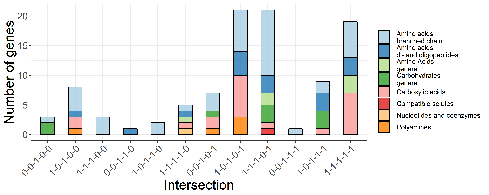

# 9. iRep analysis

```r
# Import data
irep_files <- list.files("./iRep/results", pattern = "irep_")
irep_sample_order <- read.table("./iRep/results/sample_order.tsv")
for(file in irep_files){
  # print(file)
  file_tmp <- read.table(paste("./iRep/results/", file, sep = ""),
                         stringsAsFactors = FALSE)
  bin_name <- gsub("irep_results_|.tsv", "", file)
  # print(bin_name)
  file_tmp <- data.frame(Genome_bin = bin_name, iRep_value = file_tmp[,2],
                         iRep_type = rep(c("iRep_filtered","iRep_unfiltered"), 24),
                         Sample = rep(irep_sample_order$V1, each = 2))
  if(file == irep_files[1]) results_irep <- file_tmp else{
    results_irep <- rbind(results_irep, file_tmp)
  }
}

# Rename sample names
results_irep$Sample <- gsub(".A", "", results_irep$Sample, fixed = TRUE)
results_irep$Sample <- gsub(".C", "", results_irep$Sample, fixed = TRUE)

# Rename genome bins
results_irep <- dplyr::left_join(results_irep, new_bin_names, by = c("Genome_bin" = "bins"))
results_irep$new_bin_name <- as.character(results_irep$new_bin_name)
results_irep$new_bin_name <- factor(results_irep$new_bin_name, levels =
                                      c("MAG1.FA-MLB-DN","MAG2.FA-MLB-SN",
                                        "MAG3.FA-MLB-SN", "MAG4.FA-M110-DN",
                                        "MAG5.SP-M110-DD","MAG6.SP-M15-SD",
                                        "MAG7.SU-MLB-SD","MAG8.SU-M110-DCMD",
                                        "MAG9.SU-M15-SN","MAG10.SU-M15-SN"))

# Merge with metadata
results_irep <- dplyr::left_join(results_irep, meta, by = "Sample")
results_irep$iRep_value <- as.numeric(as.character(results_irep$iRep_value))

# Format metadata
results_irep$Site <- as.character(results_irep$Site)
results_irep$Site <- gsub("110", "Lake Michigan\nsite M110", results_irep$Site)
results_irep$Site <- gsub("15", "Lake Michigan\nsite M15", results_irep$Site)
results_irep$Site <- gsub("Buoy", "Muskegon Lake", results_irep$Site)
results_irep$Site <- factor(results_irep$Site, levels = c("Muskegon Lake",
                                                            "Lake Michigan\nsite M15",
                                                            "Lake Michigan\nsite M110"))
results_irep$Season <- as.character(results_irep$Season)
results_irep$Season <- factor(results_irep$Season, levels = c("Spring", "Summer","Fall"))
```

## Plot results  


```r
# Plot unfiltered iRep
irep_p1 <- results_irep %>% 
  dplyr::filter(iRep_type == "iRep_unfiltered") %>% 
  ggplot(aes(x = new_bin_name, y = iRep_value, fill = new_bin_name, col = new_bin_name))+
  geom_point(color = "black", alpha = 0.7, size = 4, shape = 21)+
  # scale_shape_manual(values = c(21,22,23))+
  geom_boxplot(alpha = 0.3, col = "black", outlier.shape = NA, size = 0.3)+
  scale_fill_manual("", values = fill_palette)+
  scale_color_brewer("",palette = "Accent")+
  theme_bw()+
  # geom_point(size = 4, color = "black", alpha = 0.7)+
  # scale_shape_manual(values = c(21,24,23))+
  # geom_boxplot(alpha = 0.4)+
  theme(axis.text=element_text(size=12), axis.title=element_text(size=16),
      title=element_text(size=16), legend.text=element_text(size=10),
      legend.background = element_rect(fill="transparent"),
      axis.text.x = element_text(size = 12, angle = 45, hjust = 1),
      strip.text=element_text(size=12), legend.position = "bottom",
      strip.background = element_rect(fill = adjustcolor("gray", 0.15)))+
  ylab(paste0("iRep"))+
  guides(fill=FALSE)+
  facet_grid(Season~Site, scales ="free")+
  xlab("")+
  scale_y_continuous(labels=scaleFUN, limits = c(1,4.5))+
  # geom_smooth(se = FALSE)+
  guides(fill=FALSE)
  # coord_trans(y = "sqrt")

print(irep_p1)
```

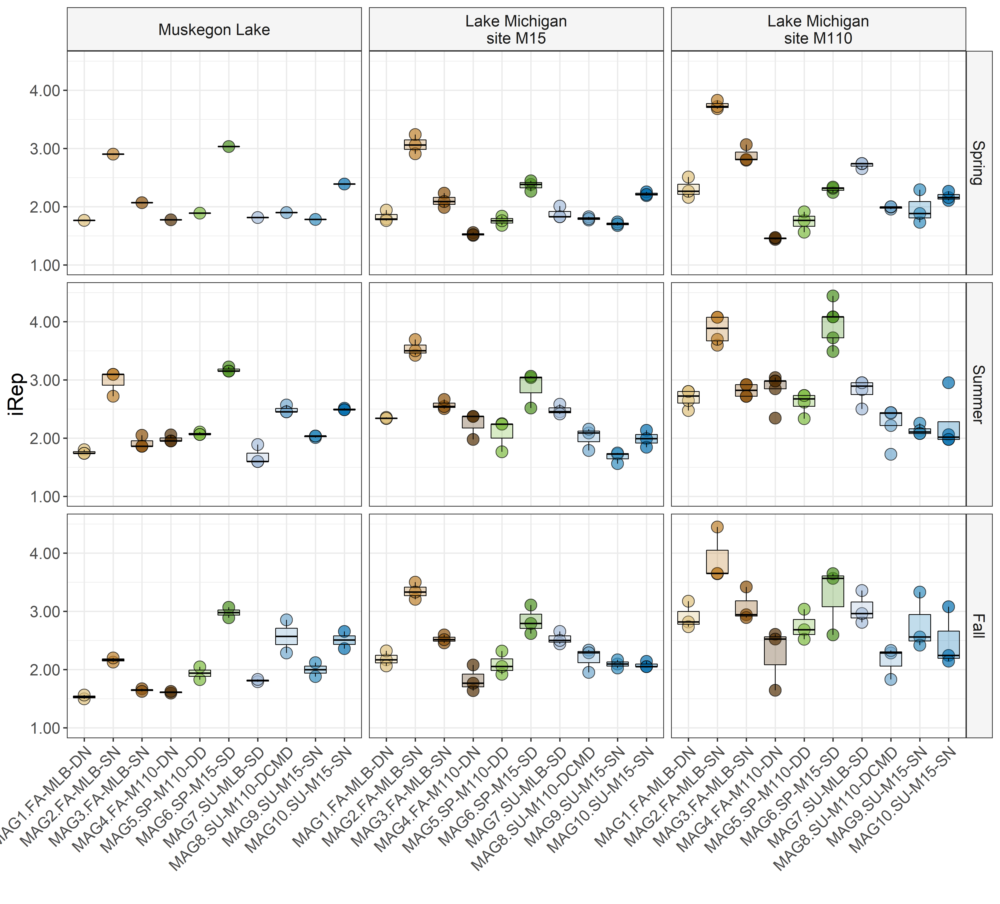

```r
# Plot filtered irep
irep_p2 <- results_irep %>% 
  dplyr::filter(iRep_type == "iRep_filtered") %>% 
  ggplot(aes(x = new_bin_name, y = iRep_value, fill = new_bin_name, col = new_bin_name))+
  geom_point(color = "black", alpha = 0.7, size = 4, shape = 21)+
  # scale_shape_manual(values = c(21,22,23))+
  geom_boxplot(alpha = 0.3, col = "black", outlier.shape = NA, size = 0.3)+
  scale_fill_manual("", values = fill_palette)+
  scale_color_brewer("",palette = "Accent")+
  theme_bw()+
  # geom_point(size = 4, color = "black", alpha = 0.7)+
  # scale_shape_manual(values = c(21,24,23))+
  # geom_boxplot(alpha = 0.4)+
  theme(axis.text=element_text(size=12), axis.title=element_text(size=16),
      title=element_text(size=16), legend.text=element_text(size=10),
      legend.background = element_rect(fill="transparent"),
      axis.text.x = element_text(size = 12, angle = 45, hjust = 1),
      strip.text=element_text(size=12), legend.position = "bottom",
      strip.background = element_rect(fill = adjustcolor("gray", 0.15)))+
  ylab(paste0("iRep"))+
  guides(fill=FALSE)+
  facet_grid(Season~Site, scales ="free")+
  xlab("")+
  scale_y_continuous(labels=scaleFUN, limits = c(1,4.5))+
  # geom_smooth(se = FALSE)+
  guides(fill=FALSE)
  # coord_trans(y = "sqrt")

print(irep_p2)
```


```r
# Only focus on MAGs for which we can determine accurate iRep values 
irep_p3 <- results_irep %>% 
  dplyr::filter(iRep_type == "iRep_filtered") %>% 
  dplyr::filter(!is.na(iRep_value)) %>% 
  ggplot(aes(x = Season, y = iRep_value, fill = new_bin_name, col = new_bin_name))+
  geom_point(color = "black", alpha = 0.7, size = 4, shape = 21)+
  # scale_shape_manual(values = c(21,22,23))+
  geom_boxplot(alpha = 0.3, col = "black", outlier.shape = NA, size = 0.3)+
  scale_fill_manual("", values = fill_palette)+
  scale_color_brewer("",palette = "Accent")+
  theme_bw()+
  # geom_point(size = 4, color = "black", alpha = 0.7)+
  # scale_shape_manual(values = c(21,24,23))+
  # geom_boxplot(alpha = 0.4)+
  theme(axis.text=element_text(size=12), axis.title=element_text(size=16),
      title=element_text(size=16), legend.text=element_text(size=10),
      legend.background = element_rect(fill="transparent"),
      axis.text.x = element_text(size = 12, angle = 45, hjust = 1),
      strip.text=element_text(size=12), legend.position = "bottom",
      strip.background = element_rect(fill = adjustcolor("gray", 0.15)))+
  ylab(paste0("iRep"))+
  guides(fill=FALSE)+
  facet_grid(new_bin_name~Site, scales ="free")+
  xlab("")+
  scale_y_continuous(labels=scaleFUN, limits = c(1,4.5))+
  # geom_smooth(se = FALSE)+
  guides(fill=FALSE)
  # coord_trans(y = "sqrt")

print(irep_p3)
```

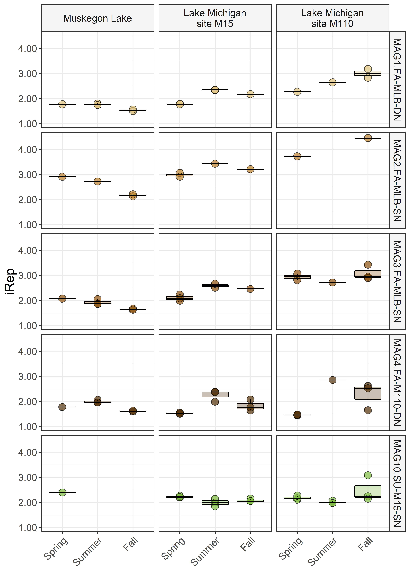


```r
# Only focus on MAGs for which we can determine accurate iRep values 
irep_p4 <- results_irep %>% 
  dplyr::filter(iRep_type == "iRep_filtered") %>% 
  dplyr::filter(!is.na(iRep_value)) %>% 
  ggplot(aes(x = new_bin_name, y = iRep_value, fill = Site, col = Site))+
  # geom_point(color = "black", alpha = 0.7, size = 4, shape = 21)+
  # scale_shape_manual(values = c(21,22,23))+
  geom_boxplot(alpha = 0.3, col = "black", outlier.shape = NA, size = 0.3)+
  scale_fill_brewer("", palette = "Accent")+
  scale_color_brewer("",palette = "Accent")+
  theme_bw()+
  # geom_point(size = 4, color = "black", alpha = 0.7)+
  # scale_shape_manual(values = c(21,24,23))+
  # geom_boxplot(alpha = 0.4)+
  theme(axis.text=element_text(size=12), axis.title=element_text(size=16),
      title=element_text(size=16), legend.text=element_text(size=10),
      legend.background = element_rect(fill="transparent"),
      axis.text.x = element_text(size = 12, angle = 45, hjust = 1),
      strip.text=element_text(size=12), legend.position = "bottom",
      strip.background = element_rect(fill = adjustcolor("gray", 0.15)))+
  ylab(paste0("iRep"))+
  # facet_grid(new_bin_name~Site, scales ="free")+
  xlab("")+
  scale_y_continuous(labels=scaleFUN, limits = c(1,4.5))
  # geom_smooth(se = FALSE)+
  # guides(fill=FALSE)
  # coord_trans(y = "sqrt")

print(irep_p4)
```


```r
# Focus on all MAGs
irep_p5 <- results_irep %>% 
  dplyr::filter(iRep_type == "iRep_unfiltered") %>% 
  dplyr::filter(!is.na(iRep_value)) %>% 
  ggplot(aes(x = new_bin_name, y = iRep_value, fill = Site, col = Site))+
  # geom_point(color = "black", alpha = 0.7, size = 4, shape = 21)+
  # scale_shape_manual(values = c(21,22,23))+
  geom_boxplot(alpha = 0.3, col = "black", outlier.shape = NA, size = 0.3)+
  scale_fill_brewer("", palette = "Accent")+
  scale_color_brewer("",palette = "Accent")+
  theme_bw()+
  # geom_point(size = 4, color = "black", alpha = 0.7)+
  # scale_shape_manual(values = c(21,24,23))+
  # geom_boxplot(alpha = 0.4)+
  theme(axis.text=element_text(size=12), axis.title=element_text(size=16),
      title=element_text(size=16), legend.text=element_text(size=10),
      legend.background = element_rect(fill="transparent"),
      axis.text.x = element_text(size = 12, angle = 45, hjust = 1),
      strip.text=element_text(size=12), legend.position = "bottom",
      strip.background = element_rect(fill = adjustcolor("gray", 0.15)))+
  ylab(paste0("iRep"))+
  # facet_grid(new_bin_name~Site, scales ="free")+
  xlab("")+
  scale_y_continuous(labels=scaleFUN, limits = c(1,4.5))
  # geom_smooth(se = FALSE)+
  # guides(fill=FALSE)
  # coord_trans(y = "sqrt")

print(irep_p5)
```

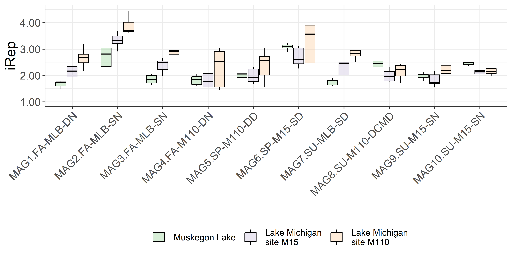

## Abundances  


```r
# Merge irep results with abundance estimates

# Correlate abundances with iRep estimates

# Plot
```


# Pangenome analysis  


```r
# Import and format panG data
# Need to use fread because of the way additional COG categories are interspersed by tabs...
panG <- data.table::fread("./panG/SUMMARY_Final_bins_wMIXED/panG-LIM-ALL_protein_clusters_summary.txt")

# Remove COG annotation
panG <- panG[, -c("V1","V2","V6", "V7")]

# Add column names
colnames(panG) <- c("bin_name", "genome_name",  "gene_callers_id",
     "COG_FUNCTION_ACC", "COG_FUNCTION", "aa_sequence")
```

```
## Error in setnames(x, value): Can't assign 6 names to a 10 column data.table
```

```r
panG_MAG <- panG
panG_MAG$gene_callers_id <- as.character(panG_MAG$gene_callers_id)
# Add unique gene identifier 
panG_MAG$unique_gene_callers_id <- interaction(panG_MAG$genome_name, 
                                               panG_MAG$gene_callers_id,
                                               sep = ".")

sum(panG_MAG$genome_name=="MAG8_SU_M110_DCMD")
```

```
## [1] 0
```

```r
panG_MAG$aa_sequence <- gsub("-", "", panG_MAG$aa_sequence)

# Export all AA sequences for annotation with KAAS or for blast
# for(i in 1:length(unique(panG_MAG$genome_name))){
#   tmp <- panG_MAG %>% dplyr::filter(genome_name == unique(panG_MAG$genome_name)[i]) %>%
#     droplevels()
#     write.table(file = paste0("./panG/", unique(panG_MAG$genome_name)[i],
#                               "_aa_export.fa"),
#            paste0(">", tmp$unique_gene_callers_id,
#       "\n", tmp$aa_sequence, sep = ""),
#       quote = FALSE, row.names = FALSE, col.names = FALSE
#       )
# }

# Import KEGG annotation through KAAS (http://www.genome.jp/tools/kaas/) of amino
# acid sequences
ko_files <- list.files(".", pattern = "KO_annot",
                       recursive = TRUE)
panG_ko <- data.frame()
for(ko_file in ko_files){
  tmp <- data.table::fread(ko_file, fill = TRUE, sep = "\t", header = FALSE)
  tmp <- data.frame(tmp, Genome = do.call(rbind, strsplit(ko_file, "-"))[,2])
  if(ko_file == ko_files[1]) panG_ko <- tmp else{
    panG_ko <- rbind(panG_ko, tmp)
  }
}
```

```
## Error in rbind(deparse.level, ...): numbers of columns of arguments do not match
```

```r
panG_ko$Genome <- gsub(".txt","",panG_ko$Genome)
colnames(panG_ko)[1:2] <- c("unique_gene_callers_id", "ko_id")
panG_ko <- panG_ko[panG_ko$ko_id != "",]
panG_ko$ko_id <- gsub(" ","", panG_ko$ko_id)

# Annotate KO_IDs with KEGG hierarchy
panG_ko <- dplyr::left_join(panG_ko, ko_path_df, by = "ko_id")

# join with corresponding COG ids
panG_ko_cog <- dplyr::left_join(panG_MAG, panG_ko, 
                                by = "unique_gene_callers_id")

# Shorten/change ko_level_B annotation a bit
panG_ko_cog$ko_level_B[panG_ko_cog$ko_level_B == "Cellular community - prokaryotes"] <- "Biofilm formation & quorum sensing"
panG_ko_cog$ko_level_B[panG_ko_cog$ko_level_B == "Xenobiotics biodegradation and metabolism"] <- "Xenobiotics degradation"
panG_ko_cog$ko_level_C[panG_ko_cog$ko_level_C == "Biofilm formation - Escherichia coli "] <- "Biofilm formation"
panG_ko_cog$ko_level_C[panG_ko_cog$ko_level_C == "Biofilm formation - Pseudomonas aeruginosa "] <- "Biofilm formation"

panG_ko$ko_level_C[panG_ko$ko_level_C == "Biofilm formation - Escherichia coli "] <- "Biofilm formation"
panG_ko$ko_level_C[panG_ko$ko_level_C == "Biofilm formation - Pseudomonas aeruginosa "] <- "Biofilm formation"

# Change the gene clusters shared between MAG1_6_10 to mixed category
panG_ko_cog$bin_name[panG_ko_cog$bin_name == "MAG1_6_10_PC"] <- "MIXED_PCs"

# Add column denoting whether it is core/mixed or accessory
panG_ko_cog$bin_core <- factor(panG_ko_cog$bin_name == "CORE_PC" | panG_ko_cog$bin_name == "MIXED_PCs")
panG_ko_cog$bin_core <- plyr::revalue(panG_ko_cog$bin_core, replace = c("TRUE" = "CORE/Mixed", "FALSE" = "Accessory"))
```

```
## The following `from` values were not present in `x`: TRUE
```


```r
# Perform hypergeometric test to see if there is functional enrichment in the pangenome
for(i_genome in 1:length(unique(panG_ko$Genome))){
  bg_gsea <- panG_ko %>% dplyr::filter(Genome == unique(panG_ko$Genome)[i_genome]) %>% 
  dplyr::select(ko_level_C,unique_gene_callers_id) %>% 
  distinct()
  
  panG_gseq <- panG_ko_cog %>% 
    dplyr::filter(Genome == unique(panG_ko$Genome)[i_genome] & 
                    bin_core == "Accessory") %>%
    dplyr::select(ko_level_C,unique_gene_callers_id) %>% 
    distinct()
  
  panG_gsea <- enricher(gene = panG_gseq$unique_gene_callers_id,
         universe = bg_gsea$unique_gene_callers_id, 
         TERM2GENE = bg_gsea,
         pvalueCutoff = 0.05,
         qvalueCutoff = 0.2)

  tmp_gseq <- data.frame(panG_gsea@result, Genome = unique(panG_ko$Genome)[i_genome])
  if(i_genome == 1) results_gseq <- tmp_gseq else {
    results_gseq <- rbind(results_gseq, tmp_gseq)
  }
  genes_per_gseq <- panG_gseq %>% 
     dplyr::filter(ko_level_C %in% panG_gsea@result$Description) %>%
     group_by(ko_level_C) %>% 
     summarize(Counts = n())
  genes_per_gseq <- data.frame(genes_per_gseq, 
                               Genome = unique(panG_ko$Genome)[i_genome])
  if(i_genome == 1) results_pergene <- genes_per_gseq else {
    results_pergene <- rbind(results_pergene, genes_per_gseq)
  }
}
```

```
## Error in filter_impl(.data, quo): Evaluation error: object 'Genome' not found.
```

```r
# Calculate fraction of enriched genes vs. annotated panG genes
results_pergene_sum <- results_pergene %>% 
  group_by(Genome) %>% 
  summarize(enrich_counts = sum(Counts))
```

```
## Error in eval(lhs, parent, parent): object 'results_pergene' not found
```

```r
annotated_fraction_panG <- panG_ko_cog %>% 
  dplyr::filter(bin_core == "Accessory") %>% 
  group_by(genome_name) %>% 
  dplyr::select(unique_gene_callers_id) %>% 
  distinct() %>% 
  summarize(panG_counts = n())
```

```
## Adding missing grouping variables: `genome_name`
```

```r
print(annotated_fraction_panG)
```

```
## # A tibble: 4,331 x 2
##    genome_name panG_counts
##          <int>       <int>
##  1           0          12
##  2           1          13
##  3           2          15
##  4           3          13
##  5           4          12
##  6           5          13
##  7           6          12
##  8           7          11
##  9           8          14
## 10           9          13
## # ... with 4,321 more rows
```

```r
results_pergene_sum <- left_join(results_pergene_sum, annotated_fraction_panG,
                                 by = c("Genome" = "genome_name"))
```

```
## Error in left_join(results_pergene_sum, annotated_fraction_panG, by = c(Genome = "genome_name")): object 'results_pergene_sum' not found
```

```r
# Merge actual unique gene counts per gsea category with the accessory genome sizes
results_pergene_sum <- results_pergene_sum %>% 
  mutate(frac_enrich = enrich_counts/panG_counts)
```

```
## Error in eval(lhs, parent, parent): object 'results_pergene_sum' not found
```

```r
print(results_pergene_sum)
```

```
## Error in print(results_pergene_sum): object 'results_pergene_sum' not found
```

```r
# Make plot
results_gseq$Genome <- gsub("_","-",results_gseq$Genome)
```

```
## Error in gsub("_", "-", results_gseq$Genome): object 'results_gseq' not found
```

```r
results_gseq$Genome <- gsub("-FA",".FA",results_gseq$Genome)
```

```
## Error in gsub("-FA", ".FA", results_gseq$Genome): object 'results_gseq' not found
```

```r
results_gseq$Genome <- gsub("-SU",".SU",results_gseq$Genome)
```

```
## Error in gsub("-SU", ".SU", results_gseq$Genome): object 'results_gseq' not found
```

```r
results_gseq$Genome <- gsub("-SP",".SP",results_gseq$Genome)
```

```
## Error in gsub("-SP", ".SP", results_gseq$Genome): object 'results_gseq' not found
```

```r
results_gseq$Genome <- factor(results_gseq$Genome, levels =
                                      c("MAG5.SP-M110-DD","MAG2.FA-MLB-SN",
                                        "MAG3.FA-MLB-SN", "MAG4.FA-M110-DN",
                                        "MAG1.FA-MLB-DN", "MAG10.SU-M15-SN",
                                        "MAG6.SP-M15-SD", "MAG8.SU-M110-DCMD",
                                        "MAG7.SU-MLB-SD","MAG9.SU-M15-SN"))
```

```
## Error in factor(results_gseq$Genome, levels = c("MAG5.SP-M110-DD", "MAG2.FA-MLB-SN", : object 'results_gseq' not found
```

```r
p_panG5 <- results_gseq %>% 
  ggplot(aes(x = Description, fill = Genome, y = Count))+
  geom_bar(color = "black", stat = "identity")+
  theme_bw()+
  scale_fill_brewer(palette="Paired")+
  ylab("Number of genes") + xlab("")+
  facet_grid(.~Genome, scales = "free")+
  theme(axis.text.y=element_text(size=12.5), axis.title.y =element_text(size = 18),
        legend.background = element_rect(fill="transparent"),
        axis.text.x = element_text(size=12.5, angle = 45, hjust = 1),
        plot.margin = unit(c(1.1,1.1,1.1,1.1), "cm"),
        strip.text = element_text(size = 12))+
  guides(fill = FALSE)
```

```
## Error in eval(lhs, parent, parent): object 'results_gseq' not found
```

```r
# print(p_panG5)

# Make heatmap instread

results_gseq_wide <- complete(results_gseq, Genome, Description,
         fill = list(Count = 0)) %>% 
  dplyr::select(Description, Genome, Count) %>% 
  spread(., Description, Count)
```

```
## Error in complete(results_gseq, Genome, Description, fill = list(Count = 0)): object 'results_gseq' not found
```

```r
dat <- results_gseq_wide[,2:ncol(results_gseq_wide)]  # numerical columns
```

```
## Error in eval(expr, envir, enclos): object 'results_gseq_wide' not found
```

```r
rownames(dat) <- results_gseq_wide$Genome
```

```
## Error in eval(expr, envir, enclos): object 'results_gseq_wide' not found
```

```r
# row.order <- hclust(dist(dat))$order # clustering
col.order <- hclust(dist(t(dat)))$order
```

```
## Error in t(dat): object 'dat' not found
```

```r
dat_new <- dat[, col.order] # re-order matrix accoring to clustering
```

```
## Error in eval(expr, envir, enclos): object 'dat' not found
```

```r
rownames(dat_new) <- results_gseq_wide$Genome
```

```
## Error in eval(expr, envir, enclos): object 'results_gseq_wide' not found
```

```r
df_molten_dat <- melt(as.matrix(dat_new)) # reshape into dataframe
```

```
## Error in as.matrix(dat_new): object 'dat_new' not found
```

```r
names(df_molten_dat)[c(1:2)] <- c("Genome", "Description")
```

```
## Error in names(df_molten_dat)[c(1:2)] <- c("Genome", "Description"): object 'df_molten_dat' not found
```

```r
p_panG6 <- complete(df_molten_dat, Genome, Description,
         fill = list(value = 0)) %>%
  # dplyr::filter(Genome %in% selected_genomes) %>%
  ggplot(aes(x = Genome, y = Description)) + # x and y axes => Var1 and Var2
  geom_tile(aes(fill = value), col = "lightgrey") + # background colours are mapped according to the value column
  geom_text(aes(label = round(value, 0)), size = 4) + # write the values
  # scale_fill_gradientn(colours = terrain.colors(10), trans = "log1p")+
  # scale_fill_gradient(low = "lightblue", high = "darkslategray", na.value="white",
                      # trans = "log1p", limits=c(1, 40)) +
  scale_fill_distiller(palette="YlOrRd", na.value="lightgrey", trans = "sqrt",
                       direction = 1) +
  theme(panel.grid.major.x=element_blank(), #no gridlines
        panel.grid.minor.x=element_blank(),
        panel.grid.major.y=element_blank(),
        panel.grid.minor.y=element_blank(),
        panel.background=element_rect(fill="white"), # background=white
        axis.text.x = element_text(angle=45, 
                                   hjust = 0, vjust=0, size = 12,face = "bold"),
        plot.title = element_text(size=20,face="bold"),
        axis.text.y = element_text(size = 12,face = "bold"))+
  theme(legend.title=element_text(face="bold", size=14)) +
  scale_x_discrete(name="", position = "top") +
  scale_y_discrete(name="") +
  labs(fill="Gene\ncount")
```

```
## Error in complete(df_molten_dat, Genome, Description, fill = list(value = 0)): object 'df_molten_dat' not found
```

```r
print(p_panG6)
```

```
## Error in print(p_panG6): object 'p_panG6' not found
```

```r
# for figure
```

# DOC transporters


# Phenotypic diversity


### Plot phenoD


```r
# Plot results
p_MAG_Pdiv2 <- ggplot(results_pd, aes(x = Season, y = D2))+
  theme_bw()+
  scale_fill_brewer(palette = "Accent")+
  geom_point(size = 4, color = "black", 
             alpha = 0.7, aes(fill = Season, shape = Depth))+
  scale_shape_manual(values = c(21,24,23))+
  geom_boxplot(alpha = 0.4, width = 0.2, outlier.shape = NA, 
               aes(fill = Season))+
  theme(axis.text=element_text(size=14), axis.title=element_text(size=20),
      title=element_text(size=20), legend.text=element_text(size=12),
      legend.background = element_rect(fill="transparent"),
      axis.text.x = element_text(size = 14, angle = 45, hjust = 1),
      strip.text=element_text(size=14), legend.position = "bottom",
      strip.background = element_rect(fill = adjustcolor("gray", 0.15)))+
  ylab(expression("Transcriptional diversity (D"[2]*")"))+
  guides(
         fill = guide_legend(override.aes=list(colour=brewer.pal(3,"Accent"))))+
  facet_grid(Site~new_bin_name, scales ="free")+
  xlab("")+
  # geom_errorbar(aes(ymin = D2 - sd.D2, ymax = D2 + sd.D2), width = 0.05)+
  scale_y_continuous(labels=scaleFUN)
  # coord_trans(y = "sqrt")

# print(p_MAG_Pdiv2)


# Plot results
dodge <- position_dodge(width=0.6)  
p_MAG_Pdiv3 <- results_pd %>% 
  dplyr::filter(Depth != "Deep") %>% 
  ggplot(., aes(x = new_bin_name, y = D2))+
  theme_bw()+
  scale_fill_brewer("",palette = "Accent")+
  # geom_point(size = 4, color = "black", 
             # alpha = 0.5, aes(fill = Season, shape = Depth),
             # position=dodge)+
  geom_boxplot(alpha = 0.4, width = 0.4, outlier.shape = NA, 
               aes(fill = Season),
               position=dodge)+
  scale_shape_manual("",values = c(21,24,23))+
  # geom_boxplot(alpha = 0.4, width = 0.2, outlier.shape = NA)+
  theme(axis.text=element_text(size=14), axis.title=element_text(size=20),
      title=element_text(size=20), legend.text=element_text(size=12),
      legend.background = element_rect(fill="transparent"),
      axis.text.x = element_text(size = 14, angle = 45, hjust = 1),
      strip.text=element_text(size=14), legend.position = "bottom",
      strip.background = element_rect(fill = adjustcolor("gray", 0.15)))+
  ylab(expression("Transcriptional diversity (D"[2]*")"))+
  guides(
         fill = guide_legend(override.aes=list(colour=brewer.pal(3,"Accent"))))+
  # facet_grid(Season~., scales ="free")+
  xlab("")+
  # geom_errorbar(aes(ymin = D2 - sd.D2, ymax = D2 + sd.D2), width = 0.05)+
  scale_y_continuous(labels=scaleFUN)
  # coord_trans(y = "sqrt")

print(p_MAG_Pdiv3)
```

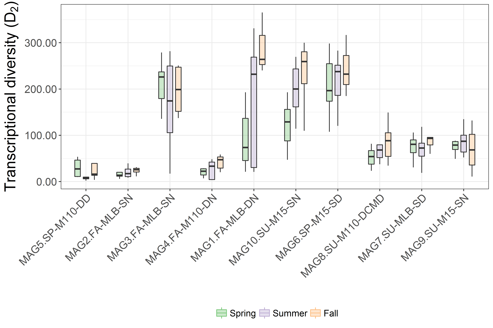

```r
p_MAG_Pdiv4 <- results_pd %>% 
  dplyr::filter(Depth == "Deep") %>% 
  ggplot(., aes(x = new_bin_name, y = D2))+
  theme_bw()+
  scale_fill_brewer("",palette = "Accent")+
  # geom_point(size = 4, color = "black", 
             # alpha = 0.5, aes(fill = Season, shape = Depth),
             # position=dodge)+
  geom_boxplot(alpha = 0.4, width = 0.4, outlier.shape = NA, 
               aes(fill = Season),
               position=dodge)+
  scale_shape_manual("",values = c(21,24,23))+
  # geom_boxplot(alpha = 0.4, width = 0.2, outlier.shape = NA)+
  theme(axis.text=element_text(size=14), axis.title=element_text(size=20),
      title=element_text(size=20), legend.text=element_text(size=12),
      legend.background = element_rect(fill="transparent"),
      axis.text.x = element_text(size = 14, angle = 45, hjust = 1),
      strip.text=element_text(size=14), legend.position = "bottom",
      strip.background = element_rect(fill = adjustcolor("gray", 0.15)))+
  ylab(expression("Transcriptional diversity (D"[2]*")"))+
  guides(
         fill = guide_legend(override.aes=list(colour=brewer.pal(3,"Accent"))))+
  # facet_grid(Season~., scales ="free")+
  xlab("")+
  # geom_errorbar(aes(ymin = D2 - sd.D2, ymax = D2 + sd.D2), width = 0.05)+
  scale_y_continuous(labels=scaleFUN)
  # coord_trans(y = "sqrt")

print(p_MAG_Pdiv4)
```

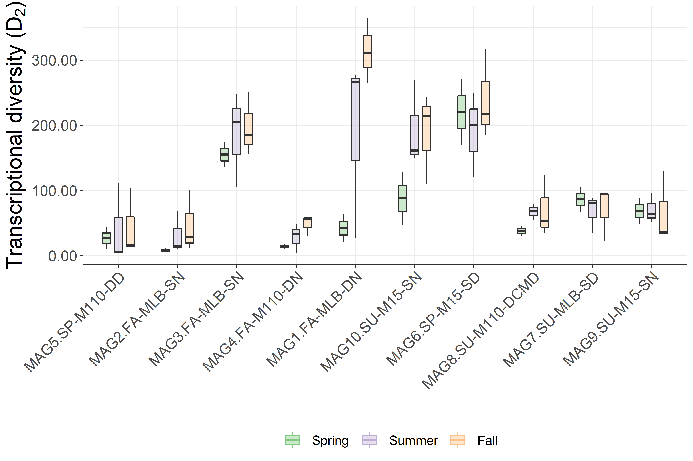

### Match with abundance


```r
# Merge with abundance data
sel_abund <- c("new_bin_name","Sample",
               "norm_lower_rel_abundance",
               "norm_mean_rel_abundance",
               "norm_upper_rel_abundance",
               "MGT","Topt","Lineage")
results_pd_abund <- dplyr::left_join(results_pd, data_total_abund[, sel_abund],
                         by = c("new_bin_name", "Sample"))

p_MAG_Pdiv4 <- ggplot(results_pd_abund, aes(y = D2, x = norm_mean_rel_abundance))+
  theme_bw()+
    geom_point(size = 4, color = "black", shape = 21,
             alpha = 0.5, aes(fill = new_bin_name))+
  scale_fill_brewer("",palette = "Paired")+
  # geom_boxplot(alpha = 0.4, width = 0.2, outlier.shape = NA)+
  theme(axis.text=element_text(size=14), axis.title=element_text(size=20),
      title=element_text(size=20), legend.text=element_text(size=12),
      legend.background = element_rect(fill="transparent"),
      axis.text.x = element_text(size = 14),
      strip.text=element_text(size=14), legend.position = "bottom",
      strip.background = element_rect(fill = adjustcolor("gray", 0.15)))+
  ylab(expression("Transcriptional diversity (D"[2]*")"))+
  xlab("Mean normalized abundance")+
  # guides(
  #        fill = guide_legend(override.aes=list(colour=brewer.pal(10,"Paired"))))
  # facet_grid(Season~Site, scales ="free")
  # geom_errorbar(aes(ymin = D2 - sd.D2, ymax = D2 + sd.D2), width = 0.05)+
  coord_trans(y = "log10", x = "log10")

print(p_MAG_Pdiv4)
```

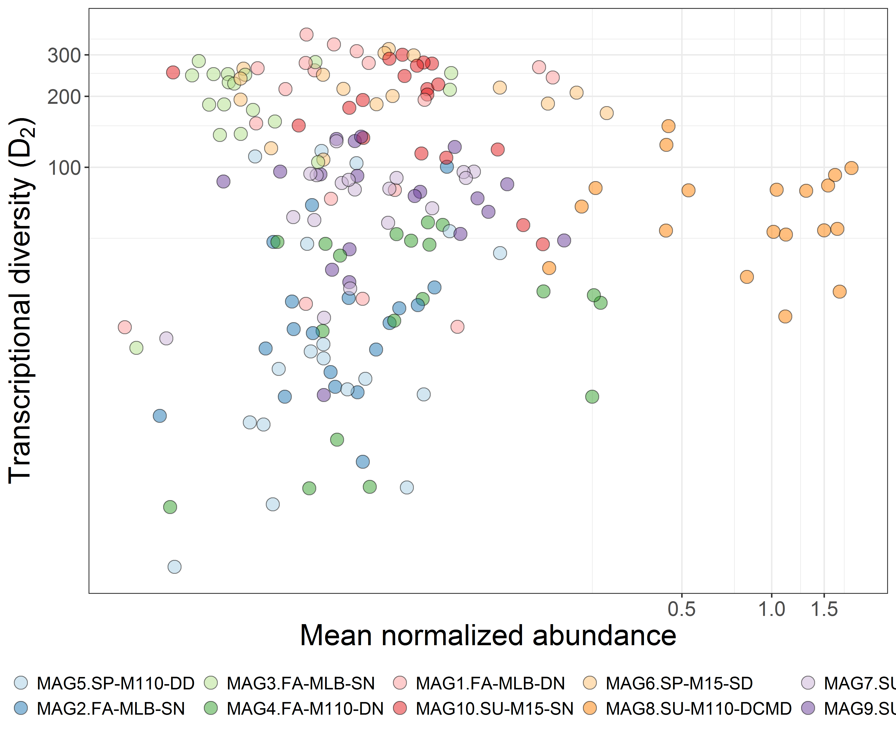

```r
p_MAG_Pdiv5 <- ggplot(results_pd_abund, aes(y = D2, x = log(2)/MGT))+
  theme_bw()+
    geom_point(size = 4, color = "black", shape = 21,
             alpha = 0.5, aes(fill = new_bin_name))+
  scale_fill_brewer("",palette = "Paired")+
  # geom_boxplot(alpha = 0.4, outlier.shape = NA, aes(fill = new_bin_name), 
               # width = 0.005)+
  theme(axis.text=element_text(size=14), axis.title=element_text(size=20),
      title=element_text(size=20), legend.text=element_text(size=12),
      legend.background = element_rect(fill="transparent"),
      axis.text.x = element_text(size = 14),
      strip.text=element_text(size=14), legend.position = "bottom",
      strip.background = element_rect(fill = adjustcolor("gray", 0.15)))+
  ylab(expression("Transcriptional diversity (D"[2]*")"))+
  xlab(expression("Maximum growth rate (µ"^-1*")"))+
  stat_summary(fun.data=mean_sdl, fun.args = list(mult = 1), 
                 geom="pointrange", color="#333333", size = 1)+
  guides(
         fill = guide_legend(override.aes=list(colour=brewer.pal(10,"Paired"))))
  # facet_grid(.~Lineage, scales ="free")
  # geom_errorbar(aes(ymin = D2 - sd.D2, ymax = D2 + sd.D2), width = 0.05)+
  # coord_trans(x = "log10")

print(p_MAG_Pdiv5)
```

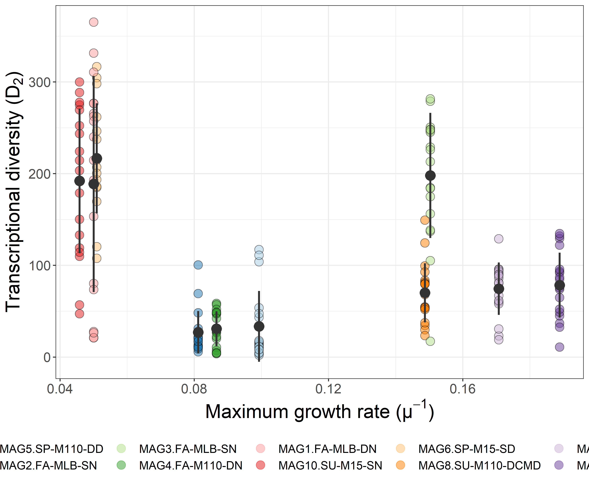

<!-- ### Example expression profiles -->
<!-- ```{r PhenoD-3, dpi = 500, warning = FALSE, fig.width = 12, fig.height = 12} -->
<!-- new_bin_names2 <- read.table("./anvio_output/rebin/general_bins_summary_selected_final.tsv", header = TRUE)[, c(3,8:10)]; new_bin_names2$IMG_taxID <- as.character(new_bin_names2$IMG_taxID) -->
<!-- expr_cov_long_sb <- left_join(expr_cov_long, new_bin_names2, by = c("Genome_ID" = "IMG_taxID")) -->

<!-- p_Pdist <- expr_cov_long_sb %>% -->
<!--   dplyr::filter(new_bin_name %in% c("MAG6.SP-M15-SD", -->
<!--                                     "MAG8.SU-M110-DCMD", -->
<!--                                     "MAG4.FA-M110-DN") & -->
<!--                                    Sample == "Fa13.BD.MM15.SD") %>% -->
<!--   group_by(new_bin_name) %>% -->
<!--   dplyr::mutate(rank = rank(-mapped_reads/sum(mapped_reads))) %>% -->
<!--   dplyr::mutate(mapped_reads_norm = mapped_reads/sum(mapped_reads)) %>% -->
<!--   ggplot(aes(x = rank, y = mapped_reads_norm, color = new_bin_name))+ -->
<!--   geom_line(size = 2, linetype = 2)+ -->
<!--   theme_bw()+ -->
<!--   scale_color_brewer("", palette = "Accent")+ -->
<!--   theme(axis.text=element_text(size=12), axis.title=element_text(size=12), -->
<!--       title=element_text(size=12), legend.text=element_text(size=12), -->
<!--       legend.background = element_rect(fill="transparent"), -->
<!--       axis.text.x = element_text(size = 12, angle = 45, hjust = 1), -->
<!--       strip.text=element_text(size=12), legend.position = "bottom", -->
<!--       strip.background = element_rect(fill = adjustcolor("gray", 0.15)))+ -->
<!--   ylab("Relative number of mapped reads")+ -->
<!--   xlab("Genes ranked by mapped reads")+ -->
<!--   scale_y_continuous(labels=scaleFUN)+ -->
<!--   xlim(0,300) -->
<!--   # coord_trans(y = "sqrt") -->

<!-- print(p_Pdist) -->

<!-- # Add 16S-estimated taxonomic diversity -->
<!-- diversity_df_phy <- data.frame(Sample = rownames(diversity_df_phy), diversity_df_phy) -->
<!-- diversity16S_df_phy <- diversity_df_phy[grep(".1", diversity_df_phy$Sample, -->
<!--                                              fixed = TRUE), ] -->
<!-- diversity16S_df_phy$Sample <- gsub(".1.renamed", "", diversity16S_df_phy$Sample) -->
<!-- colnames(diversity16S_df_phy)[2:ncol(diversity16S_df_phy)] <- paste("16S", colnames(diversity16S_df_phy)[2:ncol(diversity16S_df_phy)], sep = "_") -->
<!-- results_pd_16S <- left_join(results_pd, diversity16S_df_phy, by = "Sample") -->

<!-- # Plot taxonomic vs. phenotypic diversity -->
<!-- p_MAG_Pdiv3 <- ggplot(results_pd_16S, aes(x = `16S_D2`, y = D2, fill = new_bin_name.x))+ -->
<!--   theme_bw()+ -->
<!--   scale_fill_brewer(palette = "Paired")+ -->
<!--   scale_color_brewer(palette = "Paired")+ -->
<!--   geom_point(size = 4, color = "black", alpha = 0.7, shape = 21)+ -->
<!--   scale_shape_manual(values = c(21,24,23))+ -->
<!--   theme(axis.text=element_text(size=14), axis.title=element_text(size=20), -->
<!--       title=element_text(size=20), legend.text=element_text(size=12), -->
<!--       legend.background = element_rect(fill="transparent"), -->
<!--       axis.text.x = element_text(size = 14, angle = 45, hjust = 1), -->
<!--       strip.text=element_text(size=14), legend.position = "bottom", -->
<!--       strip.background = element_rect(fill = adjustcolor("gray", 0.15)))+ -->
<!--   ylab(paste0("Limnohabitans population\n phenotypic diversity (D2)"))+ -->
<!--   guides(shape=FALSE)+ -->
<!--   xlab("")+ -->
<!--   facet_grid(Site~new_bin_name.x)+ -->
<!--   geom_errorbar(aes(ymin = D2 - sd.D2, ymax = D2 + sd.D2), width = 0.05)+ -->
<!--   scale_y_continuous(labels=scaleFUN)+ -->
<!--   geom_smooth(method = "loess", aes(color = new_bin_name.x)) -->
<!--   # coord_trans(y = "sqrt") -->

<!-- print(p_MAG_Pdiv3) -->
<!-- ``` -->


# C and N-ARSC

<!-- # ```{r CN-ARSC, dpi = 500, warning = FALSE, fig.width = 2, fig.height = 12, include = FALSE} -->
<!-- # # Import amino acid information -->
<!-- # meta_aa <- read.csv("./mapping_files/aa_comp.csv") -->
<!-- #  -->
<!-- # # Get amino acid names individually -->
<!-- # aa_seq_split <- strsplit(panG_ko_cog$aa_sequence, split = "") -->
<!-- # names(aa_seq_split) <- panG_ko_cog$unique_gene_callers_id -->
<!-- # ncol <- max(sapply(aa_seq_split,length)) -->
<!-- # test <- lapply(seq_along(aa_seq_split),  -->
<!-- #                FUN = function(x, n, i) {data.table(table(x[[i]]),  -->
<!-- #                                                    unique_gene_callers_id = n[[i]])},  -->
<!-- #                n = names(aa_seq_split), x = aa_seq_split) -->
<!-- #  -->
<!-- # # Calculat for each gene the C-ARSC and the Gene N-ARSC -->
<!-- # calc_ARSC <- function(x, meta_aa){ -->
<!-- #   # x is a list and meta_aa is the mapping file containing elemental composition AAs -->
<!-- #   interm <- dplyr::left_join(x, meta_aa, by = c("V1" = "AA_abbrev2")) -->
<!-- #   # Remove X AA  -->
<!-- #   interm <- interm %>% dplyr::filter(V1 != "X") -->
<!-- #   N_ARSC <- sum(interm$N_elem*interm$N)/sum(interm$N) -->
<!-- #   C_ARSC <- sum(interm$C_elem*interm$N)/sum(interm$N) -->
<!-- #   return(data.frame(C_ARSC = C_ARSC, N_ARSC = N_ARSC,  -->
<!-- #                     unique_gene_callers_id = unique(interm$unique_gene_callers_id))) -->
<!-- # } -->
<!-- #  -->
<!-- # test_ARSC <- lapply(seq_along(test),  -->
<!-- #                     FUN = function(x, meta_test, i){calc_ARSC(x[[i]], meta_test)}, -->
<!-- #                     x = test, -->
<!-- #                     meta_test = meta_aa) -->
<!-- #  -->
<!-- # results_ARSC <- do.call(rbind, test_ARSC) -->
<!-- # results_final_ARSC <- left_join(results_ARSC,   -->
<!-- #                                 panG_ko_cog[, c("genome_name","unique_gene_callers_id")],  -->
<!-- #                                 by = "unique_gene_callers_id") -->
<!-- #  -->
<!-- # ord_list_bin_arsc <- c( -->
<!-- #   "MAG5_SP_M110_DD", "MAG2_FA_MLB_SN", -->
<!-- #   "MAG3_FA_MLB_SN", "MAG4_FA_M110_DN", -->
<!-- #   "MAG1_FA_MLB_DN", "MAG10_SU_M15_SN", -->
<!-- #   "MAG6_SP_M15_SD","MAG8_SU_M110_DCMD", -->
<!-- #   "REF_Lim_Rim11", "REF_Lim_103DPR2", -->
<!-- #   "MAG7_SU_MLB_SD", "REF_Lim_Rim47", -->
<!-- #   "MAG9_SU_M15_SN", "REF_Lim_Rim28", -->
<!-- #   "REF_Lim_63ED37_2","REF_Lim_2KL27", -->
<!-- #   "REF_Lim_2KL3", "REF_Lim_DM1", -->
<!-- #   "REF_Lim_IID5" -->
<!-- #   ) -->
<!-- #  -->
<!-- # results_final_ARSC$genome_name <- factor(results_final_ARSC$genome_name, -->
<!-- #                                          levels=ord_list_bin_arsc) -->
<!-- #  -->
<!-- #  -->
<!-- # pairwise.wilcox.test(x = results_final_ARSC$N_ARSC,  -->
<!-- #                      g = results_final_ARSC$genome_name) -->
<!-- #  -->
<!-- # pairwise.wilcox.test(x = results_final_ARSC$C_ARSC,  -->
<!-- #                      g = results_final_ARSC$genome_name) -->
<!-- #  -->
<!-- # ggplot(results_final_ARSC, aes(x = genome_name, y = N_ARSC, fill = genome_name))+ -->
<!-- #      geom_boxplot(alpha = 0.2, outlier.shape = NA)+ -->
<!-- #   # stat_summary(fun.data=mean_sdl, fun.args = list(mult = 1),  -->
<!-- #                  # geom="pointrange", color="black", size = 1.5, alpha = 0.75)+ -->
<!-- #   theme(axis.text.x = element_text(size = 12, angle = 45, hjust = 1))+ -->
<!-- #   ylim(0,0.5) -->
<!-- #    # scale_fill_manual("", -->
<!-- #    #                  values = c(rgb(red=t(col2rgb("#deebf7ff")),  -->
<!-- #    #                                 maxColorValue  = 255),  -->
<!-- #    #                             rgb(red=t(col2rgb("#c6dbefff")),  -->
<!-- #    #                                 maxColorValue  = 255), -->
<!-- #    #                             rgb(red=t(col2rgb("#9ecae1ff")),  -->
<!-- #    #                                 maxColorValue  = 255), -->
<!-- #    #                             rgb(red=t(col2rgb("#6baed6ff")), -->
<!-- #    #                                 maxColorValue  = 255) -->
<!-- #    #                            ))+ -->
<!-- #  -->
<!-- # ggplot(results_final_ARSC, aes(x = genome_name, y = C_ARSC, fill = genome_name))+ -->
<!-- #      geom_boxplot(alpha = 0.2, outlier.shape = NA)+ -->
<!-- #   # stat_summary(fun.data=mean_sdl, fun.args = list(mult = 1),  -->
<!-- #   #                geom="pointrange", color="black", size = 1.5, alpha = 0.75)+ -->
<!-- #   theme(axis.text.x = element_text(size = 12, angle = 45, hjust = 1))+ -->
<!-- #   ylim(2,3.5) -->
<!-- #  -->
<!-- # # extend to unseen AA with NA values so that rbind can be used -->
<!-- #  -->
<!-- # levels(meta_aa$AA_abbrev2) -->
<!-- #  -->
<!-- # # rbind the different tables -->
<!-- #  -->
<!-- # # aa_seq_split <- as.data.table(lapply(1:ncol, function(i) sapply(aa_seq_split, "[", i))) -->
<!-- #  -->
<!-- # # merge in oen data table -->
<!-- # df_aa_seq_split <- data.table::data.table(bin_name = panG_ko_cog$bin_name,  -->
<!-- #                  genome_name = panG_ko_cog$genome_name, -->
<!-- #                  unique_gene_callers_id = panG_ko_cog$unique_gene_callers_id, -->
<!-- #                  aa_seq_split) -->
<!-- #  -->
<!-- # remove(aa_seq_split) -->
<!-- #  -->
<!-- # # Wide to long format -->
<!-- # df_aa_seq_split <- gather(df_aa_seq_split, codon_position, -->
<!-- #                           aa_ID, V1:V2467, factor_key=TRUE) -->
<!-- # # Annotate AA sequences -->
<!-- # df_aa_seq_split <- left_join(df_aa_seq_split, meta_aa, by = c("aa_ID" = "AA_abbrev2")) -->
<!-- # df_aa_seq_split$unique_gene_callers_id <- factor(df_aa_seq_split$unique_gene_callers_id) -->
<!-- #  -->
<!-- # # Calculate C and N content of AA residuals -->
<!-- # data_C_N <- df_aa_seq_split %>% -->
<!-- #   filter(!is.na(C_elem)) %>%  -->
<!-- #   distinct() %>%  -->
<!-- #   group_by(unique_gene_callers_id) %>%  -->
<!-- #   summarize(N_sum = sum(N_elem), -->
<!-- #             C_sum = sum(C_elem), -->
<!-- #             aa_length = n()) -->
<!-- # remove(df_aa_seq_split) -->
<!-- #  -->
<!-- # # Merge this information with initial dataframe -->
<!-- # final_df_arsc <- left_join(panG_ko_cog, data_C_N, by = "unique_gene_callers_id") -->
<!-- #  -->
<!-- # # Calculate N_ARSC and C_ARSC -->
<!-- # final_df_arsc <- final_df_arsc %>%  -->
<!-- #   select(unique_gene_callers_id, bin_name, genome_name, aa_length, N_sum, C_sum) %>%  -->
<!-- #   distinct() %>%  -->
<!-- #   mutate(N_ARSC = N_sum/aa_length, C_ARSC = C_sum/aa_length) -->
<!-- #  -->
<!-- # p_aa_C <- final_df_arsc %>%  -->
<!-- #   ggplot(aes(x = bin_name, y = C_ARSC))+ -->
<!-- #    geom_violin(alpha = 0.2, fill = col_RAMLI, draw_quantiles = TRUE)+ -->
<!-- #   stat_summary(fun.data=mean_sdl, fun.args = list(mult = 1),  -->
<!-- #                  geom="pointrange", color="black", size = 1.5, alpha = 0.75)+ -->
<!-- #   xlab("")+ ylab("C-ARSC")+ -->
<!-- #   theme_bw()+ -->
<!-- #   theme(axis.title.x = element_blank(), -->
<!-- #         axis.title.y = element_text(size = 16), -->
<!-- #         axis.text.y = element_text(size = 14), -->
<!-- #         axis.text.x = element_text(size = 14, angle = 45, hjust = 1), -->
<!-- #         plot.title = element_text(size = 20, hjust = 0.5))+ -->
<!-- #   labs(title = "") -->
<!-- #  -->
<!-- # p_aa_N <- final_df_arsc %>%  -->
<!-- #   ggplot(aes(x = bin_name, y = N_ARSC))+ -->
<!-- #    geom_violin(alpha = 0.2, fill = col_RAMLI)+ -->
<!-- #   stat_summary(fun.data=mean_sdl, fun.args = list(mult = 1),  -->
<!-- #                  geom="pointrange", color="black", size = 1.5, alpha = 0.75)+ -->
<!-- #   xlab("")+ ylab("N-ARSC")+ -->
<!-- #   theme_bw()+ -->
<!-- #   theme(axis.title.x = element_blank(), -->
<!-- #         axis.title.y = element_text(size = 16), -->
<!-- #         axis.text.y = element_text(size = 14), -->
<!-- #         axis.text.x = element_text(size = 14, angle = 45, hjust = 1), -->
<!-- #         plot.title = element_text(size = 20, hjust = 0.5))+ -->
<!-- #   labs(title = "") -->
<!-- #  -->
<!-- # cowplot::plot_grid(p_aa_C, p_aa_N, nrow = 2, -->
<!-- #                    labels = c("A","B")) -->
<!-- #  -->
<!-- # ``` -->

# Posigene


# External metagenomes

```r
df_BlastExt <- data.table::fread("./ExternalData/merged_blastfiles.tsv", 
                         header = TRUE)
# Import metadata
meta_Ext <- xlsx::read.xlsx("./ExternalData/ismej2017156x1.xlsx", sheetIndex = 1)
meta_Ext <- meta_Ext[!is.na(meta_Ext$metagenomic.sample),]
meta_Ext <- meta_Ext[, c(1, 2, 4, 5)]
meta_Ext <- meta_Ext %>% dplyr::filter(grepl("SRR", accession.number)) # Only data used for which SRR accession IDs (NCBI) were available

# Import contig_ids of each bin
IMG_folders <- list.files("./", pattern = "assembled.names_map", include.dirs = TRUE, recursive = TRUE)
IMG_folders <- IMG_folders[1:10]

for(i in 1:length(IMG_folders)){
  contig_tmp <- cbind(read.table(IMG_folders[i], stringsAsFactors = FALSE)[,1], strsplit(IMG_folders[i], "/")[[1]][2])
  contig_tmp <- data.frame(contig_tmp)
  colnames(contig_tmp) <- c("contig_id", "IMG_taxID")
  if(i == 1){
    contig_ids <- contig_tmp
  } else {
    contig_ids <- rbind(contig_ids, contig_tmp)
  }
}
contig_ids$IMG_taxID <- gsub("IMG_","",contig_ids$IMG_taxID)

# Add manuscript bin IDs
contig_ids <- dplyr::left_join(contig_ids, new_bin_names2, by = "IMG_taxID")

# Order bins according to phylogeny
ord_list_bin_ext <- c(
  "MAG5.SP-M110-DD", "MAG2.FA-MLB-SN",
  "MAG3.FA-MLB-SN", "MAG4.FA-M110-DN",
  "MAG1.FA-MLB-DN", "MAG10.SU-M15-SN",
  "MAG6.SP-M15-SD","MAG8.SU-M110-DCMD",
  "MAG7.SU-MLB-SD","MAG9.SU-M15-SN"
)

contig_ids$new_bin_name <- factor(contig_ids$new_bin_name, levels = ord_list_bin_ext)

# Add Lineage label
contig_ids <- left_join(contig_ids, MGT_df, by = c("new_bin_name" = "Genome_ID"))

# Clean up SRA identifier label
df_BlastExt$SRA <- gsub("_blast.tsv", "", df_BlastExt$SRA)

# Remove contigs not in contig_ids
df_BlastExt <- df_BlastExt %>% dplyr::filter(contig_id %in% contig_ids$contig_id)

# Add contig labels of MAGs
df_BlastExt <- dplyr::left_join(df_BlastExt, contig_ids, by = c("contig_id"))

# Bin the %Identity in intervals of 0.5%
df_BlastExt_sum <- transform(df_BlastExt, bin_group = cut(identity,  breaks=seq(0, 100, 0.5)))

# Add extra column that converts the binning range to a numeric x-coordinate that
# is positioned in the middle of the binning interval
df_BlastExt_sum$bin_group <- gsub("\\(|]", "", 
                               as.character(df_BlastExt_sum$bin_group))
df_BlastExt_sum$bin_xcoord <- as.numeric(do.call(rbind,
                                              strsplit(df_BlastExt_sum$bin_group,
                                                       ","))[,1])+0.25

# Add metadata
df_BlastExt_sum <- left_join(df_BlastExt_sum, meta_Ext, by = c("SRA" = "accession.number"))
```


```r
# Plot % reads corrected for genome size over threshold of 0.95
blast_df_sum_comp <- df_BlastExt_sum %>% group_by(SRA, new_bin_name) %>% dplyr::count(bin_xcoord)

# Add Lineage label
blast_df_sum_comp <- left_join(blast_df_sum_comp, MGT_df, by = c("new_bin_name" = "Genome_ID"))

id_thresh <- 95-0.25
map_disc_cum <- blast_df_sum_comp  %>% 
  dplyr::filter(bin_xcoord > id_thresh) %>% group_by(SRA, new_bin_name) %>% 
  mutate(cum_rel_reads_mapped = cumsum(n))%>% 
  dplyr::filter(bin_xcoord == 100 - 0.25)

map_disc_cum <- left_join(map_disc_cum, meta_Ext, by = c("SRA" = "accession.number"))

SRA_ranking <- map_disc_cum %>% 
  dplyr::filter(new_bin_name == "MAG8.SU-M110-DCMD" & bin_xcoord > 94.5) %>%
  dplyr::group_by(metagenomic.sample, new_bin_name) %>% 
  summarise(mean_n = median(cum_rel_reads_mapped))
SRA_ranking <- as.character(SRA_ranking$metagenomic.sample[rev(order(SRA_ranking$mean_n))])
map_disc_cum$metagenomic.sample <- factor(as.character(map_disc_cum$metagenomic.sample), levels = SRA_ranking)

MAG_ranking <- map_disc_cum %>% 
  dplyr::filter(bin_xcoord > 94.5) %>%
  dplyr::group_by(new_bin_name) %>% 
  summarise(sum_n = sum(cum_rel_reads_mapped))
MAG_ranking <- as.character(MAG_ranking$new_bin_name[rev(order(MAG_ranking$sum_n))])
map_disc_cum$new_bin_name <- factor(as.character(map_disc_cum$new_bin_name), levels = MAG_ranking)

p_sdisc_cum3 <- map_disc_cum %>% 
  # dplyr::filter(!grepl("Yellowstone|Amadorio|Mendota|Klamath - Copco Reservoir", metagenomic.sample) &
  #                                               metagenomic.sample != "Houston"& metagenomic.sample != "Trout Bog") %>% 
  ggplot(aes(x = metagenomic.sample, y =  100*cum_rel_reads_mapped/1e6, 
                                        fill = Lineage))+
  theme_bw()+
  scale_fill_manual("",
                    values = c("#deebf7ff", "#c6dbefff","#9ecae1ff",
                               "#6baed6ff"))+
  geom_jitter(size = 2, shape = 21, color = "black", alpha = 0.75, width = 0.15)+
  geom_boxplot(alpha = 0.5, outlier.shape = NA)+
  theme(axis.text=element_text(size=14), axis.title=element_text(size=20),
      title=element_text(size=20), legend.text=element_text(size=12),
      legend.background = element_rect(fill="transparent"),
      axis.text.x = element_text(size=11, angle = 45, hjust = 1),
      strip.text=element_text(size=12), legend.position = "bottom",
      strip.background = element_rect(fill = adjustcolor("gray", 0.15)))+
  ylab(paste0("Relative abundance\n (> ", id_thresh-0.25, "% NI)"))+
  xlab("")+
  guides(fill=FALSE)+
  facet_wrap(.~new_bin_name, nrow = 2)+
  scale_y_sqrt()

print(p_sdisc_cum3)
```

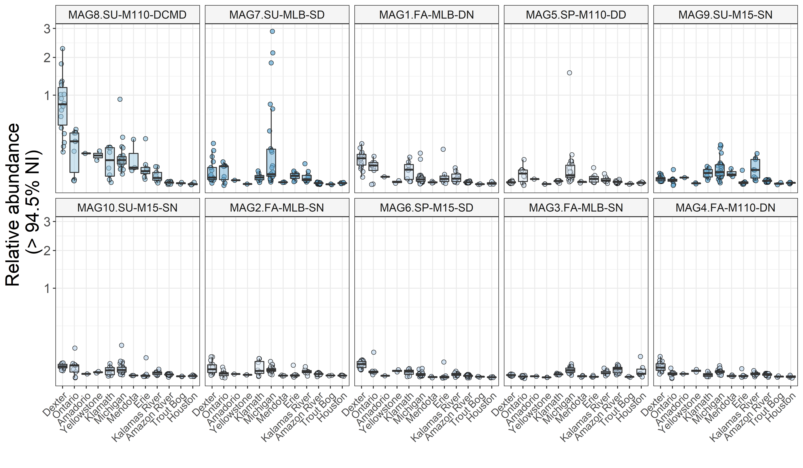


```r
# Make one graph of abundances across different external metagenomic data sets for each MAG
p_sdisc_cum4 <- map_disc_cum %>% 
  # dplyr::filter(!grepl("Yellowstone|Amadorio|Mendota|Klamath - Copco Reservoir", metagenomic.sample) &
  #                                               metagenomic.sample != "Houston"& metagenomic.sample != "Trout Bog") %>% 
  ggplot(aes(x = new_bin_name, y =  100*cum_rel_reads_mapped/1e6))+
  theme_bw()+
  scale_fill_brewer("", palette = "Paired")+
  geom_jitter(size = 4, shape = 21, color = "black", alpha = 0.5, width = 0.15,
              aes(fill = metagenomic.sample))+
  geom_violin(alpha = 0.5, adjust = 1, draw_quantiles = TRUE, scale = "width")+
  stat_summary(fun.data=mean_sdl, fun.args = list(mult = 1), 
                 geom="pointrange", color="#333333", size = 1.05)+
  theme(axis.title=element_text(size=20),
      title=element_text(size=20), legend.text=element_text(size=12),
      legend.background = element_rect(fill="transparent"),
      axis.text.x = element_text(size=14),
      axis.text.y = element_text(size = 14),
      strip.text=element_text(size=12), legend.position = "bottom",
      strip.background = element_rect(fill = adjustcolor("gray", 0.15)))+
  ylab(paste0("Relative abundance\n (> ", id_thresh-0.25, "% NI)"))+
  xlab("")+
  scale_y_sqrt()+ 
  coord_flip()+
  guides(fill = guide_legend(nrow = 4))

print(p_sdisc_cum4)
```

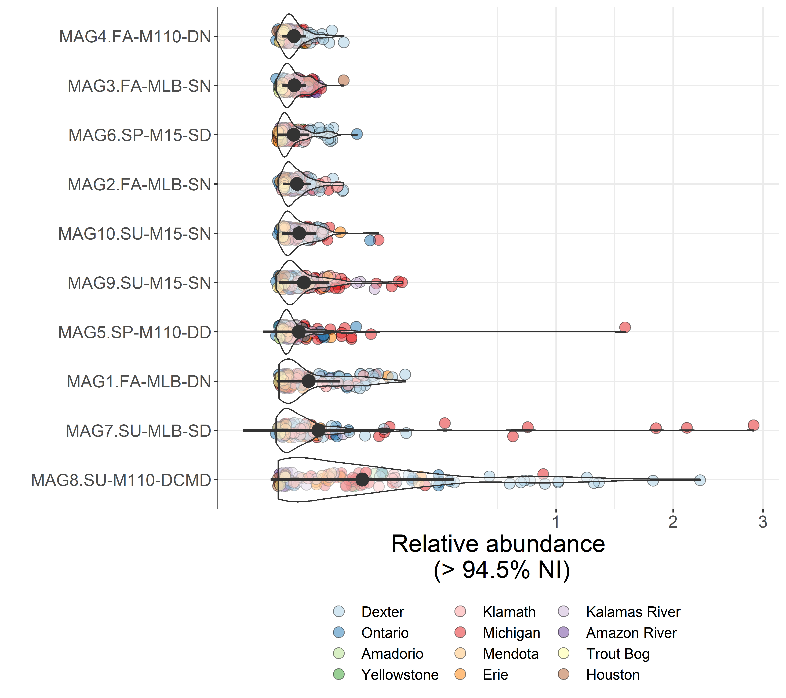


```r
# Remove samples with less than 100 reads
map_disc_cum_sdp <- map_disc_cum
map_disc_cum_sdp <- map_disc_cum_sdp %>% 
  mutate(SRA_bin = interaction(SRA, new_bin_name, sep = "_"))

# Only have metagenomic samples with more than 100 reads mapped to the MAGS in order to assess SDPs
sample_filter <- map_disc_cum_sdp %>% 
  ungroup() %>% 
  dplyr::filter(bin_xcoord > 94.5) %>%
  dplyr::group_by(SRA_bin) %>% 
  summarise(sum_n = sum(cum_rel_reads_mapped))
sample_filter <- sample_filter$SRA_bin[sample_filter$sum_n>100]

# Add interaction terms to filter out samples with low reads mapped for each MAG
df_BlastExt <- df_BlastExt %>% 
  mutate(SRA_bin = interaction(SRA, new_bin_name, sep = "_"))
df_BlastExt_sum <- df_BlastExt_sum %>% 
  mutate(SRA_bin = interaction(SRA, new_bin_name, sep = "_"))

# Plot sequence discrete populations
p_blast_sdisc <- df_BlastExt %>%
  dplyr::filter(SRA_bin %in% sample_filter) %>% 
     ggplot(aes(x = identity, ..scaled.., fill = new_bin_name))+
      theme_bw()+
      scale_fill_brewer("", palette = "Paired")+
      geom_density(color = "black")+
  facet_wrap(new_bin_name~., ncol = 2)+
      guides(color = FALSE, fill = FALSE)+
      theme(axis.text=element_text(size=14), axis.title=element_text(size=20),
        title=element_text(size=20), legend.text=element_text(size=14),
        legend.background = element_rect(fill="transparent"),
        axis.text.x = element_text(size = 14),
        strip.text=element_text(size=14))+
      ylab("Density")+
      xlab("Nucleotide identity (%)")+
    xlim(75,100)

print(p_blast_sdisc)
```

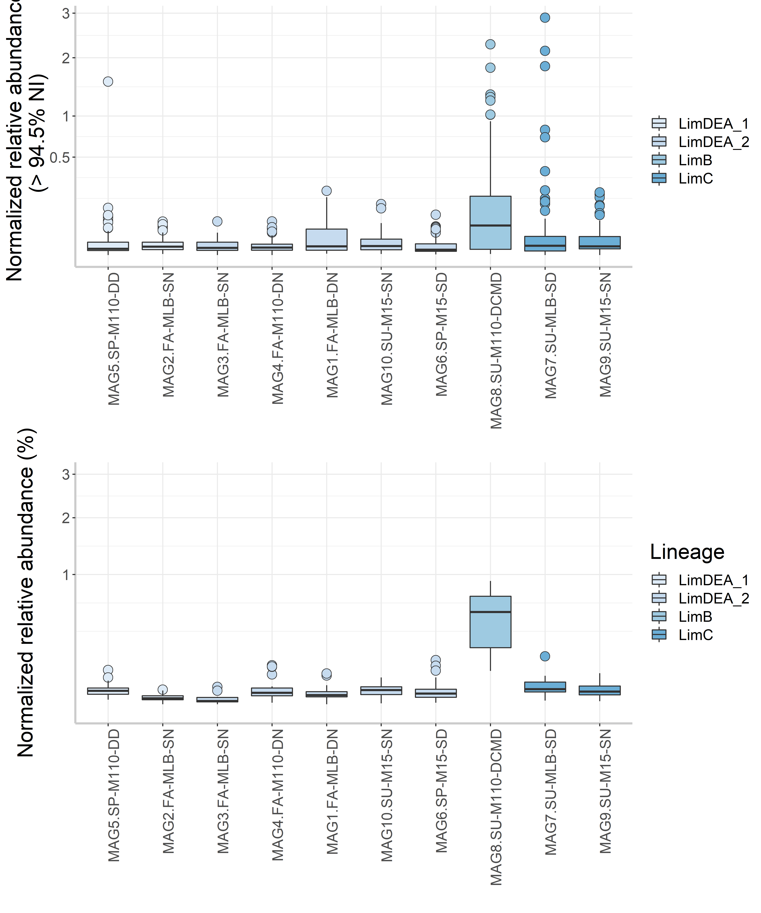

```r
# Plot sequence discrete populations
p_blast_sdisc2 <- df_BlastExt_sum %>%
    dplyr::filter(SRA_bin %in% sample_filter) %>% 
     ggplot(aes(x = bin_xcoord, fill = new_bin_name))+
      theme_bw()+
      scale_fill_brewer("", palette = "Paired")+
      geom_bar(stat = "count")+
      facet_wrap(new_bin_name~., ncol = 2)+
      guides(color = FALSE, fill = FALSE)+
      theme(axis.text=element_text(size=14), axis.title=element_text(size=20),
        title=element_text(size=20), legend.text=element_text(size=14),
        legend.background = element_rect(fill="transparent"),
        axis.text.x =element_text(size = 14),
        strip.text=element_text(size=14))+
      ylab("Number of reads")+
      xlab("Nucleotide identity (%)")+
    xlim(75,100)+
  scale_y_sqrt()

print(p_blast_sdisc2)
```

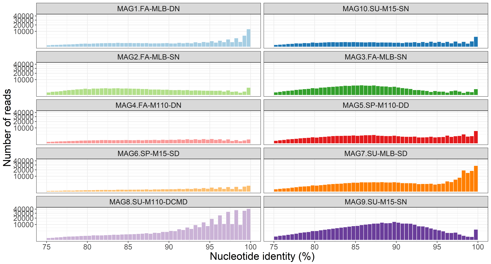

```r
# Plot for all bins density plots
p_blast_all_dens <- df_BlastExt_sum %>%
    dplyr::filter(SRA_bin %in% sample_filter) %>% 
  ggplot(aes(x = identity, shape = SRA, color = new_bin_name))+
  theme_bw()+
  geom_density(alpha = 0.4, size = 0.4,
               bw = "nrd0")+
  scale_color_brewer("", palette = "Paired")+
  guides(fill = FALSE)+
  facet_wrap(new_bin_name~., ncol = 2)+
  theme(axis.text.y=element_text(size=14), axis.title=element_text(size=20),
        title=element_text(size=20), legend.text=element_text(size=14),
        legend.background = element_rect(fill="transparent"),
        axis.text.x = element_text(size = 14),
        strip.text=element_text(size=14),
        panel.grid.minor = element_blank(),
        legend.position = "bottom")+
  ylab("")+
  xlab("% Identity")+
  scale_x_continuous(limits = c(80,100))+
  guides(shape = FALSE, color = FALSE)+
  scale_y_sqrt()

p_blast_all_dens
```

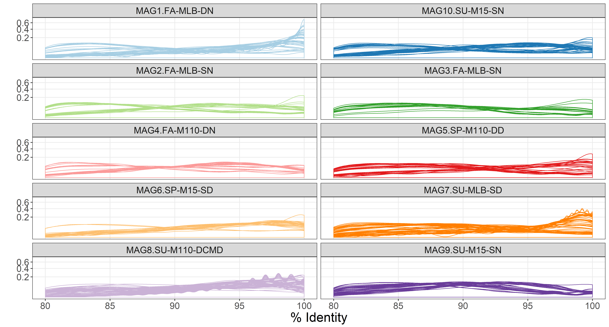

```r
p_blast_all_dens2 <- df_BlastExt_sum %>%
    dplyr::filter(SRA_bin %in% sample_filter) %>% 
  ggplot(aes(x = bin_xcoord, shape = SRA, color = new_bin_name))+
  theme_bw()+
  geom_density(alpha = 0.4, size = 0.4,
               bw = "nrd0")+
  scale_color_brewer("", palette = "Paired")+
  guides(fill = FALSE, color = FALSE)+
  facet_wrap(new_bin_name~., ncol = 2)+
  theme(axis.text.y=element_text(size=14), axis.title=element_text(size=20),
        title=element_text(size=20), legend.text=element_text(size=14),
        legend.background = element_rect(fill="transparent"),
        axis.text.x = element_text(size = 14),
        strip.text=element_text(size=14),
        panel.grid.minor = element_blank(),
        legend.position = "bottom")+
  ylab("")+
  xlab("% Identity")+
  scale_x_continuous(limits = c(80,100))+
  guides(shape = FALSE)+
  scale_y_sqrt()

p_blast_all_dens2
```

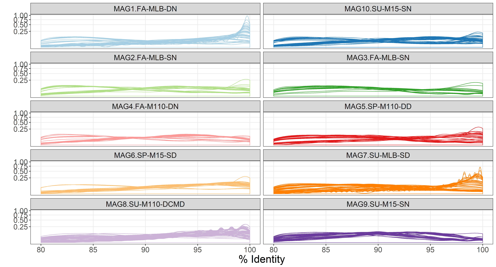
