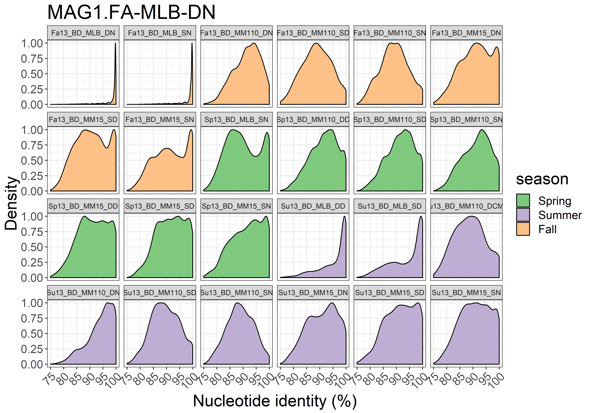
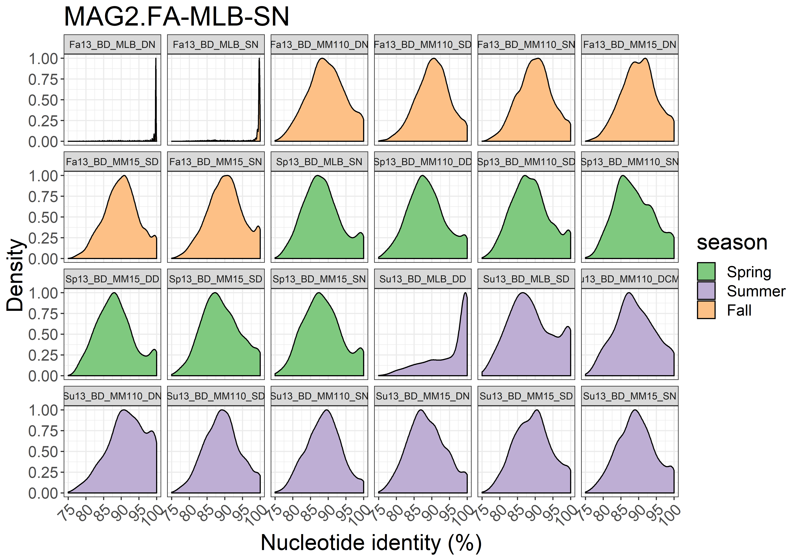
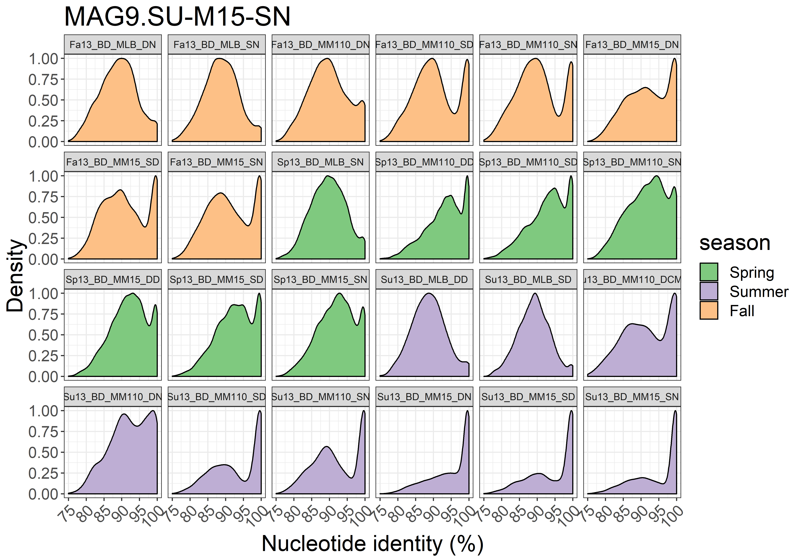

# Metagenomic analysis of Limnohabitans population in Lake Michigan
Ruben Props  
Today  


```r
# Read data
mean_coverage <- read.table("./anvio_output/rebin/mean_coverage_selected_final.tsv", header = TRUE)
std_coverage <- read.table("./anvio_output/rebin/std_coverage_selected_final.tsv", header = TRUE)
bin_size <- read.table("./anvio_output/rebin/general_bins_summary_selected_final.tsv", header = TRUE)[, c(2,4)]
total_reads <- read.table("./anvio_output/sample_reads.tsv", header = TRUE)
read_length <- 150

# From wide to long format
mean_coverage_long <- gather(mean_coverage, Sample_ID, coverage, 
                             Fa13_BD_MLB_DN:Su13_BD_MM15_SN_C, factor_key=TRUE)
mean_coverage_long[,2] <- gsub(mean_coverage_long[,2], pattern = "_C", 
                               replacement = "")

std_coverage_long <- gather(std_coverage, Sample_ID, std_coverage, 
                            Fa13_BD_MLB_DN:Su13_BD_MM15_SN_C, 
                            factor_key=TRUE)
std_coverage_long[,2] <- gsub(std_coverage_long[,2], pattern = "_C", 
                            replacement = "")
 
coverage_data <- data.frame(mean_coverage_long, 
                            std_coverage = std_coverage_long[,3])

# Read and add metadata
meta <- read.csv2("metadata.csv")
meta$Sample_ID <- gsub(meta$Sample_ID, pattern = ".", replacement = "_", fixed = TRUE)
data_total <- left_join(coverage_data, total_reads, by = c("Sample_ID" = "sample"))
data_total <- left_join(data_total, bin_size, by = "bins")
data_total <- left_join(data_total, meta, by =  "Sample_ID")

# Calculate relative abundance of the bins
data_total$mean_rel_abundance <- 100*(data_total$coverage*data_total$bin_size)/(read_length*data_total$Total_reads)
data_total$upper_rel_abundance <- 100*((data_total$coverage+data_total$std_coverage)*data_total$bin_size)/(read_length*data_total$Total_reads)
data_total$lower_rel_abundance <- 100*((data_total$coverage-data_total$std_coverage)*data_total$bin_size)/(read_length*data_total$Total_reads)
```

# 1a. Phylogenetic tree
  

# 1b. Network analysis based on 16S data

```r
# import data
df_phy <- import_mothur(mothur_shared_file = "./16S/stability.trim.contigs.good.unique.good.filter.unique.precluster.pick.pick.an.unique_list.shared",
                        mothur_constaxonomy_file = "./16S/stability.trim.contigs.good.unique.good.filter.unique.precluster.pick.pick.an.unique_list.0.03.cons.taxonomy")

# Filter out 2013 samples
df_phy <- prune_samples(grep(pattern = ".", sample_names(df_phy), fixed = TRUE,
     value = TRUE), df_phy)
df_phy <- prune_samples(grep(pattern = "cD", sample_names(df_phy), fixed = TRUE,
     value = TRUE, invert = TRUE), df_phy)

# Perform prevalence filtering
df_phy <- filter_taxa(df_phy, function(x) sum(x > 30) > (0.25*length(x)), TRUE)

# Run spiec-easi
sp_easi <- spiec.easi(df_phy, method='mb', lambda.min.ratio=1e-2,
                           nlambda=20, icov.select.params=list(rep.num=50))
```

```
## Normalizing/clr transformation of data with pseudocount ...
```

```
## Inverse Covariance Estimation with mb ...
```

```
## Model selection with stars ...
```

```
## Done!
```

```r
ig.mb <- adj2igraph(sp_easi$refit,  vertex.attr = list(name=taxa_names(df_phy)))
vsize <- Biobase::rowMax(clr(t(otu_table(df_phy)), 1))+10
Lineage_rel <- tax_table(df_phy)[,"Rank2"]
Lineage_rel <- factor(Lineage_rel, levels = unique(Lineage_rel))

# OTUs that are Limnohabitans
limno_otus <- taxa_names(df_phy)[tax_table(df_phy)[,"Rank6"] == "betI_A"]
limno_otus <- limno_otus[!is.na(limno_otus)]

# Make Limno label
limno_labs <- c()
limno_labs[vertex.attributes(ig.mb)$name %in% limno_otus] <- "Limnohabitans sp."
limno_labs[is.na(limno_labs)] <- ""

# Plot network
p_16S_network <- plot_network_custom(ig.mb, df_phy, type='taxa',
             line_weight = 2, hjust = 0.5,
             point_size = 0.1, alpha = 0.01, label=NULL, label_size = 3.95)+
  scale_fill_brewer(palette = "Paired")+
  scale_color_brewer(palette = "Paired")+
  geom_point(aes(size = vsize, fill = Lineage_rel), alpha = 0.5,
             colour="black", shape=21)+
  guides(size = FALSE,
    fill  = guide_legend(title = "Phylum", override.aes = list(size = 5),
                         nrow = 4),
    color = FALSE)+
  theme(legend.position="bottom", legend.text=element_text(size=12),
        text = element_text(size = 12),
        plot.margin = unit(c(1,1,1,1), "cm"))+
  scale_size(range = c(5, 15))+
  geom_label_repel(aes(label = limno_labs), fontface = 'bold', color = 'black',
                   box.padding = 0.35, point.padding = 0.5,
                   segment.color = 'black',
                   size = 4,
                       # Width of the line segments.
                   segment.size = 1.5,
                   # Draw an arrow from the label to the data point.
                   arrow = arrow(length = unit(0.015, 'npc')),
                   nudge_x = -0.1,
                   nudge_y = 0.6
  )

print(p_16S_network)
```


# 2. Investigate MAG- and 16S-based abundances
Formula used to calculate relative abundances:
$$Relative\ abundance =100*(\frac{mean\ coverage * bin\ size}{read\ length*total\ sample\ reads })$$


```r
# Plot abundance distributions of all bins

p_season <- ggplot(data = data_total, aes(x = bins, y = mean_rel_abundance, fill = bins))+
  geom_point(size = 4, shape = 21, alpha = 0.7)+
  geom_boxplot(alpha = 0.3)+
  scale_fill_brewer(palette = "Paired")+
  facet_grid(.~Site)+
  theme_bw()+
  geom_errorbar(aes(ymin=lower_rel_abundance, 
                    ymax=upper_rel_abundance, 
                    width=.1))+
  facet_grid(Season~.)+
  # ylim(0,1)+ 
  theme(axis.text=element_text(size=14), axis.title=element_text(size=20),
        title=element_text(size=20), legend.text=element_text(size=14),
        legend.background = element_rect(fill="transparent"),
        axis.text.x = element_text(angle = 45, hjust = 1),
        strip.text.y=element_text(size=18))+
  ylab("Mean relative abundance (%)")

p_station <- ggplot(data = data_total, aes(x = bins, y = mean_rel_abundance, fill = bins))+
  geom_point(size = 4, shape = 21, alpha = 0.7)+
  geom_boxplot(alpha = 0.3)+
  scale_fill_brewer(palette = "Paired")+
  facet_grid(.~Site)+
  theme_bw()+
  geom_errorbar(aes(ymin=lower_rel_abundance, 
                    ymax=upper_rel_abundance, 
                    width=.1))+
  facet_grid(Site~.)+
  # ylim(0,1)+ 
  theme(axis.text=element_text(size=14), axis.title=element_text(size=20),
        title=element_text(size=20), legend.text=element_text(size=14),
        legend.background = element_rect(fill="transparent"),
        axis.text.x = element_text(angle = 45, hjust = 1),
        strip.text.y=element_text(size=18))+
  ylab("Mean relative abundance (%)")

grid.arrange(p_season, p_station, nrow = 2)
```


# 3. Investigate sequence characteristics within coding DNA sequences (CDS)

```r
# First we need the files that map the gene ID to the sequence ID (linux cmd: https://github.com/rprops/MetaG_lakeMI/wiki/11.-Genome-annotation)
# These are stored in the IMG_annotation data for each genome bin

# Next, extract the %GC of each gene from the gff file
Bin_2737471681 <- extract_gc_from_gff("./IMG_annotation/IMG_2737471681/IMG_Data/133052.assembled.gff", 
                                      outputFolder = "GC_analysis")
Bin_2737471682 <- extract_gc_from_gff("./IMG_annotation/IMG_2737471682/IMG_Data/133053.assembled.gff", 
                                      outputFolder = "GC_analysis")
Bin_2737471683 <- extract_gc_from_gff("./IMG_annotation/IMG_2737471683/IMG_Data/133054.assembled.gff", 
                                      outputFolder = "GC_analysis")
Bin_2737471793 <- extract_gc_from_gff("./IMG_annotation/IMG_2737471793/IMG_Data/133647.assembled.gff", 
                                      outputFolder = "GC_analysis")
Bin_2737471794 <- extract_gc_from_gff("./IMG_annotation/IMG_2737471794/IMG_Data/133648.assembled.gff", 
                                      outputFolder = "GC_analysis")
Bin_2737471795 <- extract_gc_from_gff("./IMG_annotation/IMG_2737471795/IMG_Data/133649.assembled.gff", 
                                      outputFolder = "GC_analysis")
Bin_2737471797 <- extract_gc_from_gff("./IMG_annotation/IMG_2737471797/IMG_Data/133651.assembled.gff", 
                                      outputFolder = "GC_analysis")
Bin_2737471799 <- extract_gc_from_gff("./IMG_annotation/IMG_2737471799/IMG_Data/133653.assembled.gff", 
                                      outputFolder = "GC_analysis")
Bin_2737471802 <- extract_gc_from_gff("./IMG_annotation/IMG_2737471802/IMG_Data/133656.assembled.gff", 
                                      outputFolder = "GC_analysis")
Bin_2737471804 <- extract_gc_from_gff("./IMG_annotation/IMG_2737471804/IMG_Data/133658.assembled.gff", 
                                      outputFolder = "GC_analysis")
Bin_2737471805 <- extract_gc_from_gff("./IMG_annotation/IMG_2737471805/IMG_Data/133659.assembled.gff", 
                                      outputFolder = "GC_analysis")
Bin_2737471806 <- extract_gc_from_gff("./IMG_annotation/IMG_2737471806/IMG_Data/133660.assembled.gff", 
                                      outputFolder = "GC_analysis")


# Use these files to make dataframes mapping function (COGs) and %GC
Bin_2737471681_gc_cog <- gc2function(seq_id_gc = "GC_analysis/seqid_GC_133052.assembled.gff.tsv", gene_id_seq_id ="./IMG_annotation/IMG_2737471681/IMG_Data/2737471681/2737471681.gene_oid_2_seq_id.txt", 
                             functions = "./IMG_annotation/IMG_2737471681/IMG_Data/2737471681/2737471681.cog.tab.txt", 
                             gc_thresh = 0.1, output = FALSE, label = "Bin_2737471681")
```

```
## Wed Oct 25 18:13:28 2017  --- There are 2248 genes with > 0.1 %
## Wed Oct 25 18:13:28 2017  --- This is 100 % of all genes
## Wed Oct 25 18:13:28 2017  --- The 10 genes with the highest GC% are:
##                                                                                   function_id
## 2239 NADPH-dependent 2,4-dienoyl-CoA reductase, sulfur reductase, or a related oxidoreductase
## 2240                    tRNA A37 threonylcarbamoyladenosine synthetase subunit TsaC/SUA5/YrdC
## 2241                                 2-C-methyl-D-erythritol 4-phosphate cytidylyltransferase
## 2242                                                                Mg-chelatase subunit ChlD
## 2243                                                  Enoyl-CoA hydratase/carnithine racemase
## 2244                                            Sugar or nucleoside kinase, ribokinase family
## 2245                                       DNA-binding transcriptional regulator, MarR family
## 2246                    NAD(P)H-hydrate repair enzyme Nnr, NAD(P)H-hydrate dehydratase domain
## 2247                                                                              Peptidase E
## 2248                                                               Sulfite exporter TauE/SafE
##      function_name   GC
## 2239           415 67.5
## 2240           211 67.6
## 2241           230 67.6
## 2242           261 68.0
## 2243           257 68.2
## 2244           311 68.2
## 2245           126 68.3
## 2246           284 68.9
## 2247           224 69.3
## 2248           232 69.4
```

```r
Bin_2737471682_gc_cog <- gc2function(seq_id_gc = "GC_analysis/seqid_GC_133053.assembled.gff.tsv", gene_id_seq_id ="./IMG_annotation/IMG_2737471682/IMG_Data/2737471682/2737471682.gene_oid_2_seq_id.txt", 
                             functions = "./IMG_annotation/IMG_2737471682/IMG_Data/2737471682/2737471682.cog.tab.txt", 
                             gc_thresh = 0.1, output = FALSE, label = "Bin_2737471682")
```

```
## Wed Oct 25 18:13:28 2017  --- There are 1882 genes with > 0.1 %
## Wed Oct 25 18:13:28 2017  --- This is 100 % of all genes
## Wed Oct 25 18:13:28 2017  --- The 10 genes with the highest GC% are:
##                                                                function_id
## 1873                                   D-alanyl-D-alanine carboxypeptidase
## 1874                        Aspartate/methionine/tyrosine aminotransferase
## 1875                    DNA-binding transcriptional regulator, LysR family
## 1876                   Predicted esterase of the alpha/beta hydrolase fold
## 1877                                            Sulfite exporter TauE/SafE
## 1878                              Endonuclease YncB, thermonuclease family
## 1879    Predicted house-cleaning NTP pyrophosphatase, Maf/HAM1 superfamily
## 1880                                           L-aminopeptidase/D-esterase
## 1881 tRNA A37 threonylcarbamoyladenosine synthetase subunit TsaC/SUA5/YrdC
## 1882                                                    Glycerate-2-kinase
##      function_name   GC
## 1873           470 68.0
## 1874           393 68.1
## 1875           297 68.1
## 1876           181 68.2
## 1877           232 68.3
## 1878           192 68.5
## 1879           193 68.9
## 1880           348 69.0
## 1881           211 69.5
## 1882           422 73.0
```

```r
Bin_2737471683_gc_cog <- gc2function(seq_id_gc = "GC_analysis/seqid_GC_133054.assembled.gff.tsv", gene_id_seq_id ="./IMG_annotation/IMG_2737471683/IMG_Data/2737471683/2737471683.gene_oid_2_seq_id.txt", 
                             functions = "./IMG_annotation/IMG_2737471683/IMG_Data/2737471683/2737471683.cog.tab.txt", 
                             gc_thresh = 0.1, output = FALSE, label = "Bin_2737471683")
```

```
## Wed Oct 25 18:13:29 2017  --- There are 1727 genes with > 0.1 %
## Wed Oct 25 18:13:29 2017  --- This is 100 % of all genes
## Wed Oct 25 18:13:29 2017  --- The 10 genes with the highest GC% are:
##                                                                               function_id
## 1718                                            Type II secretory pathway, component PulF
## 1719                                                    Pyrroline-5-carboxylate reductase
## 1720                                                                     Shikimate kinase
## 1721                          Phosphoribosylaminoimidazole carboxylase (NCAIR synthetase)
## 1722                                                  ADP-heptose:LPS heptosyltransferase
## 1723                                             Cobalamin biosynthesis protein CobD/CbiB
## 1724 Acetolactate synthase large subunit or other thiamine pyrophosphate-requiring enzyme
## 1725                                                               Uracil-DNA glycosylase
## 1726             NAD(P)-dependent dehydrogenase, short-chain alcohol dehydrogenase family
## 1727                tRNA A37 threonylcarbamoyladenosine synthetase subunit TsaC/SUA5/YrdC
##      function_name   GC
## 1718           397 63.1
## 1719           266 63.1
## 1720           172 63.2
## 1721           375 63.7
## 1722           334 63.8
## 1723           320 63.9
## 1724           550 64.0
## 1725           202 64.2
## 1726           251 64.4
## 1727           211 64.6
```

```r
Bin_2737471793_gc_cog <- gc2function(seq_id_gc = "GC_analysis/seqid_GC_133647.assembled.gff.tsv", gene_id_seq_id ="./IMG_annotation/IMG_2737471793/IMG_Data/2737471793/2737471793.gene_oid_2_seq_id.txt", 
                             functions = "./IMG_annotation/IMG_2737471793/IMG_Data/2737471793/2737471793.cog.tab.txt", 
                             gc_thresh = 0.1, output = FALSE, label = "Bin_2737471793")
```

```
## Wed Oct 25 18:13:29 2017  --- There are 1476 genes with > 0.1 %
## Wed Oct 25 18:13:29 2017  --- This is 100 % of all genes
## Wed Oct 25 18:13:29 2017  --- The 10 genes with the highest GC% are:
##                                                                               function_id
## 1467 Acetolactate synthase large subunit or other thiamine pyrophosphate-requiring enzyme
## 1468                                            2-keto-3-deoxy-L-rhamnonate aldolase RhmA
## 1469            ABC-type dipeptide/oligopeptide/nickel transport system, ATPase component
## 1470   Predicted Rossmann fold nucleotide-binding protein DprA/Smf involved in DNA uptake
## 1471        NAD(P)H-dependent flavin oxidoreductase YrpB, nitropropane dioxygenase family
## 1472                                           Pimeloyl-ACP methyl ester carboxylesterase
## 1473                                    CO or xanthine dehydrogenase, FAD-binding subunit
## 1474                        tRNA A37 threonylcarbamoyladenosine modification protein TsaB
## 1475                                                            Mg-chelatase subunit ChlD
## 1476                                                               Uracil-DNA glycosylase
##      function_name   GC
## 1467           550 67.3
## 1468           255 67.4
## 1469           316 67.5
## 1470           350 67.7
## 1471           336 68.0
## 1472           282 68.0
## 1473           284 68.1
## 1474           220 68.3
## 1475           261 68.3
## 1476           202 69.2
```

```r
Bin_2737471794_gc_cog <- gc2function(seq_id_gc = "GC_analysis/seqid_GC_133648.assembled.gff.tsv", gene_id_seq_id ="./IMG_annotation/IMG_2737471794/IMG_Data/2737471794/2737471794.gene_oid_2_seq_id.txt", 
                             functions = "./IMG_annotation/IMG_2737471794/IMG_Data/2737471794/2737471794.cog.tab.txt", 
                             gc_thresh = 0.1, output = FALSE, label = "Bin_2737471794")
```

```
## Wed Oct 25 18:13:29 2017  --- There are 1226 genes with > 0.1 %
## Wed Oct 25 18:13:29 2017  --- This is 100 % of all genes
## Wed Oct 25 18:13:29 2017  --- The 10 genes with the highest GC% are:
##                                                                             function_id
## 1217                                     Cytochrome c-type biogenesis protein CcmH/NrfF
## 1218                                          Type II secretory pathway, component PulK
## 1219                                           Predicted ATPase with chaperone activity
## 1220                                              Geranylgeranyl pyrophosphate synthase
## 1221                                       Threonine/homoserine efflux transporter RhtA
## 1222                                                         Predicted secreted protein
## 1223                                                            Heme exporter protein D
## 1224                                          UDP-N-acetylmuramyl pentapeptide synthase
## 1225 Predicted Rossmann fold nucleotide-binding protein DprA/Smf involved in DNA uptake
## 1226                                  CO or xanthine dehydrogenase, FAD-binding subunit
##      function_name   GC
## 1217           153 66.0
## 1218           323 66.0
## 1219           490 66.1
## 1220           322 66.2
## 1221           292 66.3
## 1222           148 66.4
## 1223            67 66.7
## 1224           451 66.9
## 1225           350 67.9
## 1226           284 68.0
```

```r
Bin_2737471795_gc_cog <- gc2function(seq_id_gc = "GC_analysis/seqid_GC_133649.assembled.gff.tsv", gene_id_seq_id ="./IMG_annotation/IMG_2737471795/IMG_Data/2737471795/2737471795.gene_oid_2_seq_id.txt", 
                             functions = "./IMG_annotation/IMG_2737471795/IMG_Data/2737471795/2737471795.cog.tab.txt", 
                             gc_thresh = 0.1, output = FALSE, label = "Bin_2737471795")
```

```
## Wed Oct 25 18:13:29 2017  --- There are 1383 genes with > 0.1 %
## Wed Oct 25 18:13:29 2017  --- This is 100 % of all genes
## Wed Oct 25 18:13:29 2017  --- The 10 genes with the highest GC% are:
##                                                                             function_id
## 1374                                                 Glycerol-3-phosphate dehydrogenase
## 1375                                          Predicted amidophosphoribosyltransferases
## 1376 2-polyprenyl-6-methoxyphenol hydroxylase and related FAD-dependent oxidoreductases
## 1377                                 DNA-binding transcriptional regulator, LysR family
## 1378         Tat protein secretion system quality control protein TatD (DNase activity)
## 1379                                              Phosphatidylglycerophosphate synthase
## 1380                                     Methylase of polypeptide chain release factors
## 1381                                                   Methionyl-tRNA formyltransferase
## 1382                Tripartite-type tricarboxylate transporter, receptor component TctC
## 1383                                                                    Cytochrome c553
##      function_name   GC
## 1374           532 66.9
## 1375           225 67.0
## 1376           387 67.0
## 1377           297 67.1
## 1378           256 67.1
## 1379           192 67.5
## 1380           280 67.9
## 1381           307 68.0
## 1382           319 68.9
## 1383           121 69.4
```

```r
Bin_2737471797_gc_cog <- gc2function(seq_id_gc = "GC_analysis/seqid_GC_133651.assembled.gff.tsv", gene_id_seq_id ="./IMG_annotation/IMG_2737471797/IMG_Data/2737471797/2737471797.gene_oid_2_seq_id.txt", 
                             functions = "./IMG_annotation/IMG_2737471797/IMG_Data/2737471797/2737471797.cog.tab.txt", 
                             gc_thresh = 0.1, output = FALSE, label = "Bin_2737471797")
```

```
## Wed Oct 25 18:13:29 2017  --- There are 1076 genes with > 0.1 %
## Wed Oct 25 18:13:29 2017  --- This is 100 % of all genes
## Wed Oct 25 18:13:29 2017  --- The 10 genes with the highest GC% are:
##                                                                             function_id
## 1067              DNA-directed RNA polymerase specialized sigma subunit, sigma24 family
## 1068                                7,8-dihydro-6-hydroxymethylpterin-pyrophosphokinase
## 1069                                           tRNA A37 N6-isopentenylltransferase MiaA
## 1070                                                   FAD/FMN-containing dehydrogenase
## 1071                                            Phosphoribosyl-ATP pyrophosphohydrolase
## 1072                                                ADP-heptose:LPS heptosyltransferase
## 1073                                     UDP-N-acetylmuramoylalanine-D-glutamate ligase
## 1074         Uncharacterized conserved protein YcfJ, contains glycine zipper 2TM domain
## 1075 2-polyprenyl-6-methoxyphenol hydroxylase and related FAD-dependent oxidoreductases
## 1076                                                    Copper oxidase (laccase) domain
##      function_name   GC
## 1067           182 58.9
## 1068           160 58.9
## 1069           308 58.9
## 1070           459 59.1
## 1071            92 59.1
## 1072           334 59.5
## 1073           448 59.7
## 1074           179 59.7
## 1075           387 59.7
## 1076           249 60.0
```

```r
Bin_2737471799_gc_cog <- gc2function(seq_id_gc = "GC_analysis/seqid_GC_133653.assembled.gff.tsv", gene_id_seq_id ="./IMG_annotation/IMG_2737471799/IMG_Data/2737471799/2737471799.gene_oid_2_seq_id.txt", 
                             functions = "./IMG_annotation/IMG_2737471799/IMG_Data/2737471799/2737471799.cog.tab.txt", 
                             gc_thresh = 0.1, output = FALSE, label = "Bin_2737471799")
```

```
## Wed Oct 25 18:13:29 2017  --- There are 522 genes with > 0.1 %
## Wed Oct 25 18:13:29 2017  --- This is 100 % of all genes
## Wed Oct 25 18:13:29 2017  --- The 10 genes with the highest GC% are:
##                                                               function_id
## 513                                             Glutathione S-transferase
## 514                                  DNA-nicking endonuclease, Smr domain
## 515 Carbonic anhydrase or acetyltransferase, isoleucine patch superfamily
## 516                                     Pyrroline-5-carboxylate reductase
## 517                                      16S rRNA U1498 N3-methylase RsmE
## 518                                         Thiamine monophosphate kinase
## 519                      Nicotinamide mononucleotide (NMN) deamidase PncC
## 520                         Pyrimidine reductase, riboflavin biosynthesis
## 521                                                           Glucokinase
## 522                                Nucleoside-diphosphate-sugar epimerase
##     function_name   GC
## 513           211 67.0
## 514           184 67.1
## 515           176 67.2
## 516           266 67.3
## 517           246 67.4
## 518           317 67.7
## 519           162 67.7
## 520           218 67.8
## 521           320 68.0
## 522           314 69.7
```

```r
Bin_2737471802_gc_cog <- gc2function(seq_id_gc = "GC_analysis/seqid_GC_133656.assembled.gff.tsv", gene_id_seq_id ="./IMG_annotation/IMG_2737471802/IMG_Data/2737471802/2737471802.gene_oid_2_seq_id.txt", 
                             functions = "./IMG_annotation/IMG_2737471802/IMG_Data/2737471802/2737471802.cog.tab.txt", 
                             gc_thresh = 0.1, output = FALSE, label = "Bin_2737471802")
```

```
## Wed Oct 25 18:13:29 2017  --- There are 1691 genes with > 0.1 %
## Wed Oct 25 18:13:29 2017  --- This is 100 % of all genes
## Wed Oct 25 18:13:29 2017  --- The 10 genes with the highest GC% are:
##                                                                 function_id
## 1682                          Pyrimidine reductase, riboflavin biosynthesis
## 1683               2-C-methyl-D-erythritol 4-phosphate cytidylyltransferase
## 1684                      CO or xanthine dehydrogenase, FAD-binding subunit
## 1685    Pyrimidine deaminase domain of riboflavin biosynthesis protein RibD
## 1686                                      Phosphohistidine phosphatase SixA
## 1687                                                       Cyanate permease
## 1688                                              Mg-chelatase subunit ChlD
## 1689                                        Chromate transport protein ChrA
## 1690 Uncharacterized conserved protein YcbX, contains MOSC and Fe-S domains
## 1691                               Predicted ATPase with chaperone activity
##      function_name   GC
## 1682           218 67.8
## 1683           230 68.0
## 1684           284 68.2
## 1685           146 68.3
## 1686           163 68.3
## 1687           395 69.1
## 1688           261 69.2
## 1689           195 69.4
## 1690           270 69.6
## 1691           490 70.7
```

```r
Bin_2737471804_gc_cog <- gc2function(seq_id_gc = "GC_analysis/seqid_GC_133658.assembled.gff.tsv", gene_id_seq_id ="./IMG_annotation/IMG_2737471804/IMG_Data/2737471804/2737471804.gene_oid_2_seq_id.txt", 
                             functions = "./IMG_annotation/IMG_2737471804/IMG_Data/2737471804/2737471804.cog.tab.txt", 
                             gc_thresh = 0.1, output = FALSE, label = "Bin_2737471804")
```

```
## Wed Oct 25 18:13:29 2017  --- There are 749 genes with > 0.1 %
## Wed Oct 25 18:13:29 2017  --- This is 100 % of all genes
## Wed Oct 25 18:13:29 2017  --- The 10 genes with the highest GC% are:
##                                                                               function_id
## 740 Uncharacterized conserved protein, contains von Willebrand factor type A (vWA) domain
## 741                   Uncharacterized membrane protein AbrB, regulator of aidB expression
## 742                                Hydroxymethylpyrimidine/phosphomethylpyrimidine kinase
## 743                                                         Urease accessory protein UreH
## 744                                                   Rhodanese-related sulfurtransferase
## 745                                    DNA-binding transcriptional regulator, MarR family
## 746                                                 Geranylgeranyl pyrophosphate synthase
## 747                   ABC-type phosphate/phosphonate transport system, permease component
## 748                     ABC-type phosphate/phosphonate transport system, ATPase component
## 749                   ABC-type phosphate/phosphonate transport system, permease component
##     function_name   GC
## 740           395 64.2
## 741           352 64.3
## 742           263 64.7
## 743           269 65.1
## 744           110 65.1
## 745           126 65.7
## 746           322 66.3
## 747           283 66.3
## 748           258 67.7
## 749           283 67.9
```

```r
Bin_2737471805_gc_cog <- gc2function(seq_id_gc = "GC_analysis/seqid_GC_133659.assembled.gff.tsv", gene_id_seq_id ="./IMG_annotation/IMG_2737471805/IMG_Data/2737471805/2737471805.gene_oid_2_seq_id.txt", 
                             functions = "./IMG_annotation/IMG_2737471805/IMG_Data/2737471805/2737471805.cog.tab.txt", 
                             gc_thresh = 0.1, output = FALSE, label = "Bin_2737471805")
```

```
## Wed Oct 25 18:13:29 2017  --- There are 1172 genes with > 0.1 %
## Wed Oct 25 18:13:29 2017  --- This is 100 % of all genes
## Wed Oct 25 18:13:29 2017  --- The 10 genes with the highest GC% are:
##                                                                   function_id
## 1163           Ribulose-5-phosphate 4-epimerase/Fuculose-1-phosphate aldolase
## 1164    Asp-tRNAAsn/Glu-tRNAGln amidotransferase A subunit or related amidase
## 1165                                   Biotin-(acetyl-CoA carboxylase) ligase
## 1166                       Imidazole glycerol phosphate synthase subunit HisF
## 1167                        ABC-type sugar transport system, ATPase component
## 1168                           Trk K+ transport system, NAD-binding component
## 1169                                                Mg-chelatase subunit ChlI
## 1170 NAD(P)-dependent dehydrogenase, short-chain alcohol dehydrogenase family
## 1171                         Transcriptional regulator of heat shock response
## 1172                                                 Phosphoheptose isomerase
##      function_name   GC
## 1163           219 58.2
## 1164           475 58.2
## 1165           238 58.2
## 1166           256 58.3
## 1167           338 58.4
## 1168           225 58.5
## 1169           423 58.8
## 1170           251 58.9
## 1171           346 59.0
## 1172           176 59.2
```

```r
Bin_2737471806_gc_cog <- gc2function(seq_id_gc = "GC_analysis/seqid_GC_133660.assembled.gff.tsv", gene_id_seq_id ="./IMG_annotation/IMG_2737471806/IMG_Data/2737471806/2737471806.gene_oid_2_seq_id.txt", 
                             functions = "./IMG_annotation/IMG_2737471806/IMG_Data/2737471806/2737471806.cog.tab.txt", 
                             gc_thresh = 0.1, output = FALSE, label = "Bin_2737471806")
```

```
## Wed Oct 25 18:13:29 2017  --- There are 1584 genes with > 0.1 %
## Wed Oct 25 18:13:29 2017  --- This is 100 % of all genes
## Wed Oct 25 18:13:29 2017  --- The 10 genes with the highest GC% are:
##                                                                       function_id
## 1575                                   Predicted NAD/FAD-dependent oxidoreductase
## 1576                                                 Gamma-glutamyltranspeptidase
## 1577                                                       Acetyl esterase/lipase
## 1578                            CO or xanthine dehydrogenase, FAD-binding subunit
## 1579 3-hydroxyisobutyrate dehydrogenase or related beta-hydroxyacid dehydrogenase
## 1580                                                       Uracil-DNA glycosylase
## 1581        Asp-tRNAAsn/Glu-tRNAGln amidotransferase A subunit or related amidase
## 1582                                                   Predicted secreted protein
## 1583    ABC-type dipeptide/oligopeptide/nickel transport system, ATPase component
## 1584                tRNA A37 threonylcarbamoyladenosine modification protein TsaB
##      function_name   GC
## 1575           331 67.0
## 1576           539 67.0
## 1577           312 67.2
## 1578           284 67.3
## 1579           286 67.3
## 1580           202 67.4
## 1581           475 67.5
## 1582           148 67.8
## 1583           316 67.8
## 1584           220 69.8
```

```r
merged_gc_cog <- rbind(Bin_2737471681_gc_cog, Bin_2737471682_gc_cog, Bin_2737471683_gc_cog,
                       Bin_2737471793_gc_cog, Bin_2737471794_gc_cog, Bin_2737471795_gc_cog,
                       Bin_2737471797_gc_cog, Bin_2737471799_gc_cog, Bin_2737471802_gc_cog,
                       Bin_2737471804_gc_cog, Bin_2737471805_gc_cog, Bin_2737471806_gc_cog)
merged_gc_cog$genome_id <- as.character(merged_gc_cog$genome_id)
```

# 4. Analysis of gene length distribution

```r
p_cog_length <- easyGgplot2::ggplot2.histogram(data = merged_gc_cog, xName = 'gene_length',
                  groupName = 'genome_id', alpha = 0.5,
                  legendPosition = "top", binwidth = 0.15, addMeanLine=TRUE, meanLineColor="black",
                  meanLineType="dashed")+ theme_bw()+ ylim(0,15)+
  facet_grid(genome_id~.)+
  labs(x = "Gene length (bp)", y = "Count")+ theme(legend.position="none", axis.text.x = element_text(angle = 45))+
  ggtitle("Limnohabitans MAGs")+ xlim(0,2000)

print(p_cog_length)
```


# 5. COG functional categories
Get COG ID to COG functional category mapping file here: ftp://ftp.ncbi.nih.gov/pub/wolf/COGs/COG0303/cogs.csv    

The exact statistical analysis to compare genomes based on these profiles should be performed in STAMP.


```r
# Import COG mapping file
cogid_2_cogcat <- read.csv("./Mapping_files/cogid_2_cogcat.csv", sep = ",", header = FALSE, fill = TRUE,col.names = c("COG_ID", "COG_class", "function"))[, 1:2]
cogid_2_cogcat <- cogid_2_cogcat[(cogid_2_cogcat$COG_class)!="", ]
cogid_2_cogcat <- droplevels(cogid_2_cogcat)

# Read COG category file
cog_categories <- read.table("./Mapping_files/cog_categories.tsv", header = TRUE, sep = "\t")

# Merge COG metadata
cog_meta <- dplyr::left_join(cog_categories, cogid_2_cogcat, by = c("COG_class" = "COG_class"))
cog_meta <- droplevels(cog_meta)

# Merge this metadata with the genome data from before
# COGs with multiple classifications are currently still NA - work on this.
merged_gc_cog <- dplyr::left_join(merged_gc_cog, cog_meta, by = c("cog_id" = "COG_ID"))
merged_gc_cog <- merged_gc_cog[!is.na(merged_gc_cog$COG_functional_category),]

# Visualize distribution across major metabolism functional COG groups per genome.
p_cog_func_group <- ggplot(data = merged_gc_cog, aes(x=COG_functional_category, fill = COG_functional_cluster))+
  geom_bar(stat="count", width=0.7, color = "black", size = 0.75)+
  theme_bw()+
  facet_grid(genome_id~.)+
  scale_fill_brewer(palette = "Accent")+
  labs(x = "Gene length (bp)", y = "Count")+ theme(legend.position="bottom", axis.text.x = element_text(angle = 90, hjust = 1),
                                                   legend.text = element_text(size = 7))+
  ggtitle("Limnohabitans MAGs")+
  guides(fill=guide_legend(nrow=2,byrow=TRUE))

print(p_cog_func_group)
```


```r
p_cog_func_clust <- ggplot(data = merged_gc_cog, aes(x=COG_functional_cluster, fill = COG_functional_cluster))+
  geom_bar(stat="count", width=0.7, color = "black", size = 0.75)+
  theme_bw()+
  facet_grid(genome_id~.)+
  scale_fill_brewer(palette = "Accent")+
  labs(x = "Gene length (bp)", y = "Count")+ theme(legend.position="bottom",axis.text.x = element_text(angle = 90, hjust = 1),
                                                   legend.text = element_text(size = 7))+
  ggtitle("Limnohabitans MAGs")+
  guides(fill=guide_legend(nrow=2,byrow=TRUE))

print(p_cog_func_clust)
```


# 6. Expression analysis  

Remember:  
  1. Get total nr. of reads through the `samtools flagstat command`.
  2. Get gene length through the DESMAN command: `python $DESMAN/scripts/Lengths.py -i CDS.fa > CDS.len`


```r
expr_cov <- read.table("./metaT/Coverage_genes.tsv", header = TRUE)
colnames(expr_cov) <- gsub(colnames(expr_cov), pattern = "Map_genes.",
                           replacement = "")
colnames(expr_cov)[1] <- "gene_oid"
expr_cov$gene_oid <- as.character(expr_cov$gene_oid)

# Merge gene annotations from all genomes in one file
file_list <- list.dirs("./IMG_annotation", recursive = FALSE)
merged_file <- merge_annotations(file_list[1:12], genoid_seqid = TRUE)
```

```
##  --- I will merge the annotation files from the following genomes:
##                            Genomes
## 1  ./IMG_annotation/IMG_2737471681
## 2  ./IMG_annotation/IMG_2737471682
## 3  ./IMG_annotation/IMG_2737471683
## 4  ./IMG_annotation/IMG_2737471793
## 5  ./IMG_annotation/IMG_2737471794
## 6  ./IMG_annotation/IMG_2737471795
## 7  ./IMG_annotation/IMG_2737471797
## 8  ./IMG_annotation/IMG_2737471799
## 9  ./IMG_annotation/IMG_2737471802
## 10 ./IMG_annotation/IMG_2737471804
## 11 ./IMG_annotation/IMG_2737471805
## 12 ./IMG_annotation/IMG_2737471806
## [1] 3117
## [1] 3117
## [1] 2557
## [1] 5674
## [1] 2456
## [1] 8130
## [1] 2167
## [1] 10297
## [1] 1871
## [1] 12168
## [1] 2061
## [1] 14229
## [1] 1612
## [1] 15841
## [1] 804
## [1] 16645
## [1] 2661
## [1] 19306
## [1] 1157
## [1] 20463
## [1] 1743
## [1] 22206
## [1] 2334
## [1] 24540
## Wed Oct 25 18:14:05 2017  --- Sucessfully merged files
```

```r
# Annotate this expression table with Kegg Orthology and genome ids
expr_cov <- dplyr::left_join(expr_cov, merged_file[, c(1,10)], by = c("gene_oid"))

# Move to long format dataframe for visualization in ggplot2
expr_cov_long <- tidyr::gather(expr_cov, sample, coverage, Fa13.BD.MLB.DN:Su13.BD.MM15.SN, 
              factor_key = TRUE)

# Calculate average read recruitment to genes (for edgeR/DESeq) and also normalize to transcripts per million (TPM) just in case
# First read in gene lengths and total sample reads
sample_reads_metaT <- read.table("./metaT/sample_reads.tsv", header = TRUE)
gene_lengths_metaT <- read.table("./metaT/genes_concat.len", header = TRUE)
gene_lengths_metaT$gene <- as.character(gene_lengths_metaT$gene)

# Add this information to current long dataframe
expr_cov_long <- dplyr::left_join(expr_cov_long, sample_reads_metaT, by = "sample")
expr_cov_long <- dplyr::left_join(expr_cov_long, gene_lengths_metaT, by = c("gene_oid" = "gene"))

# Now calculate average read recruitment and TPM (relative to the recruitment to these
# genomes in this dataset)
# 150 = read length
expr_cov_long <- dplyr::mutate(expr_cov_long, 
                               mapped_reads = round((coverage * length)/(150),0)
                               ) # Be aware that this average is already rounded here..
expr_cov_long <- dplyr::mutate(expr_cov_long, 
                               reads_per_kb = mapped_reads/length/1000
                               )
expr_cov_long <- expr_cov_long %>% group_by(sample) %>% 
  mutate(RPK_scaling = sum(reads_per_kb)/1e6)
expr_cov_long <- expr_cov_long %>% 
  mutate(TPM = reads_per_kb/RPK_scaling)

# Now add the metadata to this long dataframe
expr_cov_long <- left_join(expr_cov_long, meta[, 1:11], by = c("sample" = "Sample"))
expr_cov_long$Genome_id <- as.factor(expr_cov_long$Genome_id)

# Remove duplicate rows
expr_cov_long <- expr_cov_long %>% distinct()
```


```r
# Format data for DESeq2
## Put count matrices in list including a count matrix for each bin 
expr_cov_bins <- list()
for(i in 1:nlevels(expr_cov_long$Genome_id)){
  expr_cov_bins[[i]] <-  expr_cov_long %>% 
  filter(Genome_id == levels(expr_cov_long$Genome_id)[i]) %>% 
  select(gene_oid, sample, mapped_reads) %>% 
  spread(sample, mapped_reads)
  r.bin <- expr_cov_bins[[i]]$gene_oid
  expr_cov_bins[[i]] <- as.matrix(expr_cov_bins[[i]][, -1])
  rownames(expr_cov_bins[[i]]) <- r.bin
}

# Metadata file
meta_metaT <-  distinct(meta[, 2:nrow(meta)])
rownames(meta_metaT) <- gsub(meta_metaT$Sample_ID, pattern="_", replacement = ".")
meta_metaT <- as.matrix(meta_metaT)

# Check order of colnames in count and rownames in metadata matrix 
# and make sure these are in the same order!
meta_metaT <- meta_metaT[match(colnames(expr_cov_bins[[1]]), rownames(meta_metaT)), ]
all(rownames(meta_metaT) %in% colnames(expr_cov_bins[[1]]))
```

```
## [1] TRUE
```

```r
# Perform DESeq2 for differential abundance testing for each genome separately
## Season effect
General_deseq_results_season <- list()
for(i in 1:nlevels(expr_cov_long$Genome_id)){
  cat(" --- Running DESeq2 on Genome_id:",levels(expr_cov_long$Genome_id)[i],sep = " ")
  dds <- DESeqDataSetFromMatrix(countData = expr_cov_bins[[i]],
                              colData = meta_metaT,
                              design= ~ Site + Season) # Test for season but controlling for site
  dds <- DESeq(dds)
  General_deseq_results_season[[i]] <- results(dds)[order(results(dds)$padj), ] # specify contrasts here if need to
  summary(results(dds, alpha=0.05))
}
```

```
##  --- Running DESeq2 on Genome_id: 2737471681
```

```
## converting counts to integer mode
```

```
## estimating size factors
```

```
## estimating dispersions
```

```
## gene-wise dispersion estimates
```

```
## mean-dispersion relationship
```

```
## final dispersion estimates
```

```
## fitting model and testing
```

```
## 
## out of 3117 with nonzero total read count
## adjusted p-value < 0.05
## LFC > 0 (up)     : 30, 0.96% 
## LFC < 0 (down)   : 71, 2.3% 
## outliers [1]     : 22, 0.71% 
## low counts [2]   : 61, 2% 
## (mean count < 1)
## [1] see 'cooksCutoff' argument of ?results
## [2] see 'independentFiltering' argument of ?results
## 
##  --- Running DESeq2 on Genome_id: 2737471682
```

```
## converting counts to integer mode
```

```
## estimating size factors
```

```
## estimating dispersions
```

```
## gene-wise dispersion estimates
```

```
## mean-dispersion relationship
```

```
## final dispersion estimates
```

```
## fitting model and testing
```

```
## 
## out of 2555 with nonzero total read count
## adjusted p-value < 0.05
## LFC > 0 (up)     : 4, 0.16% 
## LFC < 0 (down)   : 21, 0.82% 
## outliers [1]     : 14, 0.55% 
## low counts [2]   : 0, 0% 
## (mean count < 0)
## [1] see 'cooksCutoff' argument of ?results
## [2] see 'independentFiltering' argument of ?results
## 
##  --- Running DESeq2 on Genome_id: 2737471683
```

```
## converting counts to integer mode
```

```
## estimating size factors
```

```
## estimating dispersions
```

```
## gene-wise dispersion estimates
```

```
## mean-dispersion relationship
```

```
## final dispersion estimates
```

```
## fitting model and testing
```

```
## 
## out of 2455 with nonzero total read count
## adjusted p-value < 0.05
## LFC > 0 (up)     : 2, 0.081% 
## LFC < 0 (down)   : 1, 0.041% 
## outliers [1]     : 16, 0.65% 
## low counts [2]   : 0, 0% 
## (mean count < 0)
## [1] see 'cooksCutoff' argument of ?results
## [2] see 'independentFiltering' argument of ?results
## 
##  --- Running DESeq2 on Genome_id: 2737471793
```

```
## converting counts to integer mode
```

```
## estimating size factors
```

```
## estimating dispersions
```

```
## gene-wise dispersion estimates
```

```
## mean-dispersion relationship
```

```
## final dispersion estimates
```

```
## fitting model and testing
```

```
## 
## out of 2167 with nonzero total read count
## adjusted p-value < 0.05
## LFC > 0 (up)     : 1, 0.046% 
## LFC < 0 (down)   : 2, 0.092% 
## outliers [1]     : 14, 0.65% 
## low counts [2]   : 0, 0% 
## (mean count < 0)
## [1] see 'cooksCutoff' argument of ?results
## [2] see 'independentFiltering' argument of ?results
## 
##  --- Running DESeq2 on Genome_id: 2737471794
```

```
## converting counts to integer mode
```

```
## estimating size factors
```

```
## estimating dispersions
```

```
## gene-wise dispersion estimates
```

```
## mean-dispersion relationship
```

```
## final dispersion estimates
```

```
## fitting model and testing
```

```
## 
## out of 1871 with nonzero total read count
## adjusted p-value < 0.05
## LFC > 0 (up)     : 0, 0% 
## LFC < 0 (down)   : 1, 0.053% 
## outliers [1]     : 9, 0.48% 
## low counts [2]   : 0, 0% 
## (mean count < 0)
## [1] see 'cooksCutoff' argument of ?results
## [2] see 'independentFiltering' argument of ?results
## 
##  --- Running DESeq2 on Genome_id: 2737471795
```

```
## converting counts to integer mode
```

```
## estimating size factors
```

```
## estimating dispersions
```

```
## gene-wise dispersion estimates
```

```
## mean-dispersion relationship
```

```
## final dispersion estimates
```

```
## fitting model and testing
```

```
## 
## out of 2061 with nonzero total read count
## adjusted p-value < 0.05
## LFC > 0 (up)     : 3, 0.15% 
## LFC < 0 (down)   : 4, 0.19% 
## outliers [1]     : 15, 0.73% 
## low counts [2]   : 0, 0% 
## (mean count < 0)
## [1] see 'cooksCutoff' argument of ?results
## [2] see 'independentFiltering' argument of ?results
## 
##  --- Running DESeq2 on Genome_id: 2737471797
```

```
## converting counts to integer mode
```

```
## estimating size factors
```

```
## estimating dispersions
```

```
## gene-wise dispersion estimates
```

```
## mean-dispersion relationship
```

```
## final dispersion estimates
```

```
## fitting model and testing
```

```
## 
## out of 1611 with nonzero total read count
## adjusted p-value < 0.05
## LFC > 0 (up)     : 11, 0.68% 
## LFC < 0 (down)   : 30, 1.9% 
## outliers [1]     : 16, 0.99% 
## low counts [2]   : 437, 27% 
## (mean count < 3)
## [1] see 'cooksCutoff' argument of ?results
## [2] see 'independentFiltering' argument of ?results
## 
##  --- Running DESeq2 on Genome_id: 2737471799
```

```
## converting counts to integer mode
```

```
## estimating size factors
```

```
## estimating dispersions
```

```
## gene-wise dispersion estimates
```

```
## mean-dispersion relationship
```

```
## final dispersion estimates
```

```
## fitting model and testing
```

```
## 
## out of 804 with nonzero total read count
## adjusted p-value < 0.05
## LFC > 0 (up)     : 1, 0.12% 
## LFC < 0 (down)   : 6, 0.75% 
## outliers [1]     : 9, 1.1% 
## low counts [2]   : 0, 0% 
## (mean count < 0)
## [1] see 'cooksCutoff' argument of ?results
## [2] see 'independentFiltering' argument of ?results
## 
##  --- Running DESeq2 on Genome_id: 2737471802
```

```
## converting counts to integer mode
```

```
## estimating size factors
```

```
## estimating dispersions
```

```
## gene-wise dispersion estimates
```

```
## mean-dispersion relationship
```

```
## final dispersion estimates
```

```
## fitting model and testing
```

```
## 
## out of 2657 with nonzero total read count
## adjusted p-value < 0.05
## LFC > 0 (up)     : 11, 0.41% 
## LFC < 0 (down)   : 13, 0.49% 
## outliers [1]     : 24, 0.9% 
## low counts [2]   : 1330, 50% 
## (mean count < 8)
## [1] see 'cooksCutoff' argument of ?results
## [2] see 'independentFiltering' argument of ?results
## 
##  --- Running DESeq2 on Genome_id: 2737471804
```

```
## converting counts to integer mode
```

```
## estimating size factors
```

```
## estimating dispersions
```

```
## gene-wise dispersion estimates
```

```
## mean-dispersion relationship
```

```
## final dispersion estimates
```

```
## fitting model and testing
```

```
## 
## out of 1157 with nonzero total read count
## adjusted p-value < 0.05
## LFC > 0 (up)     : 7, 0.61% 
## LFC < 0 (down)   : 6, 0.52% 
## outliers [1]     : 6, 0.52% 
## low counts [2]   : 202, 17% 
## (mean count < 3)
## [1] see 'cooksCutoff' argument of ?results
## [2] see 'independentFiltering' argument of ?results
## 
##  --- Running DESeq2 on Genome_id: 2737471805
```

```
## converting counts to integer mode
```

```
## estimating size factors
```

```
## estimating dispersions
```

```
## gene-wise dispersion estimates
```

```
## mean-dispersion relationship
```

```
## final dispersion estimates
```

```
## fitting model and testing
```

```
## 
## out of 1743 with nonzero total read count
## adjusted p-value < 0.05
## LFC > 0 (up)     : 1, 0.057% 
## LFC < 0 (down)   : 0, 0% 
## outliers [1]     : 8, 0.46% 
## low counts [2]   : 0, 0% 
## (mean count < 0)
## [1] see 'cooksCutoff' argument of ?results
## [2] see 'independentFiltering' argument of ?results
## 
##  --- Running DESeq2 on Genome_id: 2737471806
```

```
## converting counts to integer mode
```

```
## estimating size factors
```

```
## estimating dispersions
```

```
## gene-wise dispersion estimates
```

```
## mean-dispersion relationship
```

```
## final dispersion estimates
```

```
## fitting model and testing
```

```
## 
## out of 2334 with nonzero total read count
## adjusted p-value < 0.05
## LFC > 0 (up)     : 2, 0.086% 
## LFC < 0 (down)   : 4, 0.17% 
## outliers [1]     : 18, 0.77% 
## low counts [2]   : 0, 0% 
## (mean count < 0)
## [1] see 'cooksCutoff' argument of ?results
## [2] see 'independentFiltering' argument of ?results
```

```r
## Site effect
General_deseq_results_site <- list()
for(i in 1:nlevels(expr_cov_long$Genome_id)){
  cat(" --- Running DESeq2 on Genome_id:",levels(expr_cov_long$Genome_id)[i],sep = " ")
  dds <- DESeqDataSetFromMatrix(countData = expr_cov_bins[[i]],
                              colData = meta_metaT,
                              design= ~ Season + Site) # Test for season but controlling for site
  dds <- DESeq(dds)
  General_deseq_results_site[[i]] <- results(dds)[order(results(dds)$padj), ] # specify contrasts here if need to
  summary(results(dds, alpha=0.05))
}
```

```
##  --- Running DESeq2 on Genome_id: 2737471681
```

```
## converting counts to integer mode
```

```
## estimating size factors
```

```
## estimating dispersions
```

```
## gene-wise dispersion estimates
```

```
## mean-dispersion relationship
```

```
## final dispersion estimates
```

```
## fitting model and testing
```

```
## 
## out of 3117 with nonzero total read count
## adjusted p-value < 0.05
## LFC > 0 (up)     : 356, 11% 
## LFC < 0 (down)   : 140, 4.5% 
## outliers [1]     : 22, 0.71% 
## low counts [2]   : 0, 0% 
## (mean count < 0)
## [1] see 'cooksCutoff' argument of ?results
## [2] see 'independentFiltering' argument of ?results
## 
##  --- Running DESeq2 on Genome_id: 2737471682
```

```
## converting counts to integer mode
```

```
## estimating size factors
```

```
## estimating dispersions
```

```
## gene-wise dispersion estimates
```

```
## mean-dispersion relationship
```

```
## final dispersion estimates
```

```
## fitting model and testing
```

```
## 
## out of 2555 with nonzero total read count
## adjusted p-value < 0.05
## LFC > 0 (up)     : 335, 13% 
## LFC < 0 (down)   : 218, 8.5% 
## outliers [1]     : 14, 0.55% 
## low counts [2]   : 100, 3.9% 
## (mean count < 1)
## [1] see 'cooksCutoff' argument of ?results
## [2] see 'independentFiltering' argument of ?results
## 
##  --- Running DESeq2 on Genome_id: 2737471683
```

```
## converting counts to integer mode
```

```
## estimating size factors
```

```
## estimating dispersions
```

```
## gene-wise dispersion estimates
```

```
## mean-dispersion relationship
```

```
## final dispersion estimates
```

```
## fitting model and testing
```

```
## 
## out of 2455 with nonzero total read count
## adjusted p-value < 0.05
## LFC > 0 (up)     : 98, 4% 
## LFC < 0 (down)   : 195, 7.9% 
## outliers [1]     : 16, 0.65% 
## low counts [2]   : 284, 12% 
## (mean count < 3)
## [1] see 'cooksCutoff' argument of ?results
## [2] see 'independentFiltering' argument of ?results
## 
##  --- Running DESeq2 on Genome_id: 2737471793
```

```
## converting counts to integer mode
```

```
## estimating size factors
```

```
## estimating dispersions
```

```
## gene-wise dispersion estimates
```

```
## mean-dispersion relationship
```

```
## final dispersion estimates
```

```
## fitting model and testing
```

```
## 
## out of 2167 with nonzero total read count
## adjusted p-value < 0.05
## LFC > 0 (up)     : 76, 3.5% 
## LFC < 0 (down)   : 137, 6.3% 
## outliers [1]     : 14, 0.65% 
## low counts [2]   : 294, 14% 
## (mean count < 5)
## [1] see 'cooksCutoff' argument of ?results
## [2] see 'independentFiltering' argument of ?results
## 
##  --- Running DESeq2 on Genome_id: 2737471794
```

```
## converting counts to integer mode
```

```
## estimating size factors
```

```
## estimating dispersions
```

```
## gene-wise dispersion estimates
```

```
## mean-dispersion relationship
```

```
## final dispersion estimates
```

```
## fitting model and testing
```

```
## 
## out of 1871 with nonzero total read count
## adjusted p-value < 0.05
## LFC > 0 (up)     : 88, 4.7% 
## LFC < 0 (down)   : 202, 11% 
## outliers [1]     : 9, 0.48% 
## low counts [2]   : 72, 3.8% 
## (mean count < 2)
## [1] see 'cooksCutoff' argument of ?results
## [2] see 'independentFiltering' argument of ?results
## 
##  --- Running DESeq2 on Genome_id: 2737471795
```

```
## converting counts to integer mode
```

```
## estimating size factors
```

```
## estimating dispersions
```

```
## gene-wise dispersion estimates
```

```
## mean-dispersion relationship
```

```
## final dispersion estimates
```

```
## fitting model and testing
```

```
## 
## out of 2061 with nonzero total read count
## adjusted p-value < 0.05
## LFC > 0 (up)     : 129, 6.3% 
## LFC < 0 (down)   : 260, 13% 
## outliers [1]     : 15, 0.73% 
## low counts [2]   : 118, 5.7% 
## (mean count < 2)
## [1] see 'cooksCutoff' argument of ?results
## [2] see 'independentFiltering' argument of ?results
## 
##  --- Running DESeq2 on Genome_id: 2737471797
```

```
## converting counts to integer mode
```

```
## estimating size factors
```

```
## estimating dispersions
```

```
## gene-wise dispersion estimates
```

```
## mean-dispersion relationship
```

```
## final dispersion estimates
```

```
## fitting model and testing
```

```
## 
## out of 1611 with nonzero total read count
## adjusted p-value < 0.05
## LFC > 0 (up)     : 256, 16% 
## LFC < 0 (down)   : 101, 6.3% 
## outliers [1]     : 16, 0.99% 
## low counts [2]   : 94, 5.8% 
## (mean count < 1)
## [1] see 'cooksCutoff' argument of ?results
## [2] see 'independentFiltering' argument of ?results
## 
##  --- Running DESeq2 on Genome_id: 2737471799
```

```
## converting counts to integer mode
```

```
## estimating size factors
```

```
## estimating dispersions
```

```
## gene-wise dispersion estimates
```

```
## mean-dispersion relationship
```

```
## final dispersion estimates
```

```
## fitting model and testing
```

```
## 
## out of 804 with nonzero total read count
## adjusted p-value < 0.05
## LFC > 0 (up)     : 39, 4.9% 
## LFC < 0 (down)   : 63, 7.8% 
## outliers [1]     : 9, 1.1% 
## low counts [2]   : 78, 9.7% 
## (mean count < 1)
## [1] see 'cooksCutoff' argument of ?results
## [2] see 'independentFiltering' argument of ?results
## 
##  --- Running DESeq2 on Genome_id: 2737471802
```

```
## converting counts to integer mode
```

```
## estimating size factors
```

```
## estimating dispersions
```

```
## gene-wise dispersion estimates
```

```
## mean-dispersion relationship
```

```
## final dispersion estimates
```

```
## fitting model and testing
```

```
## 
## out of 2657 with nonzero total read count
## adjusted p-value < 0.05
## LFC > 0 (up)     : 135, 5.1% 
## LFC < 0 (down)   : 202, 7.6% 
## outliers [1]     : 24, 0.9% 
## low counts [2]   : 664, 25% 
## (mean count < 4)
## [1] see 'cooksCutoff' argument of ?results
## [2] see 'independentFiltering' argument of ?results
## 
##  --- Running DESeq2 on Genome_id: 2737471804
```

```
## converting counts to integer mode
```

```
## estimating size factors
```

```
## estimating dispersions
```

```
## gene-wise dispersion estimates
```

```
## mean-dispersion relationship
```

```
## final dispersion estimates
```

```
## fitting model and testing
```

```
## 
## out of 1157 with nonzero total read count
## adjusted p-value < 0.05
## LFC > 0 (up)     : 244, 21% 
## LFC < 0 (down)   : 198, 17% 
## outliers [1]     : 6, 0.52% 
## low counts [2]   : 0, 0% 
## (mean count < 0)
## [1] see 'cooksCutoff' argument of ?results
## [2] see 'independentFiltering' argument of ?results
## 
##  --- Running DESeq2 on Genome_id: 2737471805
```

```
## converting counts to integer mode
```

```
## estimating size factors
```

```
## estimating dispersions
```

```
## gene-wise dispersion estimates
```

```
## mean-dispersion relationship
```

```
## final dispersion estimates
```

```
## fitting model and testing
```

```
## 
## out of 1743 with nonzero total read count
## adjusted p-value < 0.05
## LFC > 0 (up)     : 237, 14% 
## LFC < 0 (down)   : 373, 21% 
## outliers [1]     : 8, 0.46% 
## low counts [2]   : 0, 0% 
## (mean count < 0)
## [1] see 'cooksCutoff' argument of ?results
## [2] see 'independentFiltering' argument of ?results
## 
##  --- Running DESeq2 on Genome_id: 2737471806
```

```
## converting counts to integer mode
```

```
## estimating size factors
```

```
## estimating dispersions
```

```
## gene-wise dispersion estimates
```

```
## mean-dispersion relationship
```

```
## final dispersion estimates
```

```
## fitting model and testing
```

```
## 
## out of 2334 with nonzero total read count
## adjusted p-value < 0.05
## LFC > 0 (up)     : 319, 14% 
## LFC < 0 (down)   : 202, 8.7% 
## outliers [1]     : 18, 0.77% 
## low counts [2]   : 0, 0% 
## (mean count < 0)
## [1] see 'cooksCutoff' argument of ?results
## [2] see 'independentFiltering' argument of ?results
```

```r
##

##
```

# 7. Sequence discrete populations

**In order to check unspecific mapping sample reads were mapped consecutively to
every bin using `BBmap.sh`.** This approach allows us to check the mapping specificity by evaluating the distribution of read identity to the putative genome bin.  

Competitive mapping was performed through `blastn` searches against a 1M and 10M read subsample from the interleaved fasta generated after QC (`seqtk`). Shell script used to achieve this:
```
#!/bin/bash
set -e

for file in `cat map.list`
        do
        echo $file
		db=/scratch/vdenef_fluxm/rprops/DESMAN/metaG/vizbin_rebin_anvio_v230/SEQ_discrete/contigs/merged_bins-fixed.db
		seqtk sample -s 777 /scratch/vdenef_fluxm/rprops/DESMAN/metaG/data/${file}/dt_int.fasta 1000000 > /scratch/vdenef_fluxm/rprops/DESMAN/metaG/data/${file}/dt_int_subs_1000000.fasta
        qseqs=/scratch/vdenef_fluxm/rprops/DESMAN/metaG/data/${file}/dt_int_subs_1000000.fasta
		blastn -query ${qseqs} -task megablast -db ${db} -out ./blast_output/${file}_blast.tsv -outfmt 6 -max_target_seqs 1 -num_threads 40 -perc_identity 60
		rm ${qseqs}
done
```


```r
map_disc <- read.table("./SEQs_discrete/final.idhist", header = FALSE,
                       row.names = NULL)
colnames(map_disc) <- c("bin","sample", "identity", "reads_mapped", "bases_mapped")

# Add season metadata
map_disc$season <- "Summer"
map_disc$season[grep("Fa", map_disc$sample)] <- "Fall"
map_disc$season[grep("Su", map_disc$sample)] <- "Summer"
map_disc$season[grep("Sp", map_disc$sample)] <- "Spring"
map_disc$sample <- gsub(".C","", map_disc$sample, fixed = TRUE)
total_reads2 <- total_reads
total_reads2$sample <- gsub("_", ".", fixed = TRUE,total_reads$sample)
map_disc <- dplyr::left_join(map_disc, total_reads2, by = "sample")

# Throw away all %identity below 60%
# map_disc <- map_disc %>% filter(identity > 60)

# Normalize reads_mapped to library sizes
map_disc <- map_disc %>% group_by(sample) %>% 
  mutate(rel_reads_mapped = 100*reads_mapped/Total_reads)

# Add observed genome size
map_disc$bin <- gsub(".fa","",map_disc$bin)
map_disc <- left_join(map_disc, bin_size, by = c("bin" = "bins"))

# Plot distributions
for(bin2plot in unique(map_disc$bin)){
    p_sdisc <- map_disc %>% filter(bin == bin2plot) %>% 
      ggplot(aes(x = identity, y = rel_reads_mapped, color = season))+
      theme_bw()+
      scale_color_brewer(palette = "Accent")+
      facet_wrap(~sample, nrow = 4)+
      geom_line(size = 1.5)+
      guides(color = FALSE)+
      ggtitle(bin2plot)+
      theme(axis.text=element_text(size=14), axis.title=element_text(size=20),
        title=element_text(size=20), legend.text=element_text(size=14),
        legend.background = element_rect(fill="transparent"),
        axis.text.x = element_text(angle = 45, hjust = 1),
        strip.text.y=element_text(size=14))+
      ylab("Proportion of reads mapped (%)")+
      xlab("Nucleotide identity (%)")
      # ylim(0,.5)
  
  print(p_sdisc)
}
```


```r
# Plot % reads corrected for genome size over threshold of 0.95
id_thresh <- 95
map_disc_cum <- map_disc  %>% filter(identity > id_thresh) %>% group_by(sample) %>% 
  mutate(cum_rel_reads_mapped = cumsum(rel_reads_mapped))%>% 
  filter(identity == 100)
sum_cum <- map_disc_cum %>% group_by(sample) %>% mutate(cum_bins_rel_reads_mapped = sum(cum_rel_reads_mapped))
colnames(sum_cum)[c(2)] <- "Sample2"

p_sdisc_cum1 <- ggplot(map_disc_cum, aes(x = sample, y = 1e6*cum_rel_reads_mapped/bin_size, 
                                        fill = bin))+
  theme_bw()+
  scale_fill_brewer(palette = "Paired")+
  geom_point(size = 4, shape = 21, color = "black")+
  theme(axis.text=element_text(size=14), axis.title=element_text(size=20),
      title=element_text(size=20), legend.text=element_text(size=14),
      legend.background = element_rect(fill="transparent"),
      axis.text.x = element_text(angle = 45, hjust = 1),
      strip.text.y=element_text(size=14), legend.position = "bottom")+
  ylab(paste0("Proportion of reads mapped > ", id_thresh, "% NI"))+
  xlab("Sample")+
  guides(fill=guide_legend(nrow = 11))+
  # geom_point(data = sum_cum, aes(x = Sample2, y = cum_bins_rel_reads_mapped),
             # shape = 22, fill = "black", size = 4)+
  ylim(0,2.5)

print(p_sdisc_cum1)
```


```r
# Plot % reads over threshold of 0.99
id_thresh <- 99
map_disc_cum2 <- map_disc  %>% filter(identity > id_thresh) %>% group_by(sample) %>% 
  mutate(cum_rel_reads_mapped = cumsum(rel_reads_mapped))%>% 
  filter(identity == 100)
sum_cum <- map_disc_cum2 %>% group_by(sample) %>% mutate(cum_bins_rel_reads_mapped = sum(cum_rel_reads_mapped))
colnames(sum_cum)[c(2)] <- "Sample2"

p_sdisc_cum2 <- ggplot(map_disc_cum2, aes(x = sample, y = 1e6*cum_rel_reads_mapped/bin_size, 
                                        fill = bin))+
  theme_bw()+
  scale_fill_brewer(palette = "Paired")+
  geom_point(size = 4, shape = 21, color = "black")+
  theme(axis.text=element_text(size=14), axis.title=element_text(size=20),
      title=element_text(size=20), legend.text=element_text(size=14),
      legend.background = element_rect(fill="transparent"),
      axis.text.x = element_text(angle = 45, hjust = 1),
      strip.text.y=element_text(size=14), legend.position = "bottom")+
  ylab(paste0("Proportion of reads mapped > ", id_thresh, "% NI"))+
  xlab("Sample")+
  guides(fill=guide_legend(nrow = 11))+
  # geom_point(data = sum_cum, aes(x = Sample2, y = cum_bins_rel_reads_mapped),
             # shape = 22, fill = "black", size = 4)+
  ylim(0,1.0)

print(p_sdisc_cum2)
```


### Competitive mapping using `blast` with 1M reads of interleaved fasta.  


```r
blast_df <- read.table("./SEQs_discrete/merged_blast_1M.tsv", header = FALSE)
colnames(blast_df) <- c("Sample", "Contig", "Identity")
blast_df_map <- read.table("./SEQs_discrete/merged_contig_list.tsv", header = FALSE)
colnames(blast_df_map) <- c("m_contig", "o_contig", "bin")

# Round identity to integer
blast_df$Identity <- round(blast_df$Identity, 0)
blast_df$Identity <- factor(blast_df$Identity)
blast_df <- left_join(blast_df, blast_df_map, by = c("Contig" = "m_contig"))

blast_df_sum <- blast_df %>% group_by(Sample, bin) %>% count(Identity)
blast_df_sum$Sample <- gsub("_blast.tsv", "", blast_df_sum$Sample)
blast_df_sum <- data.frame(blast_df_sum)
blast_df_sum$Identity <- as.numeric(as.character(blast_df_sum$Identity))

# Normalize mapped reads per sample based on sample reads
blast_df_sum <- blast_df_sum %>% ungroup %>% group_by(Sample, bin) %>% 
  mutate(n_prop = 100*n/sum(n))

# Add season variable
blast_df_sum$season <- "Summer"
blast_df_sum$season[grep("Fa", blast_df_sum$Sample)] <- "Fall"
blast_df_sum$season[grep("Su", blast_df_sum$Sample)] <- "Summer"
blast_df_sum$season[grep("Sp", blast_df_sum$Sample)] <- "Spring"

for(bin2plot in unique(blast_df_sum$bin)){
  p_blast_sdisc <- blast_df_sum %>% filter(bin == bin2plot) %>% 
     ggplot(aes(x = Identity, y = n_prop, color = season))+
      theme_bw()+
      scale_color_brewer(palette = "Accent")+
      facet_wrap(~Sample, nrow = 4)+
      geom_line(size = 1.5)+
      guides(color = FALSE)+
      ggtitle(bin2plot)+
      theme(axis.text=element_text(size=14), axis.title=element_text(size=20),
        title=element_text(size=20), legend.text=element_text(size=14),
        legend.background = element_rect(fill="transparent"),
        axis.text.x = element_text(angle = 45, hjust = 1),
        strip.text.y=element_text(size=14))+
      ylab("Proportion of reads mapped (%)")+
      xlab("Nucleotide identity (%)")+
    xlim(75,100)
     
print(p_blast_sdisc)
}
```


