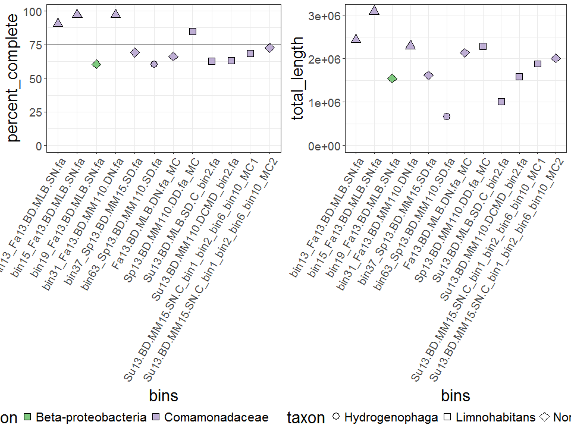
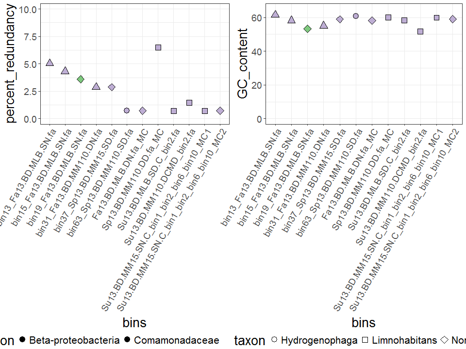

# Bin_analysis
Ruben Props  
August 17 2017  


# Genome characteristics

Import genome characteristics and binning statistics from anvi'o output:


```r
# Import anvi'o data
df_stats <- read.table("./anvio_output/general_bins_summary_selected_final.tsv", sep ="\t",
           header = TRUE, blank.lines.skip = TRUE, skipNul = TRUE)

# Also import more correct taxonomic classification from Phylosift
df_tax <- read.table("./anvio_output/bin_classification_phylosift.tsv", sep ="\t",
           header = TRUE, blank.lines.skip = TRUE, skipNul = TRUE)

# Merge both dataframes
df_merge <- dplyr::inner_join(df_stats, df_tax, by = c("bins" = "Bin"))
print(df_merge)
```

```
##                Sample                                       bins
## 1      Fa13.BD.MLB.DN                       Fa13.BD.MLB.DN.fa_MC
## 2    Sp13.BD.MM110.DD                     Sp13.BD.MM110.DD.fa_MC
## 3    Su13.BD.MLB.SD.C                   Su13.BD.MLB.SD.C_bin2.fa
## 4  Su13.BD.MM110.DCMD                 Su13.BD.MM110.DCMD_bin2.fa
## 5     Su13.BD.MM15.SN Su13.BD.MM15.SN.C_bin1_bin2_bin6_bin10_MC1
## 6   Su13.BD.MM15.SN.C Su13.BD.MM15.SN.C_bin1_bin2_bin6_bin10_MC2
## 7      Fa13.BD.MLB.SN                    bin13_Fa13.BD.MLB.SN.fa
## 8      Fa13.BD.MLB.SN                    bin15_Fa13.BD.MLB.SN.fa
## 9      Fa13.BD.MLB.SN                    bin19_Fa13.BD.MLB.SN.fa
## 10   Fa13.BD.MM110.DN                  bin31_Fa13.BD.MM110.DN.fa
## 11    Sp13.BD.MM15.SD                   bin37_Sp13.BD.MM15.SD.fa
## 12   Sp13.BD.MM110.SD                  bin63_Sp13.BD.MM110.SD.fa
##             taxon total_length num_contigs GC_content percent_complete
## 1            None      2136585         292   58.12707         66.18705
## 2   Limnohabitans      2286934         459   60.05675         84.89209
## 3   Limnohabitans      1011158         213   58.26407         62.58993
## 4   Limnohabitans      1590606         258   51.65179         63.30935
## 5   Limnohabitans      1883223         329   59.86329         68.34532
## 6            None      2011043         248   59.00021         72.66187
## 7         Unknown      2440389         255   61.46725         90.64748
## 8         Unknown      3086876         170   58.18530         97.12230
## 9            None      1543830         272   53.26861         60.43165
## 10        Unknown      2297656         165   55.04499         97.12230
## 11           None      1616513         291   58.88256         69.06475
## 12 Hydrogenophaga       669365         140   60.68817         60.43165
##    percent_redundancy      Classification
## 1           0.7194245      Comamonadaceae
## 2           6.4748201      Comamonadaceae
## 3           0.7194245      Comamonadaceae
## 4           1.4388489      Comamonadaceae
## 5           0.7194245      Comamonadaceae
## 6           0.7194245      Comamonadaceae
## 7           5.0359712      Comamonadaceae
## 8           4.3165468      Comamonadaceae
## 9           3.5971223 Beta-proteobacteria
## 10          2.8776978      Comamonadaceae
## 11          2.8776978      Comamonadaceae
## 12          0.7194245      Comamonadaceae
```

```r
# Completeness estimate
p1 <- ggplot(data = df_merge, aes(x = bins, y = percent_complete, fill = Classification, shape = taxon))+
  geom_point(size = 4)+
  theme_bw()+
  ylim(0,100)+
  theme(axis.text.x = element_text(angle = 60, hjust = 1),
        axis.text=element_text(size=14), axis.title=element_text(size=20),
        title=element_text(size=20), legend.text=element_text(size=16))+
  guides(fill = guide_legend(override.aes = list(shape = 22)))+
  geom_hline(yintercept = 75)+
  scale_fill_brewer(palette = "Accent")+
  scale_shape_manual(values = c(21,22,23,24))

# Observed genome size
p2 <- ggplot(data = df_merge, aes(x = bins, y = total_length, fill = Classification, shape = taxon))+
  geom_point(size = 4)+
  theme_bw()+
  theme(axis.text.x = element_text(angle = 60, hjust = 1),
        axis.text=element_text(size=14), axis.title=element_text(size=20),
        title=element_text(size=20), legend.text=element_text(size=16))+
  scale_fill_brewer(palette = "Accent")+
  ylim(0, 3.1e6)+
  scale_shape_manual(values = c(21,22,23,24))

# Estimated genome size
p3 <- ggplot(data = df_merge, aes(x = bins, y = total_length*percent_complete/100, fill = Classification, shape = taxon))+
  geom_point(size = 4)+
  theme_bw()+
  theme(axis.text.x = element_text(angle = 60, hjust = 1),
        axis.text=element_text(size=14), axis.title=element_text(size=20),
        title=element_text(size=20), legend.text=element_text(size=16))+
  scale_fill_brewer(palette = "Accent")+
  scale_shape_manual(values = c(21,22,23,24))

# Contamination plot
p4 <- ggplot(data = df_merge, aes(x = bins, y = percent_redundancy, fill = Classification, shape = taxon))+
  geom_point(size = 4)+
  theme_bw()+
  ylim(0,10)+
  theme(axis.text.x = element_text(angle = 60, hjust = 1),
        axis.text=element_text(size=14), axis.title=element_text(size=20),
        title=element_text(size=20), legend.text=element_text(size=16))+
  scale_fill_brewer(palette = "Accent")+
  scale_shape_manual(values = c(21,22,23,24))

# GC content
p5 <- ggplot(data = df_merge, aes(x = bins, y = GC_content, fill = Classification, shape = taxon))+
  geom_point(size = 4)+
  theme_bw()+
  ylim(0,65)+
  theme(axis.text.x = element_text(angle = 60, hjust = 1),
        axis.text=element_text(size=14), axis.title=element_text(size=20),
        title=element_text(size=20), legend.text=element_text(size=16))+
  scale_fill_brewer(palette = "Accent")+
  scale_shape_manual(values = c(21,22,23,24))

grid_arrange_shared_legend(p1, p2)
```



```r
grid_arrange_shared_legend(p4, p5)
```



